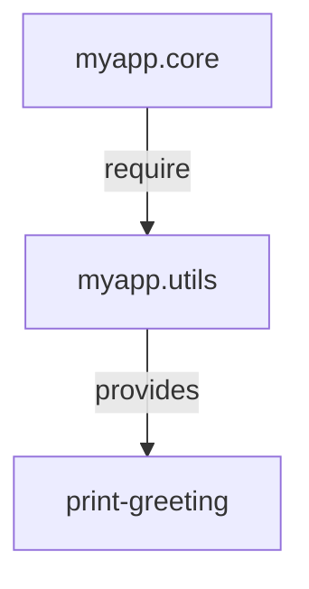

## A.1.5 Namespaces and Imports

In Clojure, namespaces play a crucial role in organizing code and managing dependencies. For Java developers transitioning to Clojure, understanding namespaces is akin to understanding packages in Java. This section will guide you through the intricacies of Clojure namespaces, how to declare them, require other namespaces, and refer to symbols. We will also explore the differences between `require`, `use`, and `import`, and provide examples of organizing code across multiple files.

### Understanding Namespaces in Clojure

Namespaces in Clojure are similar to packages in Java. They provide a way to group related functions, macros, and variables, preventing naming conflicts and making code more modular and maintainable.

#### Declaring a Namespace

To declare a namespace in Clojure, we use the `ns` macro. This is typically the first form in a Clojure file. Here's a basic example:

```clojure
(ns myapp.core)
```

This declares a namespace `myapp.core`. All definitions within this file will belong to this namespace.

**Key Points:**
- The `ns` declaration is analogous to the `package` declaration in Java.
- It is conventionally placed at the top of the file.

#### Requiring Other Namespaces

To use functions or variables from another namespace, you need to require it. This is done using the `require` function within the `ns` macro:

```clojure
(ns myapp.core
  (:require [clojure.string :as str]))
```

This requires the `clojure.string` namespace and aliases it as `str`. You can now use functions from `clojure.string` with the `str` prefix, like `str/join`.

**Comparison with Java:**
- In Java, you import classes or packages using the `import` statement.
- In Clojure, `require` is used to bring in namespaces, and you can alias them for convenience.

#### Referring to Symbols

Sometimes, you may want to refer to specific symbols from another namespace without using a prefix. This is done using the `refer` keyword:

```clojure
(ns myapp.core
  (:require [clojure.string :refer [join]]))
```

Now, you can use `join` directly without the `str` prefix.

**Best Practices:**
- Use `refer` sparingly to avoid polluting the namespace with too many symbols.
- Prefer aliasing with `:as` for better readability and to avoid conflicts.

### Differences Between `require`, `use`, and `import`

Clojure provides several ways to include code from other namespaces or Java classes. Understanding when to use each is crucial for effective code organization.

#### `require`

The `require` function is used to include other Clojure namespaces. It is the most common way to manage dependencies between namespaces.

- **Syntax:** `(:require [namespace :as alias])`
- **Use Case:** When you want to include a namespace and optionally alias it.

#### `use`

The `use` function is similar to `require` but automatically refers all public symbols from the namespace.

- **Syntax:** `(:use [namespace])`
- **Use Case:** When you need all symbols from a namespace. However, it is generally discouraged in favor of `require` with `:refer`.

#### `import`

The `import` function is used to include Java classes.

- **Syntax:** `(:import [java.util Date])`
- **Use Case:** When you need to use Java classes within your Clojure code.

**Comparison Table:**

| Function | Purpose | Syntax Example | Use Case |
|----------|---------|----------------|----------|
| `require` | Include Clojure namespaces | `(:require [clojure.string :as str])` | Modular code organization |
| `use` | Include and refer all symbols | `(:use [clojure.string])` | Discouraged, use `require` instead |
| `import` | Include Java classes | `(:import [java.util Date])` | Java interoperability |

### Organizing Code Across Multiple Files

As your Clojure application grows, organizing code across multiple files becomes essential. Here's how you can manage this effectively:

1. **Separate Concerns:** Group related functions and data structures into separate namespaces.
2. **Use Aliases:** Use `:as` to alias namespaces, making your code more readable.
3. **Avoid Circular Dependencies:** Ensure that namespaces do not depend on each other in a circular manner.

**Example:**

Suppose you have a project with the following structure:

```
src/
  myapp/
    core.clj
    utils.clj
```

In `core.clj`, you can require `utils.clj` as follows:

```clojure
(ns myapp.core
  (:require [myapp.utils :as utils]))

(defn greet []
  (utils/print-greeting "Hello, World!"))
```

And in `utils.clj`:

```clojure
(ns myapp.utils)

(defn print-greeting [message]
  (println message))
```

### Managing Dependencies Between Namespaces

Managing dependencies between namespaces is crucial for maintaining a clean and efficient codebase. Here are some tips:

- **Use Aliases:** Aliases help in avoiding name clashes and make the code more readable.
- **Limit Refers:** Use `:refer` only when necessary to keep the namespace clean.
- **Document Dependencies:** Clearly document which namespaces are required and why.

### Try It Yourself

Experiment with the following code snippets to deepen your understanding:

1. **Modify Aliases:** Change the alias in the `require` statement and observe how it affects the code.
2. **Add New Functions:** Add a new function in `utils.clj` and use it in `core.clj`.
3. **Create Circular Dependency:** Try creating a circular dependency and see how Clojure handles it.

### Diagrams and Visuals

Below is a diagram illustrating the flow of data and dependencies between namespaces:



**Diagram Description:** This diagram shows the `myapp.core` namespace requiring the `myapp.utils` namespace, which provides the `print-greeting` function.

### Further Reading

For more information on Clojure namespaces and imports, consider the following resources:

- [Official Clojure Documentation](https://clojure.org/reference/namespaces)
- [ClojureDocs](https://clojuredocs.org/)

### Exercises

1. **Create a New Namespace:** Write a new namespace that includes functions for basic arithmetic operations. Require this namespace in another file and use its functions.
2. **Refactor Code:** Refactor a Java class into multiple Clojure namespaces, focusing on separating concerns and managing dependencies.
3. **Explore Java Interop:** Use `import` to include a Java class and call its methods from Clojure.

### Key Takeaways

- **Namespaces** in Clojure are essential for organizing code and managing dependencies.
- Use **`require`** to include other namespaces, **`use`** sparingly, and **`import`** for Java classes.
- **Organize code** across multiple files to maintain a clean and modular codebase.
- **Experiment** with code snippets to reinforce your understanding of namespaces and imports.

Now that we've explored how namespaces and imports work in Clojure, let's apply these concepts to organize and manage dependencies in your applications effectively.

## Quiz: Mastering Clojure Namespaces and Imports



### What is the primary purpose of namespaces in Clojure?

- [x] To organize code and prevent naming conflicts
- [ ] To execute code faster
- [ ] To handle exceptions
- [ ] To manage memory

> **Explanation:** Namespaces in Clojure are used to organize code and prevent naming conflicts, similar to packages in Java.

### Which keyword is used to declare a namespace in Clojure?

- [x] `ns`
- [ ] `def`
- [ ] `import`
- [ ] `require`

> **Explanation:** The `ns` keyword is used to declare a namespace in Clojure.

### How do you alias a required namespace in Clojure?

- [x] Using `:as` in the `require` statement
- [ ] Using `:alias` in the `require` statement
- [ ] Using `:refer` in the `require` statement
- [ ] Using `:use` in the `require` statement

> **Explanation:** The `:as` keyword is used to alias a required namespace in Clojure.

### What is the difference between `require` and `use` in Clojure?

- [x] `require` includes a namespace, while `use` includes and refers all symbols
- [ ] `require` is faster than `use`
- [ ] `use` is used for Java classes
- [ ] `require` is deprecated

> **Explanation:** `require` includes a namespace, while `use` includes and refers all symbols, which is generally discouraged.

### When should you use `import` in Clojure?

- [x] When you need to include Java classes
- [ ] When you need to include Clojure namespaces
- [ ] When you need to refer symbols
- [ ] When you need to execute code

> **Explanation:** `import` is used to include Java classes in Clojure.

### What is the best practice for using `refer` in Clojure?

- [x] Use it sparingly to avoid polluting the namespace
- [ ] Use it for all symbols
- [ ] Avoid using it altogether
- [ ] Use it only for Java classes

> **Explanation:** `refer` should be used sparingly to avoid polluting the namespace with too many symbols.

### How can you prevent circular dependencies between namespaces?

- [x] By ensuring namespaces do not depend on each other in a circular manner
- [ ] By using `import` instead of `require`
- [ ] By using `use` instead of `require`
- [ ] By avoiding the use of aliases

> **Explanation:** Circular dependencies can be prevented by ensuring namespaces do not depend on each other in a circular manner.

### What is the purpose of aliasing a namespace?

- [x] To make code more readable and avoid name clashes
- [ ] To execute code faster
- [ ] To handle exceptions
- [ ] To manage memory

> **Explanation:** Aliasing a namespace makes code more readable and helps avoid name clashes.

### Which function is discouraged in favor of `require` with `:refer`?

- [x] `use`
- [ ] `import`
- [ ] `def`
- [ ] `ns`

> **Explanation:** `use` is discouraged in favor of `require` with `:refer` for better namespace management.

### True or False: The `ns` declaration is similar to the `package` declaration in Java.

- [x] True
- [ ] False

> **Explanation:** The `ns` declaration in Clojure is similar to the `package` declaration in Java, as both are used to organize code.


