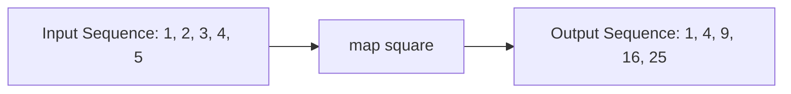
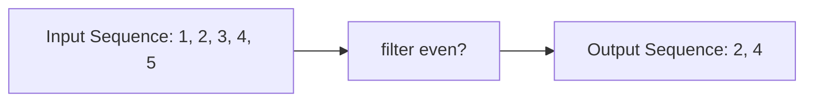
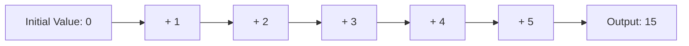
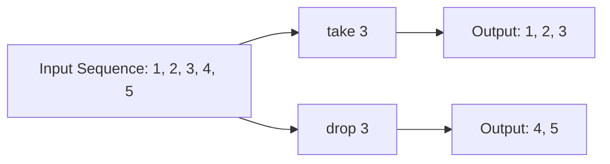
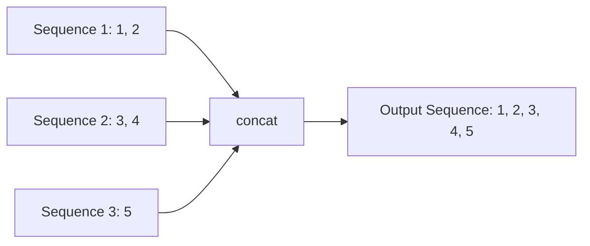
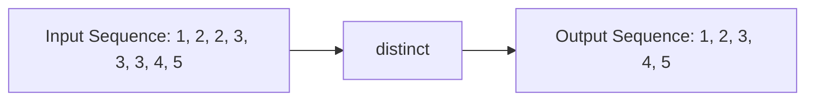
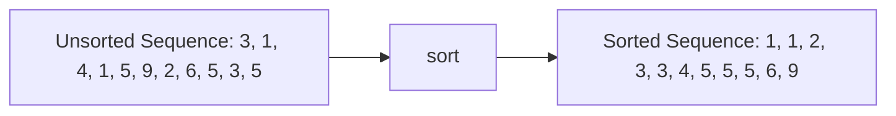

## A.2.1 Sequence Operations

In this section, we delve into the world of sequence operations in Clojure, a cornerstone of functional programming. For Java developers, understanding these operations is crucial as they offer a new paradigm for handling collections, emphasizing immutability and functional transformations. We'll explore commonly used sequence functions such as `map`, `filter`, `reduce`, `take`, `drop`, `concat`, `distinct`, `sort`, `group-by`, and `partition`. Each function will be accompanied by clear explanations and examples to illustrate their use.

### Introduction to Clojure Sequences

Clojure sequences are a powerful abstraction for working with collections. They provide a uniform interface for accessing elements, regardless of the underlying data structure. This abstraction allows you to write generic code that can operate on lists, vectors, sets, and maps seamlessly.

#### Key Characteristics of Clojure Sequences

- **Lazy Evaluation**: Sequences are often lazy, meaning they compute their elements only as needed. This can lead to performance improvements and allows for the creation of infinite sequences.
- **Immutability**: Like all Clojure data structures, sequences are immutable. Operations on sequences return new sequences without modifying the original.
- **Uniform Interface**: Functions that operate on sequences can be applied to any collection type, thanks to the sequence abstraction.

### Common Sequence Functions

Let's explore some of the most commonly used sequence functions in Clojure, providing examples and comparisons to Java where applicable.

#### `map`

The `map` function applies a given function to each element of a sequence, returning a new sequence of the results.

**Clojure Example:**

```clojure
(def numbers [1 2 3 4 5])
(defn square [x] (* x x))
(map square numbers) ; => (1 4 9 16 25)
```

**Java Equivalent:**

In Java, you might use streams to achieve a similar result:

```java
List<Integer> numbers = Arrays.asList(1, 2, 3, 4, 5);
List<Integer> squares = numbers.stream()
                               .map(x -> x * x)
                               .collect(Collectors.toList());
```

**Diagram:**



*Diagram 1: The flow of data through the `map` function.*

#### `filter`

The `filter` function returns a new sequence containing only the elements that satisfy a given predicate.

**Clojure Example:**

```clojure
(defn even? [x] (zero? (mod x 2)))
(filter even? numbers) ; => (2 4)
```

**Java Equivalent:**

```java
List<Integer> evens = numbers.stream()
                             .filter(x -> x % 2 == 0)
                             .collect(Collectors.toList());
```

**Diagram:**



*Diagram 2: Filtering even numbers from a sequence.*

#### `reduce`

The `reduce` function processes a sequence to produce a single accumulated value. It takes a function and an initial value, applying the function cumulatively to the elements of the sequence.

**Clojure Example:**

```clojure
(reduce + 0 numbers) ; => 15
```

**Java Equivalent:**

```java
int sum = numbers.stream()
                 .reduce(0, Integer::sum);
```

**Diagram:**



*Diagram 3: Accumulating a sum using `reduce`.*

#### `take` and `drop`

The `take` function returns the first n elements of a sequence, while `drop` returns the sequence without the first n elements.

**Clojure Example:**

```clojure
(take 3 numbers) ; => (1 2 3)
(drop 3 numbers) ; => (4 5)
```

**Java Equivalent:**

Java doesn't have direct equivalents, but similar functionality can be achieved with sublists:

```java
List<Integer> firstThree = numbers.subList(0, 3);
List<Integer> afterThree = numbers.subList(3, numbers.size());
```

**Diagram:**



*Diagram 4: Using `take` and `drop` to partition a sequence.*

#### `concat`

The `concat` function combines multiple sequences into one.

**Clojure Example:**

```clojure
(concat [1 2] [3 4] [5]) ; => (1 2 3 4 5)
```

**Java Equivalent:**

```java
List<Integer> combined = Stream.of(Arrays.asList(1, 2), Arrays.asList(3, 4), Arrays.asList(5))
                               .flatMap(Collection::stream)
                               .collect(Collectors.toList());
```

**Diagram:**



*Diagram 5: Concatenating multiple sequences.*

#### `distinct`

The `distinct` function removes duplicate elements from a sequence.

**Clojure Example:**

```clojure
(distinct [1 2 2 3 3 3 4 5]) ; => (1 2 3 4 5)
```

**Java Equivalent:**

```java
List<Integer> distinctNumbers = numbers.stream()
                                       .distinct()
                                       .collect(Collectors.toList());
```

**Diagram:**



*Diagram 6: Removing duplicates with `distinct`.*

#### `sort`

The `sort` function returns a new sequence with elements sorted in ascending order. You can also provide a custom comparator.

**Clojure Example:**

```clojure
(sort [3 1 4 1 5 9 2 6 5 3 5]) ; => (1 1 2 3 3 4 5 5 5 6 9)
```

**Java Equivalent:**

```java
List<Integer> sortedNumbers = numbers.stream()
                                     .sorted()
                                     .collect(Collectors.toList());
```

**Diagram:**



*Diagram 7: Sorting a sequence.*

#### `group-by`

The `group-by` function partitions a sequence into a map of sequences, keyed by the result of a function applied to each element.

**Clojure Example:**

```clojure
(group-by even? [1 2 3 4 5 6]) ; => {false [1 3 5], true [2 4 6]}
```

**Java Equivalent:**

```java
Map<Boolean, List<Integer>> grouped = numbers.stream()
                                             .collect(Collectors.groupingBy(x -> x % 2 == 0));
```

**Diagram:**

```mermaid
flowchart LR
    A[Input Sequence: 1, 2, 3, 4, 5, 6] --> B[group-by even?]
    B --> C[Output Map: {false: [1, 3, 5], true: [2, 4, 6]}]
```

*Diagram 8: Grouping elements by a predicate.*

#### `partition`

The `partition` function splits a sequence into sub-sequences of a specified size.

**Clojure Example:**

```clojure
(partition 2 [1 2 3 4 5 6]) ; => ((1 2) (3 4) (5 6))
```

**Java Equivalent:**

Java doesn't have a direct equivalent, but you can achieve similar functionality with loops or custom methods.

**Diagram:**

```mermaid
flowchart LR
    A[Input Sequence: 1, 2, 3, 4, 5, 6] --> B[partition 2]
    B --> C[Output: (1, 2), (3, 4), (5, 6)]
```

*Diagram 9: Partitioning a sequence into sub-sequences.*

### Try It Yourself

To deepen your understanding, try modifying the examples above:

- Change the function used in `map` to see how it affects the output.
- Use different predicates with `filter` and `group-by`.
- Experiment with different partition sizes in `partition`.
- Combine multiple sequence operations to perform complex data transformations.

### Exercises

1. **Transform and Filter**: Use `map` and `filter` to transform a sequence of numbers by squaring them and then filtering out the odd results.
2. **Accumulate Values**: Use `reduce` to find the product of a sequence of numbers.
3. **Custom Sorting**: Sort a sequence of strings by their length using `sort` with a custom comparator.
4. **Group by Length**: Use `group-by` to group a sequence of strings by their length.
5. **Partition and Concat**: Partition a sequence into pairs and then concatenate the pairs into a single sequence.

### Key Takeaways

- Clojure's sequence operations provide a powerful and flexible way to manipulate collections.
- These operations emphasize immutability and functional programming principles.
- Understanding these functions will enhance your ability to write concise and expressive Clojure code.
- By leveraging these operations, you can perform complex data transformations with ease.

### Further Reading

- [Official Clojure Documentation on Sequences](https://clojure.org/reference/sequences)
- [ClojureDocs: Sequence Functions](https://clojuredocs.org/quickref#sequences)
- [Functional Programming in Java: Harnessing the Power of Java 8 Lambda Expressions](https://www.amazon.com/Functional-Programming-Java-Harnessing-Expressions/dp/1937785467)

## Quiz: Mastering Clojure Sequence Operations



### Which function is used to apply a function to each element of a sequence in Clojure?

- [x] map
- [ ] filter
- [ ] reduce
- [ ] concat

> **Explanation:** The `map` function applies a given function to each element of a sequence, returning a new sequence of the results.

### What does the `filter` function do in Clojure?

- [ ] Applies a function to each element
- [x] Returns elements that satisfy a predicate
- [ ] Combines sequences
- [ ] Sorts elements

> **Explanation:** The `filter` function returns a new sequence containing only the elements that satisfy a given predicate.

### How does the `reduce` function operate on a sequence?

- [ ] It filters elements
- [ ] It sorts elements
- [x] It accumulates a single value
- [ ] It partitions elements

> **Explanation:** The `reduce` function processes a sequence to produce a single accumulated value.

### Which function would you use to remove duplicate elements from a sequence?

- [ ] map
- [ ] filter
- [ ] reduce
- [x] distinct

> **Explanation:** The `distinct` function removes duplicate elements from a sequence.

### What is the result of `(take 3 [1 2 3 4 5])`?

- [x] (1 2 3)
- [ ] (3 4 5)
- [ ] (4 5)
- [ ] (2 3 4)

> **Explanation:** The `take` function returns the first n elements of a sequence.

### How can you combine multiple sequences into one in Clojure?

- [ ] filter
- [ ] reduce
- [x] concat
- [ ] sort

> **Explanation:** The `concat` function combines multiple sequences into one.

### What does the `group-by` function return?

- [ ] A single value
- [ ] A sorted sequence
- [x] A map of sequences
- [ ] A concatenated sequence

> **Explanation:** The `group-by` function partitions a sequence into a map of sequences, keyed by the result of a function applied to each element.

### Which function splits a sequence into sub-sequences of a specified size?

- [ ] map
- [ ] filter
- [ ] reduce
- [x] partition

> **Explanation:** The `partition` function splits a sequence into sub-sequences of a specified size.

### What is the primary advantage of lazy evaluation in Clojure sequences?

- [ ] It modifies the original sequence
- [x] It computes elements only as needed
- [ ] It sorts elements automatically
- [ ] It combines sequences

> **Explanation:** Lazy evaluation computes elements only as needed, which can lead to performance improvements and allows for the creation of infinite sequences.

### True or False: Clojure sequences are mutable.

- [ ] True
- [x] False

> **Explanation:** Clojure sequences are immutable, meaning operations on sequences return new sequences without modifying the original.


