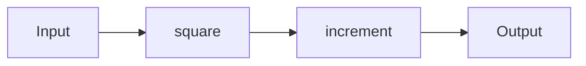

## A.2.3 Function Composition and Utilities

In this section, we delve into the powerful tools Clojure provides for function composition and manipulation. These utilities are essential for writing clean, concise, and efficient functional code. We'll explore `comp`, `partial`, `juxt`, `apply`, and `memoize`, illustrating how they can be used to enhance your Clojure programs. As experienced Java developers, you'll appreciate the parallels and differences between these Clojure utilities and Java's functional programming capabilities introduced in Java 8.

### Function Composition with `comp`

Function composition is a fundamental concept in functional programming, allowing you to combine multiple functions into a single function. In Clojure, the `comp` function is used for this purpose. It takes a variable number of functions as arguments and returns a new function that is the composition of those functions.

#### How `comp` Works

The `comp` function applies the functions from right to left. This means the last function in the argument list is applied first, and the first function is applied last.

```clojure
(defn square [x]
  (* x x))

(defn increment [x]
  (+ x 1))

(def square-then-increment (comp increment square))

(println (square-then-increment 4)) ; Output: 17
```

In this example, `square-then-increment` first squares the input and then increments the result. This is equivalent to writing `increment(square(4))` in Java.

#### Visualizing Function Composition



*Diagram 1: Flow of data through the composed function `square-then-increment`.*

### Partial Application with `partial`

Partial application refers to the process of fixing a number of arguments to a function, producing another function of smaller arity. Clojure's `partial` function allows you to create a new function by pre-filling some of the arguments of an existing function.

#### Using `partial`

```clojure
(defn multiply [a b]
  (* a b))

(def double (partial multiply 2))

(println (double 5)) ; Output: 10
```

Here, `double` is a partially applied version of `multiply`, with the first argument fixed to 2. This is similar to Java's lambda expressions but offers more flexibility in argument binding.

### Juxtaposition with `juxt`

The `juxt` function is a powerful utility that takes multiple functions and returns a new function. When this new function is called, it applies all the original functions to the arguments and returns a vector of the results.

#### Example of `juxt`

```clojure
(defn add [x y]
  (+ x y))

(defn subtract [x y]
  (- x y))

(def add-and-subtract (juxt add subtract))

(println (add-and-subtract 10 5)) ; Output: [15 5]
```

In this example, `add-and-subtract` applies both `add` and `subtract` to the arguments `10` and `5`, returning a vector of results.

### Applying Functions with `apply`

The `apply` function in Clojure is used to call a function with a list of arguments. This is particularly useful when you have a collection of arguments that you want to pass to a function.

#### Using `apply`

```clojure
(defn sum [& numbers]
  (reduce + numbers))

(def numbers [1 2 3 4 5])

(println (apply sum numbers)) ; Output: 15
```

Here, `apply` is used to pass the elements of the `numbers` vector as individual arguments to the `sum` function. This is akin to Java's varargs but more flexible in handling collections.

### Memoization with `memoize`

Memoization is an optimization technique that stores the results of expensive function calls and returns the cached result when the same inputs occur again. Clojure's `memoize` function provides a simple way to achieve this.

#### Example of `memoize`

```clojure
(defn slow-fib [n]
  (if (<= n 1)
    n
    (+ (slow-fib (- n 1)) (slow-fib (- n 2)))))

(def fast-fib (memoize slow-fib))

(println (fast-fib 35)) ; Output: 9227465
```

In this example, `fast-fib` is a memoized version of `slow-fib`, significantly improving performance by caching results of previous computations.

### Comparing with Java

Java 8 introduced functional programming constructs like lambdas and the `Function` interface, which allow for similar operations. However, Clojure's utilities provide more expressive and concise ways to handle function composition and manipulation.

#### Java Example

```java
import java.util.function.Function;

Function<Integer, Integer> square = x -> x * x;
Function<Integer, Integer> increment = x -> x + 1;
Function<Integer, Integer> squareThenIncrement = increment.compose(square);

System.out.println(squareThenIncrement.apply(4)); // Output: 17
```

While Java requires explicit chaining of functions, Clojure's `comp` provides a more natural and flexible approach.

### Try It Yourself

Experiment with the following modifications to deepen your understanding:

- Create a composed function that first increments, then squares, and finally doubles a number.
- Use `partial` to create a function that subtracts 5 from any given number.
- Use `juxt` to apply a series of transformations to a collection and return all results.
- Memoize a function that calculates factorials and observe the performance improvement.

### Exercises

1. **Compose Functions**: Write a function that composes three functions: one that doubles a number, one that adds 10, and one that squares the result.
2. **Partial Application**: Create a partially applied function that divides a number by 2.
3. **Juxtaposition**: Use `juxt` to create a function that returns both the sum and product of two numbers.
4. **Apply Function**: Use `apply` to find the maximum number in a list.
5. **Memoization**: Memoize a recursive function that calculates the nth Fibonacci number and compare its performance with the non-memoized version.

### Key Takeaways

- **Function Composition**: `comp` allows you to combine multiple functions into a single function, enhancing code readability and reusability.
- **Partial Application**: `partial` enables you to create new functions with fixed arguments, simplifying complex function calls.
- **Juxtaposition**: `juxt` applies multiple functions to the same arguments and returns a collection of results, useful for parallel computations.
- **Function Application**: `apply` is a versatile tool for calling functions with collections of arguments.
- **Memoization**: `memoize` optimizes performance by caching results of expensive computations.

By mastering these utilities, you'll be well-equipped to write efficient and elegant Clojure code. Now, let's put these concepts into practice and explore how they can transform your approach to problem-solving in Clojure.

## Quiz: Mastering Function Composition and Utilities in Clojure



### What does the `comp` function do in Clojure?

- [x] Composes multiple functions into a single function
- [ ] Partially applies a function
- [ ] Memoizes a function
- [ ] Applies a function to a collection

> **Explanation:** The `comp` function in Clojure is used to compose multiple functions into a single function, applying them from right to left.

### How does `partial` differ from `comp` in Clojure?

- [x] `partial` creates a new function with fixed arguments
- [ ] `partial` composes functions
- [ ] `partial` memoizes a function
- [ ] `partial` applies a function to a collection

> **Explanation:** `partial` is used to create a new function with some arguments pre-filled, whereas `comp` is used to compose multiple functions.

### What is the output of `(juxt inc dec) 5`?

- [x] [6 4]
- [ ] [5 5]
- [ ] [4 6]
- [ ] [6 5]

> **Explanation:** `juxt` applies both `inc` and `dec` to the argument `5`, returning a vector of results: `[6 4]`.

### Which function would you use to call a function with a list of arguments?

- [x] `apply`
- [ ] `comp`
- [ ] `partial`
- [ ] `memoize`

> **Explanation:** `apply` is used to call a function with a list of arguments, spreading them as individual arguments.

### What is the primary benefit of using `memoize`?

- [x] Caching results of expensive computations
- [ ] Composing functions
- [ ] Partially applying functions
- [ ] Juxtaposing function results

> **Explanation:** `memoize` caches the results of expensive computations, improving performance by avoiding redundant calculations.

### How does `juxt` enhance function application?

- [x] It applies multiple functions to the same arguments and returns all results
- [ ] It composes functions
- [ ] It memoizes function results
- [ ] It partially applies functions

> **Explanation:** `juxt` applies multiple functions to the same arguments and returns a collection of results, enabling parallel computations.

### What is a common use case for `apply`?

- [x] Passing a collection of arguments to a function
- [ ] Composing functions
- [ ] Memoizing results
- [ ] Partially applying functions

> **Explanation:** `apply` is commonly used to pass a collection of arguments to a function, spreading them as individual arguments.

### Which of the following is true about `memoize`?

- [x] It improves performance by caching results
- [ ] It composes functions
- [ ] It partially applies functions
- [ ] It juxtaposes function results

> **Explanation:** `memoize` improves performance by caching the results of function calls, avoiding redundant calculations.

### What does `(apply + [1 2 3 4])` return?

- [x] 10
- [ ] 6
- [ ] 24
- [ ] 12

> **Explanation:** `apply` spreads the elements of the vector `[1 2 3 4]` as arguments to the `+` function, resulting in the sum `10`.

### True or False: `comp` applies functions from left to right.

- [ ] True
- [x] False

> **Explanation:** `comp` applies functions from right to left, meaning the last function in the argument list is applied first.


