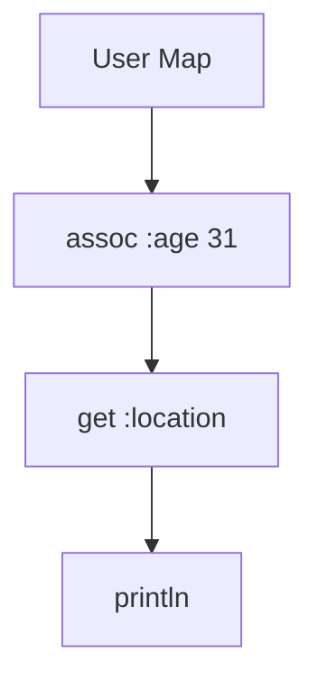

## A.2.4 Threading Macros

As experienced Java developers transitioning to Clojure, you might find yourself grappling with the functional programming paradigm, particularly when dealing with nested function calls. Clojure's threading macros—`->` (thread-first), `->>` (thread-last), `as->`, `some->`, and `cond->`—offer a powerful way to simplify these calls, making your code more readable and maintainable. In this section, we'll explore each of these macros in detail, providing examples and comparisons to Java to help you understand their utility and application.

### Understanding Threading Macros

Threading macros in Clojure are designed to transform deeply nested function calls into a more linear and readable sequence of operations. They achieve this by "threading" an initial value through a series of transformations, each represented by a function call. This approach is particularly beneficial when working with immutable data structures, as it allows you to express transformations in a clear and concise manner.

#### The `->` (Thread-First) Macro

The `->` macro, also known as the thread-first macro, is used to pass an initial value as the first argument to a series of functions. This is particularly useful when the functions you are calling expect the primary data structure as their first parameter.

**Example:**

Let's consider a scenario where you have a map representing a user, and you want to transform it by updating some fields and extracting values.

```clojure
(def user {:name "Alice" :age 30 :location "New York"})

;; Without threading macros
(let [updated-user (assoc user :age 31)
      location (get updated-user :location)]
  (println location))

;; With the `->` macro
(-> user
    (assoc :age 31)
    (get :location)
    println)
```

In the example above, the `->` macro threads the `user` map through the `assoc` and `get` functions, resulting in a more readable and concise expression.

**Comparison with Java:**

In Java, you might achieve similar functionality using method chaining or builder patterns, but these approaches can become cumbersome with deeply nested calls. The threading macro provides a cleaner alternative by eliminating the need for intermediate variables.

#### The `->>` (Thread-Last) Macro

The `->>` macro, or thread-last macro, is similar to `->`, but it threads the initial value as the last argument to each function. This is useful when dealing with functions that expect the primary data structure as their last parameter.

**Example:**

Suppose you have a list of numbers and you want to filter, map, and reduce them.

```clojure
(def numbers [1 2 3 4 5])

;; Without threading macros
(reduce + (map #(* % 2) (filter even? numbers)))

;; With the `->>` macro
(->> numbers
     (filter even?)
     (map #(* % 2))
     (reduce +))
```

Here, the `->>` macro threads the `numbers` list through `filter`, `map`, and `reduce`, making the sequence of operations clear and linear.

**Comparison with Java:**

Java 8 introduced streams, which provide a similar way to process collections with a fluent API. However, Clojure's threading macros offer more flexibility and can be used with any function, not just those designed for streams.

#### The `as->` Macro

The `as->` macro allows you to specify a placeholder for the threaded value, giving you more control over where the value is inserted in each function call. This is useful when the position of the threaded value varies between functions.

**Example:**

Imagine you need to perform a series of transformations on a string, where the position of the string varies in each function call.

```clojure
(defn transform-string [s]
  (as-> s str
    (str/upper-case str)
    (str/replace str "A" "@")
    (str/reverse str)))

(transform-string "banana") ;; => "AN@N@B"
```

In this example, `as->` allows you to specify `str` as the placeholder for the threaded value, which is then used in different positions in each function call.

**Comparison with Java:**

In Java, you might achieve similar functionality using a series of method calls with intermediate variables, but this can lead to verbose and less readable code.

#### The `some->` Macro

The `some->` macro is a conditional threading macro that stops processing if any step returns `nil`. This is useful for handling optional values or avoiding null pointer exceptions.

**Example:**

Consider a scenario where you have a nested map and want to safely extract a value.

```clojure
(def data {:user {:name "Alice" :address {:city "New York"}}})

;; Without threading macros
(let [address (get-in data [:user :address])
      city (when address (get address :city))]
  (println city))

;; With the `some->` macro
(-> data
    :user
    :address
    (some-> :city)
    println)
```

In this example, `some->` stops processing if any step returns `nil`, preventing errors when accessing nested values.

**Comparison with Java:**

Java's Optional class provides similar functionality, but Clojure's `some->` macro offers a more concise and expressive way to handle optional values.

#### The `cond->` Macro

The `cond->` macro allows you to conditionally apply transformations based on predicates. This is useful for applying transformations only when certain conditions are met.

**Example:**

Suppose you want to update a map based on certain conditions.

```clojure
(def user {:name "Alice" :age 30})

;; Without threading macros
(let [updated-user (if (> (:age user) 25)
                     (assoc user :status "Senior")
                     user)]
  (println updated-user))

;; With the `cond->` macro
(-> user
    (cond-> (> (:age user) 25) (assoc :status "Senior"))
    println)
```

In this example, `cond->` applies the `assoc` transformation only if the user's age is greater than 25.

**Comparison with Java:**

In Java, you might use conditional statements or the ternary operator to achieve similar functionality, but `cond->` provides a more declarative and readable approach.

### Try It Yourself

To deepen your understanding of threading macros, try modifying the examples above:

1. **Modify the `->` example** to add another transformation, such as converting the location to uppercase.
2. **Experiment with the `->>` example** by adding a `take` function to limit the number of elements processed.
3. **Use `as->`** to perform a series of mathematical operations on a number, varying the position of the number in each operation.
4. **Apply `some->`** to safely navigate a more complex nested data structure.
5. **Extend the `cond->` example** to apply multiple conditional transformations.

### Diagrams and Visualizations

To further illustrate the flow of data through threading macros, let's use a Mermaid.js diagram to visualize the `->` macro example:



**Diagram Description:** This flowchart represents the sequence of transformations applied to the user map using the `->` macro. The initial map is passed through `assoc`, `get`, and finally `println`.

### Exercises and Practice Problems

1. **Refactor the following nested function calls using threading macros:**

   ```clojure
   (println (reduce + (map #(* % 2) (filter odd? [1 2 3 4 5]))))
   ```

2. **Use `some->` to safely extract a value from a deeply nested map:**

   ```clojure
   (def data {:user {:profile {:settings {:theme "dark"}}}})
   ```

3. **Apply `cond->` to conditionally update a map based on multiple predicates:**

   ```clojure
   (def product {:name "Laptop" :price 1000})
   ```

### Key Takeaways

- **Threading macros simplify nested function calls**, making your code more readable and maintainable.
- **`->` and `->>` macros thread values through functions**, with `->` passing as the first argument and `->>` as the last.
- **`as->` provides flexibility** by allowing you to specify the position of the threaded value.
- **`some->` handles optional values**, stopping processing if any step returns `nil`.
- **`cond->` applies transformations conditionally**, based on predicates.
- **Threading macros offer a more declarative and expressive way** to handle transformations compared to traditional Java approaches.

By mastering threading macros, you'll be well-equipped to write clean, idiomatic Clojure code that leverages the power of functional programming. Now that we've explored these powerful tools, let's apply them to manage complex data transformations effectively in your applications.

For further reading, explore the [Official Clojure Documentation](https://clojure.org/reference/threading) and [ClojureDocs](https://clojuredocs.org/).

## Quiz: Mastering Threading Macros in Clojure



### What is the primary purpose of threading macros in Clojure?

- [x] To simplify nested function calls and improve code readability
- [ ] To handle concurrency in Clojure applications
- [ ] To manage state changes in functional programming
- [ ] To provide type safety in Clojure

> **Explanation:** Threading macros are designed to simplify nested function calls, making code more readable and maintainable.

### Which threading macro would you use to pass an initial value as the first argument to a series of functions?

- [x] `->`
- [ ] `->>`
- [ ] `as->`
- [ ] `some->`

> **Explanation:** The `->` macro threads the initial value as the first argument to each function.

### How does the `some->` macro differ from the `->` macro?

- [x] `some->` stops processing if any step returns `nil`
- [ ] `some->` threads the value as the last argument
- [ ] `some->` allows specifying a placeholder for the value
- [ ] `some->` applies transformations conditionally

> **Explanation:** The `some->` macro stops processing if any step returns `nil`, making it useful for handling optional values.

### What is the role of the `as->` macro in Clojure?

- [x] It allows specifying a placeholder for the threaded value
- [ ] It threads the value as the last argument
- [ ] It stops processing if any step returns `nil`
- [ ] It applies transformations based on predicates

> **Explanation:** The `as->` macro allows you to specify a placeholder for the threaded value, providing flexibility in function calls.

### Which macro would you use to apply transformations conditionally based on predicates?

- [ ] `->`
- [ ] `->>`
- [ ] `as->`
- [x] `cond->`

> **Explanation:** The `cond->` macro applies transformations conditionally based on predicates.

### In the context of threading macros, what does the `->>` macro do?

- [x] Threads the initial value as the last argument to each function
- [ ] Threads the initial value as the first argument to each function
- [ ] Stops processing if any step returns `nil`
- [ ] Allows specifying a placeholder for the threaded value

> **Explanation:** The `->>` macro threads the initial value as the last argument to each function.

### How can threading macros improve code readability?

- [x] By transforming deeply nested function calls into a linear sequence
- [ ] By enforcing type safety in function calls
- [ ] By providing detailed error messages
- [ ] By automatically handling concurrency

> **Explanation:** Threading macros improve code readability by transforming deeply nested function calls into a linear sequence of operations.

### Which threading macro is most similar to Java's Optional class in terms of functionality?

- [ ] `->`
- [ ] `->>`
- [x] `some->`
- [ ] `cond->`

> **Explanation:** The `some->` macro is similar to Java's Optional class, as it stops processing if any step returns `nil`.

### What is a common use case for the `cond->` macro?

- [x] Applying transformations only when certain conditions are met
- [ ] Threading values as the last argument
- [ ] Specifying a placeholder for the threaded value
- [ ] Handling optional values

> **Explanation:** The `cond->` macro is used to apply transformations only when certain conditions are met.

### True or False: The `->` and `->>` macros can be used interchangeably.

- [ ] True
- [x] False

> **Explanation:** The `->` and `->>` macros cannot be used interchangeably, as they thread the initial value in different positions (first vs. last argument).


