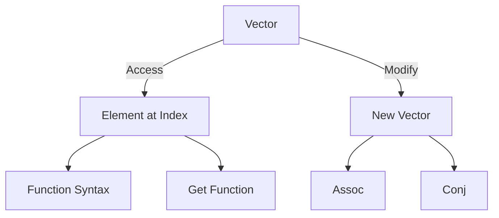

## A.3.2 Vectors

In the world of Clojure, vectors are a fundamental data structure that offer efficient indexed access and modification. As Java developers, you're likely familiar with arrays and lists, which serve similar purposes. However, Clojure vectors bring unique advantages, particularly in the realms of immutability and functional programming. In this section, we'll delve into the creation, access, and modification of vectors, and explore how they compare to Java's data structures.

### Understanding Vectors

Vectors in Clojure are immutable, indexed collections that provide efficient random access and modification. They are similar to Java's `ArrayList` in terms of functionality but differ significantly in their immutable nature. This immutability ensures that vectors are thread-safe and can be shared across concurrent processes without the need for synchronization.

#### Creating Vectors

Vectors can be created using literal syntax or the `vector` function. The literal syntax is straightforward and concise, using square brackets to denote a vector.

```clojure
(def my-vector [1 2 3 4 5])
;; my-vector is now a vector containing the elements 1, 2, 3, 4, and 5
```

Alternatively, you can use the `vector` function to create a vector from a list of elements:

```clojure
(def another-vector (vector 6 7 8 9 10))
;; another-vector is now a vector containing the elements 6, 7, 8, 9, and 10
```

#### Accessing Elements

To access elements in a vector, you can use the `get` function or simply use the vector as a function with the index as an argument.

```clojure
(get my-vector 2)
;; Returns 3, the element at index 2

(my-vector 2)
;; Also returns 3
```

In Java, accessing an element in an array or `ArrayList` would look like this:

```java
int[] myArray = {1, 2, 3, 4, 5};
int element = myArray[2]; // Accessing the element at index 2

ArrayList<Integer> myList = new ArrayList<>(Arrays.asList(1, 2, 3, 4, 5));
int listElement = myList.get(2); // Accessing the element at index 2
```

#### Modifying Vectors

While vectors are immutable, you can create a modified version of a vector using functions like `assoc` and `conj`.

- **`assoc`**: This function returns a new vector with the specified index updated to a new value.

```clojure
(def updated-vector (assoc my-vector 2 99))
;; updated-vector is now [1 2 99 4 5]
```

- **`conj`**: This function adds an element to the end of the vector, returning a new vector.

```clojure
(def extended-vector (conj my-vector 6))
;; extended-vector is now [1 2 3 4 5 6]
```

In Java, modifying an array or `ArrayList` involves directly changing the element at a specific index or adding an element:

```java
myArray[2] = 99; // Directly modifying the array

myList.set(2, 99); // Modifying the ArrayList
myList.add(6); // Adding an element to the ArrayList
```

### Comparing Vectors to Java Data Structures

Clojure vectors offer several advantages over Java's mutable data structures:

1. **Immutability**: Vectors are immutable, meaning once created, they cannot be changed. This immutability leads to safer code, especially in concurrent environments, as there are no side effects or race conditions.

2. **Persistent Data Structures**: Clojure vectors are part of Clojure's persistent data structures, which use structural sharing to efficiently create modified versions without copying the entire structure.

3. **Functional Programming**: Vectors align with functional programming principles, allowing you to work with data in a declarative manner.

4. **Concurrency**: Since vectors are immutable, they can be freely shared between threads without synchronization, making them ideal for concurrent programming.

### Practical Use Cases for Vectors

Vectors are versatile and can be used in various scenarios:

- **Data Storage**: Use vectors to store collections of data that require indexed access.
- **Functional Transformations**: Apply transformations using higher-order functions like `map`, `filter`, and `reduce`.
- **Concurrency**: Share vectors across threads without worrying about data corruption.

#### Example: Using Vectors in a Functional Transformation

Let's consider a scenario where we want to transform a collection of numbers by doubling each value. In Clojure, we can achieve this using the `map` function:

```clojure
(def numbers [1 2 3 4 5])
(def doubled (map #(* 2 %) numbers))
;; doubled is now (2 4 6 8 10)
```

In Java, you might use a loop or streams to achieve a similar transformation:

```java
List<Integer> numbers = Arrays.asList(1, 2, 3, 4, 5);
List<Integer> doubled = numbers.stream()
                               .map(n -> n * 2)
                               .collect(Collectors.toList());
```

### Try It Yourself

Experiment with the following code snippets to deepen your understanding of vectors:

1. **Create a vector** with a mix of data types and access elements using both `get` and function syntax.
2. **Modify a vector** using `assoc` and `conj`, and observe how the original vector remains unchanged.
3. **Transform a vector** using `map` to apply a function to each element.

### Visualizing Vectors

Below is a diagram illustrating the structure of a Clojure vector and how elements are accessed and modified:



**Diagram Description**: This diagram shows a vector with elements accessed via function syntax or the `get` function. Modifications using `assoc` and `conj` result in new vectors.

### Exercises

1. **Create a vector** of your favorite programming languages. Use `assoc` to change one of the languages and `conj` to add a new one.
2. **Write a function** that takes a vector of numbers and returns a new vector with each number squared.
3. **Implement a filter** using `filter` to remove all even numbers from a vector.

### Key Takeaways

- **Vectors are immutable** indexed collections that provide efficient access and modification.
- **Immutability ensures thread safety**, making vectors ideal for concurrent programming.
- **Functional transformations** can be easily applied to vectors using higher-order functions.
- **Clojure's persistent data structures** offer efficient modifications through structural sharing.

By understanding and utilizing vectors, you can leverage Clojure's strengths in functional programming and immutability to write more robust and maintainable code.

### Further Reading

- [Official Clojure Documentation on Vectors](https://clojure.org/reference/data_structures#Vectors)
- [ClojureDocs: Vectors](https://clojuredocs.org/clojure.core/vector)
- [Persistent Data Structures in Clojure](https://hypirion.com/musings/understanding-persistent-vector-pt-1)

Now that we've explored vectors in depth, let's apply these concepts to manage data efficiently in your Clojure applications.

## Quiz: Mastering Clojure Vectors



### What is a key characteristic of Clojure vectors?

- [x] Immutability
- [ ] Mutability
- [ ] Dynamic typing
- [ ] Static typing

> **Explanation:** Clojure vectors are immutable, meaning they cannot be changed after creation, which ensures thread safety.

### How can you create a vector in Clojure?

- [x] Using literal syntax with square brackets
- [x] Using the `vector` function
- [ ] Using the `list` function
- [ ] Using curly braces

> **Explanation:** Vectors can be created using literal syntax with square brackets or the `vector` function.

### Which function is used to access an element in a vector?

- [x] `get`
- [ ] `assoc`
- [ ] `conj`
- [ ] `remove`

> **Explanation:** The `get` function is used to access elements in a vector by index.

### What does the `assoc` function do in the context of vectors?

- [x] Returns a new vector with an updated element
- [ ] Removes an element from the vector
- [ ] Adds an element to the end of the vector
- [ ] Sorts the vector

> **Explanation:** The `assoc` function returns a new vector with the specified index updated to a new value.

### How does `conj` modify a vector?

- [x] Adds an element to the end of the vector
- [ ] Removes an element from the vector
- [ ] Updates an element at a specific index
- [ ] Sorts the vector

> **Explanation:** The `conj` function adds an element to the end of the vector, returning a new vector.

### What is a benefit of vector immutability?

- [x] Thread safety
- [ ] Increased memory usage
- [ ] Slower performance
- [ ] Complexity in code

> **Explanation:** Immutability ensures that vectors are thread-safe and can be shared across concurrent processes without synchronization.

### Which Clojure function is used to apply a transformation to each element in a vector?

- [x] `map`
- [ ] `filter`
- [ ] `reduce`
- [ ] `assoc`

> **Explanation:** The `map` function applies a transformation to each element in a vector.

### How do Clojure vectors differ from Java arrays?

- [x] Vectors are immutable
- [ ] Vectors are mutable
- [ ] Vectors use dynamic typing
- [ ] Vectors are statically typed

> **Explanation:** Clojure vectors are immutable, unlike Java arrays, which are mutable.

### What is a common use case for vectors in Clojure?

- [x] Storing collections of data with indexed access
- [ ] Managing mutable state
- [ ] Implementing dynamic typing
- [ ] Creating static type systems

> **Explanation:** Vectors are commonly used to store collections of data that require indexed access.

### True or False: Vectors in Clojure can be modified in place.

- [ ] True
- [x] False

> **Explanation:** Vectors in Clojure are immutable and cannot be modified in place. Any modification results in a new vector.


