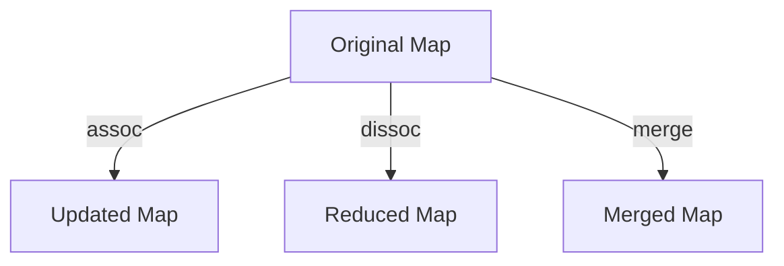

## A.3.3 Maps

Maps are a fundamental data structure in Clojure, providing a way to associate keys with values. They are similar to Java's `HashMap` and `TreeMap`, but with a focus on immutability and functional programming principles. In this section, we'll explore Clojure's hash maps and sorted maps, their uses, and how to perform common operations such as creating maps, accessing and updating values, and leveraging keywords as map keys.

### Understanding Clojure Maps

Clojure maps are collections of key-value pairs, where each key is unique. They are immutable, meaning that any operation that modifies a map returns a new map with the changes, leaving the original map unchanged. This immutability is a core feature of Clojure's functional programming paradigm, promoting safer and more predictable code.

#### Hash Maps

Hash maps in Clojure are the most common type of map, providing efficient key-value lookups. They are similar to Java's `HashMap`, but with the added benefit of immutability.

```clojure
;; Creating a hash map
(def my-map {:name "Alice" :age 30 :city "New York"})

;; Accessing values
(get my-map :name) ;=> "Alice"

;; Using keywords as functions
(:age my-map) ;=> 30

;; Checking for keys
(contains? my-map :city) ;=> true

;; Updating maps
(def updated-map (assoc my-map :age 31))
```

#### Sorted Maps

Sorted maps maintain their keys in a sorted order, similar to Java's `TreeMap`. They are useful when you need to iterate over keys in a specific order.

```clojure
;; Creating a sorted map
(def sorted-map (sorted-map :b 2 :a 1 :c 3))

;; Accessing values
(get sorted-map :a) ;=> 1

;; Iterating over keys
(keys sorted-map) ;=> (:a :b :c)
```

### Creating and Accessing Maps

Creating maps in Clojure is straightforward. You can use the literal syntax with curly braces or the `hash-map` function.

```clojure
;; Using literal syntax
(def my-map {:name "Bob" :age 25})

;; Using hash-map function
(def another-map (hash-map :country "USA" :language "English"))
```

Accessing values in a map can be done using the `get` function or by treating keywords as functions.

```clojure
;; Using get function
(get my-map :name) ;=> "Bob"

;; Using keywords as functions
(:age my-map) ;=> 25
```

### Updating Maps

Since Clojure maps are immutable, updating a map involves creating a new map with the desired changes. The `assoc`, `dissoc`, and `merge` functions are commonly used for this purpose.

#### Associating New Key-Value Pairs

The `assoc` function adds or updates key-value pairs in a map.

```clojure
;; Adding a new key-value pair
(def new-map (assoc my-map :email "bob@example.com"))

;; Updating an existing key-value pair
(def updated-map (assoc my-map :age 26))
```

#### Dissociating Keys

The `dissoc` function removes key-value pairs from a map.

```clojure
;; Removing a key-value pair
(def smaller-map (dissoc my-map :age))
```

#### Merging Maps

The `merge` function combines multiple maps into one, with later maps overriding earlier ones for duplicate keys.

```clojure
;; Merging maps
(def merged-map (merge my-map {:city "Los Angeles" :age 27}))
```

### Using Keywords as Map Keys

In Clojure, keywords are often used as map keys due to their efficiency and readability. Keywords can be used as functions to retrieve values from maps, providing a concise and expressive syntax.

```clojure
;; Using keywords as map keys
(def person {:first-name "Charlie" :last-name "Brown"})

;; Accessing values with keywords
(:first-name person) ;=> "Charlie"
```

### Immutability and Persistent Data Structures

Clojure's maps are part of its persistent data structures, which provide efficient immutable updates. When you update a map, Clojure creates a new map that shares structure with the original, minimizing memory usage and improving performance.



*Diagram: The flow of data through Clojure's persistent data structures, illustrating how updates create new maps while sharing structure with the original.*

### Comparing Clojure Maps with Java Maps

While both Clojure and Java provide map data structures, there are key differences:

- **Immutability**: Clojure maps are immutable by default, whereas Java's `HashMap` and `TreeMap` are mutable.
- **Syntax**: Clojure's syntax for creating and accessing maps is more concise, leveraging keywords as functions.
- **Concurrency**: Clojure's immutability simplifies concurrent programming, as maps can be safely shared between threads without synchronization.

### Try It Yourself

Experiment with the following code snippets to deepen your understanding of Clojure maps:

1. Create a map with your own key-value pairs and access values using both `get` and keywords.
2. Update the map by adding new keys and modifying existing ones using `assoc`.
3. Remove keys using `dissoc` and observe the changes.
4. Merge two maps and see how conflicts are resolved.

### Exercises

1. **Create a Map**: Define a map representing a book with keys like `:title`, `:author`, and `:year`. Access the values using both `get` and keywords.
2. **Update a Map**: Add a new key `:publisher` to the book map and update the `:year` key.
3. **Merge Maps**: Create another map with additional book details like `:genre` and `:pages`. Merge it with the original book map.
4. **Remove Keys**: Remove the `:year` key from the merged map and verify the result.

### Summary and Key Takeaways

- Clojure maps are immutable collections of key-value pairs, similar to Java's `HashMap` and `TreeMap`.
- Hash maps provide efficient lookups, while sorted maps maintain keys in order.
- Common operations include creating maps, accessing values, and updating maps using `assoc`, `dissoc`, and `merge`.
- Keywords are often used as map keys for their efficiency and readability.
- Immutability in Clojure maps simplifies concurrent programming and enhances code safety.

By mastering Clojure maps, you can effectively manage key-value associations in your applications, leveraging the power of immutability and functional programming.

For further reading, explore the [Official Clojure Documentation](https://clojure.org/reference/data_structures) and [ClojureDocs](https://clojuredocs.org/).

---

## Quiz: Mastering Clojure Maps for Java Developers



### What is a key feature of Clojure maps compared to Java maps?

- [x] Immutability
- [ ] Mutability
- [ ] Synchronized access
- [ ] Dynamic typing

> **Explanation:** Clojure maps are immutable by default, which is a key feature that distinguishes them from Java's mutable maps.

### How do you access a value in a Clojure map using a keyword?

- [x] By using the keyword as a function
- [ ] By using the `get` method
- [ ] By using the `contains?` function
- [ ] By using the `assoc` function

> **Explanation:** In Clojure, you can use a keyword as a function to access its corresponding value in a map.

### Which function is used to add or update key-value pairs in a Clojure map?

- [x] `assoc`
- [ ] `dissoc`
- [ ] `merge`
- [ ] `get`

> **Explanation:** The `assoc` function is used to add or update key-value pairs in a Clojure map.

### What does the `dissoc` function do in Clojure?

- [x] Removes a key-value pair from a map
- [ ] Adds a key-value pair to a map
- [ ] Merges two maps
- [ ] Checks for the presence of a key

> **Explanation:** The `dissoc` function removes a key-value pair from a map, returning a new map without the specified key.

### How does Clojure handle updates to maps?

- [x] By creating a new map with shared structure
- [ ] By modifying the original map
- [ ] By locking the map during updates
- [ ] By using a separate update thread

> **Explanation:** Clojure creates a new map with shared structure when updates are made, ensuring immutability.

### What is the purpose of the `merge` function in Clojure?

- [x] To combine multiple maps into one
- [ ] To remove keys from a map
- [ ] To check for key existence
- [ ] To sort map keys

> **Explanation:** The `merge` function combines multiple maps into one, with later maps overriding earlier ones for duplicate keys.

### Which Clojure function checks for the presence of a key in a map?

- [x] `contains?`
- [ ] `assoc`
- [ ] `dissoc`
- [ ] `merge`

> **Explanation:** The `contains?` function checks for the presence of a key in a map.

### What is a benefit of using keywords as map keys in Clojure?

- [x] Efficiency and readability
- [ ] Dynamic typing
- [ ] Synchronized access
- [ ] Mutable updates

> **Explanation:** Keywords are efficient and provide a readable syntax when used as map keys in Clojure.

### How are sorted maps different from hash maps in Clojure?

- [x] Sorted maps maintain keys in order
- [ ] Sorted maps are mutable
- [ ] Sorted maps use dynamic typing
- [ ] Sorted maps are synchronized

> **Explanation:** Sorted maps maintain their keys in a sorted order, unlike hash maps which do not guarantee order.

### True or False: Clojure maps can be safely shared between threads without synchronization.

- [x] True
- [ ] False

> **Explanation:** True. Clojure maps are immutable, allowing them to be safely shared between threads without synchronization.


