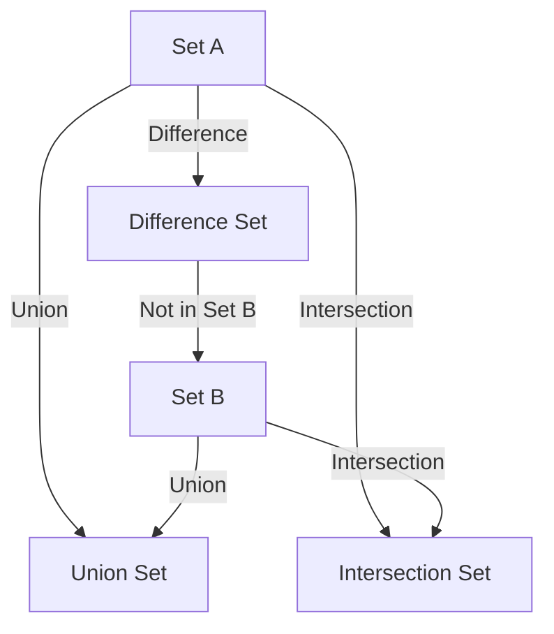

## A.3.4 Sets

In Clojure, sets are a fundamental data structure that represents collections of unique elements. They are particularly useful for tasks such as membership testing, eliminating duplicates, and performing mathematical set operations like union, intersection, and difference. As Java developers, you may be familiar with the `Set` interface in Java, which provides similar functionality. However, Clojure sets offer additional benefits due to their immutable nature and integration with functional programming paradigms.

### Understanding Sets in Clojure

A **set** in Clojure is an unordered collection of unique elements. This means that each element can appear only once in a set, and the order of elements is not guaranteed. Sets are ideal for scenarios where you need to ensure uniqueness or perform operations that are mathematically defined for sets.

#### Creating Sets

Clojure provides several ways to create sets:

1. **Literal Syntax**: You can define a set using the `#{}` syntax.

```clojure
(def my-set #{1 2 3 4})
;; my-set is a set containing the elements 1, 2, 3, and 4
```

2. **`hash-set` Function**: You can also use the `hash-set` function to create a set.

```clojure
(def another-set (hash-set 5 6 7 8))
;; another-set is a set containing the elements 5, 6, 7, and 8
```

3. **Converting Collections to Sets**: You can convert other collections, such as lists or vectors, into sets using the `set` function.

```clojure
(def list-to-set (set [1 2 2 3 4]))
;; list-to-set is a set containing the elements 1, 2, 3, and 4 (duplicates removed)
```

### Common Set Operations

Clojure provides a rich set of operations for working with sets, many of which are found in the `clojure.set` namespace. Let's explore some of the most common operations:

#### Adding and Removing Elements

- **`conj`**: Adds an element to a set. If the element is already present, the set remains unchanged.

```clojure
(def updated-set (conj my-set 5))
;; updated-set is #{1 2 3 4 5}
```

- **`disj`**: Removes an element from a set. If the element is not present, the set remains unchanged.

```clojure
(def reduced-set (disj my-set 3))
;; reduced-set is #{1 2 4}
```

#### Set Operations

- **`union`**: Combines multiple sets into one, containing all unique elements from the input sets.

```clojure
(require '[clojure.set :as set])

(def union-set (set/union my-set another-set))
;; union-set is #{1 2 3 4 5 6 7 8}
```

- **`intersection`**: Returns a set containing only the elements present in all input sets.

```clojure
(def intersection-set (set/intersection my-set #{3 4 5}))
;; intersection-set is #{3 4}
```

- **`difference`**: Returns a set containing elements present in the first set but not in the others.

```clojure
(def difference-set (set/difference my-set #{3 4 5}))
;; difference-set is #{1 2}
```

### Practical Examples

Let's explore some practical examples to illustrate how sets can be used effectively in Clojure.

#### Example 1: Removing Duplicates

Suppose you have a list of numbers with duplicates, and you want to remove the duplicates.

```clojure
(def numbers [1 2 2 3 4 4 5])
(def unique-numbers (set numbers))
;; unique-numbers is #{1 2 3 4 5}
```

#### Example 2: Membership Testing

You can use sets to efficiently test for membership.

```clojure
(defn is-member? [s element]
  (contains? s element))

(is-member? my-set 3) ;; returns true
(is-member? my-set 6) ;; returns false
```

#### Example 3: Set Operations for Data Analysis

Imagine you have two sets of user IDs representing users who have completed different courses. You want to find users who have completed both courses.

```clojure
(def course-a-users #{101 102 103 104})
(def course-b-users #{103 104 105 106})

(def common-users (set/intersection course-a-users course-b-users))
;; common-users is #{103 104}
```

### Comparing Clojure Sets with Java Sets

In Java, the `Set` interface is part of the Java Collections Framework, and it provides similar functionality to Clojure sets. However, there are some key differences:

- **Immutability**: Clojure sets are immutable by default, meaning that operations on sets return new sets rather than modifying the original. This immutability simplifies reasoning about code and enhances concurrency safety.

- **Syntax and Operations**: Clojure provides a more concise syntax for creating and manipulating sets, and it integrates seamlessly with functional programming paradigms.

- **Performance**: Clojure sets are implemented as hash sets, providing efficient membership testing and set operations.

Here's a comparison of creating and using sets in Java and Clojure:

**Java Example**:

```java
import java.util.HashSet;
import java.util.Set;

Set<Integer> javaSet = new HashSet<>();
javaSet.add(1);
javaSet.add(2);
javaSet.add(3);
javaSet.add(4);

boolean isMember = javaSet.contains(3); // true
```

**Clojure Example**:

```clojure
(def clojure-set #{1 2 3 4})
(def is-member (contains? clojure-set 3)) ;; true
```

### Visualizing Set Operations

To better understand set operations, let's visualize them using a Venn diagram. Below is a representation of the union, intersection, and difference operations.



**Diagram Explanation**:
- **Union**: Combines all elements from Set A and Set B.
- **Intersection**: Contains only elements present in both Set A and Set B.
- **Difference**: Contains elements present in Set A but not in Set B.

### Try It Yourself

To deepen your understanding of Clojure sets, try modifying the examples above:

1. Create a set of strings and perform union and intersection operations with another set of strings.
2. Implement a function that takes two sets and returns a set of elements that are unique to each set (symmetric difference).
3. Experiment with larger sets and measure the performance of different operations.

### Exercises

1. **Exercise 1**: Write a function that takes a list of numbers and returns a set of even numbers from the list.
2. **Exercise 2**: Given two sets of integers, write a function that returns a set of integers that are present in either one set or the other, but not both (symmetric difference).
3. **Exercise 3**: Implement a function that checks if one set is a subset of another.

### Key Takeaways

- **Sets in Clojure** are collections of unique elements, ideal for membership testing and eliminating duplicates.
- **Creating Sets**: Use literal syntax `#{}` or functions like `hash-set` and `set`.
- **Common Operations**: Include `conj`, `disj`, `union`, `intersection`, and `difference`.
- **Immutability**: Clojure sets are immutable, enhancing code safety and concurrency.
- **Comparison with Java**: Clojure sets offer a more concise syntax and integrate well with functional programming paradigms.

By mastering sets in Clojure, you can efficiently handle unique collections and perform powerful set operations, enhancing your data manipulation capabilities in functional programming.

### Further Reading

For more information on Clojure sets and their operations, consider exploring the following resources:

- [Official Clojure Documentation on Sets](https://clojure.org/reference/data_structures#Sets)
- [ClojureDocs: clojure.set Namespace](https://clojuredocs.org/clojure.set)
- [GitHub: Clojure Source Code](https://github.com/clojure/clojure)

Now that we've explored how sets work in Clojure, let's apply these concepts to manage unique collections effectively in your applications.

## Quiz: Mastering Clojure Sets



### What is a set in Clojure?

- [x] An unordered collection of unique elements
- [ ] An ordered collection of elements
- [ ] A collection that allows duplicate elements
- [ ] A mutable collection

> **Explanation:** A set in Clojure is an unordered collection of unique elements, meaning each element can appear only once.

### How do you create a set using literal syntax in Clojure?

- [x] `#{1 2 3}`
- [ ] `[1 2 3]`
- [ ] `(1 2 3)`
- [ ] `hash-set 1 2 3`

> **Explanation:** The literal syntax for creating a set in Clojure is `#{}`.

### Which function is used to add an element to a set in Clojure?

- [x] `conj`
- [ ] `add`
- [ ] `insert`
- [ ] `append`

> **Explanation:** The `conj` function is used to add an element to a set in Clojure.

### What does the `intersection` function do?

- [x] Returns a set containing elements present in all input sets
- [ ] Combines all elements from multiple sets
- [ ] Removes elements from a set
- [ ] Adds elements to a set

> **Explanation:** The `intersection` function returns a set containing elements present in all input sets.

### How can you remove an element from a set in Clojure?

- [x] `disj`
- [ ] `remove`
- [ ] `delete`
- [ ] `exclude`

> **Explanation:** The `disj` function is used to remove an element from a set in Clojure.

### What is the result of `(set/difference #{1 2 3} #{2 3 4})`?

- [x] `#{1}`
- [ ] `#{2 3}`
- [ ] `#{4}`
- [ ] `#{1 4}`

> **Explanation:** The `difference` function returns a set containing elements present in the first set but not in the others.

### Which namespace provides set operations like `union` and `intersection`?

- [x] `clojure.set`
- [ ] `clojure.core`
- [ ] `clojure.data`
- [ ] `clojure.collection`

> **Explanation:** The `clojure.set` namespace provides set operations like `union` and `intersection`.

### What is the primary advantage of using sets in Clojure?

- [x] Ensuring uniqueness of elements
- [ ] Maintaining order of elements
- [ ] Allowing duplicate elements
- [ ] Providing mutable collections

> **Explanation:** The primary advantage of using sets in Clojure is ensuring the uniqueness of elements.

### How does immutability benefit Clojure sets?

- [x] Enhances code safety and concurrency
- [ ] Allows direct modification of elements
- [ ] Increases memory usage
- [ ] Slows down performance

> **Explanation:** Immutability enhances code safety and concurrency by ensuring that operations on sets return new sets rather than modifying the original.

### True or False: Clojure sets are ordered collections.

- [ ] True
- [x] False

> **Explanation:** Clojure sets are unordered collections, meaning the order of elements is not guaranteed.


