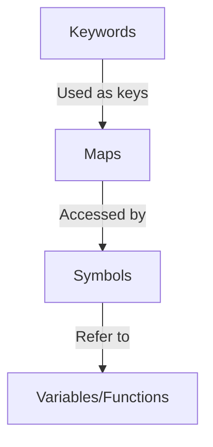

## A.3.5 Keywords and Symbols

In Clojure, **keywords** and **symbols** are fundamental constructs that play crucial roles in the language's syntax and semantics. Understanding these constructs is essential for Java developers transitioning to Clojure, as they differ significantly from Java's variable and constant handling. In this section, we'll delve into the nature of keywords and symbols, their usage, and how they compare to Java concepts.

### Understanding Keywords in Clojure

**Keywords** in Clojure are unique identifiers that evaluate to themselves. They are often used as keys in maps and are immutable, making them ideal for scenarios where constant values are required. Keywords are prefixed with a colon (`:`), such as `:name` or `:age`.

#### Characteristics of Keywords

- **Self-evaluating**: Keywords evaluate to themselves, meaning `:name` is always `:name`.
- **Immutable**: Once created, a keyword's value cannot change.
- **Efficient for Map Keys**: Keywords are optimized for use as keys in maps, providing fast lookup times.

#### Example of Keywords in Use

Let's consider a simple example where keywords are used as keys in a map:

```clojure
(def person {:name "Alice" :age 30 :occupation "Engineer"})

;; Accessing values using keywords
(println (:name person)) ; Output: Alice
(println (:age person))  ; Output: 30
```

In this example, `:name`, `:age`, and `:occupation` are keywords used to access values in the `person` map.

#### Keywords vs. Java Constants

In Java, constants are typically defined using the `final` keyword, often within an enum or a class. Here's a comparison:

**Java Example:**

```java
public class Person {
    public static final String NAME = "name";
    public static final String AGE = "age";
    public static final String OCCUPATION = "occupation";
}
```

**Clojure Equivalent:**

```clojure
(def person {:name "Alice" :age 30 :occupation "Engineer"})
```

In Clojure, keywords serve a similar purpose to Java's constants but are more concise and integrated into the language's data structures.

### Understanding Symbols in Clojure

**Symbols** in Clojure are identifiers that refer to variables or functions. They are used to name things and can be thought of as references to values or functions. Symbols are not prefixed with any special character, unlike keywords.

#### Characteristics of Symbols

- **Referential**: Symbols refer to values or functions and are resolved in the context of their namespace.
- **Dynamic**: Symbols can be bound to different values over time, allowing for flexibility in code.
- **Used in Function Definitions**: Symbols are commonly used to define function parameters and local bindings.

#### Example of Symbols in Use

Consider the following example where symbols are used to define a function:

```clojure
(defn greet [name]
  (str "Hello, " name "!"))

;; Calling the function with a symbol
(println (greet "Alice")) ; Output: Hello, Alice!
```

In this example, `greet` is a symbol representing the function, and `name` is a symbol used as a parameter within the function.

#### Symbols vs. Java Variables

In Java, variables are declared with a type and can be reassigned unless marked as `final`. Here's a comparison:

**Java Example:**

```java
public class Greeting {
    public static String greet(String name) {
        return "Hello, " + name + "!";
    }
}
```

**Clojure Equivalent:**

```clojure
(defn greet [name]
  (str "Hello, " name "!"))
```

In Clojure, symbols are more flexible and do not require explicit type declarations, aligning with the language's dynamic nature.

### Using Keywords and Symbols Together

Keywords and symbols often work together in Clojure, especially when dealing with data structures like maps. Let's explore a more complex example:

```clojure
(defn describe-person [person]
  (let [name (:name person)
        age (:age person)
        occupation (:occupation person)]
    (str name " is a " age " year old " occupation ".")))

(def alice {:name "Alice" :age 30 :occupation "Engineer"})

(println (describe-person alice))
```

In this example, keywords are used to access values in the `alice` map, while symbols are used to bind these values within the `describe-person` function.

### Try It Yourself

To deepen your understanding, try modifying the above examples:

1. Add a new keyword-value pair to the `person` map, such as `:hobby`.
2. Update the `describe-person` function to include this new information in its output.

### Diagrams and Visualizations

To visualize the relationship between keywords and symbols, consider the following diagram:



**Diagram Description**: This diagram illustrates how keywords are used as keys in maps and accessed by symbols, which refer to variables or functions.

### Exercises and Practice Problems

1. **Exercise 1**: Create a map representing a book with keywords for title, author, and year. Write a function that takes this map and returns a formatted string describing the book.

2. **Exercise 2**: Write a function that takes a map of student grades (with student names as keywords) and returns the average grade.

3. **Exercise 3**: Modify the `describe-person` function to handle missing keys gracefully, returning a default message if a key is not present.

### Key Takeaways

- **Keywords** are immutable, self-evaluating identifiers often used as map keys.
- **Symbols** are dynamic references to variables or functions, used in function definitions and local bindings.
- Keywords and symbols together enable concise and expressive data manipulation in Clojure.
- Understanding these constructs is crucial for leveraging Clojure's strengths in functional programming and data handling.

### Further Reading

For more information on keywords and symbols in Clojure, consider exploring the following resources:

- [Official Clojure Documentation on Keywords](https://clojure.org/reference/data_structures#Keywords)
- [ClojureDocs: Symbols](https://clojuredocs.org/clojure.core/symbol)
- [Clojure for the Brave and True: Keywords and Symbols](https://www.braveclojure.com)

Now that we've explored the roles of keywords and symbols in Clojure, let's apply these concepts to create more expressive and efficient code in your applications.

## Quiz: Mastering Keywords and Symbols in Clojure



### What is a keyword in Clojure?

- [x] An immutable, self-evaluating identifier often used as a map key.
- [ ] A mutable variable that can be reassigned.
- [ ] A function that returns a constant value.
- [ ] A special character used in string manipulation.

> **Explanation:** Keywords in Clojure are immutable and self-evaluating, making them ideal for use as map keys.

### How do symbols differ from keywords in Clojure?

- [x] Symbols refer to variables or functions, while keywords are self-evaluating constants.
- [ ] Symbols are immutable, while keywords are mutable.
- [ ] Symbols are used only in function definitions, while keywords are used only in maps.
- [ ] Symbols and keywords are interchangeable in Clojure.

> **Explanation:** Symbols in Clojure refer to variables or functions, whereas keywords are self-evaluating constants often used as map keys.

### Which of the following is a valid keyword in Clojure?

- [x] `:age`
- [ ] `age`
- [ ] `#age`
- [ ] `@age`

> **Explanation:** Keywords in Clojure are prefixed with a colon (`:`), such as `:age`.

### What is the primary use of keywords in Clojure?

- [x] To serve as keys in maps for efficient data access.
- [ ] To define functions and variables.
- [ ] To perform arithmetic operations.
- [ ] To manipulate strings.

> **Explanation:** Keywords are primarily used as keys in maps, providing efficient data access.

### How can you access a value in a map using a keyword?

- [x] By using the keyword as a function, e.g., `(:name person)`.
- [ ] By using the keyword with a dot operator, e.g., `.name(person)`.
- [ ] By using the keyword with a hash, e.g., `#name(person)`.
- [ ] By using the keyword with an at symbol, e.g., `@name(person)`.

> **Explanation:** In Clojure, you can access a value in a map by using the keyword as a function, such as `(:name person)`.

### What is the output of `(println (:occupation {:name "Alice" :age 30 :occupation "Engineer"}))`?

- [x] Engineer
- [ ] Alice
- [ ] 30
- [ ] nil

> **Explanation:** The keyword `:occupation` is used to access the value "Engineer" in the map.

### Which of the following is a valid symbol in Clojure?

- [x] `my-var`
- [ ] `:my-var`
- [ ] `#my-var`
- [ ] `@my-var`

> **Explanation:** Symbols in Clojure are identifiers that refer to variables or functions and do not have a prefix.

### How do you define a function in Clojure using symbols?

- [x] `(defn greet [name] (str "Hello, " name "!"))`
- [ ] `(def greet [name] (str "Hello, " name "!"))`
- [ ] `(def greet (name) (str "Hello, " name "!"))`
- [ ] `(defn greet name (str "Hello, " name "!"))`

> **Explanation:** The correct syntax for defining a function in Clojure uses `defn` followed by the function name and parameters in square brackets.

### True or False: Keywords in Clojure can be used as function parameters.

- [ ] True
- [x] False

> **Explanation:** Keywords are not used as function parameters; symbols are used for this purpose.

### True or False: Symbols in Clojure are immutable.

- [ ] True
- [x] False

> **Explanation:** Symbols in Clojure are dynamic and can be bound to different values over time.


