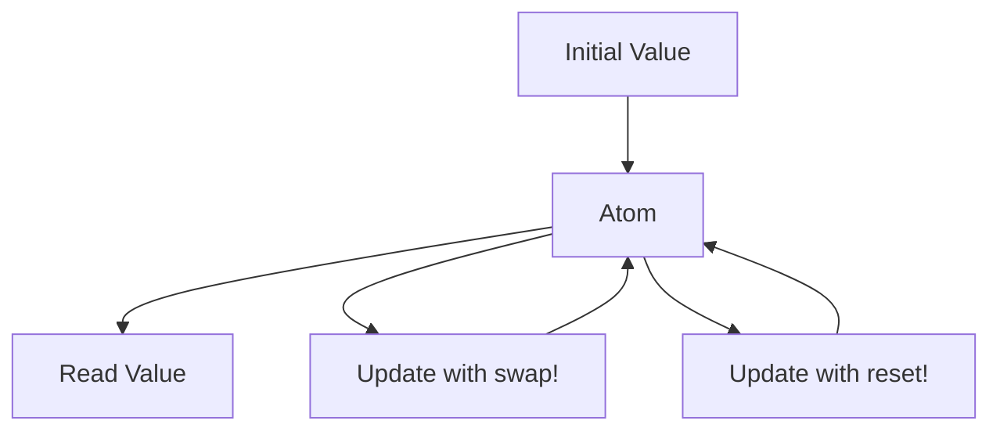

## A.4.1 Atoms

In the world of functional programming, managing state in a concurrent environment can be challenging. Clojure offers a unique solution to this problem with its concurrency primitives, one of which is the **atom**. Atoms provide a way to manage shared, synchronous, and independent state in a thread-safe manner. In this section, we'll explore how atoms work, how to use them, and how they compare to traditional Java concurrency mechanisms.

### Understanding Atoms

Atoms in Clojure are designed to manage state that is independent and can be updated synchronously. They are ideal for scenarios where you need to maintain a single, consistent state across multiple threads without the complexity of locks or other synchronization mechanisms. Atoms ensure that updates to the state are atomic, meaning they are completed in a single, indivisible operation.

#### Key Characteristics of Atoms

- **Synchronous Updates**: Atoms provide synchronous state updates, ensuring that changes are visible to all threads immediately after they occur.
- **Independent State**: Atoms are best suited for managing state that does not depend on other states.
- **Thread Safety**: Updates to atoms are thread-safe, meaning multiple threads can update an atom without causing data corruption.

### Creating and Using Atoms

To create an atom in Clojure, you use the `atom` function. You can read the value of an atom using `deref` or the `@` reader macro. To update the value, you use `swap!` or `reset!`.

#### Creating an Atom

Here's how you create an atom in Clojure:

```clojure
(def my-atom (atom 0)) ; Create an atom with an initial value of 0
```

#### Reading an Atom's Value

To read the value of an atom, you can use `deref` or the `@` symbol:

```clojure
(println (deref my-atom)) ; Prints the current value of the atom
(println @my-atom)        ; Equivalent to the above line
```

#### Updating an Atom's Value

Atoms can be updated using `swap!` or `reset!`. The `swap!` function applies a function to the current value of the atom, while `reset!` sets the atom to a new value directly.

```clojure
(swap! my-atom inc) ; Increment the atom's value by 1
(println @my-atom)  ; Prints 1

(reset! my-atom 42) ; Set the atom's value to 42
(println @my-atom)  ; Prints 42
```

### Thread Safety and Atomicity

Atoms ensure thread safety by using a compare-and-swap (CAS) mechanism under the hood. This means that when you update an atom with `swap!`, Clojure checks if the current value is what you expect it to be before applying the update. If another thread has changed the value in the meantime, the update is retried.

#### Example: Thread-Safe Counter

Let's look at an example where multiple threads update a shared counter using an atom:

```clojure
(def counter (atom 0))

(defn increment-counter []
  (dotimes [_ 1000]
    (swap! counter inc)))

(defn run-threads []
  (let [threads (repeatedly 10 #(Thread. increment-counter))]
    (doseq [t threads] (.start t))
    (doseq [t threads] (.join t))))

(run-threads)
(println @counter) ; Should print 10000
```

In this example, we create 10 threads, each incrementing the counter 1000 times. The final value of the counter should be 10000, demonstrating that the atom handles concurrent updates safely.

### Comparing Atoms to Java's Concurrency Mechanisms

In Java, managing shared state across threads often involves using locks, synchronized blocks, or atomic classes from `java.util.concurrent`. Let's compare these approaches to Clojure's atoms.

#### Java Example: AtomicInteger

Java provides `AtomicInteger` for atomic operations on integers. Here's how you might implement a similar counter in Java:

```java
import java.util.concurrent.atomic.AtomicInteger;

public class CounterExample {
    private static final AtomicInteger counter = new AtomicInteger(0);

    public static void incrementCounter() {
        for (int i = 0; i < 1000; i++) {
            counter.incrementAndGet();
        }
    }

    public static void main(String[] args) throws InterruptedException {
        Thread[] threads = new Thread[10];
        for (int i = 0; i < threads.length; i++) {
            threads[i] = new Thread(CounterExample::incrementCounter);
            threads[i].start();
        }
        for (Thread thread : threads) {
            thread.join();
        }
        System.out.println(counter.get()); // Should print 10000
    }
}
```

#### Comparison

- **Simplicity**: Clojure's atoms provide a simpler API for managing state compared to Java's atomic classes and synchronization mechanisms.
- **Functional Approach**: Atoms encourage a functional style by using pure functions to update state, whereas Java often relies on imperative constructs.
- **Retry Mechanism**: Atoms automatically retry updates when conflicts occur, reducing the need for explicit synchronization logic.

### Practical Use Cases for Atoms

Atoms are suitable for a variety of use cases where you need to manage independent state in a concurrent environment. Here are some examples:

- **Configuration Settings**: Use an atom to store and update application configuration settings that may change at runtime.
- **Caching**: Implement a simple cache using an atom to store and update cached data.
- **Counters and Statistics**: Maintain counters or statistical data that need to be updated by multiple threads.

### Try It Yourself

Now that we've explored how atoms work, try modifying the examples to deepen your understanding:

- **Experiment with Different Functions**: Use different functions with `swap!` to see how they affect the atom's value.
- **Increase the Number of Threads**: Modify the thread count in the counter example to observe how atoms handle increased concurrency.
- **Implement a Simple Cache**: Create a cache using an atom and experiment with adding and removing entries.

### Visualizing Atoms

To better understand how atoms work, let's visualize the flow of data through an atom using a diagram:



**Diagram Description**: This diagram illustrates the lifecycle of an atom. The atom starts with an initial value, which can be read or updated using `swap!` or `reset!`. Updates loop back to the atom, maintaining its state.

### Further Reading

For more information on atoms and concurrency in Clojure, check out these resources:

- [Official Clojure Documentation on Atoms](https://clojure.org/reference/atoms)
- [ClojureDocs: Atoms](https://clojuredocs.org/clojure.core/atom)
- [Concurrency in Clojure: A Practical Guide](https://practical.li/clojure/concurrency/)

### Exercises

To reinforce your understanding of atoms, try these exercises:

1. **Implement a Simple Cache**: Create a cache using an atom and implement functions to add, retrieve, and remove entries.
2. **Thread-Safe Statistics**: Use an atom to maintain statistics (e.g., average, min, max) for a series of numbers updated by multiple threads.
3. **Configuration Manager**: Implement a configuration manager using an atom to store and update application settings.

### Key Takeaways

- **Atoms provide a simple, thread-safe way to manage independent state in Clojure**.
- **They use a compare-and-swap mechanism to ensure atomic updates**, reducing the need for explicit locks or synchronization.
- **Atoms encourage a functional programming style**, using pure functions to update state.
- **They are ideal for scenarios where you need to manage shared state across multiple threads** without complex synchronization logic.

Now that we've explored how atoms work in Clojure, let's apply these concepts to manage state effectively in your applications.

## Quiz: Mastering Atoms in Clojure



### What is the primary use of atoms in Clojure?

- [x] Managing shared, synchronous, independent state
- [ ] Managing asynchronous state
- [ ] Handling side effects
- [ ] Performing I/O operations

> **Explanation:** Atoms are used for managing shared, synchronous, independent state in a thread-safe manner.

### How do you create an atom in Clojure?

- [x] Using the `atom` function
- [ ] Using the `ref` function
- [ ] Using the `agent` function
- [ ] Using the `var` function

> **Explanation:** The `atom` function is used to create an atom in Clojure.

### Which function is used to read the value of an atom?

- [x] `deref`
- [x] `@`
- [ ] `swap!`
- [ ] `reset!`

> **Explanation:** The `deref` function or the `@` symbol can be used to read the value of an atom.

### What does the `swap!` function do?

- [x] Applies a function to the current value of an atom
- [ ] Sets the atom to a new value directly
- [ ] Reads the current value of an atom
- [ ] Deletes the atom

> **Explanation:** The `swap!` function applies a function to the current value of an atom to update it.

### How does Clojure ensure thread safety when updating atoms?

- [x] Using a compare-and-swap mechanism
- [ ] Using locks
- [ ] Using synchronized blocks
- [ ] Using semaphores

> **Explanation:** Clojure uses a compare-and-swap mechanism to ensure thread safety when updating atoms.

### Which of the following is a characteristic of atoms?

- [x] Synchronous updates
- [ ] Asynchronous updates
- [ ] Dependent state management
- [ ] Requires explicit locks

> **Explanation:** Atoms provide synchronous updates and are designed for independent state management.

### What is the equivalent of Clojure's atom in Java?

- [x] `AtomicInteger`
- [ ] `synchronized` block
- [ ] `ReentrantLock`
- [ ] `Semaphore`

> **Explanation:** `AtomicInteger` in Java provides atomic operations similar to Clojure's atom.

### Which function sets an atom to a new value directly?

- [x] `reset!`
- [ ] `swap!`
- [ ] `deref`
- [ ] `@`

> **Explanation:** The `reset!` function sets an atom to a new value directly.

### What is a practical use case for atoms?

- [x] Caching
- [ ] Asynchronous messaging
- [ ] File I/O
- [ ] Network communication

> **Explanation:** Atoms are suitable for caching, where you need to manage shared state in a thread-safe manner.

### Atoms are ideal for managing state that is dependent on other states.

- [ ] True
- [x] False

> **Explanation:** Atoms are ideal for managing independent state, not state that is dependent on other states.


