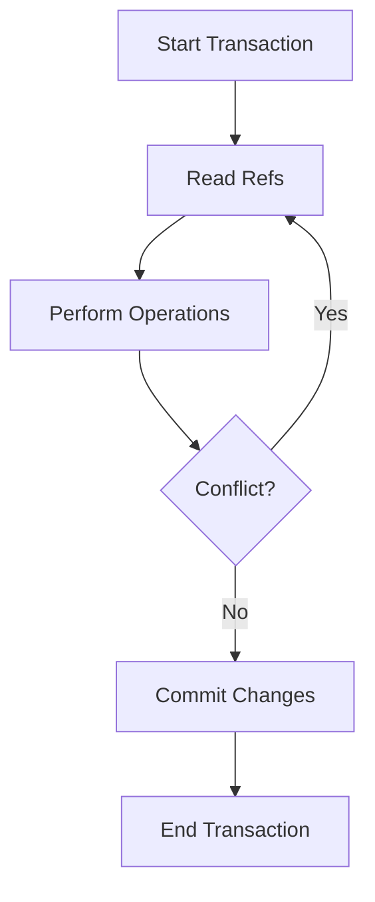

## A.4.2 Refs and Transactions

In the world of concurrent programming, managing shared mutable state is a common challenge. Clojure offers a unique solution to this problem through its Software Transactional Memory (STM) system, which provides a robust mechanism for handling concurrency. In this section, we will explore how **refs** and **transactions** work in Clojure, drawing parallels with Java's concurrency mechanisms to help you transition smoothly.

### Understanding Refs and STM

**Refs** in Clojure are part of its STM system, designed to manage shared, synchronous, and coordinated updates to mutable state. Unlike Java's traditional concurrency mechanisms, such as locks and synchronized blocks, Clojure's STM allows you to define transactions that ensure atomicity, consistency, and isolation.

#### Key Concepts

- **Ref**: A reference type that holds a mutable state, which can only be changed within a transaction.
- **Transaction**: A block of code that ensures atomic updates to one or more refs, using the `dosync` construct.
- **STM**: Software Transactional Memory, a concurrency control mechanism that simplifies state management by allowing multiple refs to be updated atomically.

### Creating Refs

To create a ref in Clojure, you use the `ref` function. Here's a simple example:

```clojure
(def account-balance (ref 1000))
```

In this example, `account-balance` is a ref initialized with a value of 1000. This ref can now be used to manage the state of an account balance in a concurrent environment.

### Performing Transactions

Transactions in Clojure are defined using the `dosync` macro. Within a transaction, you can perform coordinated updates to one or more refs using the `alter` and `ref-set` functions.

#### Using `alter`

The `alter` function is used to update the value of a ref based on its current state. Here's an example:

```clojure
(dosync
  (alter account-balance + 500))
```

In this transaction, we add 500 to the `account-balance` ref. The `alter` function takes a ref, a function, and any additional arguments required by the function.

#### Using `ref-set`

The `ref-set` function is used to set the value of a ref directly. It's less common than `alter` but useful when you need to replace the entire value:

```clojure
(dosync
  (ref-set account-balance 2000))
```

This transaction sets the `account-balance` ref to 2000.

### Coordinated Updates Across Multiple Refs

One of the powerful features of STM is the ability to perform coordinated updates across multiple refs. Let's consider a scenario where we have two accounts, and we want to transfer money between them:

```clojure
(def account1 (ref 1000))
(def account2 (ref 500))

(defn transfer [from to amount]
  (dosync
    (alter from - amount)
    (alter to + amount)))

(transfer account1 account2 200)
```

In this example, the `transfer` function performs a transaction that deducts an amount from `account1` and adds it to `account2`. The `dosync` block ensures that both operations are atomic, preventing any inconsistencies.

### Comparing with Java's Concurrency Mechanisms

Java developers are familiar with using locks and synchronized blocks to manage concurrency. Let's compare these approaches with Clojure's STM:

- **Locks and Synchronization**: In Java, you might use `synchronized` methods or blocks to ensure that only one thread can access a critical section at a time. This can lead to complex code and potential deadlocks.

- **STM in Clojure**: Clojure's STM abstracts away the complexity of locks, allowing you to focus on the logic of your transactions. The STM system handles conflicts and retries automatically, providing a simpler and more reliable concurrency model.

### Code Comparison

Here's a Java example of transferring money between accounts using synchronized methods:

```java
public class Account {
    private int balance;

    public Account(int balance) {
        this.balance = balance;
    }

    public synchronized void deposit(int amount) {
        balance += amount;
    }

    public synchronized void withdraw(int amount) {
        balance -= amount;
    }

    public int getBalance() {
        return balance;
    }
}

public class Bank {
    public static void transfer(Account from, Account to, int amount) {
        synchronized (from) {
            synchronized (to) {
                from.withdraw(amount);
                to.deposit(amount);
            }
        }
    }
}
```

In contrast, the Clojure example using refs and transactions is more concise and less error-prone:

```clojure
(def account1 (ref 1000))
(def account2 (ref 500))

(defn transfer [from to amount]
  (dosync
    (alter from - amount)
    (alter to + amount)))

(transfer account1 account2 200)
```

### Try It Yourself

Experiment with the following modifications to deepen your understanding:

- **Add Logging**: Modify the `transfer` function to log each transaction, showing the balances before and after the transfer.
- **Introduce Errors**: Try introducing an error in the transaction (e.g., subtracting more than the available balance) and observe how STM handles it.
- **Concurrent Transfers**: Simulate multiple concurrent transfers and verify the consistency of the account balances.

### Diagram: STM Transaction Flow

Below is a diagram illustrating the flow of a transaction in Clojure's STM system:



**Diagram Description**: This flowchart represents the lifecycle of a transaction in Clojure's STM. It starts by reading the refs, performing operations, checking for conflicts, and either retrying or committing the changes.

### Best Practices for Using Refs and Transactions

- **Minimize Transaction Scope**: Keep transactions as short as possible to reduce contention and improve performance.
- **Avoid Side Effects**: Do not perform I/O operations or other side effects within transactions, as they may be retried.
- **Use `ref-set` Sparingly**: Prefer `alter` over `ref-set` to leverage the current state of the ref.

### Exercises

1. **Implement a Banking System**: Create a simple banking system with multiple accounts and implement functions for deposit, withdrawal, and transfer using refs and transactions.

2. **Simulate a Stock Exchange**: Model a stock exchange where multiple traders can buy and sell stocks concurrently, ensuring that the total number of stocks remains consistent.

3. **Concurrency Stress Test**: Write a program that performs a large number of concurrent transactions and measure the performance and consistency of the system.

### Key Takeaways

- **Refs and STM** provide a powerful and elegant way to manage shared state in concurrent applications.
- **Transactions** ensure atomicity and consistency, simplifying the complexity of concurrency management.
- **Clojure's STM** abstracts away the need for explicit locks, reducing the risk of deadlocks and race conditions.

By mastering refs and transactions, you can build robust and scalable concurrent applications in Clojure. Now that we've explored how Clojure's STM works, let's apply these concepts to manage state effectively in your applications.

For further reading, consider exploring the [Official Clojure Documentation on Refs](https://clojure.org/reference/refs) and [ClojureDocs](https://clojuredocs.org/).

---

## Quiz: Mastering Refs and Transactions in Clojure



### What is the primary purpose of refs in Clojure?

- [x] To manage shared, synchronous, and coordinated updates to mutable state
- [ ] To perform asynchronous operations
- [ ] To handle I/O operations
- [ ] To create immutable data structures

> **Explanation:** Refs are used in Clojure to manage shared, synchronous, and coordinated updates to mutable state within transactions.

### Which Clojure construct is used to define a transaction?

- [x] `dosync`
- [ ] `sync`
- [ ] `lock`
- [ ] `atomic`

> **Explanation:** The `dosync` construct is used in Clojure to define a transaction, ensuring atomic updates to refs.

### How does the `alter` function work in a transaction?

- [x] It updates the value of a ref based on its current state
- [ ] It sets the value of a ref directly
- [ ] It performs I/O operations
- [ ] It locks the ref for exclusive access

> **Explanation:** The `alter` function updates the value of a ref based on its current state within a transaction.

### What happens if a conflict is detected during a transaction?

- [x] The transaction is retried
- [ ] The transaction is aborted
- [ ] The transaction is ignored
- [ ] The transaction is committed with conflicts

> **Explanation:** If a conflict is detected during a transaction, Clojure's STM automatically retries the transaction.

### Which function is used to set the value of a ref directly?

- [x] `ref-set`
- [ ] `alter`
- [ ] `set-ref`
- [ ] `update`

> **Explanation:** The `ref-set` function is used to set the value of a ref directly within a transaction.

### What is a key advantage of using STM over traditional locks?

- [x] It abstracts away the complexity of locks, reducing the risk of deadlocks
- [ ] It allows for more complex code
- [ ] It requires manual conflict resolution
- [ ] It is faster than all other concurrency models

> **Explanation:** STM abstracts away the complexity of locks, reducing the risk of deadlocks and simplifying concurrency management.

### In Java, which construct is commonly used for synchronized access to shared resources?

- [x] `synchronized`
- [ ] `dosync`
- [ ] `lock`
- [ ] `atomic`

> **Explanation:** In Java, the `synchronized` construct is commonly used for synchronized access to shared resources.

### What should be avoided within a Clojure transaction?

- [x] Performing I/O operations
- [ ] Updating refs
- [ ] Using `alter`
- [ ] Using `dosync`

> **Explanation:** Performing I/O operations should be avoided within a Clojure transaction, as transactions may be retried.

### How can you perform coordinated updates across multiple refs?

- [x] By using a transaction with `dosync`
- [ ] By using `sync`
- [ ] By using `lock`
- [ ] By using `atomic`

> **Explanation:** Coordinated updates across multiple refs can be performed using a transaction with `dosync`.

### True or False: Clojure's STM automatically handles conflicts and retries transactions.

- [x] True
- [ ] False

> **Explanation:** True. Clojure's STM automatically handles conflicts and retries transactions to ensure consistency.


