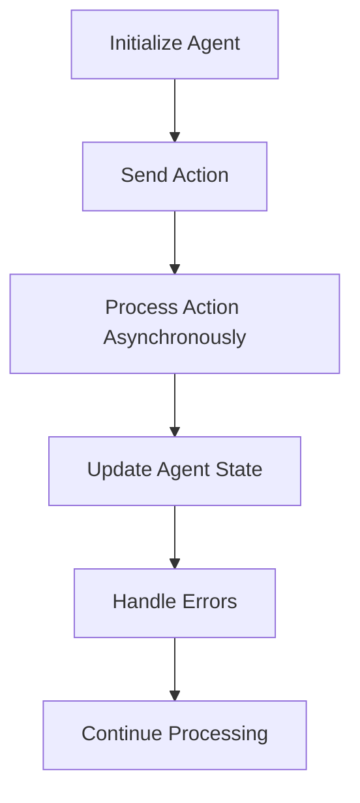

## A.4.3 Agents

In the realm of functional programming, managing state changes in a concurrent environment can be challenging. Clojure offers a unique solution with **agents**, which provide a way to handle asynchronous, independent state changes. Agents are part of Clojure's concurrency model, allowing you to perform background processing without blocking your main application flow. This section will guide you through the concepts, creation, and usage of agents, drawing parallels with Java's concurrency mechanisms to facilitate understanding for Java developers transitioning to Clojure.

### Understanding Agents in Clojure

Agents in Clojure are designed to manage state changes asynchronously. Unlike atoms, which handle synchronous state changes, agents allow you to perform operations in the background, making them ideal for tasks that do not require immediate results. Agents ensure that state changes are applied in a consistent order, even though they are processed asynchronously.

#### Key Characteristics of Agents

- **Asynchronous Processing**: Agents perform actions asynchronously, allowing your main program to continue executing without waiting for the agent's task to complete.
- **Independent State Changes**: Each agent manages its own state independently, making it suitable for tasks that do not need to coordinate with other state changes.
- **Error Handling**: Agents provide mechanisms to handle errors that occur during state updates, ensuring that your application can recover gracefully.

### Creating and Using Agents

Let's dive into how to create agents, send actions to them, and handle errors effectively.

#### Creating an Agent

To create an agent, use the `agent` function, which initializes the agent with an initial state. Here's a simple example:

```clojure
(def my-agent (agent 0)) ; Initialize an agent with an initial state of 0
```

In this example, `my-agent` is an agent initialized with the state `0`. You can think of this as similar to creating an `AtomicInteger` in Java, but with asynchronous capabilities.

#### Sending Actions to Agents

To update the state of an agent, you use the `send` or `send-off` functions. These functions take an agent and a function that describes how to update the agent's state.

- **`send`**: Use `send` for actions that are CPU-bound and do not block. It uses a fixed-size thread pool to execute actions.

- **`send-off`**: Use `send-off` for actions that might block, such as I/O operations. It uses a separate thread pool that can grow as needed.

Here's an example of using `send` to update an agent's state:

```clojure
(send my-agent inc) ; Increment the agent's state by 1
```

This sends the `inc` function to `my-agent`, which will increment its state asynchronously.

#### Handling Errors in Agents

Errors in agents are handled by setting an error handler function. This function is called whenever an exception occurs during an agent's state update. You can set an error handler using `set-error-handler!`.

```clojure
(set-error-handler! my-agent
  (fn [agent exception]
    (println "Error in agent:" exception)))
```

In this example, if an error occurs while updating `my-agent`, the error handler will print the exception.

### Practical Example: Background Processing with Agents

Let's consider a practical example where agents can be used for background processing. Suppose you want to process a list of numbers asynchronously and store the results in an agent.

```clojure
(def results (agent [])) ; Initialize an agent with an empty vector

(defn process-number [n]
  (* n n)) ; Function to process each number (e.g., square it)

(doseq [n (range 1 11)]
  (send results conj (process-number n))) ; Send each processed number to the agent

@results ; Dereference the agent to get the current state
```

In this example, we create an agent `results` initialized with an empty vector. We define a function `process-number` to process each number. Using `doseq`, we iterate over a range of numbers, process each one, and send the result to the `results` agent. Finally, we dereference the agent using `@results` to get the current state.

### Comparing Agents with Java's Concurrency Mechanisms

Java provides several concurrency mechanisms, such as `ExecutorService` and `CompletableFuture`, for handling asynchronous tasks. Let's compare these with Clojure's agents.

#### Java's ExecutorService

In Java, you might use an `ExecutorService` to manage a pool of threads for executing tasks asynchronously. Here's a simple example:

```java
ExecutorService executor = Executors.newFixedThreadPool(10);
Future<Integer> future = executor.submit(() -> {
    return 42; // Perform some computation
});
```

In this example, an `ExecutorService` is used to submit a task that returns a `Future`. The task is executed asynchronously, similar to how agents process actions.

#### Clojure's Agents vs. Java's CompletableFuture

Java's `CompletableFuture` provides a way to handle asynchronous computations and compose them using callbacks. Here's a comparison with Clojure's agents:

- **CompletableFuture**: Allows chaining of asynchronous tasks using methods like `thenApply` and `thenAccept`.
- **Agents**: Focus on managing state changes asynchronously, with built-in error handling and state consistency.

While `CompletableFuture` is powerful for composing asynchronous tasks, agents provide a simpler model for managing state changes without blocking.

### Try It Yourself: Experimenting with Agents

To deepen your understanding of agents, try modifying the examples provided:

1. **Modify the Processing Function**: Change the `process-number` function to perform a different computation, such as calculating the factorial of each number.

2. **Add Error Handling**: Introduce an error in the `process-number` function and observe how the error handler responds.

3. **Use `send-off`**: Replace `send` with `send-off` and simulate a blocking operation, such as a sleep, to see how it affects the execution.

### Visualizing Agents and State Changes

To better understand how agents manage state changes, let's visualize the process using a flowchart.



**Diagram Caption**: This flowchart illustrates the lifecycle of an agent in Clojure, from initialization to processing actions asynchronously and handling errors.

### Key Takeaways

- **Agents** provide a powerful way to manage asynchronous, independent state changes in Clojure.
- **Asynchronous Processing**: Use `send` for CPU-bound tasks and `send-off` for potentially blocking tasks.
- **Error Handling**: Set error handlers to manage exceptions gracefully.
- **Comparison with Java**: While Java offers `ExecutorService` and `CompletableFuture`, agents provide a simpler model for state management.

### Exercises

1. **Implement a Task Queue**: Use agents to implement a simple task queue where tasks are processed asynchronously and results are stored in an agent.

2. **Simulate a Real-World Scenario**: Create a simulation of a real-world scenario, such as processing orders in an e-commerce system, using agents to manage state changes.

3. **Explore Error Handling**: Experiment with different error handling strategies in agents and observe how they affect the application's behavior.

By mastering agents, you can effectively manage asynchronous state changes in your Clojure applications, leveraging the power of functional programming to build robust and scalable systems.

For further reading, explore the [Official Clojure Documentation on Agents](https://clojure.org/reference/agents) and [ClojureDocs](https://clojuredocs.org/clojure.core/agent).

---

## Quiz: Mastering Clojure Agents for Asynchronous State Management



### What is the primary purpose of agents in Clojure?

- [x] To manage asynchronous, independent state changes
- [ ] To handle synchronous state changes
- [ ] To perform blocking operations
- [ ] To replace atoms

> **Explanation:** Agents are designed to manage asynchronous, independent state changes, allowing background processing without blocking.

### Which function should you use for CPU-bound tasks with agents?

- [x] `send`
- [ ] `send-off`
- [ ] `swap!`
- [ ] `reset!`

> **Explanation:** `send` is used for CPU-bound tasks as it uses a fixed-size thread pool, while `send-off` is for potentially blocking tasks.

### How do you initialize an agent in Clojure?

- [x] `(agent initial-state)`
- [ ] `(atom initial-state)`
- [ ] `(future initial-state)`
- [ ] `(promise initial-state)`

> **Explanation:** The `agent` function is used to initialize an agent with a given initial state.

### What happens if an error occurs during an agent's state update?

- [x] The error handler function is called
- [ ] The agent stops processing
- [ ] The application crashes
- [ ] The error is ignored

> **Explanation:** If an error occurs, the error handler function set with `set-error-handler!` is called to manage the exception.

### Which function is suitable for potentially blocking tasks with agents?

- [x] `send-off`
- [ ] `send`
- [ ] `swap!`
- [ ] `reset!`

> **Explanation:** `send-off` is used for potentially blocking tasks as it uses a separate thread pool that can grow as needed.

### How can you retrieve the current state of an agent?

- [x] By dereferencing the agent using `@agent`
- [ ] By calling `get-state(agent)`
- [ ] By using `agent.state`
- [ ] By invoking `agent.value()`

> **Explanation:** You can retrieve the current state of an agent by dereferencing it with `@agent`.

### What is a key difference between agents and Java's CompletableFuture?

- [x] Agents focus on managing state changes asynchronously
- [ ] Agents allow chaining of asynchronous tasks
- [ ] Agents are used for synchronous operations
- [ ] Agents replace Java's ExecutorService

> **Explanation:** Agents focus on managing state changes asynchronously, while CompletableFuture allows chaining of asynchronous tasks.

### Which Clojure function sets an error handler for an agent?

- [x] `set-error-handler!`
- [ ] `set-exception-handler!`
- [ ] `handle-error!`
- [ ] `error-handler!`

> **Explanation:** The `set-error-handler!` function is used to set an error handler for an agent.

### What is the effect of using `send-off` instead of `send`?

- [x] It uses a separate thread pool for potentially blocking tasks
- [ ] It blocks the main thread
- [ ] It uses a fixed-size thread pool
- [ ] It stops the agent from processing

> **Explanation:** `send-off` uses a separate thread pool that can grow as needed, making it suitable for potentially blocking tasks.

### True or False: Agents in Clojure can be used to manage synchronous state changes.

- [ ] True
- [x] False

> **Explanation:** Agents are specifically designed for asynchronous state changes, not synchronous ones.


