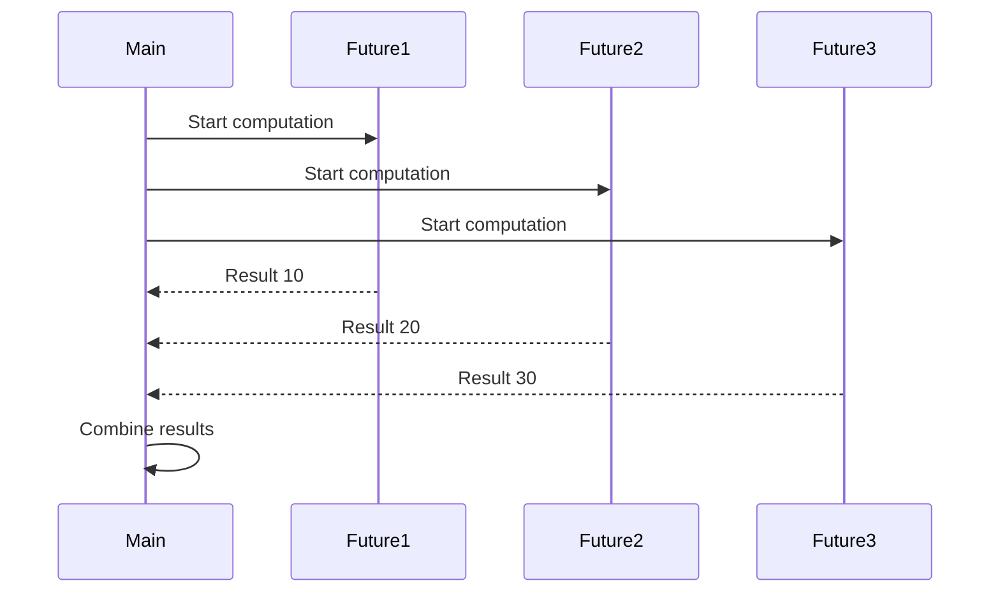
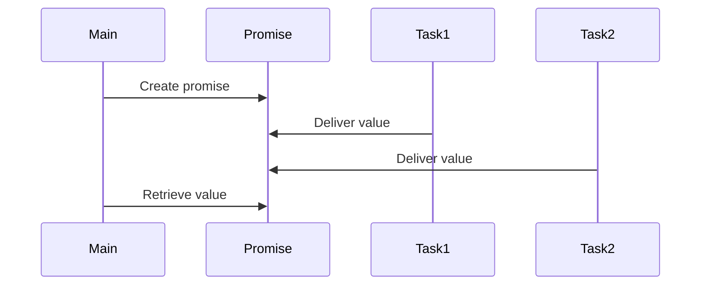

## A.4.4 Futures and Promises

As experienced Java developers, you are likely familiar with the challenges of managing concurrency and asynchronous programming. Clojure offers powerful abstractions in the form of **futures** and **promises** to handle asynchronous computations efficiently. In this section, we'll delve into these concepts, drawing parallels with Java's concurrency models, and explore how they can simplify your code and enhance performance.

### Understanding Futures and Promises

**Futures** in Clojure are a way to perform computations asynchronously. They allow you to offload tasks to be executed in the background, enabling your program to continue processing other tasks concurrently. Once the computation is complete, you can retrieve the result.

**Promises** are a mechanism to deliver a value at some point in the future. They act as placeholders for a result that will be provided later, allowing you to decouple the computation from its consumption.

#### Futures in Clojure

A **future** is created using the `future` function, which takes a computation and executes it in a separate thread. You can retrieve the result of a future using the `deref` function or the `@` reader macro.

```clojure
;; Creating a future to perform a computation asynchronously
(def my-future (future
                 (Thread/sleep 2000) ; Simulate a long-running computation
                 (+ 1 2 3)))

;; Retrieving the result of the future
(println "The result is:" @my-future) ; Output: The result is: 6
```

In this example, the computation `(Thread/sleep 2000) (+ 1 2 3)` is executed asynchronously. The main thread can continue executing other tasks while the future is being computed. The result is retrieved using `@my-future`, which blocks until the computation is complete.

#### Promises in Clojure

A **promise** is created using the `promise` function. You can deliver a value to a promise using the `deliver` function, and retrieve the value using `deref` or `@`.

```clojure
;; Creating a promise
(def my-promise (promise))

;; Delivering a value to the promise
(future
  (Thread/sleep 2000) ; Simulate a delay
  (deliver my-promise "Hello, World!"))

;; Retrieving the value from the promise
(println "The promise says:" @my-promise) ; Output: The promise says: Hello, World!
```

Here, the promise `my-promise` is fulfilled with the value `"Hello, World!"` after a delay. The main thread can continue executing other tasks, and the value is retrieved once it is delivered.

### Comparing with Java's Concurrency Models

In Java, asynchronous computations are often handled using `Future` and `CompletableFuture`. Let's compare these with Clojure's futures and promises.

#### Java's Future

In Java, a `Future` represents the result of an asynchronous computation. You can submit a task to an `ExecutorService` and retrieve the result using the `get` method, which blocks until the computation is complete.

```java
import java.util.concurrent.*;

ExecutorService executor = Executors.newFixedThreadPool(1);
Future<Integer> future = executor.submit(() -> {
    Thread.sleep(2000); // Simulate a long-running computation
    return 1 + 2 + 3;
});

try {
    System.out.println("The result is: " + future.get()); // Output: The result is: 6
} catch (InterruptedException | ExecutionException e) {
    e.printStackTrace();
}
executor.shutdown();
```

#### Java's CompletableFuture

`CompletableFuture` in Java provides a more flexible way to handle asynchronous computations, allowing you to chain multiple tasks and handle exceptions.

```java
import java.util.concurrent.*;

CompletableFuture.supplyAsync(() -> {
    try {
        Thread.sleep(2000); // Simulate a delay
    } catch (InterruptedException e) {
        e.printStackTrace();
    }
    return "Hello, World!";
}).thenAccept(result -> System.out.println("The promise says: " + result)); // Output: The promise says: Hello, World!
```

### Key Differences

- **Simplicity**: Clojure's futures and promises are simpler to use, with less boilerplate code compared to Java's `Future` and `CompletableFuture`.
- **Immutability**: Clojure's data structures are immutable, reducing the risk of concurrency-related bugs.
- **Functional Approach**: Clojure encourages a functional programming style, making it easier to reason about asynchronous computations.

### Advanced Usage of Futures and Promises

Let's explore some advanced patterns and techniques for using futures and promises in Clojure.

#### Combining Futures

You can combine multiple futures using functions like `map` and `reduce` to perform complex asynchronous computations.

```clojure
;; Combining multiple futures
(def future1 (future (Thread/sleep 1000) 10))
(def future2 (future (Thread/sleep 2000) 20))
(def future3 (future (Thread/sleep 3000) 30))

;; Summing the results of the futures
(def total (future
             (+ @future1 @future2 @future3)))

(println "The total is:" @total) ; Output: The total is: 60
```

In this example, we create three futures and combine their results using a fourth future. The computation is performed asynchronously, and the total is retrieved once all futures are complete.

#### Handling Exceptions

Clojure's futures can handle exceptions using the `try` and `catch` blocks within the future.

```clojure
;; Handling exceptions in a future
(def safe-future (future
                   (try
                     (/ 1 0) ; This will cause an exception
                     (catch ArithmeticException e
                       "Division by zero error"))))

(println "The result is:" @safe-future) ; Output: The result is: Division by zero error
```

Here, we handle a division by zero error within the future, returning a custom error message.

#### Using Promises for Coordination

Promises can be used to coordinate multiple asynchronous tasks, ensuring that a value is delivered only when all tasks are complete.

```clojure
;; Using promises for coordination
(def coord-promise (promise))

(future
  (Thread/sleep 1000)
  (deliver coord-promise "Task 1 complete"))

(future
  (Thread/sleep 2000)
  (deliver coord-promise "Task 2 complete"))

(println "Coordination result:" @coord-promise) ; Output: Coordination result: Task 1 complete
```

In this example, the promise `coord-promise` is delivered with the result of the first task to complete. This pattern can be extended to coordinate more complex workflows.

### Visualizing Futures and Promises

To better understand the flow of data and control in futures and promises, let's visualize these concepts using Mermaid.js diagrams.



*Diagram 1: Sequence of asynchronous computations using futures.*

This diagram illustrates how multiple futures can be started concurrently, with results being combined once all computations are complete.



*Diagram 2: Coordination of tasks using a promise.*

This diagram shows how a promise can be used to coordinate multiple tasks, with the value being delivered once a task is complete.

### Try It Yourself

To deepen your understanding, try modifying the code examples:

1. **Change the delay times** in the futures and promises to see how it affects the order of execution.
2. **Add error handling** to the promise example to handle potential exceptions.
3. **Create a new example** that combines futures and promises to perform a more complex computation.

### Exercises and Practice Problems

1. **Create a Future-Based Task Scheduler**: Implement a simple task scheduler using futures that executes tasks at specified intervals.
2. **Coordinate Multiple Promises**: Write a program that coordinates multiple promises, ensuring that a final result is delivered only when all promises are fulfilled.
3. **Error Handling in Asynchronous Computations**: Extend the error handling example to log errors to a file or send notifications.

### Key Takeaways

- **Futures** allow you to perform computations asynchronously, enabling concurrent execution of tasks.
- **Promises** provide a way to deliver values at a later time, decoupling computation from consumption.
- Clojure's **futures and promises** offer a simpler, more functional approach to asynchronous programming compared to Java's concurrency models.
- **Error handling** and **task coordination** are essential aspects of working with futures and promises.
- **Visualizing** the flow of data and control can enhance your understanding of asynchronous computations.

By mastering futures and promises, you can harness the full power of Clojure's concurrency model to build efficient, scalable applications. Now that we've explored these concepts, let's apply them to manage asynchronous tasks effectively in your projects.

For further reading, explore the [Official Clojure Documentation](https://clojure.org/reference/concurrency) and [ClojureDocs](https://clojuredocs.org/).

## Quiz: Mastering Clojure Futures and Promises



### What is a future in Clojure?

- [x] A way to perform computations asynchronously
- [ ] A mechanism to deliver a value at a later time
- [ ] A data structure for storing multiple values
- [ ] A function for handling exceptions

> **Explanation:** A future in Clojure is used to perform computations asynchronously, allowing tasks to be executed in the background.

### How do you retrieve the result of a future in Clojure?

- [x] Using the `deref` function or `@` reader macro
- [ ] Using the `get` method
- [ ] Using the `thenAccept` method
- [ ] Using the `deliver` function

> **Explanation:** The result of a future in Clojure can be retrieved using the `deref` function or the `@` reader macro, which blocks until the computation is complete.

### What is a promise in Clojure?

- [x] A mechanism to deliver a value at a later time
- [ ] A way to perform computations asynchronously
- [ ] A data structure for storing multiple values
- [ ] A function for handling exceptions

> **Explanation:** A promise in Clojure is a mechanism to deliver a value at a later time, allowing computation and consumption to be decoupled.

### How do you deliver a value to a promise in Clojure?

- [x] Using the `deliver` function
- [ ] Using the `deref` function
- [ ] Using the `get` method
- [ ] Using the `thenAccept` method

> **Explanation:** The `deliver` function is used to provide a value to a promise in Clojure.

### Which Java class is similar to Clojure's future?

- [x] `Future`
- [ ] `CompletableFuture`
- [ ] `Promise`
- [ ] `ExecutorService`

> **Explanation:** Java's `Future` class is similar to Clojure's future, as both represent the result of an asynchronous computation.

### What is the main advantage of using Clojure's futures and promises over Java's concurrency models?

- [x] Simplicity and reduced boilerplate code
- [ ] Better performance
- [ ] More control over thread management
- [ ] Easier integration with Java libraries

> **Explanation:** Clojure's futures and promises offer simplicity and reduced boilerplate code compared to Java's concurrency models.

### How can you handle exceptions in a Clojure future?

- [x] Using `try` and `catch` blocks within the future
- [ ] Using the `get` method
- [ ] Using the `thenAccept` method
- [ ] Using the `deliver` function

> **Explanation:** Exceptions in a Clojure future can be handled using `try` and `catch` blocks within the future.

### What function is used to create a promise in Clojure?

- [x] `promise`
- [ ] `future`
- [ ] `deliver`
- [ ] `deref`

> **Explanation:** The `promise` function is used to create a promise in Clojure.

### What is the purpose of using promises for coordination in Clojure?

- [x] To ensure a value is delivered only when all tasks are complete
- [ ] To perform computations asynchronously
- [ ] To handle exceptions in asynchronous code
- [ ] To store multiple values

> **Explanation:** Promises can be used for coordination in Clojure to ensure a value is delivered only when all tasks are complete.

### True or False: Clojure's futures and promises are immutable.

- [x] True
- [ ] False

> **Explanation:** Clojure's futures and promises are immutable, reducing the risk of concurrency-related bugs.


