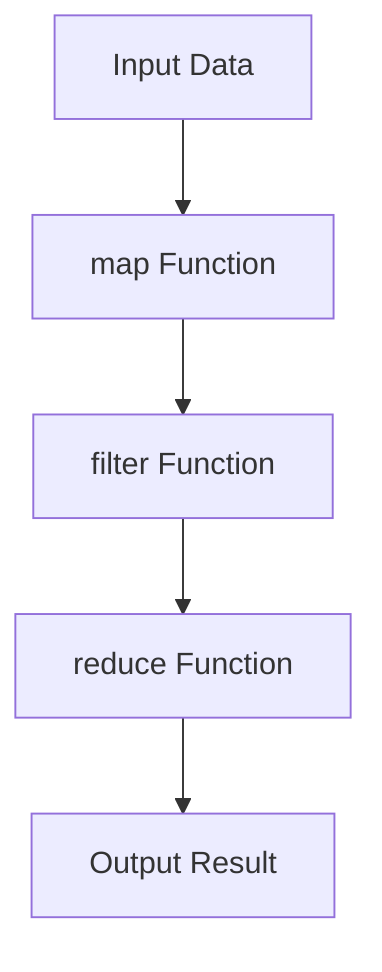
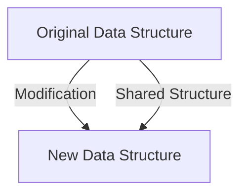

## B.2.1 MOOCs and Video Courses

As an experienced Java developer, transitioning to Clojure can be both exciting and challenging. To facilitate this journey, several online courses provide structured learning paths to master Clojure's functional programming paradigm. This section explores three prominent courses: **"Functional Programming Principles in Clojure"** on Coursera, **"Clojure Fundamentals"** on Pluralsight, and **"Mastering Clojure"** on Udemy. Each course offers unique insights and practical knowledge to enhance your Clojure skills.

### Functional Programming Principles in Clojure on Coursera

**Overview**: This course is designed to introduce the core principles of functional programming using Clojure. It covers essential concepts such as immutability, higher-order functions, and concurrency, providing a solid foundation for Java developers looking to embrace functional programming.

**Prerequisites**: A basic understanding of programming concepts and familiarity with Java is recommended. The course assumes no prior experience with Clojure, making it accessible to beginners in the language.

**Course Structure**:
- **Week 1**: Introduction to Clojure and Functional Programming
  - Understanding the functional paradigm
  - Setting up the Clojure development environment
- **Week 2**: Immutable Data Structures
  - Exploring lists, vectors, maps, and sets
  - Comparing with Java's mutable collections
- **Week 3**: Higher-Order Functions and Recursion
  - Implementing map, reduce, and filter
  - Recursive patterns and tail recursion
- **Week 4**: Concurrency and State Management
  - Using atoms, refs, and agents
  - Managing state in a concurrent environment

**Access**: Enroll through [Coursera](https://www.coursera.org) to access the course materials, video lectures, and assignments. A certificate of completion is available for a fee.

**Try It Yourself**: As you progress through the course, experiment with converting Java code snippets to Clojure. For example, try rewriting a simple Java loop using Clojure's `map` function.

### Clojure Fundamentals on Pluralsight

**Overview**: Pluralsight's "Clojure Fundamentals" course offers a comprehensive introduction to Clojure, focusing on practical applications and real-world scenarios. It is ideal for developers who prefer a hands-on approach to learning.

**Prerequisites**: Familiarity with Java or another programming language is beneficial. The course is structured to accommodate learners new to Clojure.

**Course Structure**:
- **Module 1**: Getting Started with Clojure
  - Setting up the development environment
  - Basic syntax and REPL usage
- **Module 2**: Working with Data Structures
  - Lists, vectors, maps, and sets in depth
  - Practical examples and exercises
- **Module 3**: Functions and Functional Programming
  - Defining and using functions
  - Higher-order functions and closures
- **Module 4**: Concurrency and Parallelism
  - Leveraging Clojure's concurrency primitives
  - Building concurrent applications

**Access**: Available on [Pluralsight](https://www.pluralsight.com) with a subscription. The platform offers a free trial period for new users.

**Try It Yourself**: Modify the provided code examples to implement additional features or optimize performance. For instance, enhance a data processing pipeline using Clojure's transducers.

### Mastering Clojure on Udemy

**Overview**: "Mastering Clojure" on Udemy is a deep dive into advanced Clojure topics, suitable for developers who have a basic understanding of the language and wish to explore its full potential.

**Prerequisites**: Completion of an introductory Clojure course or equivalent experience is recommended. Familiarity with functional programming concepts will be advantageous.

**Course Structure**:
- **Section 1**: Advanced Data Structures and Algorithms
  - Persistent data structures and performance considerations
  - Implementing algorithms in Clojure
- **Section 2**: Macros and Metaprogramming
  - Writing and using macros effectively
  - Building domain-specific languages (DSLs)
- **Section 3**: Interoperability with Java
  - Calling Java methods and using Java libraries
  - Creating Java objects in Clojure
- **Section 4**: Building Full-Stack Applications
  - Integrating Clojure with web technologies
  - Developing RESTful APIs and web services

**Access**: Purchase the course on [Udemy](https://www.udemy.com) to gain lifetime access to the video lectures and course materials.

**Try It Yourself**: Challenge yourself by integrating a Clojure library into a Java project. Experiment with Clojure's Java interoperability features to enhance your application's functionality.

### Diagrams and Visual Aids

To better understand the flow of data through higher-order functions and the concept of immutability, let's explore some visual aids.

#### Higher-Order Functions Flowchart

*Caption*: This flowchart illustrates the transformation of input data through a series of higher-order functions: `map`, `filter`, and `reduce`.

#### Immutability and Persistent Data Structures

*Caption*: Immutability in Clojure ensures that modifications result in new data structures, with shared parts to optimize memory usage.

### Additional Resources

For further exploration of Clojure concepts, consider these external resources:
- [Official Clojure Documentation](https://clojure.org)
- [ClojureDocs](https://clojuredocs.org)
- [Clojure GitHub Repository](https://github.com/clojure/clojure)

### Exercises and Practice Problems

1. **Rewrite Java Code**: Take a simple Java program and rewrite it in Clojure, focusing on using immutable data structures and higher-order functions.
2. **Concurrency Challenge**: Implement a concurrent data processing task using Clojure's atoms and agents. Compare the performance with a similar Java implementation.
3. **Macro Exploration**: Create a custom macro in Clojure to simplify repetitive code patterns. Test its functionality with various inputs.

### Key Takeaways

- **Functional Programming**: Clojure emphasizes immutability and higher-order functions, offering a different approach from Java's imperative style.
- **Concurrency**: Clojure's concurrency primitives provide powerful tools for managing state in concurrent applications.
- **Interoperability**: Seamless integration with Java allows developers to leverage existing Java libraries and frameworks.

By engaging with these courses and resources, you'll gain a deeper understanding of Clojure's capabilities and how they can enhance your development skills. Embrace the functional programming paradigm and explore the unique features Clojure offers to build robust, scalable applications.

## Quiz: Test Your Knowledge on Clojure MOOCs and Video Courses



### Which course is designed for beginners in Clojure and covers the core principles of functional programming?

- [x] Functional Programming Principles in Clojure on Coursera
- [ ] Clojure Fundamentals on Pluralsight
- [ ] Mastering Clojure on Udemy
- [ ] None of the above

> **Explanation:** The "Functional Programming Principles in Clojure" course on Coursera is designed to introduce beginners to the core principles of functional programming using Clojure.

### What is a key feature of the "Clojure Fundamentals" course on Pluralsight?

- [ ] Focus on advanced Clojure topics
- [x] Hands-on approach with practical applications
- [ ] Emphasis on Java interoperability
- [ ] Building full-stack applications

> **Explanation:** The "Clojure Fundamentals" course on Pluralsight offers a hands-on approach with practical applications, making it ideal for learners who prefer experiential learning.

### Which course is recommended for developers with a basic understanding of Clojure who want to explore advanced topics?

- [ ] Functional Programming Principles in Clojure on Coursera
- [ ] Clojure Fundamentals on Pluralsight
- [x] Mastering Clojure on Udemy
- [ ] None of the above

> **Explanation:** "Mastering Clojure" on Udemy is recommended for developers with a basic understanding of Clojure who wish to explore advanced topics.

### What is a common prerequisite for the courses mentioned in this section?

- [x] Familiarity with Java or another programming language
- [ ] Prior experience with Clojure
- [ ] Advanced knowledge of functional programming
- [ ] None of the above

> **Explanation:** Familiarity with Java or another programming language is a common prerequisite for the courses mentioned, as it helps learners transition to Clojure.

### Which course includes a section on building full-stack applications?

- [ ] Functional Programming Principles in Clojure on Coursera
- [ ] Clojure Fundamentals on Pluralsight
- [x] Mastering Clojure on Udemy
- [ ] None of the above

> **Explanation:** "Mastering Clojure" on Udemy includes a section on building full-stack applications, providing insights into integrating Clojure with web technologies.

### What is the focus of the "Functional Programming Principles in Clojure" course on Coursera?

- [x] Core principles of functional programming
- [ ] Advanced Clojure topics
- [ ] Java interoperability
- [ ] Full-stack application development

> **Explanation:** The focus of the "Functional Programming Principles in Clojure" course on Coursera is on the core principles of functional programming.

### Which course offers a free trial period for new users?

- [ ] Functional Programming Principles in Clojure on Coursera
- [x] Clojure Fundamentals on Pluralsight
- [ ] Mastering Clojure on Udemy
- [ ] None of the above

> **Explanation:** Pluralsight offers a free trial period for new users, allowing them to explore the "Clojure Fundamentals" course.

### What is a unique feature of Clojure compared to Java?

- [x] Immutability by default
- [ ] Object-oriented programming
- [ ] Extensive use of inheritance
- [ ] None of the above

> **Explanation:** A unique feature of Clojure compared to Java is its emphasis on immutability by default, which simplifies state management and concurrency.

### Which course emphasizes the use of macros and metaprogramming?

- [ ] Functional Programming Principles in Clojure on Coursera
- [ ] Clojure Fundamentals on Pluralsight
- [x] Mastering Clojure on Udemy
- [ ] None of the above

> **Explanation:** "Mastering Clojure" on Udemy emphasizes the use of macros and metaprogramming, exploring advanced Clojure topics.

### True or False: All the courses mentioned require prior experience with Clojure.

- [ ] True
- [x] False

> **Explanation:** Not all the courses mentioned require prior experience with Clojure. Some are designed for beginners, while others are for more advanced learners.


