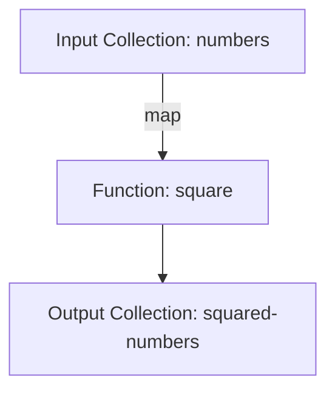

## Local User Groups and Meetups for Clojure Enthusiasts

As experienced Java developers transitioning to Clojure, engaging with local user groups and meetups can significantly enhance your learning journey. These gatherings offer a unique opportunity to connect with fellow enthusiasts, share knowledge, and collaborate on projects. In this section, we'll explore how to find local Clojure groups, the benefits of participating in meetups, and how to start your own group if none exist in your area.

### Finding Local Clojure User Groups

The first step in joining a local Clojure community is finding a group near you. Here are some effective strategies:

#### 1. **Utilize Meetup.com**

Meetup.com is a popular platform for organizing and discovering local events. By searching for "Clojure" or "Functional Programming" in your area, you can find groups that align with your interests. Meetup.com allows you to join groups, RSVP for events, and connect with other members.

#### 2. **Explore Community Websites**

Many Clojure communities maintain their own websites or forums where they announce upcoming events and activities. Websites like [Clojure.org](https://clojure.org/community) provide links to various user groups and events worldwide.

#### 3. **Leverage Social Media**

Platforms like Twitter, LinkedIn, and Facebook often host Clojure-related groups and discussions. Following Clojure influencers or joining relevant groups can lead you to local meetups and events.

#### 4. **Check Local Universities and Tech Hubs**

Universities and tech hubs often host programming meetups and workshops. Contacting computer science departments or tech incubators can reveal opportunities to engage with the Clojure community.

### Benefits of In-Person Interactions

Participating in local user groups and meetups offers numerous advantages that can accelerate your transition from Java to Clojure:

#### 1. **Collaborative Learning**

Meetups provide a platform for collaborative learning, where you can discuss challenges, share solutions, and gain insights from others' experiences. This collaborative environment fosters a deeper understanding of Clojure concepts.

#### 2. **Networking Opportunities**

Building a network of Clojure enthusiasts can open doors to new career opportunities, collaborations, and friendships. Networking at meetups allows you to connect with professionals who share your interests and goals.

#### 3. **Access to Expert Knowledge**

Many meetups feature talks or workshops led by experienced Clojure developers. These sessions offer valuable insights into best practices, advanced techniques, and real-world applications of Clojure.

#### 4. **Hands-On Experience**

Meetups often include coding sessions or hackathons, providing hands-on experience with Clojure projects. This practical application of knowledge reinforces learning and builds confidence in your skills.

#### 5. **Community Support**

Being part of a community offers support and encouragement as you navigate the challenges of learning a new language. Sharing experiences and solutions with peers can boost motivation and persistence.

### Starting a Local Clojure Group

If no Clojure user groups exist in your area, consider starting your own. Here's how:

#### 1. **Identify Potential Members**

Reach out to local developers, tech enthusiasts, and students who might be interested in Clojure. Use social media, forums, and local tech events to spread the word.

#### 2. **Choose a Venue**

Select a venue that can accommodate your group size and activities. Libraries, coworking spaces, and community centers often offer meeting rooms for free or at a low cost.

#### 3. **Plan Your First Meetup**

Organize an introductory meeting to gauge interest and discuss the group's goals. Consider inviting a guest speaker or hosting a coding session to attract attendees.

#### 4. **Promote Your Group**

Use platforms like Meetup.com, Eventbrite, and social media to promote your group and events. Consistent communication and engagement are key to building a thriving community.

#### 5. **Foster a Welcoming Environment**

Create an inclusive and supportive atmosphere where members feel comfortable sharing ideas and asking questions. Encourage participation and collaboration to build a strong sense of community.

### Code Example: Organizing a Meetup

Let's illustrate how you might organize a simple Clojure coding session at a meetup. We'll create a basic Clojure script to demonstrate a functional programming concept, such as higher-order functions.

```clojure
;; Define a higher-order function that takes a function and a collection
(defn apply-to-all [f coll]
  (map f coll))

;; Define a simple function to be applied
(defn square [x]
  (* x x))

;; Use the higher-order function
(def numbers [1 2 3 4 5])
(def squared-numbers (apply-to-all square numbers))

;; Print the result
(println "Squared numbers:" squared-numbers)
```

**Try It Yourself:** Modify the `square` function to cube the numbers instead. What changes do you need to make?

### Diagram: Flow of Data Through Higher-Order Functions



**Caption:** This diagram illustrates the flow of data through the `apply-to-all` higher-order function, which applies the `square` function to each element in the `numbers` collection.

### Challenges and Exercises

1. **Find a Local Group:** Use the strategies outlined above to find a local Clojure user group. Attend a meetup and share your experience with the community.

2. **Organize a Coding Session:** If you're part of a group, propose organizing a coding session using the provided code example. Discuss the concept of higher-order functions and explore variations.

3. **Start Your Own Group:** If no local groups exist, take the initiative to start one. Document your journey and share tips with others looking to do the same.

### Key Takeaways

- **Engagement with Local Communities:** Joining local Clojure user groups and meetups enhances learning through collaboration and networking.
- **Benefits of Participation:** Meetups offer opportunities for hands-on experience, expert insights, and community support.
- **Starting a Group:** If no local groups exist, starting your own can foster a new community of Clojure enthusiasts.

By actively participating in local user groups and meetups, you can accelerate your transition from Java to Clojure, gain valuable insights, and build lasting connections within the Clojure community.

### Further Reading

- [Official Clojure Documentation](https://clojure.org)
- [ClojureDocs](https://clojuredocs.org)
- [Meetup.com](https://www.meetup.com)

## Quiz: Test Your Knowledge on Local User Groups and Meetups



### What is a primary benefit of joining local Clojure user groups?

- [x] Collaborative learning and networking
- [ ] Access to free software
- [ ] Guaranteed job placement
- [ ] Discounts on Clojure books

> **Explanation:** Local user groups offer collaborative learning and networking opportunities, which are invaluable for professional growth.

### How can you find local Clojure meetups?

- [x] Use Meetup.com
- [x] Explore community websites
- [ ] Visit local hardware stores
- [ ] Check movie theaters

> **Explanation:** Meetup.com and community websites are excellent resources for finding local Clojure meetups.

### What is a key advantage of in-person interactions at meetups?

- [x] Access to expert knowledge
- [ ] Free meals
- [ ] Guaranteed attendance
- [ ] Automatic membership in all tech groups

> **Explanation:** In-person interactions provide access to expert knowledge and insights from experienced developers.

### What should you do if no Clojure groups exist in your area?

- [x] Start your own group
- [ ] Wait for someone else to start one
- [ ] Move to a different city
- [ ] Focus on online forums only

> **Explanation:** Starting your own group can create new opportunities for learning and networking in your area.

### Which platform is commonly used to organize meetups?

- [x] Meetup.com
- [ ] Craigslist
- [ ] eBay
- [ ] Amazon

> **Explanation:** Meetup.com is a widely used platform for organizing and discovering local meetups.

### What is an essential step in starting a local Clojure group?

- [x] Identifying potential members
- [ ] Buying expensive equipment
- [ ] Hiring a professional organizer
- [ ] Creating a complex website

> **Explanation:** Identifying potential members is crucial for building a successful local group.

### How can social media help in finding Clojure meetups?

- [x] By connecting with Clojure influencers
- [ ] By selling tickets
- [ ] By providing free advertising
- [ ] By offering discounts

> **Explanation:** Social media can help you connect with Clojure influencers and discover local meetups.

### What is a common activity at Clojure meetups?

- [x] Coding sessions
- [ ] Watching movies
- [ ] Playing video games
- [ ] Shopping

> **Explanation:** Coding sessions are common activities at Clojure meetups, providing hands-on experience.

### What is a benefit of networking at meetups?

- [x] Building professional connections
- [ ] Free merchandise
- [ ] Guaranteed promotions
- [ ] Unlimited access to resources

> **Explanation:** Networking at meetups helps build professional connections that can lead to new opportunities.

### True or False: Meetups are only beneficial for beginners.

- [ ] True
- [x] False

> **Explanation:** Meetups are beneficial for developers at all levels, offering opportunities for learning and networking.


