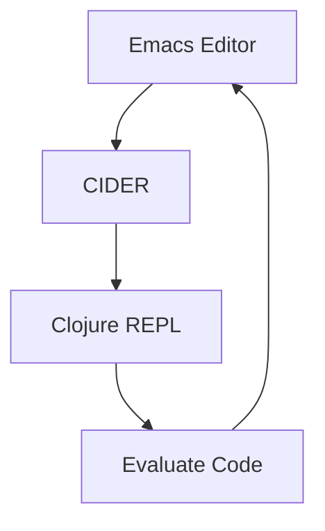

## C.1.1 Emacs with CIDER

Emacs, a powerful and extensible text editor, combined with CIDER (Clojure Interactive Development Environment that Rocks), provides a robust environment for Clojure development. This guide will walk you through setting up Emacs for Clojure, installing and configuring CIDER, and customizing your environment with additional packages for a seamless development experience.

### Setting Up Emacs for Clojure Development

#### Installing Emacs

Before diving into Clojure development, you need to install Emacs. Depending on your operating system, the installation process may vary slightly.

- **Windows**: Download the latest version of Emacs from [GNU Emacs for Windows](https://www.gnu.org/software/emacs/download.html) and follow the installation instructions.
- **macOS**: Use Homebrew to install Emacs by running `brew install emacs` in your terminal.
- **Linux**: Most Linux distributions include Emacs in their package manager. For example, on Ubuntu, you can install it using `sudo apt-get install emacs`.

#### Configuring Emacs for Clojure

Once Emacs is installed, you need to configure it for Clojure development. This involves setting up your `.emacs` or `init.el` file, which is where Emacs configuration is stored.

```lisp
;; Add MELPA repository for package management
(require 'package)
(add-to-list 'package-archives
             '("melpa" . "https://melpa.org/packages/") t)
(package-initialize)

;; Install CIDER
(unless (package-installed-p 'cider)
  (package-refresh-contents)
  (package-install 'cider))
```

### Installing and Configuring CIDER

CIDER is an essential tool for Clojure development in Emacs, providing features like inline evaluation, debugging, and REPL integration.

#### Installing CIDER

With the MELPA repository added, you can install CIDER by running `M-x package-install RET cider RET` in Emacs. This command will download and install CIDER from the MELPA repository.

#### Basic CIDER Configuration

Add the following configuration to your `.emacs` or `init.el` file to set up CIDER:

```lisp
;; Enable CIDER
(require 'cider)

;; Enable eldoc-mode for Clojure
(add-hook 'cider-mode-hook #'eldoc-mode)

;; Enable company-mode for autocompletion
(add-hook 'cider-mode-hook #'company-mode)

;; Configure CIDER REPL
(setq cider-repl-display-help-banner nil)
(setq cider-repl-pop-to-buffer-on-connect t)
```

### Customizing Emacs with Additional Packages

To enhance your Emacs experience, consider installing additional packages like `paredit` for structural editing and `company-mode` for autocompletion.

#### Installing Paredit

Paredit helps you manage parentheses and other structural elements in Lisp code. Install it by running `M-x package-install RET paredit RET`.

Add the following to your configuration file:

```lisp
;; Enable paredit for Clojure
(add-hook 'clojure-mode-hook #'paredit-mode)
```

#### Installing Company-Mode

Company-mode provides autocompletion features. Install it using `M-x package-install RET company RET`.

Add this to your configuration:

```lisp
;; Enable company-mode for Clojure
(add-hook 'clojure-mode-hook #'company-mode)
```

#### Visual Enhancements

Customize the appearance of Emacs with themes. Install a theme by running `M-x package-install RET zenburn-theme RET`, and activate it with:

```lisp
;; Load Zenburn theme
(load-theme 'zenburn t)
```

### Using CIDER Features

CIDER offers a range of features that enhance Clojure development, including inline evaluation, debugging, and code navigation.

#### Inline Evaluation

Evaluate Clojure expressions directly in your buffer using `C-c C-e`. This feature allows you to see results immediately, facilitating a more interactive development process.

#### Debugging

CIDER provides powerful debugging tools. Set breakpoints with `C-u C-M-x` and step through code execution using `n` for next and `c` for continue.

#### Code Navigation

Navigate your codebase efficiently with CIDER's navigation features. Use `M-.` to jump to the definition of a symbol and `M-,` to return to your previous location.

#### REPL Integration

The REPL (Read-Eval-Print Loop) is a core component of Clojure development. Start a REPL session with `M-x cider-jack-in` and interact with your code in real-time.

### Try It Yourself

Experiment with the following code snippet in your Emacs setup:

```clojure
;; Define a simple function
(defn greet [name]
  (str "Hello, " name "!"))

;; Evaluate the function
(greet "Clojure Developer")
```

Try modifying the `greet` function to include a personalized message or add additional parameters.

### Diagrams and Visualizations

To better understand the flow of data through CIDER and Emacs, consider the following diagram illustrating the interaction between Emacs, CIDER, and the Clojure REPL:



*Diagram: Interaction between Emacs, CIDER, and the Clojure REPL.*

### Further Reading and Resources

- [Official CIDER Documentation](https://docs.cider.mx/cider/)
- [ClojureDocs](https://clojuredocs.org/)
- [EmacsWiki](https://www.emacswiki.org/)

### Exercises and Practice Problems

1. **Exercise 1**: Customize your Emacs theme and share your configuration with a peer.
2. **Exercise 2**: Write a Clojure function that calculates the factorial of a number and test it using CIDER.
3. **Exercise 3**: Set up a debugging session in CIDER and step through a complex function.

### Key Takeaways

- **Emacs with CIDER** provides a powerful environment for Clojure development, offering features like inline evaluation and debugging.
- **Customization** is key to enhancing your development experience, with packages like `paredit` and `company-mode` improving productivity.
- **REPL integration** allows for interactive coding, making it easier to test and debug Clojure code.

By setting up Emacs with CIDER, you're well-equipped to explore the functional programming paradigm of Clojure, leveraging its unique features to build robust applications.

## Quiz: Mastering Emacs with CIDER for Clojure Development



### What is the primary purpose of CIDER in Emacs?

- [x] To provide an interactive development environment for Clojure
- [ ] To manage version control
- [ ] To compile Java code
- [ ] To edit HTML files

> **Explanation:** CIDER is designed to enhance Clojure development by providing features like inline evaluation and REPL integration.

### Which Emacs package is used for structural editing of Lisp code?

- [x] Paredit
- [ ] Company-mode
- [ ] Zenburn
- [ ] Eldoc

> **Explanation:** Paredit is a package that helps manage parentheses and other structural elements in Lisp code.

### How do you start a REPL session in Emacs with CIDER?

- [x] M-x cider-jack-in
- [ ] M-x start-repl
- [ ] M-x run-clojure
- [ ] M-x repl-start

> **Explanation:** The command `M-x cider-jack-in` starts a REPL session in Emacs using CIDER.

### What is the purpose of company-mode in Emacs?

- [x] To provide autocompletion features
- [ ] To manage themes
- [ ] To debug code
- [ ] To navigate files

> **Explanation:** Company-mode enhances coding efficiency by providing autocompletion features.

### Which command is used to evaluate a Clojure expression inline in Emacs?

- [x] C-c C-e
- [ ] C-c C-c
- [x] C-c C-k
- [ ] C-c C-d

> **Explanation:** The command `C-c C-e` evaluates a Clojure expression inline in Emacs.

### What does the command `M-.` do in CIDER?

- [x] Jumps to the definition of a symbol
- [ ] Starts a REPL session
- [ ] Evaluates a buffer
- [ ] Opens a new file

> **Explanation:** The command `M-.` is used for code navigation, allowing you to jump to the definition of a symbol.

### Which package is recommended for visual enhancements in Emacs?

- [x] Zenburn
- [ ] Paredit
- [x] Company-mode
- [ ] Eldoc

> **Explanation:** Zenburn is a theme that provides visual enhancements for Emacs.

### What is the role of eldoc-mode in CIDER?

- [x] To display function signatures and documentation
- [ ] To manage version control
- [ ] To compile code
- [ ] To edit HTML files

> **Explanation:** Eldoc-mode displays function signatures and documentation in the minibuffer, aiding in code comprehension.

### How can you install a package in Emacs?

- [x] M-x package-install RET package-name RET
- [ ] M-x install-package RET package-name RET
- [ ] M-x add-package RET package-name RET
- [ ] M-x setup-package RET package-name RET

> **Explanation:** The command `M-x package-install RET package-name RET` installs a package in Emacs.

### Emacs with CIDER is primarily used for Java development.

- [ ] True
- [x] False

> **Explanation:** Emacs with CIDER is primarily used for Clojure development, not Java.


