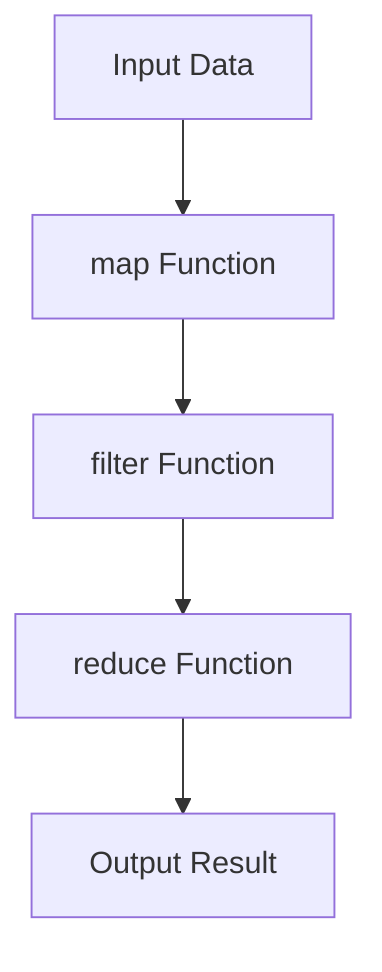

## C.1.2 IntelliJ IDEA with Cursive

IntelliJ IDEA, a widely-used integrated development environment (IDE), offers a robust platform for Java developers transitioning to Clojure. With the Cursive plugin, IntelliJ becomes a powerful tool for Clojure development, providing features that enhance productivity and streamline the development process. In this section, we will explore how to configure IntelliJ IDEA with Cursive for optimal performance, leverage its code analysis and refactoring tools, utilize structural editing, and integrate with version control and continuous integration systems.

### Configuring Project Settings for Optimal Performance

To get started with Clojure development in IntelliJ IDEA using Cursive, it's essential to configure your project settings for optimal performance. This involves setting up the Clojure SDK, configuring project dependencies, and customizing the IDE to suit your workflow.

#### Setting Up the Clojure SDK

1. **Install the Cursive Plugin**: 
   - Navigate to `File > Settings > Plugins`.
   - Search for "Cursive" and install the plugin.
   - Restart IntelliJ IDEA to activate the plugin.

2. **Configure the Clojure SDK**:
   - Go to `File > Project Structure > SDKs`.
   - Click on the `+` icon and select "Clojure SDK".
   - Choose the appropriate Clojure version and set the path to your Clojure installation.

3. **Set Up Project Dependencies**:
   - Use `Leiningen` or `tools.deps` to manage dependencies.
   - For Leiningen, create a `project.clj` file in the root directory.
   - For tools.deps, create a `deps.edn` file.

#### Customizing IntelliJ IDEA

- **Memory Settings**: Increase the IDE's memory allocation for better performance. Edit the `idea.vmoptions` file to adjust the `-Xmx` and `-Xms` values.
- **Keymap Customization**: Customize keybindings to match your workflow. Navigate to `File > Settings > Keymap` to modify shortcuts.
- **Appearance and Behavior**: Adjust themes and fonts under `File > Settings > Appearance & Behavior`.

### Leveraging IntelliJ's Powerful Code Analysis and Refactoring Tools

IntelliJ IDEA offers powerful code analysis and refactoring tools that can significantly enhance your Clojure development experience.

#### Code Analysis

- **Static Code Analysis**: IntelliJ provides real-time code analysis, highlighting potential issues and suggesting improvements.
- **Linting**: Use linters like `clj-kondo` to enforce coding standards and catch errors early.

#### Refactoring Tools

- **Rename Refactoring**: Easily rename symbols across your codebase with `Shift + F6`.
- **Extract Function**: Simplify complex expressions by extracting them into functions using `Ctrl + Alt + M`.
- **Inline Variable**: Inline variables to simplify code with `Ctrl + Alt + N`.

### Utilizing Features Like Structural Editing, Inline REPL, and Test Runners

Cursive enhances IntelliJ with features specifically designed for Clojure development, such as structural editing, an inline REPL, and integrated test runners.

#### Structural Editing

Structural editing treats code as a tree structure, allowing for more intuitive manipulation of code.

- **Paredit Mode**: Enable Paredit for structural editing, which helps maintain balanced parentheses and navigate code efficiently.
- **Smart Indentation**: Automatically indent code blocks to improve readability.

#### Inline REPL

The inline REPL allows you to evaluate Clojure expressions directly within the editor.

- **Start the REPL**: Use `Tools > REPL > Start REPL` to launch the REPL.
- **Evaluate Expressions**: Highlight code and press `Ctrl + Enter` to evaluate it in the REPL.
- **Interactive Development**: Use the REPL for interactive development and testing.

#### Test Runners

Cursive integrates with popular test frameworks, allowing you to run and debug tests within the IDE.

- **Run Tests**: Use `Run > Run...` to execute tests.
- **Debug Tests**: Set breakpoints and use `Run > Debug...` to debug tests.

### Integrating with Version Control Systems and Continuous Integration Tools

IntelliJ IDEA supports integration with version control systems (VCS) and continuous integration (CI) tools, streamlining collaboration and deployment processes.

#### Version Control Integration

- **Git Integration**: IntelliJ provides built-in support for Git, allowing you to manage repositories, branches, and commits.
- **Commit and Push**: Use `VCS > Commit` to commit changes and `VCS > Push` to push them to a remote repository.

#### Continuous Integration

- **CI Tools**: Integrate with CI tools like Jenkins or Travis CI to automate builds and tests.
- **Build Configurations**: Use `File > Settings > Build, Execution, Deployment` to configure build settings.

### Try It Yourself

To solidify your understanding, try the following exercises:

1. **Create a New Clojure Project**: Set up a new Clojure project using Leiningen or tools.deps and configure it in IntelliJ IDEA.
2. **Refactor Code**: Use IntelliJ's refactoring tools to improve the structure of an existing Clojure codebase.
3. **Run Tests**: Write and run unit tests for a simple Clojure function using Cursive's test runner.

### Diagrams and Visual Aids

Below is a Mermaid diagram illustrating the flow of data through a Clojure function using higher-order functions.

*Diagram 1: Flow of data through higher-order functions in Clojure.*

### Key Takeaways

- **IntelliJ IDEA with Cursive** provides a powerful environment for Clojure development, offering features like structural editing, inline REPL, and integrated test runners.
- **Code Analysis and Refactoring** tools in IntelliJ enhance code quality and maintainability.
- **Version Control and CI Integration** streamline collaboration and deployment processes.

### Further Reading

- [Official Cursive Documentation](https://cursive-ide.com/)
- [IntelliJ IDEA Documentation](https://www.jetbrains.com/idea/documentation/)
- [ClojureDocs](https://clojuredocs.org/)

### Exercises

1. **Configure a Clojure Project**: Set up a new Clojure project in IntelliJ IDEA and configure it with the Cursive plugin.
2. **Refactor a Codebase**: Use IntelliJ's refactoring tools to improve the structure of an existing Clojure codebase.
3. **Run and Debug Tests**: Write and run unit tests for a simple Clojure function using Cursive's test runner.

## SEO optimized quiz title



### What is the primary purpose of the Cursive plugin in IntelliJ IDEA?

- [x] To provide Clojure support in IntelliJ IDEA
- [ ] To enhance Java development features
- [ ] To manage project dependencies
- [ ] To integrate with version control systems

> **Explanation:** The Cursive plugin is specifically designed to add Clojure support to IntelliJ IDEA, enabling features like structural editing and REPL integration.

### Which tool is used for managing Clojure project dependencies in IntelliJ IDEA?

- [x] Leiningen
- [ ] Maven
- [ ] Gradle
- [ ] Ant

> **Explanation:** Leiningen is a popular tool for managing Clojure project dependencies, often used in conjunction with IntelliJ IDEA and Cursive.

### What feature does Paredit provide in Cursive?

- [x] Structural editing for balanced parentheses
- [ ] Syntax highlighting
- [ ] Code completion
- [ ] Version control integration

> **Explanation:** Paredit is a feature that provides structural editing, helping maintain balanced parentheses in Clojure code.

### How can you evaluate a Clojure expression in the inline REPL?

- [x] Highlight the code and press `Ctrl + Enter`
- [ ] Use `Alt + F5`
- [ ] Right-click and select "Run"
- [ ] Use `Shift + F10`

> **Explanation:** In Cursive, you can evaluate a Clojure expression by highlighting it and pressing `Ctrl + Enter`.

### What is the benefit of using IntelliJ's refactoring tools?

- [x] To improve code structure and maintainability
- [ ] To increase code execution speed
- [ ] To enhance syntax highlighting
- [ ] To manage project dependencies

> **Explanation:** IntelliJ's refactoring tools help improve the structure and maintainability of code, making it easier to read and modify.

### Which version control system is natively supported by IntelliJ IDEA?

- [x] Git
- [ ] Subversion
- [ ] Mercurial
- [ ] CVS

> **Explanation:** IntelliJ IDEA provides built-in support for Git, allowing seamless integration for version control.

### What is the purpose of continuous integration tools in development?

- [x] To automate builds and tests
- [ ] To manage project dependencies
- [ ] To enhance code completion
- [ ] To provide syntax highlighting

> **Explanation:** Continuous integration tools automate the process of building and testing code, ensuring that changes are integrated smoothly.

### How can you increase IntelliJ's memory allocation for better performance?

- [x] Edit the `idea.vmoptions` file
- [ ] Use the "Increase Memory" button in settings
- [ ] Install a memory management plugin
- [ ] Adjust the memory settings in `project.clj`

> **Explanation:** You can increase IntelliJ's memory allocation by editing the `idea.vmoptions` file and adjusting the `-Xmx` and `-Xms` values.

### What is the function of the `reduce` function in Clojure?

- [x] To aggregate data into a single result
- [ ] To filter elements from a collection
- [ ] To map a function over a collection
- [ ] To sort a collection

> **Explanation:** The `reduce` function in Clojure is used to aggregate data from a collection into a single result.

### True or False: Cursive allows you to run and debug Clojure tests directly within IntelliJ IDEA.

- [x] True
- [ ] False

> **Explanation:** Cursive integrates with test frameworks, allowing you to run and debug Clojure tests directly within IntelliJ IDEA.


