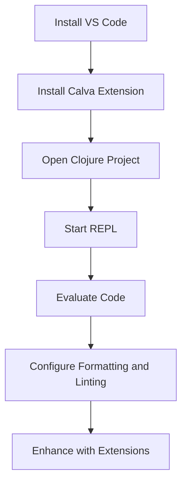

## C.1.3 Visual Studio Code with Calva

Visual Studio Code (VS Code) is a versatile and powerful code editor that, when combined with the Calva extension, provides a robust environment for Clojure development. In this guide, we'll explore how to set up and configure VS Code with Calva to enhance your Clojure development experience, focusing on REPL-driven development, code formatting, and productivity tips.

### Setting Up Calva for Seamless REPL-Driven Development

Calva is an extension for VS Code that brings Clojure support, including a REPL (Read-Eval-Print Loop), to the editor. The REPL is a fundamental tool in Clojure development, allowing for interactive coding and immediate feedback.

#### Installing Visual Studio Code

Before we dive into Calva, ensure you have Visual Studio Code installed on your system. You can download it from the [official website](https://code.visualstudio.com/).

#### Installing the Calva Extension

1. **Open VS Code**: Launch Visual Studio Code.
2. **Access Extensions**: Click on the Extensions icon in the Activity Bar on the side of the window or press `Ctrl+Shift+X`.
3. **Search for Calva**: In the Extensions view, type "Calva" into the search bar.
4. **Install Calva**: Click on the "Install" button for the Calva extension.

#### Configuring Calva

Once installed, Calva requires some configuration to optimize your workflow:

- **Open a Clojure Project**: Open a folder containing a Clojure project. Calva works best with projects managed by Leiningen or tools.deps.
- **Start the REPL**: Use the command palette (`Ctrl+Shift+P`) and type "Start a Project REPL and Connect (aka Jack-in)" to start the REPL. Calva will prompt you to choose between Leiningen or tools.deps.
- **Evaluate Code**: You can evaluate Clojure code directly in the editor by placing the cursor on an expression and pressing `Ctrl+Enter`.

#### REPL-Driven Development

The REPL allows you to test functions and expressions interactively. This is a key advantage of Clojure, enabling rapid prototyping and debugging.

```clojure
;; Define a simple function
(defn greet [name]
  (str "Hello, " name "!"))

;; Evaluate the function in the REPL
(greet "World") ; => "Hello, World!"
```

**Try It Yourself**: Modify the `greet` function to include a time-based greeting, such as "Good morning" or "Good evening," based on the current time.

### Configuring Settings for Code Formatting, Linting, and Autocompletion

Calva provides several features to enhance code quality and readability, such as formatting, linting, and autocompletion.

#### Code Formatting

Calva uses the `cljfmt` library for code formatting. You can configure it to automatically format your code on save:

1. **Open Settings**: Go to File > Preferences > Settings or press `Ctrl+,`.
2. **Search for Format on Save**: Type "format on save" in the search bar.
3. **Enable Format on Save**: Check the box for "Editor: Format On Save."

#### Linting

Linting helps catch potential errors and enforce coding standards. Calva integrates with `clj-kondo`, a popular linter for Clojure.

- **Install clj-kondo**: Follow the [installation instructions](https://github.com/clj-kondo/clj-kondo) for clj-kondo.
- **Configure Calva to Use clj-kondo**: Calva automatically detects clj-kondo if it's installed. You can customize linting settings in your project's `.clj-kondo/config.edn` file.

#### Autocompletion

Calva provides autocompletion for Clojure code, which can be enhanced by configuring VS Code's IntelliSense:

- **Enable IntelliSense**: Ensure that IntelliSense is enabled in VS Code settings for a smoother coding experience.

### Using VS Code Extensions to Improve Productivity

VS Code's extensibility allows you to enhance your development environment with additional tools.

#### Bracket Colorizers

Bracket colorizers help visually distinguish matching brackets, which is particularly useful in Clojure's nested expressions.

- **Install Bracket Pair Colorizer**: Search for "Bracket Pair Colorizer" in the Extensions view and install it.

#### Git Integrations

VS Code has built-in Git support, but you can enhance it with extensions like GitLens for advanced features.

- **Install GitLens**: Search for "GitLens" in the Extensions view and install it.

### Tips for Debugging, Live Code Evaluation, and Navigating Large Codebases

Debugging and navigating code are crucial skills in any development environment. Here are some tips to enhance these processes in VS Code with Calva.

#### Debugging

While Clojure's REPL-driven development reduces the need for traditional debugging, you can still use VS Code's debugging features:

- **Set Breakpoints**: You can set breakpoints in your Clojure code and use the REPL to inspect variables and evaluate expressions.
- **Use the Debug Console**: The Debug Console allows you to execute Clojure expressions while debugging.

#### Live Code Evaluation

Calva's REPL integration allows for live code evaluation, which is a powerful feature for testing and iterating on code.

- **Evaluate in the REPL**: Use `Ctrl+Enter` to evaluate expressions in the REPL and see results immediately.

#### Navigating Large Codebases

VS Code provides several features to help navigate large codebases:

- **Go to Definition**: Use `F12` to jump to the definition of a function or variable.
- **Find All References**: Use `Shift+F12` to find all references to a symbol.
- **Outline View**: Use the Outline view to see a structured view of your code.

### Diagrams and Visualizations

To better understand the flow of data and code structure, we can use diagrams. Below is a simple flowchart illustrating the process of setting up and using Calva in VS Code.



**Diagram Caption**: This flowchart outlines the steps to set up and use Calva in Visual Studio Code for Clojure development.

### Exercises and Practice Problems

1. **Exercise 1**: Create a new Clojure project using Leiningen or tools.deps. Set up Calva in VS Code and write a simple function to calculate the factorial of a number. Evaluate the function in the REPL.

2. **Exercise 2**: Configure clj-kondo for your project and identify any linting issues. Fix the issues and observe the improvements in code quality.

3. **Exercise 3**: Use the Bracket Pair Colorizer extension to refactor a complex Clojure expression, ensuring that all brackets are correctly matched and colorized.

### Key Takeaways

- **Calva and VS Code**: Together, they provide a powerful environment for Clojure development, leveraging the REPL for interactive coding.
- **Code Quality**: Utilize formatting, linting, and autocompletion to maintain high code quality.
- **Productivity Enhancements**: Extensions like bracket colorizers and Git integrations can significantly improve your workflow.
- **Debugging and Navigation**: Use VS Code's debugging tools and navigation features to efficiently manage and understand your codebase.

By setting up Visual Studio Code with Calva, you can create a productive and efficient Clojure development environment that leverages the power of REPL-driven development and modern editor features.

For further reading, explore the [Calva documentation](https://calva.io/) and the [official Clojure website](https://clojure.org/).

## Quiz: Mastering Visual Studio Code with Calva for Clojure Development



### What is the primary purpose of the Calva extension in Visual Studio Code?

- [x] To provide Clojure support, including a REPL
- [ ] To enhance JavaScript development
- [ ] To manage project dependencies
- [ ] To provide a built-in terminal

> **Explanation:** Calva is specifically designed to bring Clojure support to VS Code, including a REPL for interactive development.

### Which command is used to start a REPL in Calva?

- [x] "Start a Project REPL and Connect (aka Jack-in)"
- [ ] "Open Terminal"
- [ ] "Run Code"
- [ ] "Debug Project"

> **Explanation:** The "Start a Project REPL and Connect (aka Jack-in)" command is used to start a REPL session in Calva.

### How can you enable automatic code formatting on save in VS Code?

- [x] Check the "Editor: Format On Save" option in settings
- [ ] Install a separate formatting extension
- [ ] Use the command palette to format code
- [ ] Manually format code before saving

> **Explanation:** Enabling "Editor: Format On Save" in VS Code settings allows automatic formatting when saving files.

### What tool does Calva integrate with for linting Clojure code?

- [x] clj-kondo
- [ ] ESLint
- [ ] Prettier
- [ ] JSHint

> **Explanation:** Calva integrates with clj-kondo, a popular linter for Clojure, to provide linting support.

### Which extension can help visually distinguish matching brackets in Clojure code?

- [x] Bracket Pair Colorizer
- [ ] GitLens
- [ ] ESLint
- [ ] Prettier

> **Explanation:** Bracket Pair Colorizer is an extension that helps visually distinguish matching brackets, which is useful for Clojure's nested expressions.

### What is the benefit of using the REPL in Clojure development?

- [x] Interactive coding and immediate feedback
- [ ] Faster compilation times
- [ ] Improved syntax highlighting
- [ ] Enhanced project management

> **Explanation:** The REPL allows for interactive coding and immediate feedback, which is a key advantage in Clojure development.

### How can you navigate to the definition of a function in VS Code?

- [x] Press F12
- [ ] Press Ctrl+Enter
- [ ] Use the command palette
- [ ] Right-click and select "Go to Definition"

> **Explanation:** Pressing F12 in VS Code allows you to navigate to the definition of a function or variable.

### What is the purpose of the Outline view in VS Code?

- [x] To provide a structured view of your code
- [ ] To manage project dependencies
- [ ] To display terminal output
- [ ] To configure editor settings

> **Explanation:** The Outline view provides a structured view of your code, helping you navigate large codebases.

### Which of the following is a key feature of Calva?

- [x] Live code evaluation
- [ ] Built-in terminal
- [ ] JavaScript debugging
- [ ] Project management

> **Explanation:** Calva's integration with the REPL allows for live code evaluation, a key feature for Clojure development.

### True or False: Calva can only be used with Leiningen projects.

- [ ] True
- [x] False

> **Explanation:** Calva can be used with both Leiningen and tools.deps projects, providing flexibility in project management.


