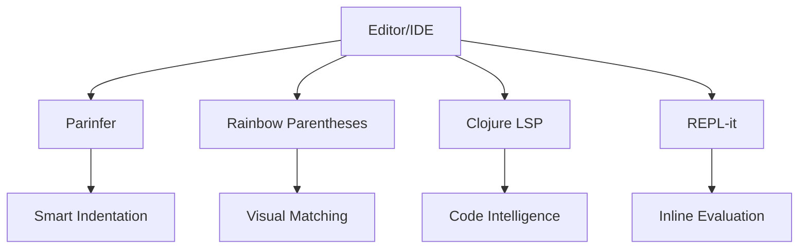

## C.2.1 REPL Integration Plugins

As experienced Java developers transitioning to Clojure, you are likely familiar with the importance of having a robust development environment. In Clojure, the REPL (Read-Eval-Print Loop) is a powerful tool that facilitates interactive programming, allowing you to test code snippets, debug, and explore libraries in real-time. To maximize the potential of the REPL, integrating it with your editor or IDE through plugins can significantly enhance your development workflow. In this section, we will explore several essential plugins that improve REPL integration, including Parinfer, Rainbow Parentheses, Clojure LSP, and REPL-it.

### Parinfer: Smart Indentation and Parentheses Balancing

Parinfer is a plugin designed to simplify the process of writing Lisp code by automatically balancing parentheses and maintaining proper indentation. This is particularly useful in Clojure, where parentheses are a fundamental part of the syntax. Parinfer operates in two modes: **Indent Mode** and **Paren Mode**.

#### Installation and Configuration

- **Emacs**: Install Parinfer using the package manager. Add the following to your Emacs configuration file:
  ```elisp
  (use-package parinfer
    :ensure t
    :hook ((clojure-mode . parinfer-mode)
           (emacs-lisp-mode . parinfer-mode))
    :init
    (setq parinfer-extensions
          '(defaults       ; should be included.
            pretty-parens  ; different paren styles for different modes.
            evil           ; If you use Evil.
            paredit        ; Introduce some paredit commands.
            smart-tab      ; C-b & C-f jump positions and smart shift with tab & S-tab.
            smart-yank)))  ; Yank behavior depend on mode.
  ```

- **Visual Studio Code**: Install the Parinfer extension from the marketplace. Configure it in your settings.json:
  ```json
  {
    "parinfer.mode": "indent"
  }
  ```

- **Atom**: Install the Parinfer package via the Atom package manager.

#### How Parinfer Enhances Your Workflow

Parinfer ensures that your code remains syntactically correct by automatically adjusting parentheses as you type. This reduces the cognitive load of manually managing parentheses, allowing you to focus on the logic of your code. By maintaining proper indentation, Parinfer also improves code readability, making it easier to navigate and understand complex expressions.

### Rainbow Parentheses: Visual Matching of Parentheses

Rainbow Parentheses is a simple yet effective plugin that visually distinguishes matching parentheses by coloring them. This feature is invaluable in Clojure, where nested expressions are common.

#### Installation and Configuration

- **Emacs**: Install Rainbow Parentheses via the package manager. Add the following to your Emacs configuration:
  ```elisp
  (use-package rainbow-delimiters
    :ensure t
    :hook (prog-mode . rainbow-delimiters-mode))
  ```

- **Visual Studio Code**: Install the Rainbow Brackets extension from the marketplace.

- **Atom**: Install the Rainbow Brackets package through the Atom package manager.

#### Benefits of Using Rainbow Parentheses

By color-coding matching parentheses, Rainbow Parentheses helps you quickly identify the structure of your code. This visual aid is particularly useful when working with deeply nested expressions, reducing errors and improving code comprehension.

### Clojure LSP (Language Server Protocol): Advanced Code Intelligence

Clojure LSP provides advanced code intelligence features such as refactoring, navigation, and code completion across various editors. It leverages the Language Server Protocol to offer a consistent experience regardless of your choice of editor.

#### Installation and Configuration

- **Emacs**: Install Clojure LSP using the package manager. Add the following to your Emacs configuration:
  ```elisp
  (use-package lsp-mode
    :ensure t
    :hook ((clojure-mode . lsp)
           (clojurec-mode . lsp)
           (clojurescript-mode . lsp))
    :commands lsp)
  ```

- **Visual Studio Code**: Install the Calva extension, which includes Clojure LSP support.

- **Atom**: Use the Atom IDE UI package along with the Clojure LSP package.

#### Enhancements Provided by Clojure LSP

Clojure LSP offers features such as:

- **Code Navigation**: Jump to definitions, find references, and navigate through your codebase with ease.
- **Refactoring**: Rename symbols, extract functions, and perform other refactoring tasks seamlessly.
- **Code Completion**: Get intelligent suggestions as you type, speeding up the coding process.

These features streamline the development process, making it easier to manage large codebases and improve code quality.

### REPL-it: Inline Evaluation and Result Display

REPL-it is a plugin that allows you to evaluate Clojure expressions inline and display the results directly in your code buffer. This feature enhances the interactive nature of the REPL, providing immediate feedback as you write code.

#### Installation and Configuration

- **Emacs**: Use the CIDER package, which includes inline evaluation capabilities. Add the following to your Emacs configuration:
  ```elisp
  (use-package cider
    :ensure t
    :hook (clojure-mode . cider-mode))
  ```

- **Visual Studio Code**: The Calva extension supports inline evaluation.

- **Atom**: Use the Proto REPL package for inline evaluation.

#### How REPL-it Improves Your Development Experience

With REPL-it, you can evaluate expressions and see the results without leaving your code buffer. This immediate feedback loop encourages experimentation and helps you quickly identify and fix issues. It also supports a more interactive and engaging coding experience, similar to what you might be accustomed to in Java with tools like JUnit for immediate test feedback.

### Try It Yourself: Experiment with Plugins

To get the most out of these plugins, try integrating them into your current development setup. Experiment with different configurations and see how they enhance your workflow. For example, try using Parinfer and Rainbow Parentheses together to see how they complement each other in managing code structure and readability.

### Diagram: Plugin Integration Workflow

Below is a diagram illustrating how these plugins integrate into your development workflow, enhancing various aspects of coding in Clojure.



**Diagram Caption**: This flowchart demonstrates how different plugins integrate into your editor or IDE, each enhancing a specific aspect of the Clojure development experience.

### Exercises: Reinforce Your Learning

1. **Install and Configure**: Choose one of the plugins discussed and install it in your preferred editor. Configure it according to your workflow and test its features.
2. **Experiment with Code**: Use Parinfer to refactor a piece of Clojure code, focusing on improving its readability and structure.
3. **Visualize with Rainbow Parentheses**: Write a complex nested expression and use Rainbow Parentheses to help you understand its structure.
4. **Leverage Clojure LSP**: Perform a refactoring task using Clojure LSP, such as renaming a function or extracting a piece of code into a new function.
5. **Inline Evaluation with REPL-it**: Write a small Clojure function and use REPL-it to evaluate it inline, observing the results directly in your code buffer.

### Key Takeaways

- **Parinfer** simplifies parentheses management and improves code readability through smart indentation.
- **Rainbow Parentheses** enhances code comprehension by visually matching parentheses.
- **Clojure LSP** provides advanced code intelligence features, streamlining navigation and refactoring.
- **REPL-it** offers inline evaluation, fostering an interactive and engaging coding experience.

By integrating these plugins into your development environment, you can significantly enhance your productivity and code quality in Clojure. These tools not only make the transition from Java smoother but also unlock the full potential of Clojure's interactive programming capabilities.

### Further Reading

- [Official Clojure Documentation](https://clojure.org/)
- [ClojureDocs](https://clojuredocs.org/)
- [Parinfer GitHub Repository](https://github.com/oakmac/parinfer)
- [Clojure LSP GitHub Repository](https://github.com/clojure-lsp/clojure-lsp)

## Quiz: Test Your Knowledge on Clojure REPL Integration Plugins



### Which plugin is used for smart indentation and parentheses balancing in Clojure?

- [x] Parinfer
- [ ] Rainbow Parentheses
- [ ] Clojure LSP
- [ ] REPL-it

> **Explanation:** Parinfer is designed to manage parentheses and indentation in Lisp languages like Clojure.

### What is the primary benefit of using Rainbow Parentheses?

- [x] Visual matching of parentheses
- [ ] Code refactoring
- [ ] Inline evaluation
- [ ] Syntax highlighting

> **Explanation:** Rainbow Parentheses color-codes matching parentheses to help visualize code structure.

### Which plugin provides advanced code intelligence features like refactoring and navigation?

- [ ] Parinfer
- [ ] Rainbow Parentheses
- [x] Clojure LSP
- [ ] REPL-it

> **Explanation:** Clojure LSP offers features such as code navigation, refactoring, and code completion.

### What is the main feature of REPL-it?

- [ ] Parentheses balancing
- [ ] Code navigation
- [x] Inline evaluation
- [ ] Syntax highlighting

> **Explanation:** REPL-it allows inline evaluation and displays results directly in the code buffer.

### Which editor is NOT mentioned as supporting Parinfer?

- [ ] Emacs
- [ ] Visual Studio Code
- [ ] Atom
- [x] Eclipse

> **Explanation:** Eclipse is not mentioned in the context of supporting Parinfer.

### How does Clojure LSP enhance code navigation?

- [x] By allowing jumping to definitions and finding references
- [ ] By providing inline evaluation
- [ ] By color-coding parentheses
- [ ] By managing indentation

> **Explanation:** Clojure LSP enhances navigation with features like jumping to definitions and finding references.

### What does REPL-it encourage through its features?

- [ ] Code refactoring
- [ ] Syntax highlighting
- [x] Experimentation and immediate feedback
- [ ] Parentheses management

> **Explanation:** REPL-it encourages experimentation by providing immediate feedback through inline evaluation.

### Which plugin is essential for managing parentheses in Lisp languages?

- [x] Parinfer
- [ ] Rainbow Parentheses
- [ ] Clojure LSP
- [ ] REPL-it

> **Explanation:** Parinfer is essential for managing parentheses and indentation in Lisp languages.

### What is the role of Rainbow Parentheses in Clojure development?

- [x] To visually match parentheses
- [ ] To provide code intelligence
- [ ] To enable inline evaluation
- [ ] To manage indentation

> **Explanation:** Rainbow Parentheses visually match parentheses to help understand code structure.

### True or False: Clojure LSP can be used for code refactoring.

- [x] True
- [ ] False

> **Explanation:** Clojure LSP provides refactoring capabilities, such as renaming symbols and extracting functions.


