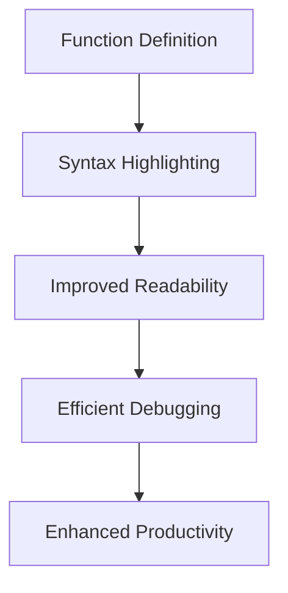

## Customizing Editor Settings for Clojure Development

As experienced Java developers transitioning to Clojure, optimizing your development environment is crucial for a smooth and productive coding experience. Customizing editor settings can significantly enhance your workflow, making it easier to read, write, and manage Clojure code. In this section, we'll explore best practices for configuring your editor to support Clojure development effectively.

### Setting Up Auto-Indentation, Line Numbers, and Syntax Highlighting

Auto-indentation, line numbers, and syntax highlighting are essential features that improve code readability and maintainability. Let's delve into how these can be configured in popular editors.

#### Auto-Indentation

Auto-indentation ensures that your code is consistently formatted, which is vital in a language like Clojure, where code structure is crucial. Most modern editors support auto-indentation out of the box, but you may need to tweak settings for optimal performance.

**Example Configuration in IntelliJ IDEA with Cursive:**

1. **Open Preferences**: Navigate to `File > Settings` (or `IntelliJ IDEA > Preferences` on macOS).
2. **Editor Settings**: Go to `Editor > Code Style > Clojure`.
3. **Indentation**: Ensure that the `Use tab character` is unchecked and set `Tab size` and `Indent` to 2 spaces, which is the standard for Clojure.

**Example Configuration in Visual Studio Code with Calva:**

1. **Open Settings**: Press `Ctrl + ,` or `Cmd + ,` on macOS.
2. **Search for Indentation**: Type "indentation" in the search bar.
3. **Configure Indentation**: Set `Editor: Tab Size` to 2 and ensure `Editor: Insert Spaces` is checked.

#### Line Numbers

Line numbers are a simple yet powerful tool for navigating and debugging code. They help you quickly locate errors and reference specific parts of your codebase.

**Enabling Line Numbers in IntelliJ IDEA:**

- Go to `View > Active Editor > Show Line Numbers`.

**Enabling Line Numbers in Visual Studio Code:**

- Open settings and search for "line numbers". Set `Editor: Line Numbers` to `on`.

#### Syntax Highlighting

Syntax highlighting makes it easier to distinguish between different elements of your code, such as functions, variables, and keywords. This visual aid is particularly helpful in a language like Clojure, where parentheses are prevalent.

**Configuring Syntax Highlighting in IntelliJ IDEA:**

- Navigate to `Editor > Color Scheme > Clojure` and customize the colors for various syntax elements.

**Configuring Syntax Highlighting in Visual Studio Code:**

- Install the Calva extension for Clojure support, which includes syntax highlighting.

### Customizing Font Sizes, Themes, and Color Schemes

Visual comfort is essential for long coding sessions. Customizing font sizes, themes, and color schemes can reduce eye strain and make your coding environment more pleasant.

#### Font Sizes

Choosing the right font size can improve readability and reduce fatigue. It's important to find a balance that works for your screen size and resolution.

**Adjusting Font Size in IntelliJ IDEA:**

- Go to `Editor > Font` and set the `Size` to your preference. A common choice is between 12 and 14 points.

**Adjusting Font Size in Visual Studio Code:**

- Open settings and search for "font size". Adjust `Editor: Font Size` to your liking.

#### Themes and Color Schemes

Themes and color schemes can greatly affect your coding experience. Whether you prefer a light or dark theme, ensure that the colors are comfortable for your eyes.

**Changing Themes in IntelliJ IDEA:**

- Navigate to `Appearance & Behavior > Appearance` and choose a theme. Popular choices include `Darcula` for dark mode and `IntelliJ Light` for light mode.

**Changing Themes in Visual Studio Code:**

- Press `Ctrl + K` followed by `Ctrl + T` to open the theme selector. Choose from the available themes or install new ones from the marketplace.

### Configuring Keybindings for Frequently Used Commands

Keybindings allow you to execute commands quickly without leaving the keyboard. Customizing them to fit your workflow can save time and increase efficiency.

#### Common Keybindings

Here are some common keybindings you might want to customize:

- **Run Code**: Quickly execute your Clojure code.
- **Navigate to Definition**: Jump to the definition of a function or variable.
- **Refactor**: Rename variables or functions across your codebase.

**Customizing Keybindings in IntelliJ IDEA:**

1. **Open Keymap**: Go to `File > Settings > Keymap`.
2. **Search for Commands**: Use the search bar to find specific commands.
3. **Assign New Keybindings**: Right-click on a command and select `Add Keyboard Shortcut`.

**Customizing Keybindings in Visual Studio Code:**

1. **Open Keyboard Shortcuts**: Press `Ctrl + K` followed by `Ctrl + S`.
2. **Search and Modify**: Find the command you want to change and click the pencil icon to assign a new keybinding.

### Try It Yourself: Experiment with Editor Settings

Now that we've covered the basics, try customizing your editor settings to see what works best for you. Here are some suggestions:

- **Experiment with Different Themes**: Try both light and dark themes to see which is more comfortable.
- **Adjust Font Sizes**: Increase or decrease the font size and observe how it affects readability.
- **Customize Keybindings**: Change keybindings for commands you use frequently and see if it speeds up your workflow.

### Diagrams and Visual Aids

To better understand how these settings can impact your workflow, let's look at a diagram illustrating the flow of data through a Clojure function with syntax highlighting enabled.

**Diagram Explanation**: This flowchart shows how syntax highlighting can improve readability, leading to more efficient debugging and ultimately enhancing productivity.

### Further Reading and Resources

For more information on customizing your development environment, check out these resources:

- [Official Clojure Documentation](https://clojure.org/)
- [ClojureDocs](https://clojuredocs.org/)
- [IntelliJ IDEA Documentation](https://www.jetbrains.com/help/idea/discover-intellij-idea.html)
- [Visual Studio Code Documentation](https://code.visualstudio.com/docs)

### Exercises and Practice Problems

1. **Customize Your Editor**: Choose an editor and customize the settings as described above. Document the changes you made and how they improved your workflow.
2. **Create a Keybinding Cheat Sheet**: List your most-used commands and their keybindings. Share it with a colleague and discuss any differences in your setups.
3. **Experiment with Themes**: Try coding with a light theme for a day, then switch to a dark theme. Write a short reflection on how each affected your coding experience.

### Key Takeaways

- **Auto-indentation, line numbers, and syntax highlighting** are essential for maintaining readable and maintainable code.
- **Customizing font sizes, themes, and color schemes** can enhance visual comfort and reduce eye strain.
- **Configuring keybindings** for frequently used commands can streamline your workflow and increase productivity.

By optimizing your editor settings, you can create a development environment that supports your transition from Java to Clojure, making coding more efficient and enjoyable.

## Quiz: Mastering Editor Customization for Clojure Development



### What is the primary benefit of auto-indentation in Clojure?

- [x] Ensures consistent code formatting
- [ ] Increases code execution speed
- [ ] Enhances syntax highlighting
- [ ] Reduces memory usage

> **Explanation:** Auto-indentation ensures that code is consistently formatted, which is crucial for readability and maintainability in Clojure.

### Which setting is essential for navigating and debugging code?

- [x] Line numbers
- [ ] Font size
- [ ] Color scheme
- [ ] Keybindings

> **Explanation:** Line numbers help developers quickly locate errors and reference specific parts of the codebase, making navigation and debugging easier.

### How can syntax highlighting improve your coding experience?

- [x] By making it easier to distinguish between different code elements
- [ ] By increasing the speed of code execution
- [ ] By reducing the size of the codebase
- [ ] By automatically fixing syntax errors

> **Explanation:** Syntax highlighting visually differentiates code elements such as functions, variables, and keywords, aiding in readability and comprehension.

### What is a common font size range for coding in IntelliJ IDEA?

- [x] 12 to 14 points
- [ ] 8 to 10 points
- [ ] 16 to 18 points
- [ ] 20 to 22 points

> **Explanation:** A font size range of 12 to 14 points is commonly used for coding in IntelliJ IDEA to balance readability and screen space.

### Which theme is popular for dark mode in IntelliJ IDEA?

- [x] Darcula
- [ ] Solarized Light
- [ ] Monokai
- [ ] Zenburn

> **Explanation:** Darcula is a popular theme for dark mode in IntelliJ IDEA, providing a comfortable visual experience for developers.

### How can keybindings enhance productivity?

- [x] By allowing quick execution of commands without leaving the keyboard
- [ ] By automatically generating code
- [ ] By increasing the size of the codebase
- [ ] By reducing the need for syntax highlighting

> **Explanation:** Keybindings enable developers to execute commands quickly without leaving the keyboard, streamlining workflow and enhancing productivity.

### What is the benefit of customizing themes and color schemes?

- [x] Reduces eye strain and enhances visual comfort
- [ ] Increases code execution speed
- [ ] Automatically formats code
- [ ] Reduces memory usage

> **Explanation:** Customizing themes and color schemes can reduce eye strain and enhance visual comfort, especially during long coding sessions.

### Which tool is used for syntax highlighting in Visual Studio Code for Clojure?

- [x] Calva extension
- [ ] Emmet extension
- [ ] Prettier extension
- [ ] ESLint extension

> **Explanation:** The Calva extension in Visual Studio Code provides syntax highlighting and other Clojure-specific features.

### What is the purpose of the `Editor: Insert Spaces` setting in Visual Studio Code?

- [x] To ensure spaces are used instead of tabs for indentation
- [ ] To increase the font size
- [ ] To enable syntax highlighting
- [ ] To display line numbers

> **Explanation:** The `Editor: Insert Spaces` setting ensures that spaces are used instead of tabs for indentation, which is a common practice in Clojure.

### True or False: Customizing editor settings can significantly enhance your coding productivity.

- [x] True
- [ ] False

> **Explanation:** Customizing editor settings can enhance productivity by improving code readability, reducing eye strain, and streamlining workflow.


