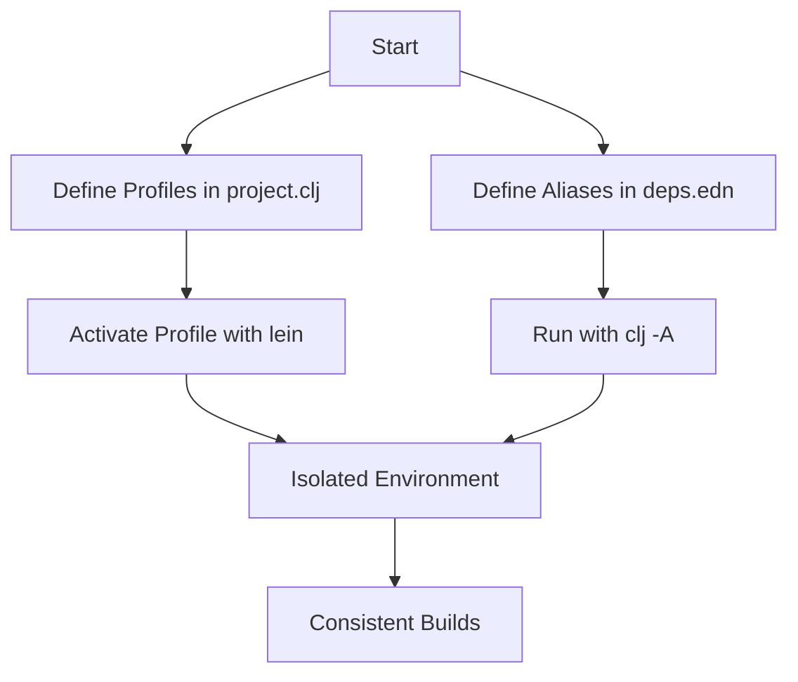

## Efficiently Managing Multiple Projects in Clojure

As experienced Java developers transitioning to Clojure, managing multiple projects efficiently is crucial for maintaining productivity and ensuring seamless development workflows. In this section, we'll explore strategies and tools that can help you handle multiple Clojure projects effectively. We'll cover project management tools within editors, organizing projects with consistent directory structures, and tips for managing different dependency versions and isolating environments.

### Project Management Tools within Editors

Managing multiple projects can be challenging, especially when switching contexts frequently. Fortunately, modern editors and IDEs offer powerful project management tools that can significantly enhance your workflow.

#### Emacs with Projectile

**Projectile** is a project interaction library for Emacs that provides easy project management and navigation. It allows you to quickly switch between projects, search for files, and execute commands within the context of a project.

- **Installation**: You can install Projectile via the Emacs package manager (MELPA). Add the following to your Emacs configuration:

  ```elisp
  (require 'package)
  (add-to-list 'package-archives '("melpa" . "https://melpa.org/packages/"))
  (package-initialize)
  (unless (package-installed-p 'projectile)
    (package-refresh-contents)
    (package-install 'projectile))
  ```

- **Basic Usage**: Once installed, you can enable Projectile globally:

  ```elisp
  (projectile-mode +1)
  ```

  Use `C-c p p` to switch between projects, `C-c p f` to find a file in the current project, and `C-c p s g` to search within the project.

- **Integration with Clojure**: Projectile works seamlessly with Clojure projects, allowing you to manage dependencies and run REPLs within the project context.

#### Visual Studio Code with Workspaces

**Visual Studio Code (VS Code)** offers a feature called **Workspaces**, which allows you to manage multiple projects efficiently.

- **Creating a Workspace**: You can create a workspace by opening multiple folders and saving the workspace configuration. This setup allows you to switch between projects without losing context.

- **Extensions for Clojure**: Use the **Calva** extension for Clojure development in VS Code. It provides features like REPL integration, syntax highlighting, and code navigation.

- **Managing Dependencies**: VS Code's workspace settings allow you to configure environment-specific settings, making it easier to manage dependencies across different projects.

### Organizing Projects with Consistent Directory Structures

A well-organized project structure is essential for maintaining clarity and consistency across multiple projects. Here are some best practices for organizing your Clojure projects:

#### Consistent Directory Structure

Adopting a consistent directory structure helps in navigating projects and understanding their layout quickly. Here's a typical structure for a Clojure project:

```
my-clojure-project/
├── src/
│   └── my_clojure_project/
│       └── core.clj
├── test/
│   └── my_clojure_project/
│       └── core_test.clj
├── resources/
├── target/
├── project.clj
└── README.md
```

- **`src/` Directory**: Contains the source code organized by namespaces.
- **`test/` Directory**: Contains test files corresponding to the source files.
- **`resources/` Directory**: Holds static resources like configuration files.
- **`target/` Directory**: Used for build artifacts.
- **`project.clj`**: The Leiningen project file defining dependencies and build configurations.

#### Naming Conventions

Using consistent naming conventions for files and directories helps in quickly identifying their purpose. For example, use lowercase with underscores for file names and namespaces, aligning with Clojure's conventions.

### Tips for Quickly Switching Contexts

Switching contexts between projects can be time-consuming. Here are some tips to streamline this process:

#### Using `lein` Profiles

Leiningen profiles allow you to define different configurations for your projects. This feature is useful for managing different environments or dependency versions.

- **Defining Profiles**: You can define profiles in your `project.clj` file. For example:

  ```clojure
  :profiles {:dev {:dependencies [[midje "1.9.9"]]}
             :prod {:jvm-opts ["-Dconf=prod-config.edn"]}}
  ```

- **Activating Profiles**: Use the `with-profile` command to activate a profile:

  ```bash
  lein with-profile dev run
  ```

#### Using `deps.edn` Aliases

If you're using `tools.deps`, aliases provide a way to manage different configurations and dependencies.

- **Defining Aliases**: Add aliases to your `deps.edn` file:

  ```clojure
  {:aliases {:dev {:extra-deps {org.clojure/tools.namespace {:mvn/version "1.0.0"}}}
             :test {:extra-paths ["test"]}}}
  ```

- **Using Aliases**: Run commands with specific aliases:

  ```bash
  clj -A:dev
  ```

### Isolating Environments

Isolating environments is crucial for preventing dependency conflicts and ensuring consistent builds across projects.

#### Using Virtual Environments

Tools like **Docker** can help create isolated environments for your projects. By containerizing your applications, you ensure that each project runs with its specific dependencies and configurations.

- **Dockerfile Example**:

  ```dockerfile
  FROM clojure:openjdk-11-lein
  WORKDIR /app
  COPY . .
  RUN lein deps
  CMD ["lein", "run"]
  ```

- **Building and Running**:

  ```bash
  docker build -t my-clojure-app .
  docker run -p 3000:3000 my-clojure-app
  ```

#### Managing Dependency Versions

Using tools like **Leiningen** and **tools.deps** allows you to manage dependencies effectively. Ensure that your `project.clj` or `deps.edn` files are up-to-date and specify exact versions to avoid conflicts.

### Try It Yourself

To practice managing multiple projects, try setting up a new Clojure project using the directory structure and naming conventions discussed. Experiment with defining different profiles and aliases to see how they affect your project's behavior.

### Diagrams and Visuals

Below is a diagram illustrating the flow of managing multiple projects using Leiningen profiles and tools.deps aliases:



*Diagram: Managing Multiple Projects with Leiningen and tools.deps*

### Further Reading

For more information on managing Clojure projects, consider exploring the following resources:

- [Official Clojure Documentation](https://clojure.org/)
- [Leiningen Documentation](https://leiningen.org/)
- [tools.deps Guide](https://clojure.org/guides/deps_and_cli)

### Exercises

1. Create a new Clojure project and set up a consistent directory structure.
2. Define multiple profiles in your `project.clj` and experiment with switching between them.
3. Use `tools.deps` to manage dependencies and create aliases for different environments.
4. Containerize your Clojure application using Docker and run it in an isolated environment.

### Key Takeaways

- Utilize project management tools within editors to streamline workflows.
- Maintain a consistent directory structure and naming conventions across projects.
- Use Leiningen profiles and tools.deps aliases to manage different configurations.
- Isolate environments using tools like Docker to prevent dependency conflicts.

By implementing these strategies, you'll be well-equipped to manage multiple Clojure projects efficiently, enhancing your productivity and ensuring seamless development workflows.

## Quiz: Mastering Multiple Project Management in Clojure



### What is the primary benefit of using Projectile in Emacs for Clojure projects?

- [x] It provides easy project management and navigation.
- [ ] It automatically writes Clojure code for you.
- [ ] It compiles Clojure projects faster than other tools.
- [ ] It replaces the need for a REPL.

> **Explanation:** Projectile is a project interaction library that simplifies project management and navigation within Emacs, making it easier to switch between projects and manage files.

### How can you activate a specific Leiningen profile?

- [x] Use the `with-profile` command.
- [ ] Modify the `project.clj` file directly.
- [ ] Use the `lein activate` command.
- [ ] Restart the Leiningen server.

> **Explanation:** The `with-profile` command allows you to activate a specific profile defined in your `project.clj` file, enabling different configurations for your project.

### What is the purpose of using Docker for Clojure projects?

- [x] To create isolated environments for projects.
- [ ] To automatically generate Clojure code.
- [ ] To replace the need for a version control system.
- [ ] To compile Clojure projects faster.

> **Explanation:** Docker helps create isolated environments, ensuring that each project runs with its specific dependencies and configurations, preventing conflicts.

### Which file in a Clojure project typically contains the source code?

- [x] `src/`
- [ ] `test/`
- [ ] `resources/`
- [ ] `target/`

> **Explanation:** The `src/` directory typically contains the source code organized by namespaces in a Clojure project.

### What is the benefit of using consistent naming conventions in Clojure projects?

- [x] It helps in quickly identifying the purpose of files and directories.
- [ ] It automatically optimizes the code for performance.
- [x] It aligns with Clojure's conventions.
- [ ] It reduces the need for documentation.

> **Explanation:** Consistent naming conventions help in quickly identifying the purpose of files and directories and align with Clojure's conventions, improving code readability and maintainability.

### How do you define aliases in a `deps.edn` file?

- [x] By adding them under the `:aliases` key.
- [ ] By creating a separate `aliases.edn` file.
- [ ] By using the `lein alias` command.
- [ ] By modifying the `project.clj` file.

> **Explanation:** Aliases are defined under the `:aliases` key in a `deps.edn` file, allowing you to manage different configurations and dependencies.

### What is the role of the `target/` directory in a Clojure project?

- [x] It is used for build artifacts.
- [ ] It contains the source code.
- [x] It holds static resources.
- [ ] It stores test files.

> **Explanation:** The `target/` directory is used for build artifacts, such as compiled code and packaged applications, in a Clojure project.

### Which tool can be used to manage dependencies in Clojure projects?

- [x] Leiningen
- [ ] Maven
- [ ] Gradle
- [ ] Ant

> **Explanation:** Leiningen is a popular build automation tool for Clojure projects, used to manage dependencies, run tasks, and build projects.

### What is the advantage of using `tools.deps` over Leiningen?

- [x] It provides a more flexible dependency management system.
- [ ] It automatically compiles Clojure code.
- [ ] It replaces the need for a REPL.
- [ ] It is faster than Leiningen.

> **Explanation:** `tools.deps` offers a more flexible dependency management system, allowing for more granular control over dependencies and configurations.

### True or False: Using Docker can help prevent dependency conflicts in Clojure projects.

- [x] True
- [ ] False

> **Explanation:** True. Docker creates isolated environments, ensuring that each project runs with its specific dependencies and configurations, preventing conflicts.


