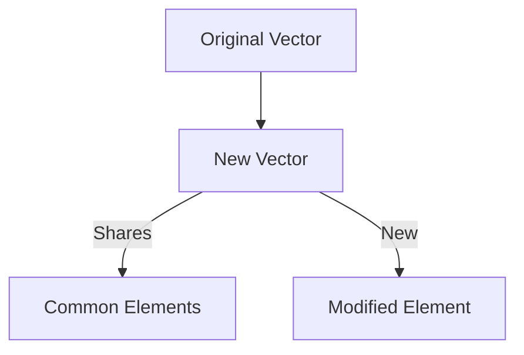
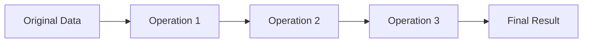

## D.1.1 Immutable Data Structures

In the world of Clojure, immutability is a foundational concept that distinguishes it from many other programming languages, including Java. As experienced Java developers, you are likely accustomed to mutable data structures where changes are made in place. In contrast, Clojure's immutable data structures offer a paradigm shift that brings numerous benefits, especially in the realms of concurrency, code reasoning, and side-effect prevention. Let's delve into the intricacies of immutable data structures in Clojure, understand their advantages, and explore how they can be leveraged effectively in your applications.

### Understanding Immutability

**Immutability** means that once a data structure is created, it cannot be altered. Any operation that appears to modify the data structure actually results in the creation of a new data structure, leaving the original unchanged. This concept is central to functional programming and is a key feature of Clojure.

#### Java vs. Clojure: A Comparative Overview

In Java, data structures like arrays, lists, and maps are typically mutable. Consider the following Java example:

```java
import java.util.ArrayList;
import java.util.List;

public class MutableExample {
    public static void main(String[] args) {
        List<String> list = new ArrayList<>();
        list.add("Hello");
        list.add("World");
        list.set(1, "Java");
        System.out.println(list); // Output: [Hello, Java]
    }
}
```

In this Java code, the `ArrayList` is mutable, allowing us to change its contents directly. However, this mutability can lead to issues in concurrent environments, where multiple threads might attempt to modify the list simultaneously, potentially causing data corruption.

In contrast, Clojure's approach to immutability is evident in its core data structures: lists, vectors, maps, and sets. Here's how you would achieve similar functionality in Clojure:

```clojure
(def my-list ["Hello" "World"])
(def new-list (assoc my-list 1 "Clojure"))
(println new-list) ; Output: ["Hello" "Clojure"]
```

In this Clojure example, `assoc` creates a new vector with the desired change, leaving `my-list` unchanged. This immutability ensures that data structures are inherently thread-safe, making Clojure a powerful tool for concurrent programming.

### Benefits of Immutable Data Structures

#### 1. Concurrency Made Simple

One of the most significant advantages of immutability is its impact on concurrency. In Java, managing concurrent modifications to shared data structures often requires complex synchronization mechanisms, such as locks or concurrent collections. These can introduce performance bottlenecks and increase the complexity of your code.

Clojure's immutable data structures eliminate the need for such synchronization. Since data cannot be changed once created, there is no risk of concurrent modifications leading to inconsistent states. This simplifies the development of concurrent applications and enhances performance by avoiding locking overhead.

#### 2. Easier Reasoning and Debugging

Immutable data structures make reasoning about code easier. When a data structure cannot change, you can be confident that its state remains consistent throughout its lifecycle. This predictability simplifies debugging and reduces the likelihood of bugs related to unexpected state changes.

#### 3. Prevention of Side Effects

In functional programming, side effects are changes in state that occur outside the scope of a function. Immutability helps prevent side effects by ensuring that functions do not alter the state of their inputs. This leads to more predictable and reliable code, as functions become pure and their outputs depend solely on their inputs.

### Persistent Data Structures

Clojure's immutable data structures are often referred to as **persistent data structures**. These structures efficiently share memory between versions, allowing for the creation of new versions without duplicating the entire structure. This is achieved through a technique known as **structural sharing**.

#### Structural Sharing Explained

Structural sharing allows new data structures to reuse parts of existing structures, minimizing memory usage and improving performance. Let's visualize this concept with a simple diagram:



*Diagram: Structural sharing in Clojure's persistent data structures, where new versions share unchanged parts with the original.*

In this diagram, the new vector shares common elements with the original vector, only creating new memory for the modified element. This approach ensures that operations on immutable data structures remain efficient.

### Code Examples: Immutable Data Structures in Action

Let's explore some practical examples of immutable data structures in Clojure, highlighting their usage and benefits.

#### Lists

Lists in Clojure are immutable linked lists. They are ideal for scenarios where you need to frequently add or remove elements from the front of the list.

```clojure
(def my-list '(1 2 3 4))
(def new-list (cons 0 my-list))
(println new-list) ; Output: (0 1 2 3 4)
```

In this example, `cons` adds an element to the front of the list, creating a new list without modifying the original.

#### Vectors

Vectors are indexed collections that provide efficient random access and updates. They are suitable for scenarios where you need to access elements by index.

```clojure
(def my-vector [1 2 3 4])
(def new-vector (assoc my-vector 2 99))
(println new-vector) ; Output: [1 2 99 4]
```

Here, `assoc` creates a new vector with the updated value at index 2, leaving `my-vector` unchanged.

#### Maps

Maps are key-value pairs that allow for efficient lookups and updates.

```clojure
(def my-map {:a 1 :b 2 :c 3})
(def new-map (assoc my-map :b 99))
(println new-map) ; Output: {:a 1, :b 99, :c 3}
```

In this example, `assoc` creates a new map with the updated value for key `:b`.

#### Sets

Sets are collections of unique elements. They are useful for scenarios where you need to ensure that elements are not duplicated.

```clojure
(def my-set #{1 2 3})
(def new-set (conj my-set 4))
(println new-set) ; Output: #{1 2 3 4}
```

Here, `conj` adds an element to the set, creating a new set without altering the original.

### Try It Yourself

To deepen your understanding of immutable data structures, try modifying the code examples above. Experiment with adding, removing, and updating elements in lists, vectors, maps, and sets. Observe how each operation results in a new data structure, leaving the original unchanged.

### Diagrams and Visualizations

To further illustrate the concept of immutability and structural sharing, let's explore a few more diagrams.

#### Diagram: Flow of Data Through Immutable Operations



*Diagram: The flow of data through a series of immutable operations, where each operation produces a new version of the data.*

This diagram demonstrates how data flows through a series of operations, with each step producing a new version of the data. This flow ensures that the original data remains unchanged, promoting predictability and reliability.

### Further Reading

For more information on Clojure's immutable data structures, consider exploring the following resources:

- [Official Clojure Documentation](https://clojure.org/reference/data_structures)
- [ClojureDocs](https://clojuredocs.org/)
- [GitHub: Clojure Source Code](https://github.com/clojure/clojure)

### Exercises and Practice Problems

1. **Exercise 1**: Create a Clojure vector representing a sequence of numbers. Use `assoc` to update an element and observe the resulting vector.
2. **Exercise 2**: Implement a function that takes a map and returns a new map with all values incremented by 1.
3. **Exercise 3**: Write a Clojure function that adds an element to a set and returns the new set. Ensure that the original set remains unchanged.
4. **Exercise 4**: Explore the performance of structural sharing by creating large vectors and measuring the time taken to perform updates.

### Key Takeaways

- **Immutability** is a core concept in Clojure, ensuring that data structures cannot be changed after creation.
- **Persistent data structures** use structural sharing to efficiently create new versions without duplicating memory.
- **Concurrency** is simplified with immutable data structures, as they eliminate the need for synchronization.
- **Code reasoning** and **debugging** are easier with immutable data, as state remains consistent throughout its lifecycle.
- **Side effects** are minimized, leading to more predictable and reliable code.

Now that we've explored how immutable data structures work in Clojure, let's apply these concepts to manage state effectively in your applications.

## Quiz: Mastering Immutable Data Structures in Clojure



### What is the primary characteristic of immutable data structures in Clojure?

- [x] They cannot be changed after creation.
- [ ] They allow direct modification of elements.
- [ ] They require synchronization for concurrent access.
- [ ] They are only used for concurrency.

> **Explanation:** Immutable data structures in Clojure cannot be changed after creation, which is a key feature of functional programming.

### How do immutable data structures benefit concurrency?

- [x] They eliminate the need for synchronization.
- [ ] They require complex locking mechanisms.
- [ ] They increase the risk of data corruption.
- [ ] They slow down concurrent operations.

> **Explanation:** Immutable data structures eliminate the need for synchronization, simplifying concurrent programming and reducing the risk of data corruption.

### What is structural sharing in Clojure?

- [x] A technique to share memory between versions of data structures.
- [ ] A method to duplicate data structures for safety.
- [ ] A way to synchronize access to data structures.
- [ ] A process to convert mutable structures to immutable ones.

> **Explanation:** Structural sharing is a technique used in Clojure to share memory between versions of data structures, minimizing memory usage.

### Which Clojure function is used to add an element to the front of a list?

- [x] `cons`
- [ ] `assoc`
- [ ] `conj`
- [ ] `update`

> **Explanation:** The `cons` function is used to add an element to the front of a list in Clojure.

### How does immutability affect code reasoning?

- [x] It makes reasoning about code easier.
- [ ] It complicates debugging.
- [ ] It introduces unpredictable state changes.
- [ ] It requires additional synchronization.

> **Explanation:** Immutability makes reasoning about code easier by ensuring that data structures remain consistent throughout their lifecycle.

### What is the result of using `assoc` on a Clojure vector?

- [x] A new vector with the updated element.
- [ ] The original vector is modified.
- [ ] An error is thrown.
- [ ] The vector is converted to a list.

> **Explanation:** Using `assoc` on a Clojure vector creates a new vector with the updated element, leaving the original unchanged.

### Why are side effects minimized with immutable data structures?

- [x] Functions do not alter the state of their inputs.
- [ ] Data structures can be modified in place.
- [ ] Synchronization is required for safety.
- [ ] State changes are unpredictable.

> **Explanation:** With immutable data structures, functions do not alter the state of their inputs, minimizing side effects and leading to more predictable code.

### Which Clojure data structure is ideal for ensuring unique elements?

- [x] Set
- [ ] List
- [ ] Vector
- [ ] Map

> **Explanation:** A set is a Clojure data structure that ensures unique elements, making it ideal for scenarios where duplication is not allowed.

### What is a key advantage of persistent data structures?

- [x] Efficient memory usage through structural sharing.
- [ ] Direct modification of elements.
- [ ] Complex synchronization mechanisms.
- [ ] Increased risk of data corruption.

> **Explanation:** Persistent data structures use structural sharing to efficiently manage memory, allowing for the creation of new versions without duplicating the entire structure.

### True or False: Immutability in Clojure requires complex synchronization mechanisms.

- [ ] True
- [x] False

> **Explanation:** False. Immutability in Clojure eliminates the need for complex synchronization mechanisms, simplifying concurrent programming.


