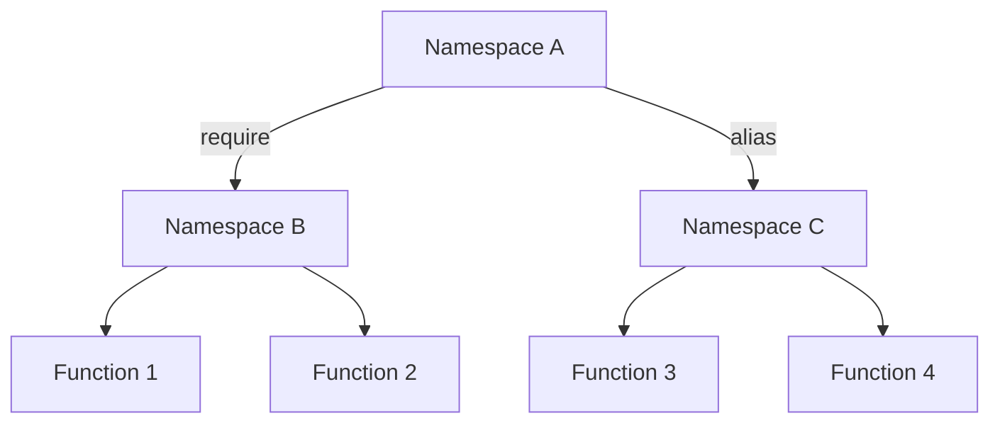

## D.1.2 Namespaces

In Clojure, **namespaces** play a crucial role in organizing code and preventing naming conflicts. They allow developers to group related functions and variables, making it easier to manage and maintain large codebases. For Java developers transitioning to Clojure, understanding namespaces is akin to understanding packages in Java, but with some unique characteristics and advantages.

### Understanding Namespaces in Clojure

Namespaces in Clojure are similar to packages in Java. They provide a way to group related code and avoid naming conflicts by creating a context in which symbols (such as functions and variables) are defined. This is particularly important in large projects where multiple libraries and modules might define symbols with the same name.

#### Defining a Namespace

To define a namespace in Clojure, we use the `ns` macro. This macro not only defines the namespace but also allows us to specify dependencies and aliases for other namespaces. Here's a simple example:

```clojure
(ns myapp.core
  (:require [clojure.string :as str]))

(defn greet [name]
  (str "Hello, " name "!"))
```

In this example, we define a namespace `myapp.core` and require the `clojure.string` namespace with an alias `str`. This allows us to use functions from `clojure.string` with the `str` prefix, such as `str/join`.

#### Comparing with Java Packages

In Java, packages are used to organize classes and interfaces. A typical Java package declaration looks like this:

```java
package com.example.myapp;

import java.util.List;

public class MyApp {
    public static void main(String[] args) {
        System.out.println("Hello, World!");
    }
}
```

While both namespaces in Clojure and packages in Java serve the purpose of organizing code, Clojure namespaces offer more flexibility. They allow for dynamic loading and aliasing of other namespaces, which can be particularly useful in a REPL-driven development environment.

### Requiring and Referring to Symbols

In Clojure, you can bring symbols from other namespaces into the current namespace using `require`, `use`, or `import`. Each serves a different purpose and has its own use cases.

#### Using `require`

The `require` function is used to load a namespace and optionally create an alias for it. This is the most common way to include other namespaces in your code.

```clojure
(ns myapp.utils
  (:require [clojure.set :as set]))

(defn union-sets [a b]
  (set/union a b))
```

Here, we require the `clojure.set` namespace and use the alias `set` to access its `union` function.

#### Using `refer`

The `refer` function allows you to bring specific symbols from another namespace into the current namespace. This can be useful when you want to use functions without a prefix.

```clojure
(ns myapp.math
  (:require [clojure.math.numeric-tower :refer [sqrt]]))

(defn calculate-root [x]
  (sqrt x))
```

In this example, we refer to the `sqrt` function from `clojure.math.numeric-tower`, allowing us to use it directly without a prefix.

#### Using `use`

The `use` function is similar to `require` but brings all public symbols from the specified namespace into the current namespace. However, it is generally discouraged in favor of `require` with `refer` due to potential naming conflicts.

```clojure
(ns myapp.all
  (:use clojure.set))

(defn intersect-sets [a b]
  (intersection a b))
```

While `use` can simplify code, it can also lead to unexpected behavior if multiple namespaces define symbols with the same name.

### Namespace Hygiene

Namespace hygiene refers to the practice of managing namespaces in a way that avoids conflicts and maintains clarity. This involves careful use of `require`, `refer`, and aliases to ensure that symbols are clearly identified and conflicts are minimized.

#### Best Practices for Namespace Hygiene

1. **Use Aliases**: When requiring namespaces, use aliases to avoid long namespace prefixes and potential conflicts.
   
   ```clojure
   (ns myapp.core
     (:require [clojure.string :as str]))
   ```

2. **Limit `refer` Usage**: Use `refer` sparingly and only for specific symbols that are frequently used. This helps avoid cluttering the namespace with unnecessary symbols.

3. **Avoid `use`**: Prefer `require` with `refer` over `use` to maintain explicit control over which symbols are available in the namespace.

4. **Organize Code Logically**: Group related functions and variables within the same namespace to enhance readability and maintainability.

5. **Document Namespace Dependencies**: Clearly document which namespaces are required and why, to aid in understanding and maintaining the code.

### Practical Examples and Exercises

Let's explore some practical examples to solidify our understanding of namespaces in Clojure.

#### Example 1: Creating a Utility Namespace

```clojure
(ns myapp.utils
  (:require [clojure.string :as str]))

(defn capitalize-words [sentence]
  (str/join " " (map str/capitalize (str/split sentence #" "))))
```

In this example, we define a utility function `capitalize-words` that capitalizes each word in a sentence. We use the `clojure.string` namespace to split and join strings.

#### Example 2: Using Multiple Namespaces

```clojure
(ns myapp.calculator
  (:require [clojure.math.numeric-tower :as math]
            [clojure.string :as str]))

(defn calculate [expression]
  (let [tokens (str/split expression #" ")]
    (math/sqrt (read-string (first tokens)))))
```

Here, we use both `clojure.math.numeric-tower` and `clojure.string` to create a simple calculator function that calculates the square root of a number from a string expression.

### Try It Yourself

Experiment with the following exercises to deepen your understanding of namespaces:

1. **Create a New Namespace**: Define a new namespace for a simple application, such as a to-do list manager. Organize related functions and variables within this namespace.

2. **Use Aliases and Refer**: Modify an existing namespace to use aliases and refer specific symbols. Observe how this affects the readability and maintainability of your code.

3. **Avoid Naming Conflicts**: Introduce a naming conflict by using `use` and resolve it by switching to `require` with aliases.

### Diagrams and Visual Aids

To further illustrate the concept of namespaces, let's use a diagram to show how namespaces organize code and prevent conflicts.



**Diagram Description**: This diagram shows how Namespace A requires Namespace B and aliases Namespace C. Namespace B contains Function 1 and Function 2, while Namespace C contains Function 3 and Function 4. This organization helps prevent naming conflicts and keeps code organized.

### Key Takeaways

- **Namespaces** in Clojure are essential for organizing code and preventing naming conflicts.
- Use the `ns` macro to define namespaces and manage dependencies.
- Prefer `require` with aliases and `refer` for specific symbols over `use`.
- Maintain namespace hygiene by organizing code logically and documenting dependencies.

### Further Reading

For more information on namespaces in Clojure, consider exploring the following resources:

- [Official Clojure Documentation on Namespaces](https://clojure.org/reference/namespaces)
- [ClojureDocs: Namespaces](https://clojuredocs.org/clojure.core/ns)
- [GitHub: Clojure Source Code](https://github.com/clojure/clojure)

### Exercises and Practice Problems

1. **Define a Namespace**: Create a new namespace for a simple calculator application. Include functions for addition, subtraction, multiplication, and division.

2. **Resolve Conflicts**: Introduce a naming conflict by using `use` and resolve it by switching to `require` with aliases.

3. **Document Dependencies**: Document the dependencies of a complex namespace, explaining why each is required and how it is used.

### Summary

Namespaces are a powerful feature in Clojure that help organize code and prevent naming conflicts. By understanding and applying best practices for namespace hygiene, you can create clean, maintainable, and scalable Clojure applications. Now that we've explored namespaces, let's apply these concepts to manage code organization effectively in your projects.

## Quiz: Mastering Clojure Namespaces



### What is the primary purpose of namespaces in Clojure?

- [x] To organize code and prevent naming conflicts
- [ ] To improve performance
- [ ] To manage memory allocation
- [ ] To handle exceptions

> **Explanation:** Namespaces in Clojure are used to organize code and prevent naming conflicts by grouping related functions and variables.

### How do you define a namespace in Clojure?

- [x] Using the `ns` macro
- [ ] Using the `package` keyword
- [ ] Using the `namespace` function
- [ ] Using the `import` statement

> **Explanation:** The `ns` macro is used to define a namespace in Clojure, allowing you to specify dependencies and aliases.

### What is the recommended way to include symbols from another namespace?

- [x] Using `require` with aliases
- [ ] Using `use`
- [ ] Using `import`
- [ ] Using `include`

> **Explanation:** It is recommended to use `require` with aliases to include symbols from another namespace, as it provides explicit control and avoids conflicts.

### Which function allows you to bring specific symbols from another namespace into the current namespace?

- [x] `refer`
- [ ] `use`
- [ ] `import`
- [ ] `alias`

> **Explanation:** The `refer` function allows you to bring specific symbols from another namespace into the current namespace.

### What is namespace hygiene?

- [x] The practice of managing namespaces to avoid conflicts and maintain clarity
- [ ] The process of cleaning up unused namespaces
- [ ] The act of documenting all namespaces in a project
- [ ] The method of optimizing namespace performance

> **Explanation:** Namespace hygiene refers to the practice of managing namespaces to avoid conflicts and maintain clarity in the code.

### Which of the following is discouraged in favor of `require` with `refer`?

- [x] `use`
- [ ] `import`
- [ ] `alias`
- [ ] `include`

> **Explanation:** The `use` function is discouraged in favor of `require` with `refer` due to potential naming conflicts.

### How can you resolve a naming conflict in Clojure?

- [x] By using `require` with aliases
- [ ] By using `use`
- [ ] By renaming the conflicting symbols
- [ ] By removing one of the conflicting namespaces

> **Explanation:** Using `require` with aliases helps resolve naming conflicts by providing explicit control over symbol names.

### What is the benefit of using aliases in namespaces?

- [x] They help avoid long namespace prefixes and potential conflicts
- [ ] They improve code execution speed
- [ ] They reduce memory usage
- [ ] They simplify error handling

> **Explanation:** Aliases help avoid long namespace prefixes and potential conflicts, making the code more readable and maintainable.

### True or False: The `ns` macro can only define a namespace without specifying dependencies.

- [ ] True
- [x] False

> **Explanation:** The `ns` macro can define a namespace and specify dependencies, allowing for the inclusion of other namespaces and aliases.

### Which of the following is a best practice for namespace hygiene?

- [x] Organizing code logically and documenting dependencies
- [ ] Using `use` for all namespaces
- [ ] Avoiding the use of aliases
- [ ] Importing all symbols from other namespaces

> **Explanation:** Organizing code logically and documenting dependencies is a best practice for maintaining namespace hygiene.


