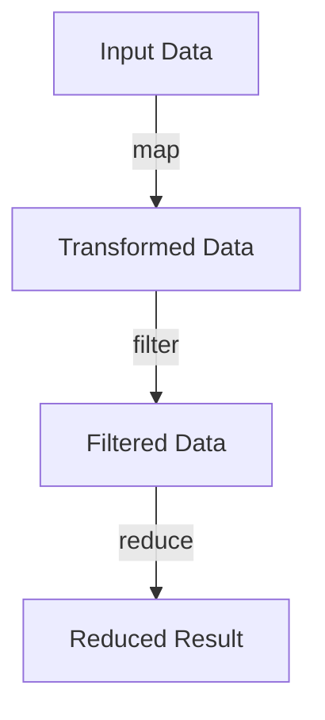

## Higher-Order Functions in Clojure: A Guide for Java Developers

Higher-order functions are a cornerstone of functional programming, enabling developers to write more abstract, reusable, and concise code. In Clojure, higher-order functions are used extensively to manipulate data and control flow. This guide will help Java developers understand and leverage higher-order functions in Clojure, drawing parallels to Java where applicable.

### Understanding Higher-Order Functions

**Definition**: A higher-order function is a function that either takes one or more functions as arguments or returns a function as its result. This concept allows for powerful abstractions and code reuse.

In Java, higher-order functions became more prominent with the introduction of lambda expressions in Java 8. However, Clojure, being a functional language, has embraced higher-order functions from its inception.

### Key Concepts and Benefits

- **Abstraction**: Higher-order functions allow you to abstract patterns of computation, making your code more modular and easier to understand.
- **Reusability**: By encapsulating behavior in functions, you can reuse logic across different parts of your application.
- **Conciseness**: Higher-order functions often lead to more concise code, reducing boilerplate and improving readability.

### Common Higher-Order Functions in Clojure

Clojure provides several built-in higher-order functions that are commonly used for data transformation and control flow. Let's explore some of these functions with examples.

#### `map`

The `map` function applies a given function to each element of a collection, returning a new collection of results.

```clojure
;; Example: Using map to square each number in a list
(def numbers [1 2 3 4 5])
(def squared-numbers (map #(* % %) numbers))
;; squared-numbers => (1 4 9 16 25)
```

In Java, a similar operation can be performed using streams:

```java
// Java equivalent using streams
List<Integer> numbers = Arrays.asList(1, 2, 3, 4, 5);
List<Integer> squaredNumbers = numbers.stream()
                                      .map(n -> n * n)
                                      .collect(Collectors.toList());
```

#### `filter`

The `filter` function returns a new collection containing only the elements that satisfy a given predicate function.

```clojure
;; Example: Filtering even numbers from a list
(def even-numbers (filter even? numbers))
;; even-numbers => (2 4)
```

Java's equivalent using streams:

```java
// Java equivalent using streams
List<Integer> evenNumbers = numbers.stream()
                                   .filter(n -> n % 2 == 0)
                                   .collect(Collectors.toList());
```

#### `reduce`

The `reduce` function processes elements of a collection to produce a single accumulated result. It takes a function and an initial value as arguments.

```clojure
;; Example: Summing a list of numbers
(def sum (reduce + 0 numbers))
;; sum => 15
```

Java's equivalent using streams:

```java
// Java equivalent using streams
int sum = numbers.stream()
                 .reduce(0, Integer::sum);
```

### Creating Custom Higher-Order Functions

In addition to using built-in higher-order functions, you can create your own to encapsulate specific patterns of computation.

```clojure
;; Example: A custom higher-order function that applies a function twice
(defn apply-twice [f x]
  (f (f x)))

;; Usage
(defn increment [n] (+ n 1))
(apply-twice increment 5) ;; => 7
```

### Function Composition

Function composition is a powerful technique that allows you to combine simple functions to build more complex ones. Clojure provides the `comp` function for this purpose.

```clojure
;; Example: Composing functions to create a new function
(defn add-one [x] (+ x 1))
(defn square [x] (* x x))

(def add-one-and-square (comp square add-one))

(add-one-and-square 3) ;; => 16
```

### Diagram: Flow of Data Through Higher-Order Functions



*Caption*: This diagram illustrates the flow of data through a series of higher-order functions: `map`, `filter`, and `reduce`.

### Comparing with Java

While Java has adopted some functional programming features, such as lambda expressions and the Stream API, Clojure's approach to higher-order functions is more deeply integrated into the language. Clojure's functions are first-class citizens, meaning they can be passed around and manipulated just like any other data type.

### Try It Yourself

Experiment with the following modifications to deepen your understanding:

- Modify the `map` example to cube each number instead of squaring it.
- Create a custom higher-order function that applies a function three times.
- Use `reduce` to find the maximum number in a list.

### Exercises

1. Write a function in Clojure that takes a list of strings and returns a list of their lengths using `map`.
2. Implement a function that filters out all strings shorter than 5 characters from a list.
3. Use `reduce` to concatenate a list of strings into a single string, separated by commas.

### Key Takeaways

- Higher-order functions are essential for writing abstract, reusable, and concise code in Clojure.
- Clojure provides built-in higher-order functions like `map`, `filter`, and `reduce` for common data transformations.
- Creating custom higher-order functions allows you to encapsulate specific patterns of computation.
- Function composition enables you to build complex functions from simpler ones.
- While Java offers some functional programming features, Clojure's approach is more deeply integrated and idiomatic.

### Further Reading

- [Official Clojure Documentation](https://clojure.org/reference/functions)
- [ClojureDocs](https://clojuredocs.org/)
- [Functional Programming in Java: Harnessing the Power of Java 8 Lambda Expressions](https://www.amazon.com/Functional-Programming-Java-Harnessing-Expressions/dp/1937785467)

## Quiz: Test Your Knowledge on Higher-Order Functions



### What is a higher-order function?

- [x] A function that takes other functions as arguments or returns a function as a result
- [ ] A function that only operates on numbers
- [ ] A function that is defined inside another function
- [ ] A function that cannot be reused

> **Explanation:** Higher-order functions are those that can take other functions as arguments or return them as results, enabling powerful abstractions.

### Which Clojure function applies a given function to each element of a collection?

- [x] map
- [ ] filter
- [ ] reduce
- [ ] apply

> **Explanation:** The `map` function applies a given function to each element of a collection, returning a new collection of results.

### What does the `filter` function do in Clojure?

- [x] Returns a new collection containing only the elements that satisfy a given predicate
- [ ] Applies a function to each element of a collection
- [ ] Reduces a collection to a single value
- [ ] Composes multiple functions into one

> **Explanation:** The `filter` function returns a new collection containing only the elements that satisfy a given predicate function.

### How does `reduce` function work in Clojure?

- [x] It processes elements of a collection to produce a single accumulated result
- [ ] It filters elements based on a condition
- [ ] It applies a function to each element of a collection
- [ ] It returns the first element of a collection

> **Explanation:** The `reduce` function processes elements of a collection to produce a single accumulated result, taking a function and an initial value as arguments.

### Which of the following is a benefit of higher-order functions?

- [x] Abstraction
- [x] Reusability
- [ ] Increased complexity
- [ ] Reduced performance

> **Explanation:** Higher-order functions provide abstraction and reusability, making code more modular and easier to understand.

### What is function composition?

- [x] Combining simple functions to build more complex ones
- [ ] Defining a function inside another function
- [ ] Applying a function to each element of a collection
- [ ] Filtering elements based on a condition

> **Explanation:** Function composition is the process of combining simple functions to build more complex ones, often using the `comp` function in Clojure.

### Which Clojure function would you use to find the maximum number in a list?

- [x] reduce
- [ ] map
- [ ] filter
- [ ] apply

> **Explanation:** The `reduce` function can be used to find the maximum number in a list by accumulating the maximum value as it processes each element.

### What is the equivalent of Clojure's `map` function in Java?

- [x] Stream's map method
- [ ] Stream's filter method
- [ ] Stream's reduce method
- [ ] Stream's collect method

> **Explanation:** Java's Stream API provides a `map` method that is equivalent to Clojure's `map` function, applying a function to each element of a stream.

### Can higher-order functions return other functions?

- [x] True
- [ ] False

> **Explanation:** Higher-order functions can return other functions, allowing for dynamic behavior and powerful abstractions.

### Are functions first-class citizens in Clojure?

- [x] True
- [ ] False

> **Explanation:** In Clojure, functions are first-class citizens, meaning they can be passed around and manipulated just like any other data type.


