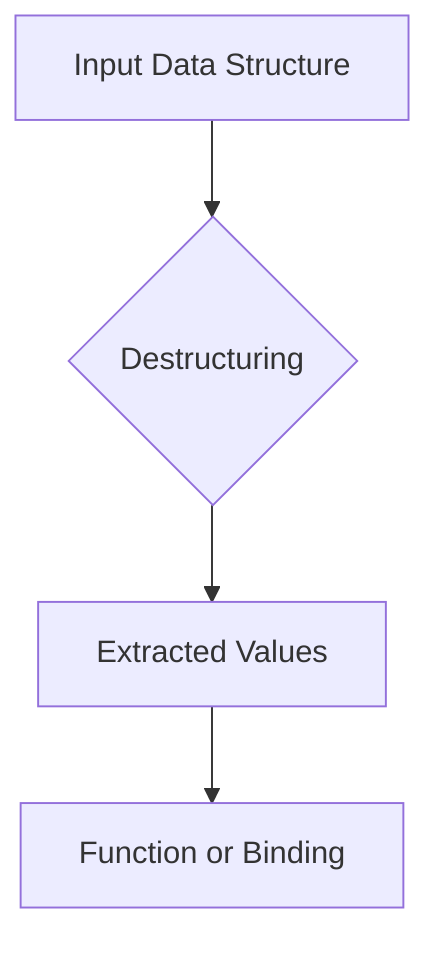

## D.2.2 Destructuring

Destructuring is a powerful feature in Clojure that allows developers to bind names to values within complex data structures, making it easier to extract needed values. This concept is particularly beneficial for Java developers transitioning to Clojure, as it simplifies code by allowing direct access to nested data. In this section, we will explore destructuring in detail, providing examples in function parameters and `let` bindings, and comparing it with Java's approach to handling data structures.

### Understanding Destructuring

Destructuring in Clojure is a means of breaking down complex data structures into simpler parts, allowing you to access and manipulate data more easily. It is a syntactic convenience that can be used in various contexts, such as function parameters, `let` bindings, and even `for` loops. By using destructuring, you can write more concise and readable code, reducing the need for repetitive data access patterns.

#### Key Concepts

- **Binding Names to Values**: Destructuring allows you to bind names to specific values within a data structure, making it easier to work with nested data.
- **Simplifying Code**: By providing direct access to nested data, destructuring reduces the need for verbose code, improving readability and maintainability.
- **Versatility**: Destructuring can be used in various contexts, including function parameters, `let` bindings, and loops, making it a versatile tool for Clojure developers.

### Destructuring in Function Parameters

One of the most common uses of destructuring is in function parameters. This allows you to directly access elements of a collection passed to a function, without having to manually extract each element.

#### Example: Destructuring a Vector

Consider a function that takes a vector of three elements and returns their sum. In Java, you might write something like this:

```java
public int sumVector(int[] vector) {
    return vector[0] + vector[1] + vector[2];
}
```

In Clojure, you can achieve the same result using destructuring:

```clojure
(defn sum-vector [[a b c]]
  (+ a b c))

;; Usage
(sum-vector [1 2 3]) ; => 6
```

**Explanation**: In the Clojure example, the vector `[a b c]` in the function parameters destructures the input vector, binding `a`, `b`, and `c` to the first, second, and third elements, respectively. This eliminates the need for explicit indexing, making the code cleaner and more expressive.

### Destructuring in `let` Bindings

Destructuring can also be used in `let` bindings to extract values from complex data structures. This is particularly useful when working with nested maps or vectors.

#### Example: Destructuring a Map

Suppose you have a map representing a person, and you want to extract the first and last names:

```clojure
(def person {:first-name "John" :last-name "Doe" :age 30})

(let [{:keys [first-name last-name]} person]
  (str "Hello, " first-name " " last-name "!"))

;; Output: "Hello, John Doe!"
```

**Explanation**: The `{:keys [first-name last-name]}` syntax destructures the map, binding `first-name` and `last-name` to the corresponding values in the map. This approach is more concise than manually accessing each key, as you might do in Java.

### Nested Destructuring

Clojure's destructuring capabilities extend to nested data structures, allowing you to extract values from deeply nested maps or vectors in a single step.

#### Example: Nested Map Destructuring

Consider a nested map representing a book with an author:

```clojure
(def book {:title "Clojure for Java Developers"
           :author {:first-name "Jane" :last-name "Smith"}})

(let [{:keys [title]
       :author {:keys [first-name last-name]}} book]
  (str title " by " first-name " " last-name))

;; Output: "Clojure for Java Developers by Jane Smith"
```

**Explanation**: The destructuring form `{:author {:keys [first-name last-name]}}` allows you to access the nested `author` map directly, binding `first-name` and `last-name` to the corresponding values. This simplifies the process of working with nested data, which would require multiple steps in Java.

### Destructuring with Default Values

Clojure allows you to specify default values when destructuring, ensuring that your code handles missing data gracefully.

#### Example: Default Values in Destructuring

```clojure
(def person {:first-name "John"})

(let [{:keys [first-name last-name] :or {last-name "Doe"}} person]
  (str "Hello, " first-name " " last-name "!"))

;; Output: "Hello, John Doe!"
```

**Explanation**: The `:or` keyword is used to provide default values for keys that may not be present in the map. In this example, if `last-name` is missing, it defaults to "Doe".

### Destructuring in Loops

Destructuring can also be applied in loops, such as `for`, to iterate over collections and extract elements directly.

#### Example: Destructuring in a `for` Loop

```clojure
(def people [{:first-name "John" :last-name "Doe"}
             {:first-name "Jane" :last-name "Smith"}])

(for [{:keys [first-name last-name]} people]
  (str first-name " " last-name))

;; Output: ("John Doe" "Jane Smith")
```

**Explanation**: The destructuring form `{:keys [first-name last-name]}` is used within the `for` loop to extract `first-name` and `last-name` from each map in the `people` collection. This approach simplifies the iteration process, making the code more readable.

### Comparing Destructuring in Clojure and Java

While Java does not have a direct equivalent to Clojure's destructuring, you can achieve similar results using other techniques, such as pattern matching (introduced in Java 16) or using libraries like Jackson for JSON parsing. However, these approaches often require more boilerplate code and lack the elegance and simplicity of Clojure's destructuring.

#### Java Example: Pattern Matching

```java
record Person(String firstName, String lastName) {}

public String greetPerson(Person person) {
    return switch (person) {
        case Person(String firstName, String lastName) -> "Hello, " + firstName + " " + lastName + "!";
    };
}

// Usage
Person person = new Person("John", "Doe");
System.out.println(greetPerson(person)); // Output: "Hello, John Doe!"
```

**Explanation**: Java's pattern matching allows you to destructure records, but it is limited to specific use cases and lacks the flexibility of Clojure's destructuring for arbitrary data structures.

### Try It Yourself

To deepen your understanding of destructuring in Clojure, try modifying the examples above:

- Add additional keys to the map in the nested destructuring example and access them in the `let` binding.
- Experiment with destructuring vectors of different lengths and observe how Clojure handles missing elements.
- Use destructuring in a `for` loop to iterate over a collection of nested maps.

### Diagrams and Visualizations

To better understand how destructuring works, consider the following diagram illustrating the flow of data through a destructuring operation:



**Diagram Description**: This flowchart represents the process of destructuring, where an input data structure is broken down into extracted values, which are then used in a function or binding.

### Exercises and Practice Problems

1. **Exercise 1**: Given a vector `[1 2 3 4 5]`, write a function that uses destructuring to return the sum of the first three elements.

2. **Exercise 2**: Create a map representing a car with keys `:make`, `:model`, and `:year`. Use destructuring in a `let` binding to extract these values and return a formatted string.

3. **Exercise 3**: Write a `for` loop that iterates over a collection of maps, each representing a student with keys `:name` and `:grade`. Use destructuring to extract these values and return a list of formatted strings.

### Key Takeaways

- **Destructuring Simplifies Code**: By allowing direct access to nested data, destructuring reduces the need for verbose code, improving readability and maintainability.
- **Versatility**: Destructuring can be used in various contexts, including function parameters, `let` bindings, and loops, making it a versatile tool for Clojure developers.
- **Comparison with Java**: While Java offers some pattern matching capabilities, Clojure's destructuring provides a more flexible and concise way to work with complex data structures.

By mastering destructuring in Clojure, you can write more expressive and efficient code, making it easier to work with complex data structures and improving your overall productivity as a developer.

### Further Reading

For more information on destructuring and other Clojure features, consider exploring the following resources:

- [Official Clojure Documentation](https://clojure.org/reference/destructuring)
- [ClojureDocs: Destructuring](https://clojuredocs.org/clojure.core/destructure)
- [Clojure for the Brave and True](https://www.braveclojure.com/)

## Quiz: Mastering Destructuring in Clojure



### What is destructuring in Clojure?

- [x] A way to bind names to values within complex data structures
- [ ] A method for creating new data structures
- [ ] A technique for optimizing performance
- [ ] A process for compiling Clojure code

> **Explanation:** Destructuring is a means to bind names to values within complex data structures, simplifying data access.

### How does destructuring improve code readability?

- [x] By allowing direct access to nested data
- [ ] By reducing the number of functions needed
- [ ] By increasing the complexity of code
- [ ] By eliminating the need for comments

> **Explanation:** Destructuring allows direct access to nested data, reducing verbosity and improving readability.

### In which contexts can destructuring be used in Clojure?

- [x] Function parameters
- [x] `let` bindings
- [x] Loops
- [ ] Class definitions

> **Explanation:** Destructuring can be used in function parameters, `let` bindings, and loops to simplify data access.

### What is the purpose of the `:or` keyword in destructuring?

- [x] To provide default values for missing keys
- [ ] To specify optional parameters
- [ ] To define the order of keys
- [ ] To optimize performance

> **Explanation:** The `:or` keyword is used to provide default values for keys that may not be present in the data structure.

### How does destructuring in Clojure compare to Java's pattern matching?

- [x] Clojure's destructuring is more flexible
- [ ] Java's pattern matching is more concise
- [ ] Both are identical in functionality
- [ ] Java's pattern matching is more versatile

> **Explanation:** Clojure's destructuring is more flexible and can be applied to arbitrary data structures, unlike Java's pattern matching.

### What is a common use case for destructuring in function parameters?

- [x] Extracting elements from a collection
- [ ] Defining default values for arguments
- [ ] Optimizing function calls
- [ ] Compiling functions

> **Explanation:** Destructuring in function parameters is commonly used to extract elements from a collection directly.

### How can destructuring be used in a `for` loop?

- [x] To extract elements from each item in a collection
- [ ] To define the loop's termination condition
- [ ] To optimize loop performance
- [ ] To create new collections

> **Explanation:** Destructuring in a `for` loop allows you to extract elements from each item in a collection, simplifying iteration.

### What is the benefit of using nested destructuring?

- [x] It allows access to deeply nested data in a single step
- [ ] It increases code complexity
- [ ] It reduces the need for functions
- [ ] It eliminates the need for data structures

> **Explanation:** Nested destructuring allows you to access deeply nested data in a single step, simplifying code.

### Can destructuring be used with vectors in Clojure?

- [x] True
- [ ] False

> **Explanation:** Destructuring can be used with vectors to bind names to specific elements, simplifying data access.

### What is the main advantage of destructuring over traditional data access methods?

- [x] It simplifies code and improves readability
- [ ] It increases performance
- [ ] It reduces the need for data structures
- [ ] It eliminates the need for functions

> **Explanation:** The main advantage of destructuring is that it simplifies code and improves readability by providing direct access to nested data.


