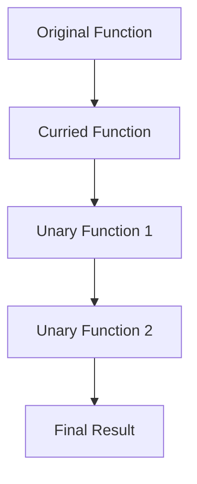

## Currying and Partial Application in Clojure: A Deep Dive for Java Developers

As experienced Java developers, you're likely familiar with the concept of functions that take multiple arguments. In functional programming, particularly in Clojure, we often encounter two powerful techniques: **currying** and **partial application**. These techniques allow us to transform and manipulate functions in ways that enhance code flexibility and reusability. Let's explore these concepts in depth, using Clojure's unique features to illustrate their power and utility.

### Understanding Currying

**Currying** is a functional programming technique that transforms a function with multiple arguments into a sequence of functions, each taking a single argument. This transformation allows for more flexible function composition and reuse.

#### Currying in Theory

In a curried function, instead of taking all arguments at once, the function takes the first argument and returns a new function that takes the next argument. This process continues until all arguments are supplied, at which point the original function is executed.

**Example in Mathematics:**

Consider a mathematical function `f(x, y) = x + y`. In a curried form, this becomes:

- `f(x) = (y) => x + y`

This transformation allows us to create specialized functions by supplying arguments incrementally.

#### Currying in Clojure

Clojure does not natively support currying in the same way some other functional languages do, but we can achieve similar behavior using higher-order functions.

**Clojure Example:**

```clojure
(defn add [x y]
  (+ x y))

(defn curried-add [x]
  (fn [y]
    (+ x y)))

;; Usage
(def add-five (curried-add 5))
(println (add-five 10)) ; Output: 15
```

In this example, `curried-add` is a function that takes one argument `x` and returns another function that takes `y`. When both arguments are provided, the addition is performed.

### Partial Application

**Partial application** is a technique where we fix a few arguments of a function, producing another function of smaller arity (fewer arguments). This is particularly useful for creating specialized functions from more general ones.

#### Partial Application in Theory

Partial application allows us to "preset" some arguments of a function, creating a new function that requires fewer arguments. This can simplify function calls and improve code readability.

**Example in Mathematics:**

Given a function `f(x, y, z) = x * y + z`, we can partially apply it to fix `x` and `y`:

- `g(z) = f(2, 3, z) = 2 * 3 + z`

#### Partial Application in Clojure

Clojure provides the `partial` function to facilitate partial application.

**Clojure Example:**

```clojure
(defn multiply [x y z]
  (+ (* x y) z))

(def multiply-by-six (partial multiply 2 3))

;; Usage
(println (multiply-by-six 4)) ; Output: 10
```

Here, `multiply-by-six` is a partially applied function where `x` and `y` are fixed to `2` and `3`, respectively. The resulting function only requires the `z` argument.

### Currying vs. Partial Application

While both currying and partial application involve transforming functions, they serve different purposes:

- **Currying** transforms a function into a sequence of unary functions, allowing arguments to be supplied one at a time.
- **Partial Application** fixes some arguments of a function, creating a new function with fewer arguments.

#### Comparison with Java

In Java, achieving similar behavior requires more boilerplate code. Java 8 introduced lambdas and method references, which help, but the syntax remains more verbose compared to Clojure.

**Java Example:**

```java
import java.util.function.Function;

public class CurryingExample {
    public static Function<Integer, Function<Integer, Integer>> curriedAdd() {
        return x -> y -> x + y;
    }

    public static void main(String[] args) {
        Function<Integer, Integer> addFive = curriedAdd().apply(5);
        System.out.println(addFive.apply(10)); // Output: 15
    }
}
```

In Java, we use nested `Function` interfaces to achieve currying, which is less intuitive than Clojure's approach.

### Practical Applications

Currying and partial application are not just theoretical concepts; they have practical applications in real-world programming.

#### Function Composition

Currying and partial application enable elegant function composition, allowing us to build complex functions from simpler ones.

**Clojure Example:**

```clojure
(defn add [x y] (+ x y))
(defn multiply [x y] (* x y))

(def add-five (partial add 5))
(def multiply-by-ten (partial multiply 10))

(defn add-five-then-multiply-by-ten [x]
  (multiply-by-ten (add-five x)))

(println (add-five-then-multiply-by-ten 3)) ; Output: 80
```

In this example, we compose `add-five` and `multiply-by-ten` to create a new function `add-five-then-multiply-by-ten`.

#### Code Reusability

By using currying and partial application, we can create reusable and modular code components, reducing duplication and enhancing maintainability.

### Try It Yourself

Experiment with the following code snippets to deepen your understanding of currying and partial application:

1. Modify the `curried-add` function to support subtraction instead of addition.
2. Create a partially applied function that divides numbers by a fixed divisor.
3. Combine multiple partially applied functions to perform a sequence of operations on a list of numbers.

### Visualizing Currying and Partial Application

To better understand these concepts, let's visualize the transformation of functions using diagrams.



**Diagram Description:** This flowchart illustrates the transformation of an original function into a curried function, which is then broken down into a sequence of unary functions, leading to the final result.

### Further Reading

For more information on currying and partial application, consider exploring the following resources:

- [Official Clojure Documentation](https://clojure.org/reference/functions)
- [ClojureDocs](https://clojuredocs.org/)
- [Functional Programming in Clojure](https://www.braveclojure.com/)

### Exercises

1. **Exercise 1:** Implement a curried function that calculates the area of a rectangle given its length and width.
2. **Exercise 2:** Use partial application to create a function that adds a fixed tax rate to a given price.
3. **Exercise 3:** Refactor a Java method to use currying and partial application in Clojure.

### Key Takeaways

- **Currying** transforms a multi-argument function into a sequence of unary functions, enhancing flexibility.
- **Partial Application** fixes some arguments of a function, creating a new function with fewer arguments.
- These techniques promote code reusability, modularity, and composition.
- Clojure's concise syntax makes currying and partial application more intuitive compared to Java.

Now that we've explored currying and partial application in Clojure, let's apply these concepts to create more flexible and reusable code in your applications.

## Quiz: Mastering Currying and Partial Application in Clojure



### What is currying in functional programming?

- [x] Transforming a function with multiple arguments into a sequence of functions each taking a single argument.
- [ ] Fixing a few arguments of a function to produce another function of smaller arity.
- [ ] A technique to optimize function execution speed.
- [ ] A method to handle exceptions in functional programming.

> **Explanation:** Currying involves transforming a function with multiple arguments into a sequence of unary functions, each taking one argument at a time.

### What is partial application?

- [ ] Transforming a function with multiple arguments into a sequence of functions each taking a single argument.
- [x] Fixing a few arguments of a function to produce another function of smaller arity.
- [ ] A technique to optimize function execution speed.
- [ ] A method to handle exceptions in functional programming.

> **Explanation:** Partial application involves fixing some arguments of a function, resulting in a new function with fewer arguments.

### How does Clojure achieve currying?

- [x] By using higher-order functions to return new functions.
- [ ] By using the `partial` function.
- [ ] By using macros.
- [ ] By using Java interop.

> **Explanation:** Clojure achieves currying by using higher-order functions that return new functions, allowing arguments to be supplied one at a time.

### Which Clojure function is used for partial application?

- [ ] `map`
- [x] `partial`
- [ ] `reduce`
- [ ] `filter`

> **Explanation:** The `partial` function in Clojure is used to fix some arguments of a function, creating a new function with fewer arguments.

### What is the result of `(partial + 5)` in Clojure?

- [x] A function that adds 5 to its argument.
- [ ] A function that subtracts 5 from its argument.
- [ ] A function that multiplies its argument by 5.
- [ ] A function that divides its argument by 5.

> **Explanation:** `(partial + 5)` creates a new function that adds 5 to its argument.

### How does currying enhance function composition?

- [x] By allowing functions to be combined more flexibly.
- [ ] By reducing the number of arguments needed.
- [ ] By optimizing execution speed.
- [ ] By handling exceptions more effectively.

> **Explanation:** Currying enhances function composition by allowing functions to be combined more flexibly, as each function takes a single argument.

### What is a practical use of partial application?

- [x] Creating specialized functions from general ones.
- [ ] Optimizing function execution speed.
- [ ] Handling exceptions in functional programming.
- [ ] Managing state changes.

> **Explanation:** Partial application is used to create specialized functions from general ones by fixing some arguments.

### How does Clojure's syntax for currying compare to Java's?

- [x] Clojure's syntax is more concise and intuitive.
- [ ] Java's syntax is more concise and intuitive.
- [ ] Both have equally concise syntax.
- [ ] Neither language supports currying.

> **Explanation:** Clojure's syntax for currying is more concise and intuitive compared to Java's, which requires more boilerplate code.

### Can partial application be used with any Clojure function?

- [x] True
- [ ] False

> **Explanation:** Partial application can be used with any Clojure function, allowing for flexible function creation.

### Currying and partial application are unique to Clojure.

- [ ] True
- [x] False

> **Explanation:** Currying and partial application are not unique to Clojure; they are common techniques in functional programming languages.


