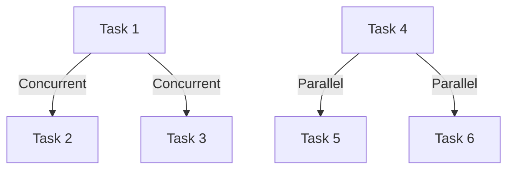

## D.3.1 Concurrency vs. Parallelism

As experienced Java developers, you are likely familiar with the challenges of managing multiple tasks in your applications. Concurrency and parallelism are two key concepts that help in handling these tasks efficiently. While they are often used interchangeably, they refer to different approaches to task management. In this section, we will explore the differences between concurrency and parallelism, how Clojure supports these concepts, and how you can leverage them to build efficient and scalable applications.

### Understanding Concurrency

**Concurrency** is about dealing with multiple tasks at once. It involves managing multiple tasks that can overlap in execution time but are not necessarily executed simultaneously. Concurrency is more about the structure of a program and how it handles multiple tasks, rather than the actual execution of tasks.

In Java, concurrency is often managed using threads. Java provides a rich set of concurrency utilities, such as `ExecutorService`, `Future`, and `CompletableFuture`, to manage concurrent tasks. However, managing threads can be complex and error-prone, especially when dealing with shared mutable state.

#### Concurrency in Clojure

Clojure offers a different approach to concurrency, focusing on immutability and functional programming principles. Clojure's concurrency model is built around its immutable data structures and a set of concurrency primitives that simplify the management of shared state.

**Clojure's Concurrency Primitives:**

- **Atoms**: Provide a way to manage shared, synchronous, and independent state changes.
- **Refs**: Use Software Transactional Memory (STM) to manage coordinated, synchronous state changes.
- **Agents**: Allow for asynchronous, independent state changes.
- **Vars**: Support dynamic binding of values to variables.

Let's explore these primitives with examples.

#### Atoms in Clojure

Atoms are used for managing shared state that can be changed independently. They provide a way to update state synchronously and safely without locks.

```clojure
(def counter (atom 0)) ; Define an atom with an initial value of 0

(defn increment-counter []
  (swap! counter inc)) ; Increment the counter atomically

(increment-counter) ; Call the function to increment the counter
@counter ; Dereference the atom to get its current value
```

In this example, `swap!` is used to update the atom's value atomically. This ensures that even if multiple threads attempt to update the atom simultaneously, the updates will be applied safely.

#### Refs and Software Transactional Memory (STM)

Refs are used for managing coordinated state changes. They leverage STM to ensure that multiple state changes are applied atomically.

```clojure
(def account1 (ref 1000)) ; Define a ref with an initial balance
(def account2 (ref 2000))

(defn transfer [from to amount]
  (dosync
    (alter from - amount)
    (alter to + amount))) ; Transfer amount from one account to another

(transfer account1 account2 100) ; Perform a transfer
```

The `dosync` block ensures that the operations within it are executed as a single transaction, maintaining consistency across multiple refs.

#### Agents for Asynchronous Updates

Agents are designed for asynchronous updates. They allow you to perform state changes in the background without blocking the main thread.

```clojure
(def logger (agent [])) ; Define an agent with an initial empty vector

(defn log-message [msg]
  (send logger conj msg)) ; Asynchronously add a message to the log

(log-message "Starting process...") ; Log a message
```

The `send` function queues the update operation, allowing the main thread to continue execution without waiting for the update to complete.

### Understanding Parallelism

**Parallelism** is about executing multiple tasks simultaneously. It leverages multi-core processors to perform computations in parallel, improving performance and throughput.

In Java, parallelism can be achieved using the `ForkJoinPool` and parallel streams introduced in Java 8. These tools allow you to divide tasks into smaller sub-tasks and execute them concurrently across multiple threads.

#### Parallelism in Clojure

Clojure can leverage parallelism through its immutable data structures and functional programming constructs. The language provides several ways to perform parallel computations, such as `pmap` and `future`.

#### Using `pmap` for Parallel Processing

`pmap` is a parallel version of the `map` function. It applies a function to each element of a collection in parallel.

```clojure
(defn square [n]
  (* n n))

(def numbers (range 1 1000))

(def squared-numbers (pmap square numbers)) ; Compute squares in parallel
```

In this example, `pmap` distributes the computation of squares across available cores, improving performance for large datasets.

#### Futures for Asynchronous Computation

Futures in Clojure allow you to perform computations asynchronously, returning a placeholder for the result that will be available in the future.

```clojure
(def result (future (expensive-computation))) ; Start computation in a separate thread

@result ; Block and wait for the result
```

The `future` function starts the computation in a separate thread, and the result can be retrieved by dereferencing the future.

### Concurrency vs. Parallelism: Key Differences

- **Concurrency** is about managing multiple tasks that can overlap in time, while **parallelism** is about executing multiple tasks simultaneously.
- Concurrency focuses on the structure and management of tasks, whereas parallelism focuses on the execution of tasks.
- Clojure's concurrency primitives (atoms, refs, agents) help manage shared state safely, while parallelism tools (`pmap`, `future`) leverage multi-core processors for improved performance.

### Visualizing Concurrency and Parallelism

Below is a diagram illustrating the difference between concurrency and parallelism:



**Diagram Description**: This diagram shows how tasks can be managed concurrently (overlapping in time) and executed in parallel (simultaneously).

### Try It Yourself

Experiment with the following modifications to the code examples:

1. **Atom Example**: Modify the `increment-counter` function to decrement the counter and observe the changes.
2. **Ref Example**: Add a new account and perform multiple transfers within a single `dosync` block.
3. **Agent Example**: Create a new agent for a different task and send multiple messages asynchronously.
4. **Parallel Processing**: Use `pmap` to apply a different function to the `numbers` collection and compare the performance with `map`.

### Further Reading

- [Official Clojure Documentation](https://clojure.org/reference)
- [ClojureDocs](https://clojuredocs.org/)
- [Java Concurrency Utilities](https://docs.oracle.com/javase/8/docs/api/java/util/concurrent/package-summary.html)

### Exercises

1. Implement a concurrent task manager using Clojure's agents to handle multiple tasks asynchronously.
2. Create a parallel data processing pipeline using `pmap` to process a large dataset efficiently.
3. Refactor a Java application using Clojure's concurrency primitives to manage shared state safely.

### Key Takeaways

- **Concurrency** and **parallelism** are distinct concepts that help manage and execute multiple tasks efficiently.
- Clojure provides powerful concurrency primitives that simplify state management and enhance application scalability.
- Leveraging Clojure's parallel processing tools can significantly improve performance on multi-core systems.
- Understanding and applying these concepts can lead to more robust and efficient applications.

Now that we've explored the differences between concurrency and parallelism, let's apply these concepts to build scalable and efficient applications using Clojure's unique features.

## Quiz: Test Your Understanding of Concurrency and Parallelism



### What is the primary focus of concurrency?

- [x] Managing multiple tasks that can overlap in time
- [ ] Executing multiple tasks simultaneously
- [ ] Improving single-threaded performance
- [ ] Reducing memory usage

> **Explanation:** Concurrency is about managing multiple tasks that can overlap in time, focusing on the structure and management of tasks.

### How does Clojure's `atom` help in concurrency?

- [x] It manages shared state synchronously and safely
- [ ] It executes tasks in parallel
- [ ] It provides asynchronous task execution
- [ ] It locks resources for exclusive access

> **Explanation:** Atoms in Clojure manage shared state synchronously and safely without locks, ensuring thread-safe updates.

### What is the role of `pmap` in Clojure?

- [x] It applies a function to each element of a collection in parallel
- [ ] It manages shared state changes
- [ ] It provides asynchronous task execution
- [ ] It locks resources for exclusive access

> **Explanation:** `pmap` is a parallel version of `map`, applying a function to each element of a collection in parallel.

### Which Clojure primitive uses Software Transactional Memory (STM)?

- [x] Refs
- [ ] Atoms
- [ ] Agents
- [ ] Vars

> **Explanation:** Refs in Clojure use Software Transactional Memory (STM) to manage coordinated state changes atomically.

### What is the main advantage of using agents in Clojure?

- [x] They allow for asynchronous, independent state changes
- [ ] They manage shared state synchronously
- [ ] They execute tasks in parallel
- [ ] They lock resources for exclusive access

> **Explanation:** Agents in Clojure allow for asynchronous, independent state changes, enabling non-blocking updates.

### How does parallelism improve performance?

- [x] By executing multiple tasks simultaneously on multi-core processors
- [ ] By managing multiple tasks that can overlap in time
- [ ] By reducing memory usage
- [ ] By locking resources for exclusive access

> **Explanation:** Parallelism improves performance by executing multiple tasks simultaneously on multi-core processors.

### What is the difference between concurrency and parallelism?

- [x] Concurrency is about managing tasks, while parallelism is about executing tasks simultaneously
- [ ] Concurrency is about executing tasks simultaneously, while parallelism is about managing tasks
- [ ] Both are the same and interchangeable
- [ ] Concurrency focuses on single-threaded performance

> **Explanation:** Concurrency is about managing tasks that can overlap in time, while parallelism is about executing tasks simultaneously.

### Which Clojure function allows for asynchronous computation?

- [x] future
- [ ] pmap
- [ ] swap!
- [ ] alter

> **Explanation:** The `future` function in Clojure allows for asynchronous computation, returning a placeholder for the result.

### What is the purpose of the `dosync` block in Clojure?

- [x] To ensure operations within it are executed as a single transaction
- [ ] To manage asynchronous task execution
- [ ] To apply a function to each element of a collection in parallel
- [ ] To lock resources for exclusive access

> **Explanation:** The `dosync` block in Clojure ensures that operations within it are executed as a single transaction, maintaining consistency.

### True or False: Parallelism can be achieved without concurrency.

- [x] True
- [ ] False

> **Explanation:** Parallelism can be achieved without concurrency, as it focuses on executing tasks simultaneously, while concurrency is about managing tasks.


