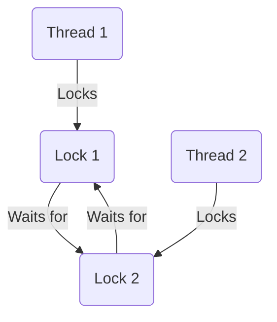

## Understanding Deadlocks and Race Conditions in Clojure

Concurrency is a powerful tool in modern programming, allowing multiple computations to occur simultaneously. However, it introduces complexities such as **deadlocks** and **race conditions**. In this section, we'll explore these issues, how they manifest in Java, and how Clojure's concurrency model and immutable data structures provide solutions.

### What are Deadlocks?

A **deadlock** occurs when two or more threads are blocked forever, each waiting on the other to release resources. This situation is akin to a traffic jam where each car waits for the other to move, resulting in a standstill.

#### Deadlock Example in Java

In Java, deadlocks often occur when multiple threads acquire locks in different orders. Consider the following example:

```java
public class DeadlockExample {
    private final Object lock1 = new Object();
    private final Object lock2 = new Object();

    public void method1() {
        synchronized (lock1) {
            System.out.println("Thread 1: Holding lock 1...");
            try { Thread.sleep(10); } catch (InterruptedException e) {}
            synchronized (lock2) {
                System.out.println("Thread 1: Holding lock 1 & 2...");
            }
        }
    }

    public void method2() {
        synchronized (lock2) {
            System.out.println("Thread 2: Holding lock 2...");
            try { Thread.sleep(10); } catch (InterruptedException e) {}
            synchronized (lock1) {
                System.out.println("Thread 2: Holding lock 2 & 1...");
            }
        }
    }

    public static void main(String[] args) {
        DeadlockExample example = new DeadlockExample();
        new Thread(example::method1).start();
        new Thread(example::method2).start();
    }
}
```

In this code, `method1` locks `lock1` and then `lock2`, while `method2` locks `lock2` and then `lock1`. If `method1` and `method2` are called simultaneously, a deadlock can occur.

#### Visualizing Deadlocks



*Diagram: This flowchart illustrates how two threads can become deadlocked by waiting on each other's locks.*

### What are Race Conditions?

A **race condition** occurs when the behavior of software depends on the relative timing of events, such as thread execution order. This can lead to unpredictable results and bugs.

#### Race Condition Example in Java

Consider a simple counter increment:

```java
public class RaceConditionExample {
    private int counter = 0;

    public void increment() {
        counter++;
    }

    public static void main(String[] args) {
        RaceConditionExample example = new RaceConditionExample();
        for (int i = 0; i < 1000; i++) {
            new Thread(example::increment).start();
        }
        System.out.println("Final counter value: " + example.counter);
    }
}
```

In this example, multiple threads increment the counter without synchronization, leading to a race condition where the final counter value is unpredictable.

### Clojure's Approach to Concurrency

Clojure addresses these issues with a robust concurrency model and immutable data structures. Let's explore how these features help prevent deadlocks and race conditions.

#### Immutability in Clojure

Clojure's core philosophy is immutability, meaning data structures cannot be modified after creation. This eliminates race conditions because threads cannot interfere with each other's data.

```clojure
(def counter (atom 0))

(defn increment []
  (swap! counter inc))

(dotimes [_ 1000]
  (future (increment)))

(println "Final counter value:" @counter)
```

In this Clojure example, we use an `atom` to manage state. The `swap!` function ensures atomic updates, preventing race conditions.

#### Concurrency Primitives in Clojure

Clojure provides several concurrency primitives, including **atoms**, **refs**, **agents**, and **vars**, each suited for different use cases.

- **Atoms**: For independent, synchronous updates.
- **Refs**: For coordinated, synchronous updates using Software Transactional Memory (STM).
- **Agents**: For asynchronous updates.
- **Vars**: For thread-local state.

#### Avoiding Deadlocks with Clojure

Clojure's STM system helps avoid deadlocks by managing coordinated state changes without explicit locks. Here's an example using refs:

```clojure
(def account1 (ref 100))
(def account2 (ref 200))

(defn transfer [from to amount]
  (dosync
    (alter from - amount)
    (alter to + amount)))

(future (transfer account1 account2 50))
(future (transfer account2 account1 30))

(println "Account 1 balance:" @account1)
(println "Account 2 balance:" @account2)
```

In this example, `dosync` ensures that all operations within the transaction are atomic, consistent, and isolated, preventing deadlocks.

### Comparing Java and Clojure

Java's concurrency model relies heavily on locks and synchronization, which can lead to deadlocks and race conditions if not managed carefully. Clojure's approach, with its emphasis on immutability and STM, provides a safer and more straightforward model for concurrent programming.

#### Java vs. Clojure: A Comparison Table

| Feature                | Java                          | Clojure                        |
|------------------------|-------------------------------|--------------------------------|
| **Immutability**       | Optional, requires discipline | Default, enforced by language  |
| **Concurrency Model**  | Locks, synchronized blocks    | STM, atoms, agents, refs       |
| **Deadlock Prevention**| Manual lock management        | Automatic with STM             |
| **Race Condition Handling** | Requires synchronization | Handled by default with immutability |

### Try It Yourself

Experiment with the provided Clojure examples by modifying the number of threads or the operations performed. Observe how Clojure's concurrency primitives handle these changes gracefully.

### Further Reading

- [Clojure's Official Documentation on Concurrency](https://clojure.org/reference/atoms)
- [ClojureDocs: Atoms and Refs](https://clojuredocs.org/clojure.core/atom)
- [Java Concurrency in Practice](https://jcip.net/)

### Exercises

1. Modify the Java deadlock example to resolve the deadlock by changing the lock acquisition order.
2. Implement a Clojure program using agents to perform asynchronous updates on a shared resource.
3. Create a Clojure application that simulates a bank transfer system using refs and STM, ensuring no deadlocks occur.

### Key Takeaways

- **Deadlocks** occur when threads wait indefinitely for resources held by each other.
- **Race conditions** arise from unsynchronized access to shared resources.
- Clojure's **immutability** and **concurrency primitives** help prevent these issues.
- **Atoms**, **refs**, **agents**, and **vars** provide flexible concurrency models in Clojure.
- Clojure's **STM** simplifies coordinated state changes, reducing the risk of deadlocks.

By leveraging Clojure's unique features, we can write concurrent programs that are both safe and efficient, avoiding common pitfalls like deadlocks and race conditions.

## Quiz: Mastering Deadlocks and Race Conditions in Clojure



### What is a deadlock?

- [x] A situation where two or more threads are waiting indefinitely for resources held by each other.
- [ ] A condition where a program runs out of memory.
- [ ] A scenario where a single thread consumes all CPU resources.
- [ ] A bug that occurs when the timing of threads affects program correctness.

> **Explanation:** A deadlock occurs when threads are stuck waiting for each other to release resources, causing a standstill.

### How does Clojure prevent race conditions?

- [x] By using immutable data structures.
- [ ] By using synchronized blocks.
- [ ] By using explicit locks.
- [ ] By using Java's concurrency utilities.

> **Explanation:** Clojure's immutable data structures ensure that data cannot be modified by multiple threads simultaneously, preventing race conditions.

### Which Clojure primitive is used for asynchronous updates?

- [ ] Atoms
- [ ] Refs
- [x] Agents
- [ ] Vars

> **Explanation:** Agents in Clojure are designed for asynchronous updates, allowing changes to be made without blocking the main thread.

### What is the primary advantage of Clojure's STM?

- [x] It manages coordinated state changes without explicit locks.
- [ ] It provides faster execution than Java's synchronized blocks.
- [ ] It allows for mutable state.
- [ ] It simplifies the syntax of concurrent programming.

> **Explanation:** Clojure's STM handles state changes atomically and consistently, preventing deadlocks without the need for explicit locks.

### In Java, how can deadlocks be avoided?

- [x] By acquiring locks in a consistent order.
- [ ] By using more threads.
- [ ] By avoiding the use of synchronized blocks.
- [ ] By using more memory.

> **Explanation:** Acquiring locks in a consistent order prevents circular wait conditions, which are a primary cause of deadlocks.

### What is a race condition?

- [x] A bug that occurs when the timing or ordering of threads affects the program's correctness.
- [ ] A situation where a program runs out of memory.
- [ ] A scenario where a single thread consumes all CPU resources.
- [ ] A condition where two or more threads are waiting indefinitely for resources held by each other.

> **Explanation:** Race conditions occur when the outcome of a program depends on the unpredictable timing of thread execution.

### Which Clojure primitive is best for independent, synchronous updates?

- [x] Atoms
- [ ] Refs
- [ ] Agents
- [ ] Vars

> **Explanation:** Atoms are used for independent, synchronous updates, allowing for atomic changes to state.

### How does Clojure's immutability help with concurrency?

- [x] It prevents data from being modified by multiple threads simultaneously.
- [ ] It allows for faster execution.
- [ ] It simplifies the syntax of concurrent programming.
- [ ] It requires less memory.

> **Explanation:** Immutability ensures that data cannot be changed, eliminating the risk of race conditions in concurrent environments.

### What is the role of `dosync` in Clojure?

- [x] It ensures that all operations within the transaction are atomic, consistent, and isolated.
- [ ] It locks a resource for exclusive access.
- [ ] It synchronizes threads.
- [ ] It performs asynchronous updates.

> **Explanation:** `dosync` is used in Clojure's STM to manage transactions, ensuring atomic and consistent state changes.

### True or False: Clojure's concurrency model relies heavily on locks and synchronization.

- [ ] True
- [x] False

> **Explanation:** Clojure's concurrency model relies on immutability and STM, reducing the need for explicit locks and synchronization.


