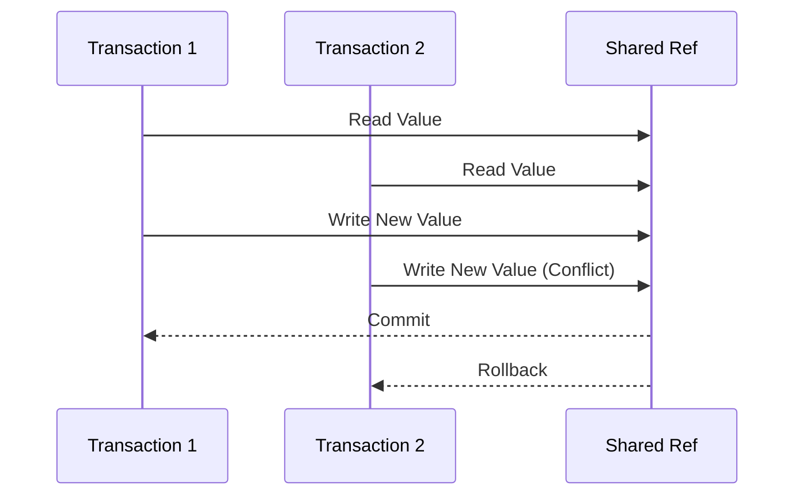

## Software Transactional Memory (STM) in Clojure: A Comprehensive Guide

Concurrency is a challenging aspect of programming, especially when dealing with shared mutable state. In traditional Java programming, concurrency control often involves using locks and synchronized blocks, which can lead to complex and error-prone code. Clojure offers a different approach through Software Transactional Memory (STM), a concurrency control mechanism that allows for coordinated, atomic updates to shared state without explicit locks. This guide will explore STM in Clojure, how it works, and how it can simplify concurrent programming.

### Understanding Software Transactional Memory (STM)

Software Transactional Memory (STM) is a concurrency control mechanism that simplifies the process of managing shared state in concurrent applications. Unlike traditional locking mechanisms, STM allows multiple threads to operate on shared data concurrently, providing a higher level of abstraction for managing state changes.

In Clojure, STM is implemented using **refs**, which are mutable references to immutable data. Refs allow you to perform coordinated, atomic updates to shared state, ensuring consistency and avoiding race conditions.

#### Key Concepts of STM

- **Atomic Transactions**: STM allows you to group multiple operations into a single transaction, ensuring that all operations are executed atomically. If any operation within the transaction fails, the entire transaction is rolled back.
- **Consistency**: STM ensures that shared state remains consistent by allowing only one transaction to modify a ref at a time.
- **Isolation**: Transactions are isolated from each other, meaning that changes made by one transaction are not visible to other transactions until the transaction is committed.
- **No Locks**: STM eliminates the need for explicit locks, reducing the complexity of concurrent programming and avoiding issues such as deadlocks and race conditions.

### STM in Clojure: Using Refs

In Clojure, STM is implemented through the use of refs. A ref is a mutable reference to an immutable value, and it can be updated atomically within a transaction. Let's explore how to use refs in Clojure.

#### Creating and Using Refs

To create a ref in Clojure, you use the `ref` function. Here's an example:

```clojure
(def account-balance (ref 1000))
```

In this example, `account-balance` is a ref that holds the initial value of 1000.

To update the value of a ref, you use the `dosync` macro to start a transaction and the `ref-set` or `alter` functions to modify the ref's value. Here's how you can update the `account-balance` ref:

```clojure
(dosync
  (alter account-balance + 500))
```

In this example, the `alter` function is used to add 500 to the current value of `account-balance`. The `dosync` macro ensures that the update is performed atomically.

#### Coordinated Updates with Multiple Refs

One of the key benefits of STM is the ability to perform coordinated updates to multiple refs within a single transaction. Here's an example:

```clojure
(def account-a (ref 1000))
(def account-b (ref 2000))

(defn transfer [from to amount]
  (dosync
    (alter from - amount)
    (alter to + amount)))

(transfer account-a account-b 300)
```

In this example, the `transfer` function transfers 300 from `account-a` to `account-b`. The `dosync` macro ensures that both updates are performed atomically, maintaining consistency.

### Comparing STM in Clojure with Java's Concurrency Mechanisms

In Java, concurrency control is typically achieved using locks and synchronized blocks. Let's compare this approach with Clojure's STM.

#### Java's Lock-Based Concurrency

In Java, you might use a `ReentrantLock` to manage concurrent access to shared state:

```java
import java.util.concurrent.locks.ReentrantLock;

public class Account {
    private int balance;
    private final ReentrantLock lock = new ReentrantLock();

    public Account(int initialBalance) {
        this.balance = initialBalance;
    }

    public void transfer(Account to, int amount) {
        lock.lock();
        try {
            this.balance -= amount;
            to.balance += amount;
        } finally {
            lock.unlock();
        }
    }
}
```

In this example, the `transfer` method uses a `ReentrantLock` to ensure that the balance updates are performed atomically.

#### Clojure's STM Approach

In contrast, Clojure's STM approach eliminates the need for explicit locks, simplifying the code and reducing the risk of errors:

```clojure
(def account-a (ref 1000))
(def account-b (ref 2000))

(defn transfer [from to amount]
  (dosync
    (alter from - amount)
    (alter to + amount)))

(transfer account-a account-b 300)
```

As you can see, the Clojure code is more concise and easier to understand, thanks to the use of STM.

### Advantages of STM in Clojure

Clojure's STM offers several advantages over traditional lock-based concurrency control:

- **Simplified Code**: STM eliminates the need for explicit locks, reducing the complexity of concurrent code.
- **Avoidance of Deadlocks**: By eliminating locks, STM avoids common concurrency issues such as deadlocks.
- **Automatic Rollback**: If a transaction fails, STM automatically rolls back the changes, ensuring consistency.
- **Composability**: STM allows you to compose multiple operations into a single transaction, making it easier to manage complex state changes.

### Try It Yourself: Experimenting with STM

To get a better understanding of STM in Clojure, try modifying the examples above. Here are a few ideas:

- **Add Logging**: Modify the `transfer` function to log each transaction's start and end.
- **Simulate a Failure**: Introduce a condition that causes a transaction to fail and observe how STM handles the rollback.
- **Concurrent Transfers**: Create multiple threads that perform transfers concurrently and verify that the final balances are consistent.

### Visualizing STM with Diagrams

To better understand how STM works, let's visualize the flow of data through a transaction using a Mermaid.js diagram.



**Diagram Description**: This sequence diagram illustrates two transactions, T1 and T2, attempting to update the same shared ref. T1 successfully commits its changes, while T2 encounters a conflict and is rolled back.

### Further Reading and Resources

For more information on STM and concurrency in Clojure, check out the following resources:

- [Official Clojure Documentation on Refs](https://clojure.org/reference/refs)
- [ClojureDocs: STM Examples](https://clojuredocs.org/clojure.core/dosync)
- [GitHub: Clojure Concurrency Examples](https://github.com/clojure-examples/concurrency)

### Exercises and Practice Problems

To reinforce your understanding of STM in Clojure, try solving the following exercises:

1. **Implement a Bank System**: Create a simple bank system with multiple accounts and implement deposit and withdrawal operations using STM.
2. **Simulate a Stock Exchange**: Simulate a stock exchange where multiple traders can buy and sell stocks concurrently, ensuring that the total number of stocks remains consistent.
3. **Build a Ticket Booking System**: Implement a ticket booking system where multiple users can book tickets concurrently, ensuring that the total number of available tickets is not exceeded.

### Key Takeaways

- **STM Simplifies Concurrency**: Clojure's STM provides a higher level of abstraction for managing shared state, eliminating the need for explicit locks.
- **Atomic Transactions Ensure Consistency**: STM allows you to perform coordinated, atomic updates to shared state, ensuring consistency and avoiding race conditions.
- **Clojure's STM is More Concise**: Compared to Java's lock-based concurrency, Clojure's STM approach results in more concise and readable code.

Now that we've explored how STM works in Clojure, let's apply these concepts to manage state effectively in your applications.

## Quiz: Mastering Software Transactional Memory (STM) in Clojure



### What is the primary benefit of using STM in Clojure?

- [x] It allows for atomic updates to shared state without explicit locks.
- [ ] It improves the performance of single-threaded applications.
- [ ] It simplifies the syntax of Clojure code.
- [ ] It provides a graphical user interface for managing transactions.

> **Explanation:** STM allows for atomic updates to shared state without explicit locks, simplifying concurrent programming.

### How do you create a ref in Clojure?

- [x] Using the `ref` function.
- [ ] Using the `atom` function.
- [ ] Using the `def` keyword.
- [ ] Using the `sync` macro.

> **Explanation:** The `ref` function is used to create a ref in Clojure.

### Which macro is used to start a transaction in Clojure?

- [x] `dosync`
- [ ] `sync`
- [ ] `transaction`
- [ ] `atomic`

> **Explanation:** The `dosync` macro is used to start a transaction in Clojure.

### What happens if a transaction fails in Clojure's STM?

- [x] The transaction is rolled back.
- [ ] The transaction is committed with errors.
- [ ] The application crashes.
- [ ] The transaction is ignored.

> **Explanation:** If a transaction fails in Clojure's STM, it is rolled back to ensure consistency.

### Which of the following is NOT a benefit of STM in Clojure?

- [ ] Simplified code
- [ ] Avoidance of deadlocks
- [x] Improved graphical user interface
- [ ] Automatic rollback of failed transactions

> **Explanation:** STM does not improve the graphical user interface; it simplifies concurrency control.

### How does STM ensure consistency in Clojure?

- [x] By allowing only one transaction to modify a ref at a time.
- [ ] By using explicit locks.
- [ ] By using a graphical user interface.
- [ ] By ignoring failed transactions.

> **Explanation:** STM ensures consistency by allowing only one transaction to modify a ref at a time.

### What is the role of the `alter` function in Clojure's STM?

- [x] It updates the value of a ref within a transaction.
- [ ] It creates a new ref.
- [ ] It starts a new transaction.
- [ ] It commits a transaction.

> **Explanation:** The `alter` function updates the value of a ref within a transaction.

### How does Clojure's STM compare to Java's lock-based concurrency?

- [x] Clojure's STM is more concise and avoids explicit locks.
- [ ] Java's lock-based concurrency is more concise.
- [ ] Clojure's STM requires more code.
- [ ] Java's lock-based concurrency avoids explicit locks.

> **Explanation:** Clojure's STM is more concise and avoids explicit locks, simplifying concurrent programming.

### What is a ref in Clojure?

- [x] A mutable reference to an immutable value.
- [ ] An immutable reference to a mutable value.
- [ ] A function that starts a transaction.
- [ ] A graphical user interface component.

> **Explanation:** A ref is a mutable reference to an immutable value in Clojure.

### True or False: STM in Clojure eliminates the need for explicit locks.

- [x] True
- [ ] False

> **Explanation:** STM in Clojure eliminates the need for explicit locks, simplifying concurrent programming.


