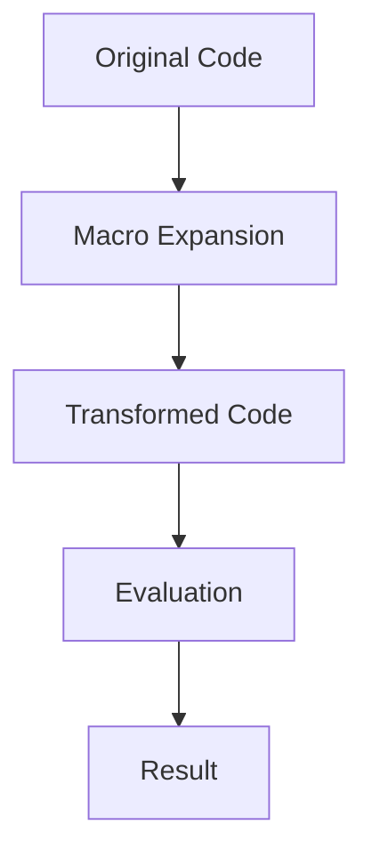

## D.4.1 Homoiconicity

### Introduction to Homoiconicity

**Homoiconicity** is a defining feature of Clojure and other Lisp-like languages, where the code is represented using the same data structures that the language manipulates. This means that Clojure code is essentially data, typically expressed in lists, vectors, and maps. This characteristic allows for powerful metaprogramming capabilities, enabling developers to write code that can manipulate other code as easily as it manipulates data.

For Java developers, this concept might seem foreign, as Java separates code (compiled into bytecode) from data structures. In Clojure, however, the boundary between code and data is blurred, providing a unique flexibility that can be leveraged to create dynamic and adaptable programs.

### Understanding Homoiconicity

In Clojure, every piece of code is a data structure. This is a fundamental aspect of the language's design, rooted in its Lisp heritage. Let's explore this concept with a simple example:

```clojure
;; A simple Clojure expression
(+ 1 2 3)
```

In Clojure, the above expression is a list where `+` is the first element, followed by the numbers `1`, `2`, and `3`. This list can be manipulated like any other data structure:

```clojure
;; Treating code as data
(def expr '(+ 1 2 3))

;; Evaluating the expression
(eval expr) ; => 6
```

Here, `expr` is a list that represents a Clojure expression. We can use the `eval` function to execute this list as code, demonstrating the seamless transition between code and data.

### Homoiconicity vs. Java's Code Representation

In Java, code is compiled into bytecode, which is not directly manipulable as a data structure. Java's reflection API allows some level of introspection and dynamic behavior, but it is not as seamless or integrated as Clojure's approach. Here's a comparison:

**Java Example:**

```java
// Java code to add numbers
int result = 1 + 2 + 3;
```

In Java, the above code is a statement that gets compiled and executed, but it cannot be treated as a data structure without additional tools or libraries.

**Clojure Example:**

```clojure
;; Clojure code as a list
(def expr '(+ 1 2 3))

;; Manipulating the code as data
(conj expr 4) ; => (+ 1 2 3 4)
```

In Clojure, we can easily manipulate the code itself, adding elements or transforming it before evaluation.

### The Power of Macros

Homoiconicity enables Clojure's powerful macro system, allowing developers to write code that generates code. Macros operate on the syntactic structure of the code, transforming it before it is evaluated. This capability is a cornerstone of metaprogramming in Clojure.

**Macro Example:**

Let's create a simple macro that logs the execution of an expression:

```clojure
(defmacro log-execution [expr]
  `(let [result# ~expr]
     (println "Executing:" '~expr "Result:" result#)
     result#))

;; Using the macro
(log-execution (+ 1 2 3))
```

In this example, the `log-execution` macro takes an expression, evaluates it, and prints the expression along with its result. The backtick (`) and tilde (`~`) are used for quoting and unquoting, allowing us to construct new code structures.

### Comparing Macros to Java's Reflection

Java's reflection API provides some dynamic capabilities, such as inspecting classes and invoking methods at runtime. However, it lacks the seamless integration of code and data that Clojure's macros provide.

**Java Reflection Example:**

```java
import java.lang.reflect.Method;

public class ReflectionExample {
    public static void main(String[] args) throws Exception {
        Method method = Math.class.getMethod("abs", int.class);
        int result = (int) method.invoke(null, -5);
        System.out.println("Result: " + result);
    }
}
```

In this Java example, we use reflection to invoke the `abs` method on the `Math` class. While powerful, reflection is more cumbersome and less intuitive than Clojure's macro system.

### Practical Applications of Homoiconicity

Homoiconicity allows for a range of practical applications, from creating domain-specific languages (DSLs) to implementing custom control structures. Let's explore some examples:

#### Creating a DSL

Clojure's homoiconicity makes it an excellent choice for building DSLs. Here's a simple DSL for defining workflows:

```clojure
(defmacro workflow [& steps]
  `(fn []
     (println "Starting workflow...")
     ~@(map (fn [step] `(println "Executing step:" '~step) ~step) steps)
     (println "Workflow complete.")))

;; Define a workflow
(def my-workflow
  (workflow
    (println "Step 1")
    (println "Step 2")
    (println "Step 3")))

;; Execute the workflow
(my-workflow)
```

In this example, the `workflow` macro creates a function that executes a series of steps, logging each step as it is executed.

#### Custom Control Structures

Macros can also be used to create custom control structures. Let's implement a simple `unless` macro:

```clojure
(defmacro unless [condition & body]
  `(if (not ~condition)
     (do ~@body)))

;; Using the unless macro
(unless false
  (println "This will print because the condition is false."))
```

The `unless` macro inverts the condition and executes the body if the condition is false, providing a more intuitive way to express certain logic.

### Try It Yourself

Experiment with the following exercises to deepen your understanding of homoiconicity and macros in Clojure:

1. **Modify the `log-execution` macro** to include a timestamp with each log entry.
2. **Create a macro** that repeats an expression a specified number of times.
3. **Implement a DSL** for defining mathematical expressions and evaluate them.

### Diagrams and Visualizations

To better understand the flow of data and code in Clojure, let's visualize a simple macro transformation process:



**Diagram Description:** This flowchart illustrates the process of macro transformation in Clojure. The original code is expanded by the macro, transformed into new code, evaluated, and finally produces a result.

### Further Reading

For more information on homoiconicity and macros in Clojure, consider exploring the following resources:

- [Official Clojure Documentation](https://clojure.org/reference/macros)
- [ClojureDocs](https://clojuredocs.org/)
- [Clojure Programming by Chas Emerick, Brian Carper, and Christophe Grand](https://www.oreilly.com/library/view/clojure-programming/9781449310387/)

### Exercises and Practice Problems

1. **Exercise 1:** Write a macro that takes a list of expressions and executes them in reverse order.
2. **Exercise 2:** Create a DSL for defining and executing simple state machines.
3. **Exercise 3:** Implement a macro that times the execution of an expression and prints the duration.

### Key Takeaways

- **Homoiconicity** allows Clojure code to be represented as data structures, enabling powerful metaprogramming capabilities.
- **Macros** leverage homoiconicity to transform code before evaluation, providing flexibility and expressiveness.
- **Clojure's approach** to code as data contrasts with Java's compiled code model, offering unique advantages for dynamic programming.

By understanding and utilizing homoiconicity, you can unlock the full potential of Clojure's metaprogramming capabilities, creating more dynamic and adaptable applications.

## Quiz: Test Your Understanding of Homoiconicity in Clojure



### What is homoiconicity in Clojure?

- [x] Code is represented as data structures.
- [ ] Code is compiled into bytecode.
- [ ] Code is interpreted at runtime.
- [ ] Code is stored in a database.

> **Explanation:** Homoiconicity means that Clojure code is represented using the same data structures that it manipulates, such as lists and vectors.

### How does homoiconicity benefit Clojure developers?

- [x] Enables powerful metaprogramming capabilities.
- [ ] Simplifies memory management.
- [ ] Increases execution speed.
- [ ] Reduces code size.

> **Explanation:** Homoiconicity allows for metaprogramming, where code can manipulate other code as data, providing flexibility and expressiveness.

### Which Clojure feature is directly enabled by homoiconicity?

- [x] Macros
- [ ] Functions
- [ ] Atoms
- [ ] Namespaces

> **Explanation:** Macros in Clojure leverage homoiconicity to transform code before evaluation, allowing for dynamic code generation.

### What is the primary difference between Clojure's homoiconicity and Java's code representation?

- [x] Clojure code is data, while Java code is compiled.
- [ ] Clojure code is faster than Java code.
- [ ] Java code is more readable than Clojure code.
- [ ] Java code is interpreted, while Clojure code is compiled.

> **Explanation:** Clojure's homoiconicity allows code to be treated as data, unlike Java's compiled code model.

### How can macros be used in Clojure?

- [x] To generate and transform code.
- [ ] To manage memory allocation.
- [x] To create custom control structures.
- [ ] To handle exceptions.

> **Explanation:** Macros are used to generate and transform code, enabling custom control structures and dynamic behavior.

### What is a common use case for macros in Clojure?

- [x] Creating domain-specific languages (DSLs).
- [ ] Managing database connections.
- [ ] Optimizing network communication.
- [ ] Handling user input.

> **Explanation:** Macros are often used to create DSLs, allowing developers to define custom syntax and behavior.

### How does Clojure's macro system compare to Java's reflection API?

- [x] Macros are more integrated and seamless.
- [ ] Reflection is faster and more efficient.
- [x] Macros allow code generation.
- [ ] Reflection provides better error handling.

> **Explanation:** Clojure's macros offer a more integrated and seamless way to generate and transform code compared to Java's reflection API.

### What is the role of the `eval` function in Clojure?

- [x] Executes code represented as data.
- [ ] Compiles code into bytecode.
- [ ] Parses code into an abstract syntax tree.
- [ ] Optimizes code for performance.

> **Explanation:** The `eval` function in Clojure executes code that is represented as data, leveraging homoiconicity.

### How can homoiconicity be visualized in Clojure?

- [x] Code is represented as lists and vectors.
- [ ] Code is stored in binary format.
- [ ] Code is encrypted for security.
- [ ] Code is compiled into machine code.

> **Explanation:** Homoiconicity in Clojure means that code is represented as lists and vectors, which can be manipulated as data.

### True or False: Homoiconicity is unique to Clojure and not found in other languages.

- [ ] True
- [x] False

> **Explanation:** Homoiconicity is a feature of Lisp-like languages, including Clojure, but it is not unique to Clojure alone.


