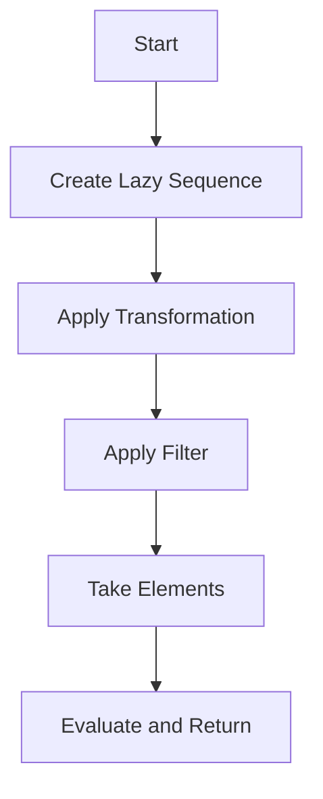

## Lazy Evaluation in Clojure: A Deep Dive for Java Developers

Lazy evaluation is a powerful concept in functional programming that allows for the deferred computation of expressions until their results are actually needed. This strategy can lead to significant performance improvements and enables the handling of infinite data structures. In this section, we will explore how Clojure employs lazy evaluation, compare it with Java's evaluation strategy, and illustrate its benefits through practical examples.

### Understanding Lazy Evaluation

Lazy evaluation, also known as call-by-need, is a strategy where expressions are not evaluated until their values are required. This contrasts with eager evaluation, where expressions are evaluated as soon as they are bound to a variable. Lazy evaluation can lead to performance gains by avoiding unnecessary calculations and can handle potentially infinite data structures by computing elements on demand.

#### Key Concepts of Lazy Evaluation

- **Deferred Computation**: Expressions are not computed until their results are needed.
- **Efficiency**: Reduces unnecessary calculations, leading to potential performance improvements.
- **Infinite Data Structures**: Allows for the creation and manipulation of infinite sequences without running out of memory.

### Lazy Evaluation in Clojure

Clojure, being a functional language, embraces lazy evaluation, particularly in its sequence abstractions. The `lazy-seq` function and other lazy sequence operations allow developers to work with potentially infinite data structures efficiently.

#### Clojure's Lazy Sequences

Clojure sequences are a powerful abstraction that supports lazy evaluation. Functions like `map`, `filter`, and `take` return lazy sequences, which means they do not compute their results immediately.

```clojure
;; Example of a lazy sequence in Clojure
(defn lazy-numbers []
  (lazy-seq (cons 1 (lazy-numbers))))

;; Take the first 5 numbers from the lazy sequence
(take 5 (lazy-numbers))
;; => (1 1 1 1 1)
```

In this example, `lazy-numbers` is an infinite sequence of the number 1. The `take` function retrieves only the first 5 elements, demonstrating how lazy evaluation allows us to work with infinite sequences without computing them entirely.

#### Benefits of Lazy Evaluation in Clojure

1. **Performance Optimization**: By deferring computation, Clojure can avoid unnecessary calculations, leading to more efficient code execution.
2. **Memory Efficiency**: Lazy sequences allow for the representation of large or infinite data structures without consuming excessive memory.
3. **Composability**: Lazy sequences can be composed with other sequence operations, enabling complex data transformations with minimal overhead.

### Comparing Lazy Evaluation in Clojure and Java

Java, traditionally an eagerly evaluated language, does not natively support lazy evaluation in the same way Clojure does. However, with the introduction of Java 8, features like Streams provide some lazy evaluation capabilities.

#### Java Streams vs. Clojure Sequences

Java Streams offer a form of lazy evaluation where operations are not executed until a terminal operation is invoked.

```java
// Java Stream example
Stream<Integer> infiniteStream = Stream.iterate(1, n -> n + 1);
List<Integer> firstFive = infiniteStream.limit(5).collect(Collectors.toList());
// => [1, 2, 3, 4, 5]
```

In this Java example, the `iterate` method creates an infinite stream of integers, similar to Clojure's lazy sequences. The `limit` method is a terminal operation that triggers the evaluation of the stream, akin to Clojure's `take`.

#### Key Differences

- **Syntax and Semantics**: Clojure's syntax for lazy sequences is more concise and idiomatic for functional programming.
- **Integration with Functional Constructs**: Clojure's lazy sequences integrate seamlessly with its functional programming paradigm, whereas Java Streams are an add-on to an otherwise imperative language.
- **Flexibility and Power**: Clojure's lazy sequences offer more flexibility in terms of composition and transformation.

### Practical Examples of Lazy Evaluation in Clojure

Let's explore some practical examples to illustrate the power and utility of lazy evaluation in Clojure.

#### Example 1: Generating Fibonacci Numbers

The Fibonacci sequence is a classic example where lazy evaluation shines. We can generate an infinite sequence of Fibonacci numbers using Clojure's lazy evaluation.

```clojure
(defn fib-seq
  ([] (fib-seq 0 1))
  ([a b] (lazy-seq (cons a (fib-seq b (+ a b))))))

;; Take the first 10 Fibonacci numbers
(take 10 (fib-seq))
;; => (0 1 1 2 3 5 8 13 21 34)
```

In this example, `fib-seq` generates an infinite sequence of Fibonacci numbers. The use of `lazy-seq` ensures that numbers are only computed as needed.

#### Example 2: Filtering Large Data Sets

Lazy evaluation is particularly useful when working with large data sets, as it allows for efficient filtering and transformation.

```clojure
(defn even-numbers [coll]
  (filter even? coll))

;; Create a large range and filter even numbers
(take 5 (even-numbers (range 1000000)))
;; => (0 2 4 6 8)
```

Here, `even-numbers` filters a large range of numbers to find even ones. The `filter` function returns a lazy sequence, ensuring that only the necessary elements are processed.

### Try It Yourself

To deepen your understanding of lazy evaluation in Clojure, try modifying the examples above:

- **Modify the Fibonacci sequence** to start from different initial values.
- **Experiment with filtering** different criteria on large data sets.
- **Create your own infinite sequence** using `lazy-seq` and explore its behavior.

### Visualizing Lazy Evaluation

To better understand how lazy evaluation works in Clojure, let's visualize the flow of data through a lazy sequence operation.



**Diagram Description**: This flowchart illustrates the process of creating a lazy sequence, applying transformations and filters, and finally evaluating the sequence to return the desired elements.

### Further Reading

For more information on lazy evaluation and Clojure sequences, consider exploring the following resources:

- [Official Clojure Documentation on Sequences](https://clojure.org/reference/sequences)
- [ClojureDocs: Lazy Sequences](https://clojuredocs.org/clojure.core/lazy-seq)
- [Java Streams Documentation](https://docs.oracle.com/javase/8/docs/api/java/util/stream/package-summary.html)

### Exercises

To reinforce your understanding of lazy evaluation in Clojure, try the following exercises:

1. **Create a Lazy Sequence**: Write a function that generates an infinite sequence of prime numbers using lazy evaluation.
2. **Transform and Filter**: Use lazy sequences to transform a large data set and filter out specific elements.
3. **Performance Comparison**: Compare the performance of lazy evaluation in Clojure with eager evaluation in Java for a large data processing task.

### Key Takeaways

- **Lazy evaluation** allows for deferred computation, optimizing performance and memory usage.
- **Clojure's lazy sequences** enable efficient handling of infinite data structures and large data sets.
- **Java Streams** provide similar capabilities but are less integrated with the functional paradigm.
- **Practical applications** of lazy evaluation include generating infinite sequences and filtering large data sets.

By understanding and leveraging lazy evaluation in Clojure, you can write more efficient and expressive code, particularly when dealing with large or infinite data structures.

## Quiz: Mastering Lazy Evaluation in Clojure



### What is lazy evaluation?

- [x] A strategy where expressions are not evaluated until their values are needed
- [ ] A strategy where expressions are evaluated immediately
- [ ] A strategy where expressions are evaluated in parallel
- [ ] A strategy where expressions are evaluated in reverse order

> **Explanation:** Lazy evaluation defers computation until the result is needed, optimizing performance and memory usage.

### How does Clojure implement lazy evaluation?

- [x] Through lazy sequences
- [ ] Through eager sequences
- [ ] Through parallel processing
- [ ] Through immediate computation

> **Explanation:** Clojure uses lazy sequences to implement lazy evaluation, allowing deferred computation.

### Which function in Clojure creates a lazy sequence?

- [x] `lazy-seq`
- [ ] `eager-seq`
- [ ] `parallel-seq`
- [ ] `immediate-seq`

> **Explanation:** The `lazy-seq` function in Clojure is used to create lazy sequences.

### What is a benefit of lazy evaluation?

- [x] It allows handling of infinite data structures
- [ ] It requires more memory
- [ ] It increases computation time
- [ ] It simplifies code syntax

> **Explanation:** Lazy evaluation allows for the efficient handling of infinite data structures by computing elements on demand.

### How do Java Streams relate to Clojure's lazy sequences?

- [x] Both provide a form of lazy evaluation
- [ ] Both are eagerly evaluated
- [ ] Both are used for parallel processing
- [ ] Both are used for immediate computation

> **Explanation:** Java Streams and Clojure's lazy sequences both provide lazy evaluation capabilities.

### Which Clojure function is used to retrieve elements from a lazy sequence?

- [x] `take`
- [ ] `collect`
- [ ] `retrieve`
- [ ] `fetch`

> **Explanation:** The `take` function is used to retrieve a specified number of elements from a lazy sequence in Clojure.

### What is a key difference between Java Streams and Clojure's lazy sequences?

- [x] Clojure's lazy sequences integrate seamlessly with functional programming
- [ ] Java Streams are more concise
- [ ] Java Streams are more powerful
- [ ] Clojure's lazy sequences are less flexible

> **Explanation:** Clojure's lazy sequences are more integrated with functional programming, offering greater flexibility and composability.

### What does the `filter` function return in Clojure?

- [x] A lazy sequence
- [ ] An eager sequence
- [ ] A parallel sequence
- [ ] An immediate sequence

> **Explanation:** The `filter` function in Clojure returns a lazy sequence, allowing deferred computation.

### How can you visualize the flow of data in a lazy sequence operation?

- [x] Using a flowchart
- [ ] Using a pie chart
- [ ] Using a bar graph
- [ ] Using a scatter plot

> **Explanation:** A flowchart can effectively visualize the process of creating and evaluating a lazy sequence.

### True or False: Lazy evaluation can lead to performance improvements by avoiding unnecessary calculations.

- [x] True
- [ ] False

> **Explanation:** Lazy evaluation defers computation, which can lead to performance improvements by avoiding unnecessary calculations.


