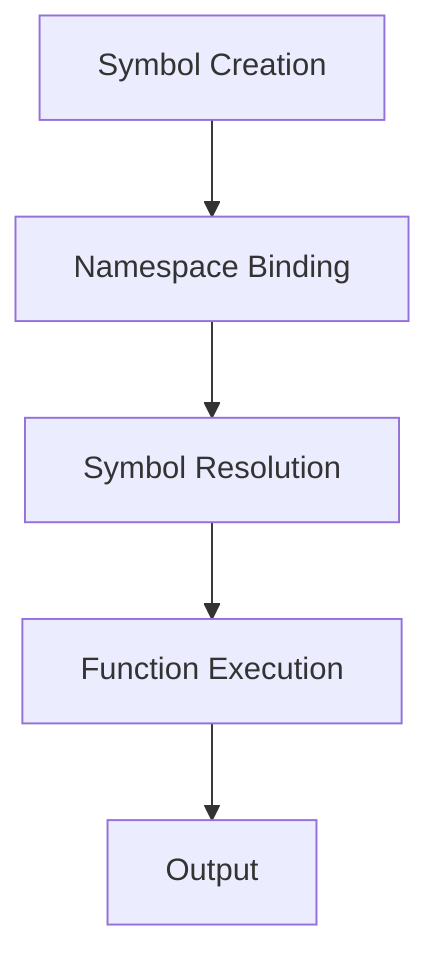

## 3.1.1 Understanding Symbols

As experienced Java developers, you're familiar with identifiers—names that refer to variables, methods, classes, and more. In Clojure, **symbols** serve a similar purpose but with unique characteristics that align with the language's functional paradigm. In this section, we'll delve into the concept of symbols in Clojure, how they differ from Java identifiers, and how they are used in naming variables, functions, and more.

### What Are Symbols in Clojure?

In Clojure, a **symbol** is a fundamental data type used to name things. Symbols are identifiers that refer to bindings in namespaces. They are not just names but are also used to refer to variables, functions, and other entities within a program. Symbols are immutable, meaning once created, they cannot be changed.

#### Characteristics of Symbols

- **Immutable**: Once a symbol is created, it cannot be altered.
- **Namespace-aware**: Symbols can be associated with namespaces, allowing for organized code and avoiding name clashes.
- **First-class citizens**: Symbols can be passed around as data, stored in collections, and manipulated like any other data type.

### Creating and Using Symbols

Symbols in Clojure are typically created using the `def` keyword, which binds a symbol to a value or function. Here's a simple example:

```clojure
(def my-symbol "Hello, Clojure!")
```

In this example, `my-symbol` is a symbol bound to the string `"Hello, Clojure!"`. You can use this symbol to refer to the value throughout your code.

#### Example: Defining a Function with Symbols

Let's define a simple function using symbols:

```clojure
(defn greet [name]
  (str "Hello, " name "!"))

(greet "Java Developer") ; => "Hello, Java Developer!"
```

Here, `greet` is a symbol representing a function that takes a `name` and returns a greeting string. The symbol `name` is a parameter within the function.

### Symbols vs. Java Identifiers

While symbols in Clojure and identifiers in Java serve similar roles, there are key differences:

- **Immutability**: Symbols in Clojure are immutable, whereas Java identifiers can be reassigned.
- **Namespace**: Clojure symbols are namespace-aware, allowing for more organized code.
- **First-class status**: Symbols can be manipulated as data in Clojure, unlike Java identifiers.

#### Java Example

In Java, you might define a variable like this:

```java
String myVariable = "Hello, Java!";
```

In this case, `myVariable` is an identifier that can be reassigned to another value. In contrast, a Clojure symbol, once bound, cannot be reassigned.

### Namespaces and Symbols

Namespaces in Clojure provide a way to organize symbols and avoid naming conflicts. A namespace is a collection of symbols, and each symbol is associated with a specific namespace. You can create and use namespaces like this:

```clojure
(ns my-namespace)

(def my-symbol "Hello from my-namespace!")
```

In this example, `my-symbol` is part of the `my-namespace` namespace. You can refer to it from another namespace using the fully qualified name:

```clojure
(my-namespace/my-symbol)
```

### Comparing with Java Packages

Namespaces in Clojure are similar to packages in Java. They both serve to organize code and prevent naming conflicts. However, Clojure's namespaces are more dynamic and can be manipulated at runtime.

### Working with Symbols

Symbols can be created dynamically using the `symbol` function. This is useful when you need to generate symbols programmatically:

```clojure
(def dynamic-symbol (symbol "dynamic-name"))

(println dynamic-symbol) ; => dynamic-name
```

### Symbol Resolution

Symbol resolution in Clojure is the process of finding the value or function associated with a symbol. This is done at runtime, allowing for dynamic behavior.

#### Example: Dynamic Resolution

```clojure
(defn dynamic-greet [name-symbol]
  (let [name (resolve name-symbol)]
    (str "Hello, " name "!")))

(def my-name "Clojure Developer")

(dynamic-greet 'my-name) ; => "Hello, Clojure Developer!"
```

In this example, `resolve` is used to find the value associated with the symbol `my-name`.

### Symbols in Collections

Symbols can be stored in collections like lists, vectors, maps, and sets. This allows for flexible data manipulation:

```clojure
(def symbol-list ['a 'b 'c])

(map str symbol-list) ; => ("a" "b" "c")
```

### Try It Yourself

Experiment with symbols by creating your own functions and variables. Try using symbols in different namespaces and observe how they interact. Modify the examples above to see how symbols behave in various contexts.

### Diagrams and Visualizations

To better understand how symbols work in Clojure, let's visualize the flow of data and symbol resolution using a diagram.



**Diagram Explanation**: This flowchart illustrates the process of creating a symbol, binding it to a namespace, resolving it at runtime, executing a function, and producing an output.

### Further Reading

For more information on symbols and namespaces in Clojure, check out the following resources:

- [Official Clojure Documentation on Symbols](https://clojure.org/reference/symbols)
- [ClojureDocs: Symbols](https://clojuredocs.org/clojure.core/symbol)
- [Clojure Programming by Chas Emerick, Brian Carper, and Christophe Grand](https://www.oreilly.com/library/view/clojure-programming/9781449310387/)

### Exercises

1. **Create a Symbol**: Define a symbol in a new namespace and bind it to a value. Print the value using the fully qualified name.
2. **Dynamic Symbol Creation**: Write a function that takes a string and returns a dynamically created symbol.
3. **Symbol Resolution**: Implement a function that resolves a symbol to its value and prints it.

### Key Takeaways

- **Symbols** in Clojure are immutable identifiers used to name variables, functions, and more.
- They are **namespace-aware**, allowing for organized code and avoiding name clashes.
- Symbols can be manipulated as **first-class citizens**, unlike Java identifiers.
- Understanding symbols is crucial for mastering Clojure's functional programming paradigm.

Now that we've explored symbols in Clojure, let's continue our journey by diving into keywords and their role in Clojure programming.

## Quiz: Mastering Symbols in Clojure



### What is a symbol in Clojure?

- [x] An immutable identifier used to name variables and functions.
- [ ] A mutable identifier similar to Java variables.
- [ ] A type of collection in Clojure.
- [ ] A special form for conditional logic.

> **Explanation:** A symbol in Clojure is an immutable identifier used to name variables, functions, and more.

### How do symbols differ from Java identifiers?

- [x] Symbols are immutable and namespace-aware.
- [ ] Symbols can be reassigned like Java identifiers.
- [ ] Symbols are mutable and not namespace-aware.
- [ ] Symbols are used only for collections.

> **Explanation:** Symbols in Clojure are immutable and namespace-aware, unlike Java identifiers which can be reassigned.

### What function is used to create a symbol dynamically?

- [x] `symbol`
- [ ] `def`
- [ ] `let`
- [ ] `fn`

> **Explanation:** The `symbol` function is used to create symbols dynamically in Clojure.

### How can you refer to a symbol in another namespace?

- [x] Using the fully qualified name.
- [ ] Using the `import` keyword.
- [ ] Using the `include` keyword.
- [ ] Using the `require` keyword.

> **Explanation:** You can refer to a symbol in another namespace using its fully qualified name.

### What is the purpose of the `resolve` function?

- [x] To find the value or function associated with a symbol.
- [ ] To create a new symbol.
- [ ] To bind a symbol to a value.
- [ ] To remove a symbol from a namespace.

> **Explanation:** The `resolve` function is used to find the value or function associated with a symbol.

### Can symbols be stored in collections?

- [x] Yes
- [ ] No

> **Explanation:** Symbols can be stored in collections like lists, vectors, maps, and sets.

### What is a namespace in Clojure?

- [x] A collection of symbols used to organize code.
- [ ] A type of collection in Clojure.
- [ ] A special form for conditional logic.
- [ ] A mutable identifier similar to Java variables.

> **Explanation:** A namespace in Clojure is a collection of symbols used to organize code and avoid naming conflicts.

### How are symbols resolved in Clojure?

- [x] At runtime
- [ ] At compile time
- [ ] During garbage collection
- [ ] During initialization

> **Explanation:** Symbols in Clojure are resolved at runtime, allowing for dynamic behavior.

### What keyword is used to define a symbol in Clojure?

- [x] `def`
- [ ] `let`
- [ ] `fn`
- [ ] `import`

> **Explanation:** The `def` keyword is used to define a symbol in Clojure.

### Symbols in Clojure are mutable.

- [ ] True
- [x] False

> **Explanation:** Symbols in Clojure are immutable, meaning once created, they cannot be changed.


