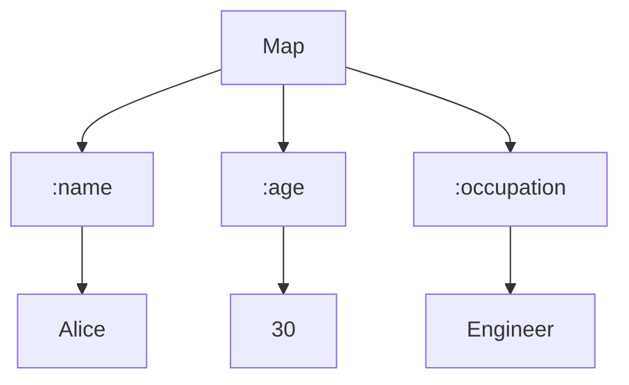

## 3.1.2 Working with Keywords

In Clojure, **keywords** are a fundamental concept that plays a crucial role in data manipulation and code readability. They are often used as keys in maps, for enumeration, and as identifiers in various contexts. Unlike Java, where constants are typically defined using `static final` variables, Clojure provides a more concise and flexible way to handle constant values through keywords. In this section, we'll explore what keywords are, how to create and use them, and how they compare to similar constructs in Java.

### What are Keywords?

Keywords in Clojure are symbolic identifiers that evaluate to themselves. They are immutable, unique, and typically used as keys in maps or to represent fixed values in your code. A keyword is prefixed with a colon (`:`), such as `:name`, `:age`, or `:status`.

#### Characteristics of Keywords

- **Self-evaluating**: Keywords evaluate to themselves, making them constant and reliable.
- **Immutable**: Once created, a keyword cannot be changed, ensuring consistency across your codebase.
- **Efficient**: Keywords are optimized for use as keys in maps, providing fast lookup times.
- **Readable**: They enhance code readability by clearly indicating their role as identifiers or constants.

### Creating Keywords

Creating a keyword in Clojure is straightforward. You simply prefix a name with a colon. Here's how you can create and use keywords:

```clojure
(def my-keyword :example)
;; my-keyword evaluates to :example
```

In this example, `:example` is a keyword that evaluates to itself. You can use it directly in your code without any additional syntax.

### Using Keywords in Data Structures

Keywords are commonly used as keys in maps, which are a fundamental data structure in Clojure. Maps associate keys with values, and keywords provide an efficient and readable way to define these keys.

#### Example: Using Keywords in a Map

```clojure
(def person {:name "Alice" :age 30 :occupation "Engineer"})

;; Accessing values using keywords
(:name person) ;; => "Alice"
(:age person)  ;; => 30
```

In this example, `:name`, `:age`, and `:occupation` are keywords used as keys in the `person` map. You can access the values associated with these keys by simply using the keyword.

### Keywords vs. Java Constants

In Java, constants are typically defined using `static final` variables. While this approach works well, it can be verbose and less flexible compared to Clojure's keywords.

#### Java Example: Defining Constants

```java
public class Constants {
    public static final String NAME = "name";
    public static final String AGE = "age";
    public static final String OCCUPATION = "occupation";
}
```

In Clojure, you achieve the same functionality with much less code:

```clojure
(def person {:name "Alice" :age 30 :occupation "Engineer"})
```

Here, keywords serve as both the declaration and usage of constants, streamlining your code and enhancing readability.

### Advanced Keyword Usage

Keywords in Clojure offer more than just simple key-value associations. They can be used in various advanced scenarios to enhance your code's functionality and maintainability.

#### Keyword Namespaces

Keywords can be namespaced, allowing you to avoid naming conflicts and organize your code more effectively. A namespaced keyword includes a namespace and a name, separated by a slash (`/`).

```clojure
(def user {:user/name "Alice" :user/age 30})
```

In this example, `:user/name` and `:user/age` are namespaced keywords, providing context and avoiding potential conflicts with other keywords.

#### Using Keywords for Enumeration

Keywords can also be used for enumeration, representing a fixed set of values. This is similar to using enums in Java but with more flexibility and less boilerplate.

```clojure
(def status :active)

(case status
  :active "User is active"
  :inactive "User is inactive"
  :banned "User is banned")
```

In this example, `:active`, `:inactive`, and `:banned` are keywords representing different statuses. The `case` expression uses these keywords to determine the appropriate response.

### Diagrams and Visualizations

To better understand how keywords function within Clojure's data structures, let's visualize a simple map using a Mermaid.js diagram.



**Diagram Description**: This diagram illustrates a Clojure map with keywords `:name`, `:age`, and `:occupation` as keys, each pointing to their respective values.

### Try It Yourself

To deepen your understanding of keywords, try modifying the following code examples:

1. Create a map with additional keywords and values.
2. Use namespaced keywords to organize your data.
3. Implement a simple enumeration using keywords and the `case` expression.

### Exercises and Practice Problems

1. **Exercise 1**: Define a map representing a book with keywords for title, author, and year. Access each value using the appropriate keyword.
2. **Exercise 2**: Create a namespaced keyword for a product category and use it in a map representing a product.
3. **Exercise 3**: Implement a function that takes a keyword and a map, returning the value associated with the keyword or a default value if the keyword is not present.

### Key Takeaways

- **Keywords** in Clojure are immutable, self-evaluating identifiers used primarily as map keys and for enumeration.
- They enhance **code readability** and efficiency by providing a concise way to define constants.
- Keywords can be **namespaced** to avoid conflicts and organize code.
- Compared to Java constants, keywords offer a more streamlined and flexible approach to defining fixed values.

By understanding and utilizing keywords effectively, you can write more readable, maintainable, and efficient Clojure code. Now that we've explored how keywords work in Clojure, let's apply these concepts to enhance your data structures and code organization.

### Further Reading

For more information on keywords and their usage in Clojure, consider exploring the following resources:

- [Official Clojure Documentation on Keywords](https://clojure.org/reference/data_structures#Keywords)
- [ClojureDocs: Keywords](https://clojuredocs.org/)

---

## Quiz: Mastering Keywords in Clojure



### What is a keyword in Clojure?

- [x] A symbolic identifier that evaluates to itself
- [ ] A mutable variable
- [ ] A function
- [ ] A data type

> **Explanation:** Keywords in Clojure are symbolic identifiers that evaluate to themselves, making them constant and immutable.

### How do you create a keyword in Clojure?

- [x] Prefix a name with a colon, e.g., `:example`
- [ ] Use the `def` keyword
- [ ] Enclose the name in quotes
- [ ] Use the `let` keyword

> **Explanation:** Keywords are created by prefixing a name with a colon, such as `:example`.

### What is a common use of keywords in Clojure?

- [x] As keys in maps
- [ ] As loop counters
- [ ] As function arguments
- [ ] As class names

> **Explanation:** Keywords are commonly used as keys in maps due to their immutability and efficiency.

### How do keywords enhance code readability?

- [x] By clearly indicating their role as identifiers or constants
- [ ] By allowing dynamic typing
- [ ] By enabling polymorphism
- [ ] By supporting inheritance

> **Explanation:** Keywords enhance code readability by clearly indicating their role as identifiers or constants.

### How do keywords compare to Java constants?

- [x] Keywords are more concise and flexible
- [ ] Keywords are mutable
- [ ] Keywords require more boilerplate code
- [ ] Keywords are less efficient

> **Explanation:** Keywords are more concise and flexible compared to Java constants, which require more boilerplate code.

### What is a namespaced keyword?

- [x] A keyword with a namespace, separated by a slash
- [ ] A keyword with a prefix
- [ ] A keyword with a suffix
- [ ] A keyword with a number

> **Explanation:** A namespaced keyword includes a namespace and a name, separated by a slash, such as `:user/name`.

### How can keywords be used for enumeration?

- [x] By representing a fixed set of values
- [ ] By defining classes
- [ ] By creating loops
- [ ] By managing memory

> **Explanation:** Keywords can represent a fixed set of values, similar to enums in Java, for enumeration purposes.

### What is the benefit of using keywords as map keys?

- [x] Fast lookup times
- [ ] Increased memory usage
- [ ] Slower performance
- [ ] Dynamic typing

> **Explanation:** Keywords provide fast lookup times when used as map keys due to their immutability and optimization.

### Can keywords be changed once created?

- [x] No, they are immutable
- [ ] Yes, they can be reassigned
- [ ] Yes, they can be modified
- [ ] No, they are mutable

> **Explanation:** Keywords are immutable and cannot be changed once created.

### Keywords are self-evaluating in Clojure.

- [x] True
- [ ] False

> **Explanation:** Keywords are self-evaluating, meaning they evaluate to themselves, making them constant and reliable.


