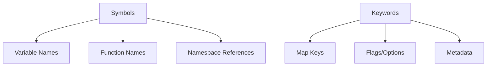

## 3.1.3 Differences and Use Cases

As experienced Java developers transitioning to Clojure, understanding the differences between **symbols** and **keywords** is crucial. These two constructs play distinct roles in Clojure's syntax and semantics, and knowing when to use each can significantly enhance your functional programming skills.

### Understanding Symbols in Clojure

**Symbols** in Clojure are identifiers that refer to variables or functions. They are akin to variable names in Java but come with additional flexibility and power. Symbols are used to represent:

- **Variable names**: Just like in Java, symbols can be used to name variables.
- **Function names**: Symbols can also represent functions, allowing you to call them dynamically.
- **Namespace references**: Symbols can include namespace information, making them more versatile.

**Example of Symbols in Clojure:**

```clojure
(def my-var 42) ; Define a variable named 'my-var'
(defn my-func [x] (* x x)) ; Define a function named 'my-func'

; Using symbols to refer to the variable and function
(println my-var) ; Output: 42
(println (my-func 5)) ; Output: 25
```

**Comparison with Java:**

In Java, variable and method names are identifiers, similar to symbols in Clojure. However, Java lacks the dynamic nature of symbols, which can be resolved at runtime in Clojure.

### Understanding Keywords in Clojure

**Keywords** in Clojure are constant, self-evaluating identifiers that are primarily used as keys in maps. They are prefixed with a colon (`:`) and are immutable. Keywords are used for:

- **Map keys**: Keywords are often used as keys in associative data structures.
- **Flags or options**: They can serve as flags or options in function arguments.
- **Metadata**: Keywords can be used to annotate data with metadata.

**Example of Keywords in Clojure:**

```clojure
(def person {:name "Alice" :age 30}) ; Define a map with keywords as keys

; Accessing values using keywords
(println (:name person)) ; Output: Alice
(println (:age person)) ; Output: 30
```

**Comparison with Java:**

In Java, map keys are typically strings or custom objects. Keywords in Clojure offer a more concise and efficient way to define constant keys, avoiding the overhead of string comparison.

### Differences Between Symbols and Keywords

Understanding the differences between symbols and keywords is essential for writing idiomatic Clojure code. Here are the key distinctions:

- **Evaluation**: Symbols are evaluated to their bound values, while keywords evaluate to themselves.
- **Usage**: Symbols are used for naming variables and functions, whereas keywords are used as map keys and flags.
- **Mutability**: Symbols can be rebound to different values, but keywords are immutable.

**Example Highlighting Differences:**

```clojure
(def my-symbol 'my-var) ; A symbol referring to 'my-var'
(def my-keyword :my-key) ; A keyword

; Evaluating the symbol
(println (eval my-symbol)) ; Output: 42 (assuming 'my-var' is bound to 42)

; Evaluating the keyword
(println my-keyword) ; Output: :my-key
```

### Use Cases for Symbols and Keywords

#### Symbols

1. **Dynamic Function Calls**: Symbols can be used to dynamically call functions, enabling more flexible code.

   ```clojure
   (defn dynamic-call [func-symbol arg]
     ((resolve func-symbol) arg))

   (println (dynamic-call 'my-func 10)) ; Output: 100
   ```

2. **Namespace Management**: Symbols can include namespace information, allowing for organized code.

   ```clojure
   (ns my-namespace)
   (def my-var 100)

   (println my-namespace/my-var) ; Output: 100
   ```

#### Keywords

1. **Data Structures**: Keywords are ideal for defining keys in maps, providing a clear and concise syntax.

   ```clojure
   (def book {:title "Clojure for Java Developers" :author "John Doe"})

   (println (:title book)) ; Output: Clojure for Java Developers
   ```

2. **Function Options**: Keywords can be used to pass options to functions, enhancing readability.

   ```clojure
   (defn greet [name & {:keys [greeting]}]
     (println (str (or greeting "Hello") ", " name)))

   (greet "Alice" :greeting "Hi") ; Output: Hi, Alice
   ```

### Diagrams and Visual Aids

To further illustrate the differences and use cases of symbols and keywords, let's use a diagram to visualize their roles in Clojure.



**Diagram Explanation**: This diagram shows how symbols and keywords are used in Clojure. Symbols are versatile, serving as variable names, function names, and namespace references. Keywords, on the other hand, are primarily used as map keys, flags, and metadata.

### Practical Exercises

To solidify your understanding of symbols and keywords, try the following exercises:

1. **Exercise 1**: Create a map representing a book with keywords as keys. Access the values using the keywords.

2. **Exercise 2**: Define a function that takes a symbol and a number, and dynamically calls a function with the symbol name.

3. **Exercise 3**: Use symbols to manage namespaces in a small Clojure project. Experiment with different namespace structures.

### Key Takeaways

- **Symbols** are dynamic identifiers used for variables, functions, and namespaces.
- **Keywords** are immutable, self-evaluating identifiers used primarily as map keys.
- Understanding when to use symbols versus keywords is crucial for writing idiomatic Clojure code.
- Symbols offer flexibility for dynamic function calls and namespace management, while keywords provide clarity and efficiency for data structures and function options.

Now that we've explored the differences and use cases of symbols and keywords in Clojure, let's apply these concepts to enhance your functional programming skills and write more idiomatic Clojure code.

## Quiz: Mastering Symbols and Keywords in Clojure



### What is the primary use of symbols in Clojure?

- [x] Naming variables and functions
- [ ] Defining map keys
- [ ] Representing constant values
- [ ] Annotating data with metadata

> **Explanation:** Symbols in Clojure are primarily used for naming variables and functions, similar to identifiers in Java.

### How do keywords in Clojure differ from symbols?

- [x] Keywords are immutable and self-evaluating
- [ ] Keywords can be rebound to different values
- [ ] Keywords are used for dynamic function calls
- [ ] Keywords are used for namespace management

> **Explanation:** Keywords in Clojure are immutable and self-evaluating, making them ideal for use as map keys and flags.

### Which of the following is a valid use case for keywords in Clojure?

- [x] Defining keys in a map
- [ ] Naming a function
- [ ] Managing namespaces
- [ ] Dynamic function calls

> **Explanation:** Keywords are commonly used to define keys in maps due to their immutability and self-evaluating nature.

### What is the output of the following Clojure code?
```clojure
(def my-symbol 'my-var)
(def my-keyword :my-key)
(println my-keyword)
```

- [x] :my-key
- [ ] my-var
- [ ] my-key
- [ ] :my-var

> **Explanation:** The code prints the keyword `:my-key`, as keywords evaluate to themselves.

### In what scenario would you use a symbol over a keyword?

- [x] When dynamically calling a function
- [ ] When defining a constant value
- [ ] When creating a map key
- [ ] When annotating data with metadata

> **Explanation:** Symbols are used for dynamic function calls, as they can be resolved to function names at runtime.

### Which of the following statements is true about symbols in Clojure?

- [x] Symbols can include namespace information
- [ ] Symbols are immutable
- [ ] Symbols evaluate to themselves
- [ ] Symbols are used as map keys

> **Explanation:** Symbols can include namespace information, allowing for organized code and dynamic resolution.

### What is the result of evaluating a keyword in Clojure?

- [x] The keyword itself
- [ ] The value it is bound to
- [ ] An error
- [ ] A string representation

> **Explanation:** Keywords evaluate to themselves, making them useful for constant identifiers.

### Which of the following is NOT a use case for keywords in Clojure?

- [x] Dynamic function calls
- [ ] Map keys
- [ ] Flags or options
- [ ] Metadata

> **Explanation:** Keywords are not used for dynamic function calls; symbols serve that purpose.

### How can symbols enhance namespace management in Clojure?

- [x] By including namespace information
- [ ] By being immutable
- [ ] By evaluating to themselves
- [ ] By serving as map keys

> **Explanation:** Symbols can include namespace information, which aids in organizing and managing code.

### True or False: Keywords in Clojure can be used to dynamically call functions.

- [ ] True
- [x] False

> **Explanation:** Keywords are not used for dynamic function calls; symbols are used for this purpose.


