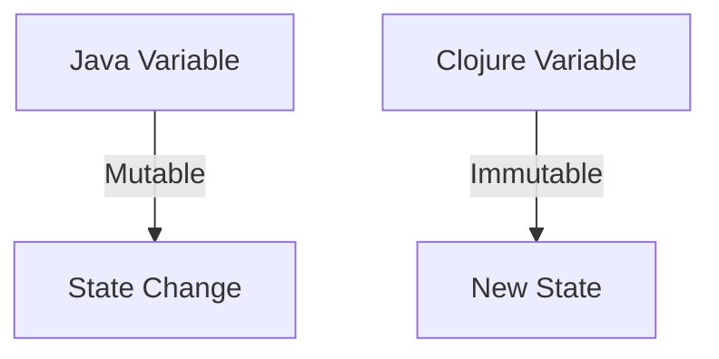
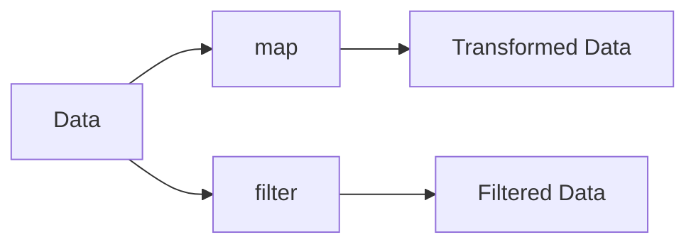

## 3.10 Summary and Key Takeaways

In this chapter, we delved into the fundamental syntax and concepts of Clojure, a functional programming language that offers a fresh perspective for Java developers. By understanding these core elements, you are now equipped to explore more advanced topics in Clojure and leverage its unique features to enhance your programming skills. Let's summarize the key takeaways and concepts covered in this chapter.

### Understanding Clojure's Syntax and Evaluation Model

Clojure's syntax is minimalistic and expressive, designed to facilitate functional programming. Unlike Java, which follows an object-oriented paradigm, Clojure emphasizes immutability and first-class functions. Here's a quick recap of the essential syntax elements:

- **Symbols and Keywords**: Symbols in Clojure are used to refer to variables and functions, while keywords are often used as identifiers or keys in maps. Unlike Java's variable names, Clojure symbols are not tied to a specific type.

  ```clojure
  ; Defining a symbol
  (def my-symbol "Hello, Clojure!")

  ; Using a keyword as a map key
  {:name "Alice" :age 30}
  ```

- **Data Types**: Clojure supports various data types, including numbers, strings, characters, and booleans. These types are similar to Java's primitive types but are immutable by default.

  ```clojure
  ; Numbers
  42
  3.14

  ; Strings
  "Hello, World!"

  ; Characters
  \A

  ; Booleans
  true
  false
  ```

- **Collections**: Clojure's collections, such as lists, vectors, maps, and sets, are immutable and persistent. This immutability ensures thread safety and simplifies reasoning about code.

  ```clojure
  ; List
  (list 1 2 3)

  ; Vector
  [1 2 3]

  ; Map
  {:key "value"}

  ; Set
  #{1 2 3}
  ```

- **S-Expressions**: Clojure code is composed of S-expressions, which are lists used to represent both code and data. This homoiconicity allows for powerful metaprogramming capabilities.

  ```clojure
  ; A simple function call
  (+ 1 2 3)
  ```

### Immutability and Functional Programming

Clojure's emphasis on immutability is a significant shift from Java's mutable state. This paradigm encourages the use of pure functions, which are functions without side effects. Pure functions are easier to test and reason about, leading to more maintainable code.

- **Immutable Data Structures**: Clojure's data structures are designed to be immutable, meaning they cannot be changed after creation. Instead, operations on these structures return new versions with the desired changes.

  ```clojure
  ; Adding an element to a vector
  (conj [1 2 3] 4) ; => [1 2 3 4]
  ```

- **First-Class and Higher-Order Functions**: Functions in Clojure are first-class citizens, meaning they can be passed as arguments, returned from other functions, and stored in data structures. Higher-order functions, such as `map`, `reduce`, and `filter`, allow for concise and expressive data transformations.

  ```clojure
  ; Using map to increment each element in a vector
  (map inc [1 2 3]) ; => (2 3 4)
  ```

### Comparison with Java

For Java developers, transitioning to Clojure involves understanding the differences in syntax and programming paradigms. Here are some key contrasts:

- **Variable Assignment**: In Java, variables are mutable by default, whereas Clojure promotes immutability. This shift requires a change in mindset, focusing on transforming data rather than modifying it.

- **Control Structures**: Clojure replaces traditional control structures like loops and conditionals with functional constructs. For example, recursion and higher-order functions are used instead of loops.

  ```clojure
  ; Recursion in Clojure
  (defn factorial [n]
    (if (<= n 1)
      1
      (* n (factorial (dec n)))))
  ```

- **Concurrency**: Clojure provides robust concurrency primitives, such as atoms, refs, and agents, which simplify concurrent programming compared to Java's thread-based model.

### Practical Exercises and Challenges

To solidify your understanding of Clojure's syntax and concepts, try the following exercises:

1. **Modify a Vector**: Create a vector of numbers and use `map` to square each element. Compare this approach to a traditional Java loop.

2. **Implement a Recursive Function**: Write a recursive function to calculate the Fibonacci sequence. Consider how this differs from an iterative Java solution.

3. **Explore Concurrency**: Use Clojure's atoms to implement a simple counter that can be safely incremented by multiple threads.

### Diagrams and Visual Aids

To further illustrate these concepts, let's use some diagrams:



*Diagram 1: Comparison of Java's mutable variables with Clojure's immutable variables.*



*Diagram 2: Data flow through higher-order functions in Clojure.*

### Key Takeaways

- **Embrace Immutability**: Clojure's immutable data structures lead to safer and more predictable code, especially in concurrent environments.
- **Leverage Higher-Order Functions**: These functions enable concise and expressive data manipulation, reducing boilerplate code.
- **Understand Clojure's Syntax**: Familiarity with symbols, keywords, and S-expressions is crucial for writing idiomatic Clojure code.
- **Transition from Java**: Recognize the paradigm shift from object-oriented to functional programming, focusing on data transformation rather than state mutation.

By mastering these foundational concepts, you are well-prepared to explore more advanced topics in Clojure, such as concurrency, macros, and building full-stack applications. Now that we've explored how immutable data structures work in Clojure, let's apply these concepts to manage state effectively in your applications.

### Further Reading

For more in-depth exploration, consider the following resources:

- [Official Clojure Documentation](https://clojure.org/reference/documentation)
- [ClojureDocs](https://clojuredocs.org/)
- [Clojure Programming by Chas Emerick, Brian Carper, and Christophe Grand](https://www.oreilly.com/library/view/clojure-programming/9781449310387/)

### Exercises

1. **Refactor Java Code**: Take a simple Java program and refactor it into Clojure, focusing on using immutable data structures and higher-order functions.
2. **Concurrency Challenge**: Implement a concurrent task manager using Clojure's agents. Compare its simplicity and performance with a Java-based solution.
3. **Build a Simple DSL**: Create a domain-specific language (DSL) in Clojure for a specific task, such as configuration management or data processing.

By engaging with these exercises and challenges, you'll deepen your understanding of Clojure's syntax and concepts, setting a strong foundation for further exploration.

## Quiz: Test Your Understanding of Clojure Syntax and Concepts



### What is a key difference between Clojure's and Java's approach to data structures?

- [x] Clojure's data structures are immutable by default.
- [ ] Java's data structures are immutable by default.
- [ ] Clojure uses classes for data structures.
- [ ] Java uses functions for data structures.

> **Explanation:** Clojure emphasizes immutability, meaning its data structures cannot be changed after creation, unlike Java's mutable data structures.

### How does Clojure handle variable assignment differently from Java?

- [x] Clojure promotes immutability and avoids reassignment.
- [ ] Clojure allows mutable variables by default.
- [ ] Java promotes immutability and avoids reassignment.
- [ ] Clojure uses pointers for variable assignment.

> **Explanation:** Clojure encourages the use of immutable variables, focusing on data transformation rather than mutation.

### What is an S-expression in Clojure?

- [x] A list used to represent both code and data.
- [ ] A type of data structure similar to a Java array.
- [ ] A special form for conditional expressions.
- [ ] A syntax for defining classes.

> **Explanation:** S-expressions are a fundamental part of Clojure's syntax, representing both code and data in a list form.

### Which of the following is a higher-order function in Clojure?

- [x] `map`
- [ ] `if`
- [ ] `def`
- [ ] `let`

> **Explanation:** `map` is a higher-order function that applies a function to each element in a collection.

### What is the purpose of keywords in Clojure?

- [x] They are often used as identifiers or keys in maps.
- [ ] They define functions.
- [ ] They are used for variable assignment.
- [ ] They represent conditional expressions.

> **Explanation:** Keywords in Clojure are typically used as identifiers or keys in data structures like maps.

### How does Clojure's approach to concurrency differ from Java's?

- [x] Clojure uses atoms, refs, and agents for concurrency.
- [ ] Clojure relies on synchronized blocks.
- [ ] Java uses atoms for concurrency.
- [ ] Clojure uses threads and locks.

> **Explanation:** Clojure provides concurrency primitives like atoms, refs, and agents, simplifying concurrent programming compared to Java's thread-based model.

### What is a benefit of using pure functions in Clojure?

- [x] They are easier to test and reason about.
- [ ] They allow for mutable state.
- [ ] They require more boilerplate code.
- [ ] They are less efficient than impure functions.

> **Explanation:** Pure functions, which have no side effects, are easier to test and reason about, leading to more maintainable code.

### Which Clojure construct is used for local bindings?

- [x] `let`
- [ ] `def`
- [ ] `fn`
- [ ] `loop`

> **Explanation:** The `let` construct is used in Clojure to create local bindings within a specific scope.

### What is a key advantage of Clojure's immutable data structures?

- [x] They ensure thread safety.
- [ ] They allow for direct memory manipulation.
- [ ] They are mutable by default.
- [ ] They require explicit synchronization.

> **Explanation:** Immutable data structures in Clojure ensure thread safety, as they cannot be changed after creation.

### Clojure's syntax is designed to facilitate which programming paradigm?

- [x] Functional programming
- [ ] Object-oriented programming
- [ ] Procedural programming
- [ ] Logic programming

> **Explanation:** Clojure's syntax and features are designed to support functional programming, emphasizing immutability and first-class functions.



By completing this chapter, you have gained a solid understanding of Clojure's fundamental syntax and concepts, setting the stage for more advanced topics in functional programming. Keep practicing and exploring to deepen your knowledge and proficiency in Clojure.
