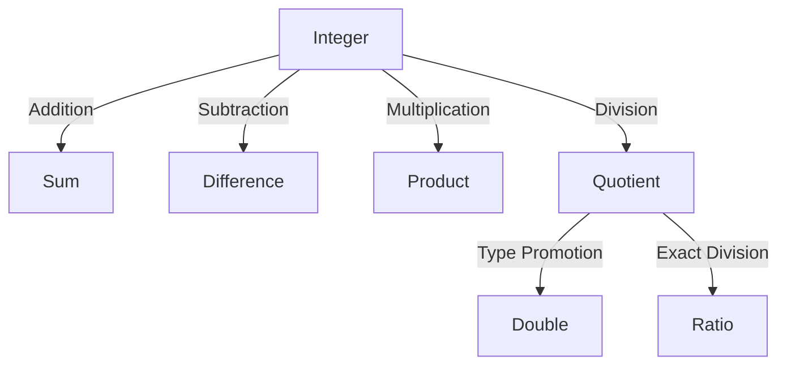

## 3.2.1 Numbers

In this section, we will delve into the numeric types in Clojure, exploring how they compare to Java's numeric types and how they can be used effectively in your Clojure applications. We'll cover integers, floating-point numbers, and ratios, and demonstrate arithmetic operations and type promotion. By the end of this section, you'll have a solid understanding of how to work with numbers in Clojure and how to leverage their unique features to write more expressive and efficient code.

### Understanding Numeric Types in Clojure

Clojure provides a rich set of numeric types that are designed to handle a wide range of mathematical operations. These types include:

- **Integers**: Clojure supports both fixed-size integers and arbitrary-precision integers.
- **Floating-point numbers**: These are used for representing real numbers with fractional parts.
- **Ratios**: Clojure uniquely supports ratios, which are fractions represented as two integers.

Let's explore each of these types in detail.

### Integers in Clojure

Clojure supports two types of integers:

1. **Fixed-size integers**: These are similar to Java's `int` and `long` types.
2. **Arbitrary-precision integers**: These are similar to Java's `BigInteger` and allow for operations on integers of any size without overflow.

#### Fixed-Size Integers

Fixed-size integers in Clojure are represented using Java's primitive types. Here's how you can work with them:

```clojure
;; Fixed-size integer
(def fixed-int 42) ; This is a 32-bit integer by default

;; Long integer
(def long-int 9223372036854775807) ; This is a 64-bit integer
```

In Clojure, the default integer type is `long`, which is a 64-bit integer. This is different from Java, where the default integer type is `int`, a 32-bit integer.

#### Arbitrary-Precision Integers

Clojure's arbitrary-precision integers are represented using Java's `BigInteger`. They allow you to perform operations on very large integers without worrying about overflow:

```clojure
;; Arbitrary-precision integer
(def big-int (bigint "1234567890123456789012345678901234567890"))

;; Arithmetic operations with arbitrary-precision integers
(def result (+ big-int 1))
```

In the example above, `bigint` is used to create an arbitrary-precision integer. You can perform arithmetic operations on these integers just like you would with fixed-size integers.

### Floating-Point Numbers

Floating-point numbers in Clojure are similar to Java's `float` and `double` types. They are used to represent real numbers with fractional parts:

```clojure
;; Floating-point numbers
(def float-num 3.14) ; This is a double by default
(def double-num 2.718281828459045)
```

Clojure uses Java's `double` type by default for floating-point numbers, which provides double-precision 64-bit IEEE 754 values.

### Ratios in Clojure

One of the unique features of Clojure is its support for ratios. Ratios are fractions represented as two integers, and they allow for exact arithmetic operations:

```clojure
;; Ratios
(def ratio-num (/ 22 7)) ; Represents the fraction 22/7

;; Arithmetic with ratios
(def ratio-result (* ratio-num 2))
```

Ratios are particularly useful when you need to perform precise arithmetic operations without the rounding errors associated with floating-point arithmetic.

### Arithmetic Operations

Clojure supports a wide range of arithmetic operations, including addition, subtraction, multiplication, and division. These operations work seamlessly across different numeric types:

```clojure
;; Addition
(def sum (+ 10 20))

;; Subtraction
(def difference (- 50 20))

;; Multiplication
(def product (* 5 4))

;; Division
(def quotient (/ 10 2))
```

Clojure's arithmetic operations are designed to handle different numeric types gracefully. For example, when you divide two integers, Clojure returns a ratio if the division is not exact:

```clojure
(def division-result (/ 5 2)) ; Returns 5/2 as a ratio
```

### Type Promotion

Clojure automatically promotes numeric types to ensure that operations are performed accurately. For example, when you perform arithmetic operations on mixed numeric types, Clojure promotes the types to the most precise type involved in the operation:

```clojure
;; Type promotion
(def mixed-result (+ 1 2.5)) ; Promotes 1 to a double, result is 3.5
```

In this example, the integer `1` is promoted to a double to match the type of `2.5`, ensuring that the result is a double.

### Comparing Clojure and Java Numeric Types

Let's compare how Clojure and Java handle numeric types and operations:

#### Java Code Example

```java
// Java integer types
int intNum = 42;
long longNum = 9223372036854775807L;

// Java floating-point types
float floatNum = 3.14f;
double doubleNum = 2.718281828459045;

// Java BigInteger for arbitrary-precision integers
BigInteger bigInt = new BigInteger("1234567890123456789012345678901234567890");

// Arithmetic operations in Java
int sum = intNum + 10;
double divisionResult = (double) intNum / 2;
```

#### Clojure Code Example

```clojure
;; Clojure integer types
(def int-num 42)
(def long-num 9223372036854775807)

;; Clojure floating-point types
(def float-num 3.14)
(def double-num 2.718281828459045)

;; Clojure arbitrary-precision integers
(def big-int (bigint "1234567890123456789012345678901234567890"))

;; Arithmetic operations in Clojure
(def sum (+ int-num 10))
(def division-result (/ int-num 2))
```

As you can see, Clojure provides a more concise and expressive syntax for working with numeric types, while also offering additional features like ratios and automatic type promotion.

### Try It Yourself

To get a better understanding of how numeric types work in Clojure, try modifying the code examples above. Experiment with different numeric types and operations, and observe how Clojure handles type promotion and precision.

### Diagrams and Visualizations

To help visualize the flow of data through arithmetic operations and type promotion, let's use a Mermaid.js diagram:



**Diagram Description**: This diagram illustrates the flow of data through various arithmetic operations in Clojure. It shows how integers are used in addition, subtraction, multiplication, and division, and how division can result in either a double or a ratio through type promotion.

### Further Reading

For more information on numeric types in Clojure, check out the following resources:

- [Official Clojure Documentation on Numbers](https://clojure.org/reference/data_structures#Numbers)
- [ClojureDocs: Numbers](https://clojuredocs.org/quickref#Numbers)
- [Java BigInteger Documentation](https://docs.oracle.com/javase/8/docs/api/java/math/BigInteger.html)

### Exercises

To reinforce your understanding of numeric types in Clojure, try the following exercises:

1. Create a function that takes two integers and returns their sum as a ratio.
2. Write a function that calculates the factorial of a number using arbitrary-precision integers.
3. Implement a function that converts a floating-point number to a ratio and performs arithmetic operations on it.

### Key Takeaways

- Clojure provides a rich set of numeric types, including integers, floating-point numbers, and ratios.
- Clojure's arbitrary-precision integers allow for operations on very large numbers without overflow.
- Ratios in Clojure enable exact arithmetic operations, avoiding the rounding errors of floating-point arithmetic.
- Clojure automatically promotes numeric types to ensure accurate operations.
- Compared to Java, Clojure offers a more concise and expressive syntax for working with numbers.

Now that we've explored the numeric types in Clojure, let's apply these concepts to perform precise and efficient arithmetic operations in your applications.

## Quiz: Mastering Clojure's Numeric Types



### What is the default integer type in Clojure?

- [ ] int
- [x] long
- [ ] BigInteger
- [ ] short

> **Explanation:** In Clojure, the default integer type is `long`, which is a 64-bit integer.

### How does Clojure handle division of two integers when the result is not exact?

- [x] It returns a ratio
- [ ] It returns a float
- [ ] It throws an error
- [ ] It rounds to the nearest integer

> **Explanation:** Clojure returns a ratio when dividing two integers if the result is not exact, allowing for precise arithmetic.

### Which Clojure function is used to create an arbitrary-precision integer?

- [ ] big
- [x] bigint
- [ ] biginteger
- [ ] bigdecimal

> **Explanation:** The `bigint` function is used in Clojure to create an arbitrary-precision integer.

### What is the primary advantage of using ratios in Clojure?

- [x] Exact arithmetic without rounding errors
- [ ] Faster computation
- [ ] Smaller memory footprint
- [ ] Compatibility with Java

> **Explanation:** Ratios in Clojure allow for exact arithmetic operations, avoiding the rounding errors associated with floating-point arithmetic.

### How does Clojure promote numeric types during arithmetic operations?

- [x] To the most precise type involved
- [ ] To the least precise type involved
- [ ] It does not promote types
- [ ] It throws an error if types differ

> **Explanation:** Clojure promotes numeric types to the most precise type involved in the operation to ensure accuracy.

### Which of the following is a unique numeric type in Clojure not found in Java?

- [ ] int
- [ ] float
- [x] ratio
- [ ] double

> **Explanation:** Ratios are a unique numeric type in Clojure, allowing for exact fractions, unlike Java.

### What type does Clojure use by default for floating-point numbers?

- [ ] float
- [x] double
- [ ] decimal
- [ ] BigDecimal

> **Explanation:** Clojure uses Java's `double` type by default for floating-point numbers, providing double-precision values.

### How can you create a ratio in Clojure?

- [x] Using the division operator `/`
- [ ] Using the `ratio` function
- [ ] Using the `fraction` function
- [ ] Using the `divide` function

> **Explanation:** In Clojure, you can create a ratio by using the division operator `/` with two integers.

### What is the result of the expression `(/ 5 2)` in Clojure?

- [ ] 2.5
- [x] 5/2
- [ ] 2
- [ ] 3

> **Explanation:** The expression `(/ 5 2)` in Clojure returns the ratio `5/2`, representing the exact division.

### True or False: Clojure's numeric types are more expressive and concise compared to Java.

- [x] True
- [ ] False

> **Explanation:** Clojure's numeric types offer a more expressive and concise syntax, along with unique features like ratios and automatic type promotion.


