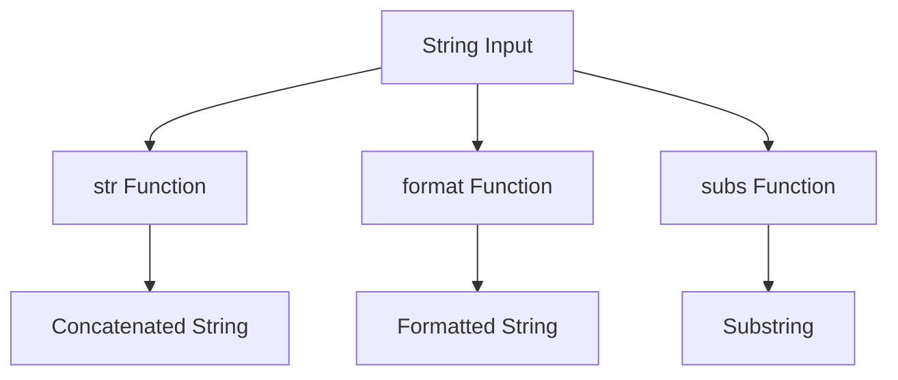

## 3.2.2 Strings

In this section, we will delve into the world of strings in Clojure, a fundamental data type that is essential for text manipulation and processing. As experienced Java developers, you are already familiar with the concept of strings, but Clojure offers a unique approach that leverages its functional programming paradigm. Let's explore how Clojure handles strings, the functions available for string manipulation, and how these concepts compare to Java.

### Creating Strings in Clojure

In Clojure, strings are created using double quotes, similar to Java. Strings in Clojure are immutable, meaning once a string is created, it cannot be changed. This immutability is a core principle of functional programming and offers several advantages, such as thread safety and ease of reasoning about code.

#### Example: Creating Strings

```clojure
(def greeting "Hello, World!") ; Define a string using double quotes
(def name "Clojure") ; Another string definition
```

In the above example, we define two strings, `greeting` and `name`, using double quotes. This is analogous to how strings are defined in Java:

```java
String greeting = "Hello, World!";
String name = "Java";
```

### Common String Functions

Clojure provides a rich set of functions for string manipulation. Let's explore some of the most commonly used functions: `str`, `format`, and `subs`.

#### The `str` Function

The `str` function is used to concatenate strings and other data types. It converts its arguments to strings and concatenates them.

```clojure
(def full-greeting (str greeting ", " name "!")) ; Concatenate strings
(println full-greeting) ; Output: Hello, World!, Clojure!
```

In Java, string concatenation is typically done using the `+` operator or the `StringBuilder` class for more complex operations:

```java
String fullGreeting = greeting + ", " + name + "!";
System.out.println(fullGreeting); // Output: Hello, World!, Java!
```

#### The `format` Function

The `format` function in Clojure is similar to `String.format` in Java. It allows you to create formatted strings using placeholders.

```clojure
(def formatted-greeting (format "Hello, %s! Welcome to %s." name "Clojure"))
(println formatted-greeting) ; Output: Hello, Clojure! Welcome to Clojure.
```

Java equivalent:

```java
String formattedGreeting = String.format("Hello, %s! Welcome to %s.", name, "Java");
System.out.println(formattedGreeting); // Output: Hello, Java! Welcome to Java.
```

#### The `subs` Function

The `subs` function extracts a substring from a given string. It takes the string, a start index, and an optional end index.

```clojure
(def sub-greeting (subs greeting 0 5)) ; Extract "Hello"
(println sub-greeting) ; Output: Hello
```

In Java, you would use the `substring` method:

```java
String subGreeting = greeting.substring(0, 5);
System.out.println(subGreeting); // Output: Hello
```

### String Concatenation and Interpolation

String concatenation in Clojure is primarily done using the `str` function, as shown earlier. However, Clojure also supports string interpolation through the use of the `format` function and libraries like `clojure.string`.

#### Example: String Concatenation

```clojure
(def concatenated (str "Hello, " name "!"))
(println concatenated) ; Output: Hello, Clojure!
```

#### String Interpolation

While Clojure does not have built-in string interpolation like some other languages, you can achieve similar results using `format` or third-party libraries.

```clojure
(def interpolated (format "Hello, %s! Welcome to %s." name "Clojure"))
(println interpolated) ; Output: Hello, Clojure! Welcome to Clojure.
```

### Advanced String Manipulation

Clojure's `clojure.string` namespace provides additional functions for advanced string manipulation, such as splitting, joining, and replacing strings.

#### Splitting Strings

The `split` function divides a string into a sequence of substrings based on a regular expression.

```clojure
(require '[clojure.string :as str])

(def words (str/split greeting #", "))
(println words) ; Output: ["Hello" "World!"]
```

Java equivalent using `String.split`:

```java
String[] words = greeting.split(", ");
System.out.println(Arrays.toString(words)); // Output: [Hello, World!]
```

#### Joining Strings

The `join` function concatenates a sequence of strings with a specified delimiter.

```clojure
(def joined (str/join ", " ["Hello" "Clojure"]))
(println joined) ; Output: Hello, Clojure
```

Java equivalent using `String.join`:

```java
String joined = String.join(", ", "Hello", "Java");
System.out.println(joined); // Output: Hello, Java
```

#### Replacing Substrings

The `replace` function substitutes parts of a string with another string.

```clojure
(def replaced (str/replace greeting "World" "Clojure"))
(println replaced) ; Output: Hello, Clojure!
```

Java equivalent using `String.replace`:

```java
String replaced = greeting.replace("World", "Java");
System.out.println(replaced); // Output: Hello, Java!
```

### Try It Yourself

To deepen your understanding, try modifying the examples above. For instance, experiment with different string functions, or create a function that takes a name and returns a personalized greeting.

### Diagrams and Visualizations

Below is a diagram illustrating the flow of data through string functions in Clojure:



*Diagram: Flow of data through string functions in Clojure.*

### Key Takeaways

- **Immutability**: Strings in Clojure are immutable, promoting thread safety and functional programming principles.
- **Rich Functionality**: Clojure provides a variety of functions for string manipulation, similar to Java but with a functional twist.
- **String Interpolation**: Achieved through `format` and libraries, offering flexibility in creating dynamic strings.
- **Comparison with Java**: While similar in many ways, Clojure's approach to strings emphasizes immutability and functional programming.

### Exercises

1. **Create a Greeting Function**: Write a Clojure function that takes a name and returns a greeting message using `str` and `format`.
2. **String Manipulation**: Use `clojure.string` functions to transform a sentence into a list of words, reverse the list, and join them back into a sentence.
3. **Substring Extraction**: Write a function that extracts the domain from an email address using `subs`.

### Further Reading

- [Official Clojure Documentation on Strings](https://clojure.org/reference/data_structures#Strings)
- [ClojureDocs - String Functions](https://clojuredocs.org/clojure.string)

Now that we've explored strings in Clojure, let's apply these concepts to enhance text processing in your applications. By leveraging Clojure's string manipulation capabilities, you can write more concise and expressive code.

## Mastering Clojure Strings: Quiz for Java Developers



### Which function is used in Clojure for string concatenation?

- [x] str
- [ ] concat
- [ ] append
- [ ] join

> **Explanation:** The `str` function is used in Clojure to concatenate strings and other data types.

### How do you create a string in Clojure?

- [x] Using double quotes
- [ ] Using single quotes
- [ ] Using backticks
- [ ] Using parentheses

> **Explanation:** Strings in Clojure are created using double quotes, similar to Java.

### What is the equivalent of Java's `String.format` in Clojure?

- [x] format
- [ ] printf
- [ ] str
- [ ] concat

> **Explanation:** The `format` function in Clojure is used to create formatted strings, similar to Java's `String.format`.

### Which function is used to extract a substring in Clojure?

- [x] subs
- [ ] slice
- [ ] substring
- [ ] extract

> **Explanation:** The `subs` function is used in Clojure to extract a substring from a string.

### What is the output of `(str "Hello, " "Clojure!")`?

- [x] Hello, Clojure!
- [ ] Hello, Clojure
- [ ] Hello Clojure!
- [ ] Hello, Clojure

> **Explanation:** The `str` function concatenates the two strings, resulting in "Hello, Clojure!".

### How can you split a string into a sequence of substrings in Clojure?

- [x] Using the `split` function from `clojure.string`
- [ ] Using the `divide` function
- [ ] Using the `partition` function
- [ ] Using the `separate` function

> **Explanation:** The `split` function from `clojure.string` is used to divide a string into a sequence of substrings based on a regular expression.

### What is the purpose of the `replace` function in Clojure?

- [x] To substitute parts of a string with another string
- [ ] To remove parts of a string
- [ ] To add characters to a string
- [ ] To reverse a string

> **Explanation:** The `replace` function is used to substitute parts of a string with another string.

### Which library provides additional string manipulation functions in Clojure?

- [x] clojure.string
- [ ] clojure.core
- [ ] clojure.data
- [ ] clojure.utils

> **Explanation:** The `clojure.string` library provides additional functions for string manipulation in Clojure.

### What is the result of `(subs "Functional Programming" 0 10)`?

- [x] Functional
- [ ] Programming
- [ ] Functional Programming
- [ ] Function

> **Explanation:** The `subs` function extracts the substring from index 0 to 10, resulting in "Functional".

### True or False: Strings in Clojure are mutable.

- [ ] True
- [x] False

> **Explanation:** Strings in Clojure are immutable, meaning they cannot be changed once created.


