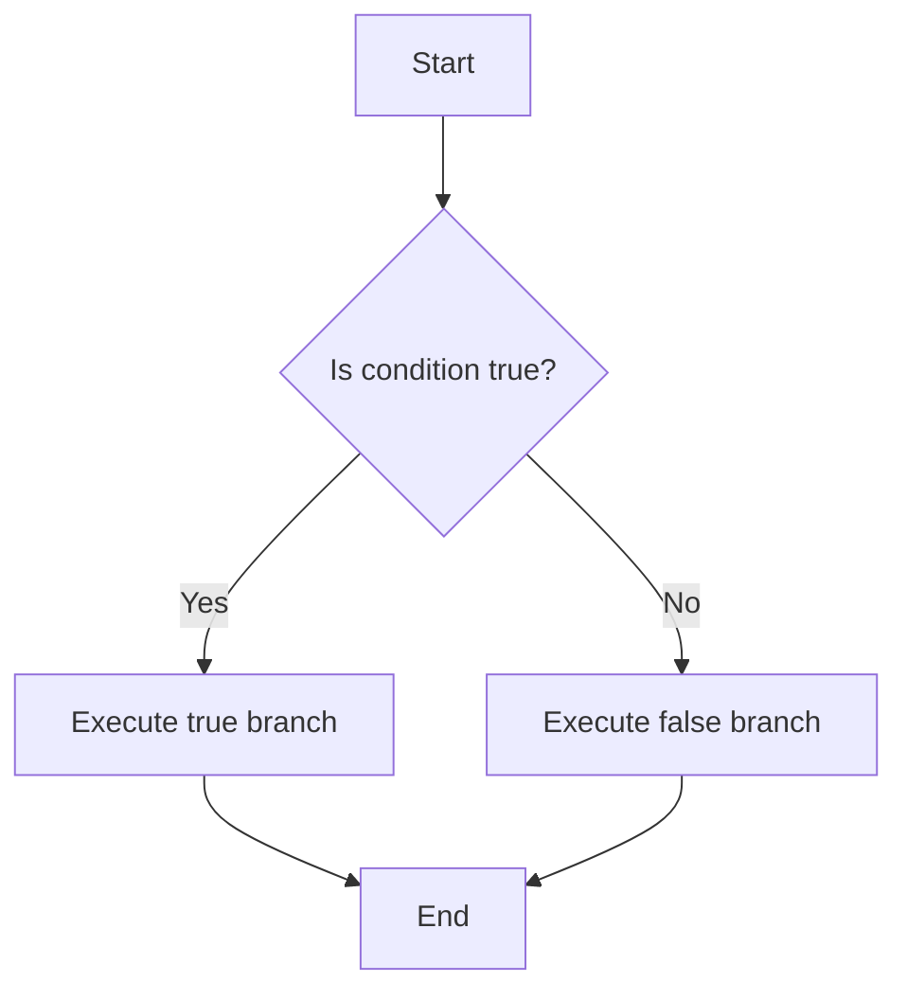

## 3.2.3 Characters and Booleans

In this section, we will delve into the fundamental data types of characters and booleans in Clojure, providing a comprehensive understanding for Java developers transitioning to Clojure. We will explore how these data types are represented, their usage in control structures, and how they compare to their Java counterparts.

### Understanding Characters in Clojure

In Clojure, characters are represented by a backslash followed by the character itself. This is a departure from Java, where characters are enclosed in single quotes. Let's explore how characters are defined and used in Clojure.

#### Defining Characters

In Clojure, a character is defined by preceding it with a backslash (`\`). Here are some examples:

```clojure
(def char-a \a) ; Defines the character 'a'
(def char-newline \newline) ; Defines the newline character
(def char-space \space) ; Defines the space character
```

**Comparison with Java:**

In Java, characters are defined using single quotes:

```java
char charA = 'a'; // Defines the character 'a'
char charNewline = '\n'; // Defines the newline character
char charSpace = ' '; // Defines the space character
```

#### Character Functions

Clojure provides several functions to work with characters. Here are a few examples:

- **`char?`**: Checks if a value is a character.

```clojure
(char? \a) ; Returns true
(char? "a") ; Returns false
```

- **`int`**: Converts a character to its ASCII integer value.

```clojure
(int \a) ; Returns 97
```

- **`char`**: Converts an integer to its corresponding character.

```clojure
(char 97) ; Returns \a
```

#### Try It Yourself

Experiment with these character functions by modifying the examples above. Try converting different characters to their ASCII values and vice versa.

### Booleans in Clojure

Booleans in Clojure are straightforward and similar to Java. They are represented by the literals `true` and `false`. Let's explore their usage and how they integrate with control structures.

#### Defining Booleans

In Clojure, booleans are defined using the literals `true` and `false`:

```clojure
(def is-true true) ; Defines a boolean with value true
(def is-false false) ; Defines a boolean with value false
```

**Comparison with Java:**

In Java, booleans are defined similarly:

```java
boolean isTrue = true; // Defines a boolean with value true
boolean isFalse = false; // Defines a boolean with value false
```

#### Booleans in Control Structures

Booleans play a crucial role in control structures, such as `if`, `when`, and `cond`. Let's see how these structures work in Clojure.

- **`if`**: A basic conditional structure.

```clojure
(if true
  (println "This is true")
  (println "This is false"))
```

- **`when`**: Similar to `if`, but without an `else` branch.

```clojure
(when true
  (println "This will print if true"))
```

- **`cond`**: A multi-branch conditional structure.

```clojure
(cond
  (= 1 1) (println "One equals one")
  (= 1 2) (println "One equals two"))
```

**Comparison with Java:**

In Java, control structures use boolean expressions similarly:

```java
if (true) {
    System.out.println("This is true");
} else {
    System.out.println("This is false");
}

switch (1) {
    case 1:
        System.out.println("One equals one");
        break;
    case 2:
        System.out.println("One equals two");
        break;
}
```

#### Try It Yourself

Modify the examples above to use different boolean expressions and see how the output changes. Try using `cond` with more branches to handle multiple conditions.

### Diagrams and Visualizations

To better understand the flow of data through control structures, let's visualize a simple decision-making process using a flowchart.



**Caption**: This flowchart represents a simple `if` control structure in Clojure, where a condition is evaluated, and the corresponding branch is executed.

### Key Takeaways

- **Characters in Clojure** are defined using a backslash (`\`) and are distinct from Java's single-quote syntax.
- **Booleans** are represented by `true` and `false`, similar to Java, and are integral to control structures.
- **Control Structures** in Clojure, such as `if`, `when`, and `cond`, rely heavily on boolean expressions to dictate program flow.
- **Experimentation** with code examples helps solidify understanding of these fundamental concepts.

### Further Reading

For more information on Clojure's data types and control structures, consider exploring the following resources:

- [Official Clojure Documentation](https://clojure.org/reference/data_structures)
- [ClojureDocs](https://clojuredocs.org/)

### Exercises

1. **Define a Character**: Write a Clojure expression to define the character `z` and convert it to its ASCII value.
2. **Boolean Expression**: Create a Clojure function that takes a boolean and prints "Yes" if true and "No" if false.
3. **Complex Conditionals**: Use `cond` to create a decision structure that handles three different conditions.

### Summary

In this section, we've explored the fundamental data types of characters and booleans in Clojure, drawing parallels with Java to aid in the transition. By understanding these basic building blocks, we can effectively utilize them in control structures and other programming constructs within Clojure.

Now that we've covered characters and booleans, let's move on to the next section, where we'll dive deeper into Clojure's rich set of collections and how they compare to Java's collections framework.

## Quiz: Mastering Characters and Booleans in Clojure



### What is the correct way to define a character in Clojure?

- [x] \a
- [ ] 'a'
- [ ] "a"
- [ ] char a

> **Explanation:** In Clojure, characters are defined using a backslash followed by the character itself, such as `\a`.

### How are booleans represented in Clojure?

- [x] true and false
- [ ] True and False
- [ ] 1 and 0
- [ ] Yes and No

> **Explanation:** Booleans in Clojure are represented by the literals `true` and `false`, similar to Java.

### Which function checks if a value is a character in Clojure?

- [x] char?
- [ ] isChar?
- [ ] character?
- [ ] checkChar?

> **Explanation:** The `char?` function is used to check if a value is a character in Clojure.

### What does the `int` function do when applied to a character in Clojure?

- [x] Converts the character to its ASCII integer value
- [ ] Converts the character to a string
- [ ] Converts the character to a boolean
- [ ] Converts the character to a float

> **Explanation:** The `int` function converts a character to its ASCII integer value in Clojure.

### Which Clojure control structure is used for multi-branch conditionals?

- [x] cond
- [ ] if
- [ ] when
- [ ] switch

> **Explanation:** The `cond` control structure in Clojure is used for multi-branch conditionals, similar to a switch statement in Java.

### How do you define a boolean variable with the value `true` in Clojure?

- [x] (def is-true true)
- [ ] (def isTrue True)
- [ ] (boolean is-true true)
- [ ] (boolean isTrue True)

> **Explanation:** In Clojure, a boolean variable is defined using the `def` keyword followed by the variable name and the boolean value, such as `(def is-true true)`.

### What is the result of `(char 65)` in Clojure?

- [x] \A
- [ ] \a
- [ ] \65
- [ ] A

> **Explanation:** The `char` function converts the integer 65 to its corresponding character, which is `\A`.

### Which Clojure function would you use to convert a character to its integer representation?

- [x] int
- [ ] char
- [ ] toInt
- [ ] convert

> **Explanation:** The `int` function is used to convert a character to its integer representation in Clojure.

### What is the output of `(if false "Yes" "No")` in Clojure?

- [x] "No"
- [ ] "Yes"
- [ ] true
- [ ] false

> **Explanation:** The `if` expression evaluates to the "else" branch when the condition is `false`, resulting in "No".

### True or False: In Clojure, characters are enclosed in single quotes.

- [ ] True
- [x] False

> **Explanation:** In Clojure, characters are not enclosed in single quotes; they are defined using a backslash followed by the character.


