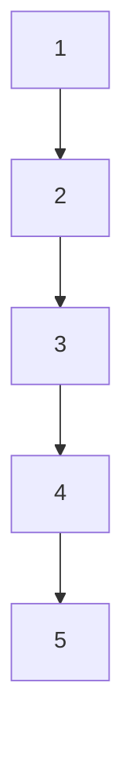

## 3.3.1 Lists

In Clojure, lists are a fundamental data structure that embodies the principles of functional programming. As Java developers, you may be familiar with lists as part of the Java Collections Framework, such as `ArrayList` or `LinkedList`. However, Clojure lists differ significantly in their implementation and usage, emphasizing immutability and functional operations.

### Introduction to Lists in Clojure

Clojure lists are linked collections that are immutable by nature. This immutability ensures that once a list is created, it cannot be altered, which aligns with the functional programming paradigm. Lists in Clojure are primarily used for sequential access and are optimized for operations at the head of the list.

#### Creating Lists

In Clojure, lists can be created using two primary methods: the quote (`'`) operator and the `list` function. Let's explore both:

- **Using the Quote Operator**: The quote operator is a shorthand for creating lists. It prevents the evaluation of the list elements, treating them as data.

  ```clojure
  ; Creating a list using the quote operator
  (def my-list '(1 2 3 4 5))
  ```

- **Using the `list` Function**: The `list` function explicitly constructs a list from the provided elements.

  ```clojure
  ; Creating a list using the list function
  (def my-list (list 1 2 3 4 5))
  ```

Both methods result in the same list structure. The choice between them often depends on readability and context.

#### Accessing Elements

Accessing elements in a Clojure list is straightforward, thanks to several built-in functions:

- **`first`**: Retrieves the first element of the list.

  ```clojure
  ; Accessing the first element
  (first my-list) ; => 1
  ```

- **`rest`**: Returns a list of all elements except the first.

  ```clojure
  ; Accessing the rest of the list
  (rest my-list) ; => (2 3 4 5)
  ```

- **`nth`**: Retrieves the element at a specified index. Note that lists are zero-indexed.

  ```clojure
  ; Accessing the third element (index 2)
  (nth my-list 2) ; => 3
  ```

These functions allow for efficient traversal and manipulation of lists, supporting the functional programming model.

### Use Cases for Lists

Lists are particularly useful in scenarios where you need to process elements sequentially. They are ideal for recursive algorithms and when you need to frequently access the head of the list. Let's explore some common use cases:

#### Recursive Processing

Lists are well-suited for recursive operations due to their linked nature. Consider a simple example of calculating the sum of a list:

```clojure
; Recursive function to calculate the sum of a list
(defn sum-list [lst]
  (if (empty? lst)
    0
    (+ (first lst) (sum-list (rest lst)))))

(sum-list my-list) ; => 15
```

In this example, the `sum-list` function recursively processes each element, demonstrating the elegance of recursion with lists.

#### Functional Transformations

Lists can be transformed using higher-order functions like `map`, `filter`, and `reduce`. These functions enable concise and expressive data transformations:

```clojure
; Doubling each element in the list
(map #(* 2 %) my-list) ; => (2 4 6 8 10)

; Filtering even numbers
(filter even? my-list) ; => (2 4)

; Reducing to a sum
(reduce + my-list) ; => 15
```

These transformations highlight the power of functional programming in Clojure, allowing you to express complex operations succinctly.

### Comparing Clojure Lists with Java Lists

To fully appreciate Clojure lists, it's helpful to compare them with Java's list implementations. In Java, lists are mutable, and operations often involve side effects. Clojure's immutability offers several advantages:

- **Immutability**: Clojure lists are immutable, ensuring thread safety and predictability. In contrast, Java lists like `ArrayList` are mutable, requiring careful synchronization in concurrent environments.

- **Functional Operations**: Clojure provides a rich set of functional operations that are not natively available in Java. While Java 8 introduced streams and lambda expressions, Clojure's functional capabilities are more deeply integrated.

- **Performance Considerations**: Clojure lists are optimized for operations at the head, making them suitable for recursive algorithms. Java lists, depending on the implementation, may offer better performance for random access.

Here's a simple comparison of list creation and access in Java and Clojure:

```java
// Java: Creating and accessing an ArrayList
List<Integer> javaList = new ArrayList<>(Arrays.asList(1, 2, 3, 4, 5));
int firstElement = javaList.get(0); // Accessing the first element
```

```clojure
; Clojure: Creating and accessing a list
(def clojureList '(1 2 3 4 5))
(first clojureList) ; Accessing the first element
```

### Diagrams and Visualizations

To better understand the structure and operations on lists, let's visualize a simple list and its operations using Mermaid.js:



**Diagram 1**: This diagram represents a Clojure list `(1 2 3 4 5)` as a linked structure, where each node points to the next.

### Try It Yourself

To deepen your understanding, try modifying the code examples:

- **Experiment with Different Functions**: Use other functions like `take`, `drop`, or `concat` to manipulate lists.
- **Implement a Recursive Function**: Write a recursive function to find the maximum element in a list.
- **Compare with Java**: Implement similar operations in Java and compare the code's verbosity and expressiveness.

### Exercises

1. **Create a List**: Write a Clojure function that creates a list of the first 10 natural numbers.
2. **Access Elements**: Implement a function that returns the second-to-last element of a list.
3. **Recursive Sum**: Modify the `sum-list` function to handle nested lists (e.g., `(1 (2 3) 4)` should return 10).
4. **Transform and Filter**: Use `map` and `filter` to transform a list of numbers, doubling each and then filtering out odd results.

### Summary and Key Takeaways

- **Lists in Clojure** are immutable, linked collections optimized for sequential access.
- **Creation** can be done using the quote operator or the `list` function.
- **Accessing elements** is efficient with functions like `first`, `rest`, and `nth`.
- **Use cases** include recursive processing and functional transformations.
- **Comparison with Java** highlights the benefits of immutability and functional programming.

By mastering lists in Clojure, you gain a powerful tool for functional programming, enabling you to write concise, expressive, and safe code. Now that we've explored lists, let's continue our journey into other Clojure collections and their unique capabilities.

## Quiz: Mastering Clojure Lists for Java Developers



### What is the primary characteristic of Clojure lists?

- [x] Immutability
- [ ] Mutability
- [ ] Random Access
- [ ] Dynamic Typing

> **Explanation:** Clojure lists are immutable, meaning they cannot be changed after creation, which is a key feature of functional programming.

### How do you create a list in Clojure using the quote operator?

- [x] '(1 2 3)
- [ ] (list 1 2 3)
- [ ] [1 2 3]
- [ ] {1 2 3}

> **Explanation:** The quote operator `'` is used to create lists in Clojure, preventing evaluation of the elements.

### Which function retrieves the first element of a Clojure list?

- [x] first
- [ ] rest
- [ ] nth
- [ ] last

> **Explanation:** The `first` function is used to access the first element of a list in Clojure.

### What is the result of `(rest '(1 2 3 4))` in Clojure?

- [x] (2 3 4)
- [ ] (1 2 3)
- [ ] (3 4)
- [ ] nil

> **Explanation:** The `rest` function returns all elements of the list except the first one.

### How does immutability benefit concurrent programming?

- [x] Ensures thread safety
- [ ] Increases performance
- [ ] Allows direct memory access
- [ ] Requires less memory

> **Explanation:** Immutability ensures that data cannot be changed by multiple threads simultaneously, enhancing thread safety.

### Which Java collection is most similar to Clojure's list in terms of structure?

- [x] LinkedList
- [ ] ArrayList
- [ ] HashMap
- [ ] TreeSet

> **Explanation:** Java's `LinkedList` is similar to Clojure's list as both are linked structures.

### What is a common use case for lists in Clojure?

- [x] Recursive processing
- [ ] Random access
- [ ] Key-value storage
- [ ] Sorting

> **Explanation:** Lists are ideal for recursive processing due to their linked nature.

### Which function would you use to transform each element of a list?

- [x] map
- [ ] filter
- [ ] reduce
- [ ] concat

> **Explanation:** The `map` function applies a given function to each element of a list, transforming it.

### What is the output of `(nth '(10 20 30) 1)`?

- [x] 20
- [ ] 10
- [ ] 30
- [ ] nil

> **Explanation:** The `nth` function retrieves the element at the specified index, which is 1 in this case.

### True or False: Clojure lists are mutable.

- [ ] True
- [x] False

> **Explanation:** Clojure lists are immutable, meaning they cannot be altered after creation.


