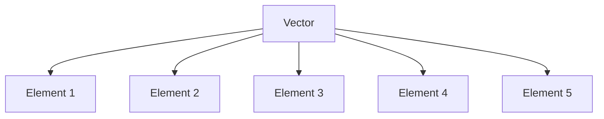
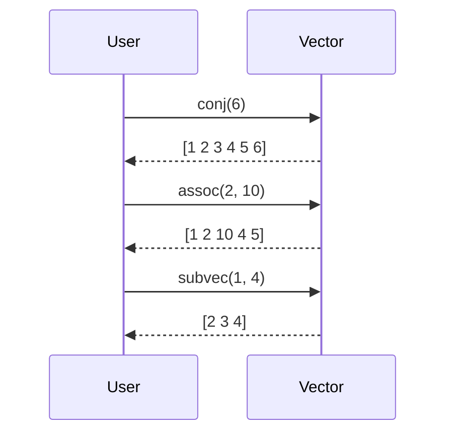

## 3.3.2 Vectors

In Clojure, vectors are a fundamental data structure that provides indexed, random-access collections. They are a core part of Clojure's collection library and are designed to be efficient for both access and modification operations, especially at the end of the collection. For Java developers, vectors can be seen as an immutable alternative to Java's `ArrayList`, with some key differences and advantages.

### Understanding Vectors in Clojure

Vectors in Clojure are created using square brackets `[]`. They are immutable, meaning that any operation that modifies a vector actually returns a new vector with the modification applied, leaving the original vector unchanged. This immutability is a cornerstone of functional programming and offers several benefits, such as easier reasoning about code and safer concurrent programming.

#### Creating Vectors

Creating vectors in Clojure is straightforward. You can define a vector using square brackets and populate it with elements:

```clojure
(def my-vector [1 2 3 4 5])
```

In this example, `my-vector` is a vector containing the integers 1 through 5. Unlike Java's arrays or lists, vectors in Clojure are immutable, meaning that once created, their contents cannot be changed directly.

#### Accessing Elements

Accessing elements in a vector is efficient and can be done using the `get` or `nth` functions. Both functions allow you to retrieve an element at a specific index.

```clojure
;; Using get
(get my-vector 2) ; => 3

;; Using nth
(nth my-vector 2) ; => 3
```

Both `get` and `nth` provide constant-time access to elements, similar to accessing elements in a Java array or `ArrayList`.

#### Modifying Vectors

While vectors are immutable, you can create a new vector with modifications using functions like `conj`, `assoc`, and `subvec`.

- **Appending Elements**: Use `conj` to add elements to the end of a vector.

```clojure
(def updated-vector (conj my-vector 6))
;; updated-vector => [1 2 3 4 5 6]
```

- **Updating Elements**: Use `assoc` to update an element at a specific index.

```clojure
(def modified-vector (assoc my-vector 2 10))
;; modified-vector => [1 2 10 4 5]
```

- **Subvectors**: Use `subvec` to create a subvector from an existing vector.

```clojure
(def sub-vector (subvec my-vector 1 4))
;; sub-vector => [2 3 4]
```

### Comparing Vectors to Java Collections

For Java developers, understanding the differences between Clojure vectors and Java's `ArrayList` or arrays is crucial. Here are some key points of comparison:

- **Immutability**: Unlike Java's `ArrayList`, which is mutable, Clojure vectors are immutable. This means that operations that modify a vector return a new vector, preserving the original.

- **Performance**: Clojure vectors provide efficient access and modification at the end of the collection, similar to `ArrayList`. However, due to their persistent nature, they also offer efficient structural sharing, which can lead to better performance in certain scenarios.

- **Syntax**: Vectors in Clojure are created using square brackets `[]`, which is a more concise syntax compared to Java's `new ArrayList<>()`.

### Practical Examples and Use Cases

Let's explore some practical examples and use cases for vectors in Clojure.

#### Example 1: Managing a List of Tasks

Consider a scenario where you need to manage a list of tasks. You can use a vector to store the tasks and perform operations such as adding, updating, and retrieving tasks.

```clojure
(def tasks ["Task 1" "Task 2" "Task 3"])

;; Add a new task
(def updated-tasks (conj tasks "Task 4"))

;; Update a task
(def modified-tasks (assoc tasks 1 "Updated Task 2"))

;; Retrieve a task
(nth tasks 0) ; => "Task 1"
```

#### Example 2: Processing a Collection of Data

Vectors are ideal for processing collections of data, such as numbers or strings. You can use higher-order functions like `map`, `filter`, and `reduce` to perform operations on vectors.

```clojure
(def numbers [1 2 3 4 5])

;; Double each number
(def doubled (map #(* 2 %) numbers))
;; doubled => (2 4 6 8 10)

;; Filter even numbers
(def evens (filter even? numbers))
;; evens => (2 4)

;; Sum of numbers
(def sum (reduce + numbers))
;; sum => 15
```

### Diagrams and Visualizations

To better understand how vectors work in Clojure, let's visualize their structure and operations using Mermaid.js diagrams.

#### Diagram: Vector Structure



*Caption*: This diagram represents a vector containing five elements. Each element is indexed, allowing for efficient access and modification.

#### Diagram: Vector Operations



*Caption*: This sequence diagram illustrates common vector operations such as `conj`, `assoc`, and `subvec`.

### Try It Yourself

To deepen your understanding of vectors in Clojure, try modifying the code examples provided. Here are some suggestions:

- Add more elements to the vector and observe how `conj` behaves.
- Experiment with `assoc` by updating different indices.
- Create a subvector with different start and end indices using `subvec`.

### Exercises and Practice Problems

1. **Exercise 1**: Create a vector of your favorite programming languages. Use `conj` to add a new language and `assoc` to update an existing one.

2. **Exercise 2**: Write a function that takes a vector of numbers and returns a new vector with each number squared.

3. **Exercise 3**: Given a vector of strings, use `filter` to create a new vector containing only strings that start with the letter "C".

4. **Exercise 4**: Implement a function that takes a vector and an index and returns a new vector with the element at the given index removed.

### Key Takeaways

- **Vectors are immutable**: Operations on vectors return new vectors, preserving the original.
- **Efficient access and modification**: Vectors provide constant-time access and efficient modification at the end.
- **Syntax and usage**: Vectors are created with square brackets `[]` and accessed using `get` or `nth`.
- **Comparison with Java**: Vectors offer an immutable alternative to Java's `ArrayList`, with benefits in concurrency and reasoning about code.

By understanding and leveraging vectors in Clojure, you can write more efficient, maintainable, and concurrent-friendly code. Now that we've explored vectors, let's apply these concepts to manage collections effectively in your applications.

### Further Reading

For more information on Clojure vectors and collections, consider exploring the following resources:

- [Official Clojure Documentation on Vectors](https://clojure.org/reference/data_structures#Vectors)
- [ClojureDocs: Vectors](https://clojuredocs.org/clojure.core/vector)
- [GitHub: Clojure Source Code](https://github.com/clojure/clojure)

## Quiz: Mastering Clojure Vectors



### What is a key characteristic of Clojure vectors?

- [x] They are immutable.
- [ ] They are mutable.
- [ ] They are always sorted.
- [ ] They are only for numeric data.

> **Explanation:** Clojure vectors are immutable, meaning any modification results in a new vector.

### How do you create a vector in Clojure?

- [x] Using square brackets `[]`.
- [ ] Using curly braces `{}`.
- [ ] Using parentheses `()`.
- [ ] Using angle brackets `<>`.

> **Explanation:** Vectors in Clojure are created using square brackets `[]`.

### Which function is used to add an element to the end of a vector?

- [x] `conj`
- [ ] `append`
- [ ] `add`
- [ ] `insert`

> **Explanation:** The `conj` function is used to add elements to the end of a vector in Clojure.

### How do you access the third element of a vector `v`?

- [x] `(nth v 2)`
- [ ] `(get v 3)`
- [ ] `(v 3)`
- [ ] `(access v 2)`

> **Explanation:** The `nth` function is used to access elements by index, with zero-based indexing.

### What does the `assoc` function do?

- [x] Updates an element at a specific index.
- [ ] Removes an element from a vector.
- [ ] Adds an element to the beginning of a vector.
- [ ] Sorts the vector.

> **Explanation:** The `assoc` function updates an element at a specific index in a vector.

### What is the result of `(conj [1 2 3] 4)`?

- [x] `[1 2 3 4]`
- [ ] `[4 1 2 3]`
- [ ] `[1 2 4 3]`
- [ ] `[1 2 3]`

> **Explanation:** `conj` adds the element `4` to the end of the vector `[1 2 3]`.

### Which of the following is true about vectors in Clojure?

- [x] They provide constant-time access to elements.
- [ ] They are slower than lists for access.
- [ ] They are mutable by default.
- [ ] They require manual memory management.

> **Explanation:** Vectors provide constant-time access to elements, similar to arrays.

### What does `(subvec [1 2 3 4 5] 1 4)` return?

- [x] `[2 3 4]`
- [ ] `[1 2 3]`
- [ ] `[3 4 5]`
- [ ] `[1 2 3 4]`

> **Explanation:** `subvec` creates a subvector from index 1 to 4 (exclusive), resulting in `[2 3 4]`.

### How does immutability benefit concurrent programming?

- [x] It prevents race conditions.
- [ ] It increases memory usage.
- [ ] It complicates code.
- [ ] It requires locks for access.

> **Explanation:** Immutability prevents race conditions by ensuring data cannot be changed unexpectedly.

### True or False: Vectors in Clojure are always sorted.

- [ ] True
- [x] False

> **Explanation:** Vectors in Clojure are not sorted by default; they maintain the order of insertion.


