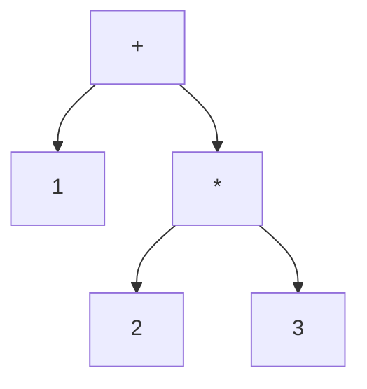

## 3.4 Writing Expressions and S-Expressions

In this section, we delve into the core of Clojure programming: expressions and S-expressions. Understanding these concepts is crucial for Java developers transitioning to Clojure, as they form the foundation of how code is structured and executed in this functional programming language. 

### Understanding Expressions in Clojure

Expressions in Clojure are the building blocks of the language. Unlike Java, where statements and expressions are distinct, Clojure treats everything as an expression. This means that every piece of code returns a value, making it inherently more composable and flexible.

#### Prefix Notation

Clojure uses prefix notation, also known as Polish notation, where the operator precedes its operands. This is a departure from the infix notation used in Java, where operators are placed between operands.

**Example: Arithmetic Operations**

In Java, you might write an arithmetic expression like this:

```java
int result = 1 + 2 * 3;
```

In Clojure, the same expression would be written using prefix notation:

```clojure
;; Clojure expression using prefix notation
(def result (+ 1 (* 2 3)))
```

**Explanation:**

- The `+` operator is placed before its operands `1` and `(* 2 3)`.
- The `*` operator is also placed before its operands `2` and `3`.
- This structure allows for easy nesting of expressions, as seen with the multiplication inside the addition.

### S-Expressions: The Heart of Clojure

S-expressions, or symbolic expressions, are a fundamental concept in Clojure and Lisp languages. They represent both code and data, embodying the principle of homoiconicity, where code is data and vice versa.

#### Structure of S-Expressions

An S-expression is typically a list where the first element is a function or operator, and the subsequent elements are arguments.

**Example: Function Call**

Consider a simple function call in Java:

```java
System.out.println("Hello, World!");
```

In Clojure, this would be expressed as an S-expression:

```clojure
;; Clojure function call using S-expression
(println "Hello, World!")
```

**Explanation:**

- `println` is the function being called.
- `"Hello, World!"` is the argument passed to the function.
- The entire expression is enclosed in parentheses, which is a hallmark of S-expressions.

#### Nesting S-Expressions

One of the powerful features of S-expressions is their ability to nest, allowing for complex expressions to be composed in a readable manner.

**Example: Nested Expressions**

Let's compare a nested expression in Java and Clojure:

```java
int result = Math.max(10, Math.min(5, 3));
```

In Clojure, this would be written as:

```clojure
;; Nested S-expression in Clojure
(def result (max 10 (min 5 3)))
```

**Explanation:**

- The `max` function takes two arguments: `10` and the result of `(min 5 3)`.
- The `min` function is evaluated first, demonstrating the natural flow of nested S-expressions.

### Comparing Java and Clojure Expressions

To further illustrate the differences and similarities between Java and Clojure, let's explore a few more examples.

#### Conditional Expressions

In Java, conditional logic is often expressed using `if` statements:

```java
int x = 10;
int y = 20;
int max = (x > y) ? x : y;
```

In Clojure, the equivalent logic uses the `if` expression:

```clojure
;; Conditional expression in Clojure
(def x 10)
(def y 20)
(def max (if (> x y) x y))
```

**Explanation:**

- The `if` expression in Clojure takes three arguments: a condition, a result if true, and a result if false.
- This aligns with the functional nature of Clojure, where expressions return values.

#### Looping Constructs

Java uses loops like `for` and `while` for iteration:

```java
for (int i = 0; i < 5; i++) {
    System.out.println(i);
}
```

Clojure uses recursion and higher-order functions instead:

```clojure
;; Looping in Clojure using recursion
(doseq [i (range 5)]
  (println i))
```

**Explanation:**

- `doseq` is a macro that iterates over a sequence, executing the body for each element.
- `range` generates a sequence of numbers from `0` to `4`.

### Try It Yourself

To solidify your understanding of expressions and S-expressions in Clojure, try modifying the examples above:

1. **Arithmetic Challenge**: Change the arithmetic expression to calculate `(3 + 4) * 5` and print the result.
2. **Conditional Logic**: Modify the conditional expression to find the minimum of two numbers.
3. **Looping Exercise**: Use `doseq` to print the squares of numbers from `1` to `5`.

### Visualizing S-Expressions

To better understand the structure of S-expressions, let's visualize them using a tree diagram.



**Diagram Explanation:**

- The root node `+` represents the addition operation.
- The left child `1` is the first operand.
- The right child is another S-expression `(* 2 3)`, representing multiplication.
- This tree structure illustrates how S-expressions naturally represent nested operations.

### Key Takeaways

- **Expressions in Clojure**: Everything is an expression, returning a value.
- **Prefix Notation**: Operators precede operands, simplifying nested expressions.
- **S-Expressions**: Symbolic expressions represent both code and data, enabling powerful abstractions.
- **Comparison with Java**: Clojure's expressions offer more flexibility and composability compared to Java's statements.

By mastering expressions and S-expressions, you unlock the full potential of Clojure's functional programming paradigm. As you continue your journey, remember to experiment and explore how these concepts can simplify and enhance your code.

### Exercises

1. **Rewrite Java Code**: Take a simple Java program and rewrite it in Clojure using S-expressions.
2. **Create a Function**: Write a Clojure function that takes two numbers and returns their average.
3. **Explore Nesting**: Create a deeply nested S-expression and evaluate it in the REPL.

### Further Reading

For more in-depth exploration of Clojure expressions and S-expressions, consider these resources:

- [Official Clojure Documentation](https://clojure.org/reference)
- [ClojureDocs](https://clojuredocs.org/)
- [Clojure for the Brave and True](https://www.braveclojure.com/)

---

## Quiz: Mastering Clojure Expressions and S-Expressions



### What is the primary characteristic of expressions in Clojure?

- [x] Everything is an expression and returns a value.
- [ ] Expressions are distinct from statements.
- [ ] Only arithmetic operations are expressions.
- [ ] Expressions do not return values.

> **Explanation:** In Clojure, everything is an expression, meaning every piece of code returns a value, unlike Java where statements and expressions are distinct.

### How does prefix notation differ from infix notation?

- [x] Operators precede operands in prefix notation.
- [ ] Operands precede operators in prefix notation.
- [ ] Prefix notation is used only for arithmetic operations.
- [ ] Prefix notation is the same as infix notation.

> **Explanation:** In prefix notation, operators come before their operands, which is different from infix notation where operators are between operands.

### What is an S-expression in Clojure?

- [x] A symbolic expression representing both code and data.
- [ ] A special type of data structure.
- [ ] An expression that only represents data.
- [ ] A syntax error in Clojure.

> **Explanation:** S-expressions are symbolic expressions that represent both code and data, embodying the principle of homoiconicity.

### How are nested expressions represented in Clojure?

- [x] As S-expressions within S-expressions.
- [ ] Using special syntax outside of S-expressions.
- [ ] Only through separate function calls.
- [ ] Using Java-style loops.

> **Explanation:** Nested expressions in Clojure are represented as S-expressions within other S-expressions, allowing for complex compositions.

### What is the result of the following Clojure expression: `(+ 1 (* 2 3))`?

- [x] 7
- [ ] 9
- [ ] 5
- [ ] 6

> **Explanation:** The expression `(+ 1 (* 2 3))` evaluates to `7` because `(* 2 3)` is `6`, and adding `1` results in `7`.

### Which of the following is a key advantage of using S-expressions?

- [x] They allow for easy nesting and composition.
- [ ] They are only used for arithmetic operations.
- [ ] They are less readable than Java code.
- [ ] They do not support function calls.

> **Explanation:** S-expressions allow for easy nesting and composition, making them powerful for representing complex logic.

### How does Clojure handle conditional logic compared to Java?

- [x] Using expressions that return values.
- [ ] Using statements that do not return values.
- [ ] Only through loops.
- [ ] Using Java-style `if` statements.

> **Explanation:** Clojure handles conditional logic using expressions that return values, unlike Java's statements.

### What is the purpose of the `doseq` macro in Clojure?

- [x] To iterate over a sequence and execute a body for each element.
- [ ] To define a new function.
- [ ] To create a new data structure.
- [ ] To handle exceptions.

> **Explanation:** The `doseq` macro is used to iterate over a sequence and execute a body for each element, similar to a loop.

### Which of the following best describes homoiconicity?

- [x] Code is represented as data and vice versa.
- [ ] Code is compiled into machine language.
- [ ] Data is stored in a database.
- [ ] Code is written in a specific syntax.

> **Explanation:** Homoiconicity means that code is represented as data and vice versa, a key feature of Lisp languages like Clojure.

### True or False: In Clojure, every piece of code is an expression that returns a value.

- [x] True
- [ ] False

> **Explanation:** True. In Clojure, every piece of code is an expression that returns a value, which is a fundamental aspect of the language.


