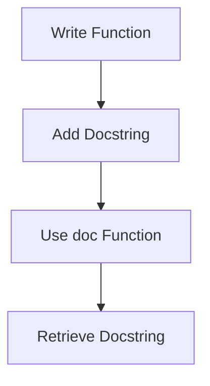

## 3.5 Commenting Code and Documentation

In this section, we will explore the essential practices for commenting and documenting Clojure code. As experienced Java developers, you are likely familiar with the importance of clear and concise documentation. In Clojure, commenting and documentation follow different conventions, which we will cover in detail. We will discuss how to write comments using the `;` character, utilize the `comment` macro for block comments, and create docstrings for functions, which can be retrieved using the `doc` function.

### Writing Comments in Clojure

#### Single-Line Comments with `;`

In Clojure, single-line comments are created using the semicolon (`;`). Everything following the semicolon on the same line is considered a comment and is ignored by the Clojure compiler. This is similar to using `//` in Java.

**Example:**

```clojure
; This is a single-line comment in Clojure
(defn add [a b]
  ; Adding two numbers
  (+ a b))
```

**Java Comparison:**

```java
// This is a single-line comment in Java
public int add(int a, int b) {
    // Adding two numbers
    return a + b;
}
```

**Best Practices:**

- Use single-line comments to explain complex logic or important decisions in your code.
- Keep comments concise and relevant to the code they accompany.
- Avoid stating the obvious; focus on the "why" rather than the "what."

#### Block Comments with the `comment` Macro

Clojure provides a `comment` macro that can be used to create block comments. This is particularly useful for temporarily disabling code or writing extensive documentation within your codebase.

**Example:**

```clojure
(comment
  "This is a block comment in Clojure.
  It can span multiple lines and is often used
  to disable code or write detailed explanations."
  (defn multiply [a b]
    (* a b)))
```

**Java Comparison:**

```java
/*
 This is a block comment in Java.
 It can span multiple lines and is often used
 to disable code or write detailed explanations.
*/
public int multiply(int a, int b) {
    return a * b;
}
```

**Best Practices:**

- Use block comments for large sections of code that need to be explained or temporarily disabled.
- Ensure that block comments are well-structured and easy to read.
- Avoid excessive use of block comments, as they can clutter the code.

### Writing Docstrings for Functions

Docstrings in Clojure are a way to document functions, providing a description of their purpose and usage. They are written as strings immediately following the function's argument vector and can be retrieved using the `doc` function.

**Example:**

```clojure
(defn subtract
  "Subtracts the second number from the first."
  [a b]
  (- a b))

(doc subtract)
```

**Output:**

```
-------------------------
user/subtract
([a b])
  Subtracts the second number from the first.
```

**Java Comparison:**

In Java, Javadoc comments are used to document methods. They are written using `/** ... */` syntax and can be processed to generate HTML documentation.

```java
/**
 * Subtracts the second number from the first.
 *
 * @param a the first number
 * @param b the second number
 * @return the result of subtracting b from a
 */
public int subtract(int a, int b) {
    return a - b;
}
```

**Best Practices:**

- Write clear and concise docstrings that describe the function's purpose, parameters, and return value.
- Use docstrings to provide examples of how the function can be used.
- Regularly update docstrings to reflect changes in the function's behavior.

### Retrieving Docstrings with `doc`

The `doc` function in Clojure is used to retrieve and display the docstring of a function. This is similar to using Javadoc in Java to view method documentation.

**Example:**

```clojure
(defn divide
  "Divides the first number by the second.
  Returns nil if the divisor is zero."
  [a b]
  (if (zero? b)
    nil
    (/ a b)))

(doc divide)
```

**Output:**

```
-------------------------
user/divide
([a b])
  Divides the first number by the second.
  Returns nil if the divisor is zero.
```

**Best Practices:**

- Use the `doc` function to verify that your docstrings are accurate and informative.
- Encourage team members to use `doc` to understand the functions they are working with.
- Consider integrating docstring checks into your code review process.

### Try It Yourself

To reinforce your understanding of commenting and documentation in Clojure, try modifying the following code examples:

1. Add a single-line comment explaining the purpose of the `multiply` function.
2. Use the `comment` macro to temporarily disable the `divide` function.
3. Write a docstring for a new function `modulus` that calculates the remainder of two numbers.

### Diagrams and Visual Aids

To better understand the flow of data and the role of comments in Clojure, consider the following diagram that illustrates the process of writing and retrieving docstrings:



**Diagram Description:** This flowchart shows the process of writing a function with a docstring, using the `doc` function to retrieve it, and viewing the documentation.

### Exercises and Practice Problems

1. **Exercise 1:** Write a Clojure function `power` that raises a number to a given exponent. Include a docstring and use the `doc` function to display it.

2. **Exercise 2:** Create a block comment using the `comment` macro that explains the logic of a recursive function `factorial`.

3. **Exercise 3:** Refactor a Java method to Clojure, ensuring that all comments and documentation are appropriately translated.

### Summary and Key Takeaways

- **Single-line comments** in Clojure are created using `;` and are similar to `//` in Java.
- **Block comments** can be written using the `comment` macro, analogous to `/* ... */` in Java.
- **Docstrings** provide a way to document functions and can be retrieved using the `doc` function.
- Effective commenting and documentation enhance code readability and maintainability.
- Regularly update comments and docstrings to reflect changes in code behavior.

By mastering these commenting and documentation techniques, you will improve the clarity and usability of your Clojure code, making it easier for others to understand and contribute to your projects.

### Further Reading

For more information on Clojure's commenting and documentation practices, consider exploring the following resources:

- [Official Clojure Documentation](https://clojure.org/reference/documentation)
- [ClojureDocs](https://clojuredocs.org/)
- [Effective Clojure Documentation Practices](https://github.com/clojure-cookbook/clojure-cookbook)

## Quiz: Mastering Clojure Commenting and Documentation



### What character is used for single-line comments in Clojure?

- [x] ;
- [ ] //
- [ ] #
- [ ] --

> **Explanation:** In Clojure, the semicolon `;` is used for single-line comments.

### How do you create a block comment in Clojure?

- [x] Using the `comment` macro
- [ ] Using `/* ... */`
- [ ] Using `#| ... |#`
- [ ] Using `// ... //`

> **Explanation:** The `comment` macro is used in Clojure to create block comments.

### What is the purpose of a docstring in Clojure?

- [x] To document the purpose and usage of a function
- [ ] To temporarily disable code
- [ ] To create inline comments
- [ ] To format code

> **Explanation:** Docstrings in Clojure are used to document the purpose and usage of a function.

### How can you retrieve a function's docstring in Clojure?

- [x] Using the `doc` function
- [ ] Using the `describe` function
- [ ] Using the `info` function
- [ ] Using the `help` function

> **Explanation:** The `doc` function is used to retrieve a function's docstring in Clojure.

### Which of the following is a best practice for writing comments?

- [x] Focus on explaining the "why" rather than the "what"
- [ ] Write comments for every line of code
- [ ] Use comments to restate the code
- [ ] Avoid using comments altogether

> **Explanation:** Comments should focus on explaining the "why" behind the code, not restating what the code does.

### What is the equivalent of Clojure's docstring in Java?

- [x] Javadoc comments
- [ ] Inline comments
- [ ] Block comments
- [ ] Annotations

> **Explanation:** Javadoc comments in Java serve a similar purpose to docstrings in Clojure.

### Which function is used to display a function's documentation in Clojure?

- [x] `doc`
- [ ] `show`
- [ ] `print`
- [ ] `display`

> **Explanation:** The `doc` function is used to display a function's documentation in Clojure.

### What is a common use for the `comment` macro in Clojure?

- [x] Temporarily disabling code
- [ ] Formatting code
- [ ] Creating inline comments
- [ ] Generating documentation

> **Explanation:** The `comment` macro is commonly used to temporarily disable code in Clojure.

### True or False: Docstrings in Clojure are optional.

- [x] True
- [ ] False

> **Explanation:** Docstrings in Clojure are optional, but they are recommended for documenting functions.

### What is the primary benefit of using docstrings in Clojure?

- [x] They improve code readability and maintainability
- [ ] They increase code execution speed
- [ ] They reduce memory usage
- [ ] They enhance security

> **Explanation:** Docstrings improve code readability and maintainability by providing clear documentation for functions.


