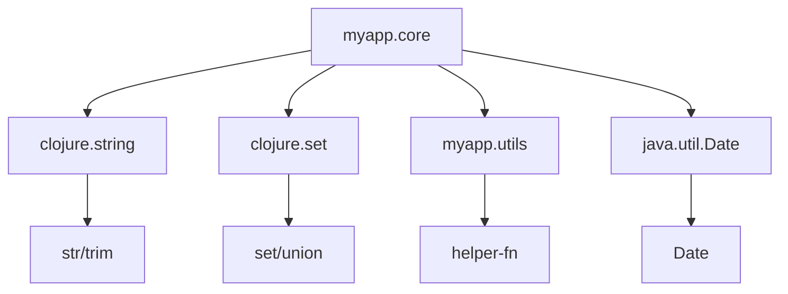

## 3.6 Namespaces and `require`/`use` Keywords

In this section, we will delve into the concept of namespaces in Clojure, a critical aspect of organizing and managing code in a functional programming environment. As experienced Java developers, you are already familiar with the concept of packages and imports. Clojure's approach to namespaces is somewhat analogous but offers unique features and flexibility that align with its functional programming paradigm.

### Understanding Namespaces in Clojure

Namespaces in Clojure serve a similar purpose to packages in Java: they help organize code and avoid name clashes by grouping related functions and variables. In Clojure, a namespace is essentially a mapping from symbols to values, allowing you to manage the scope of your code effectively.

#### Declaring a Namespace with `ns`

The `ns` macro is used to declare a namespace in a Clojure file. It is typically the first form in a file and sets up the context for everything that follows. Here's a basic example:

```clojure
(ns myapp.core)
```

This line declares a namespace `myapp.core`. All functions and variables defined in this file will belong to this namespace.

#### Using `ns` to Manage Dependencies

The `ns` macro can also be used to manage dependencies by requiring other namespaces, importing Java classes, and aliasing namespaces. Here's a more detailed example:

```clojure
(ns myapp.core
  (:require [clojure.string :as str]
            [myapp.utils :refer [helper-fn]])
  (:import (java.util Date)))
```

- **`:require`**: This keyword is used to include other Clojure namespaces. In the example, `clojure.string` is required and aliased as `str` for brevity. This means you can use `str/` to access functions from `clojure.string`.
- **`:refer`**: This option allows you to bring specific functions into the current namespace. Here, `helper-fn` from `myapp.utils` is referred directly.
- **`:import`**: This is used to import Java classes. In this case, `java.util.Date` is imported, allowing you to use `Date` directly in your code.

### Importing Other Namespaces with `require`, `use`, and `import`

Clojure provides several ways to include code from other namespaces, each with its own use case and benefits.

#### The `require` Keyword

The `require` keyword is the most common way to include other namespaces. It loads the specified namespace and makes its public vars available. Here's how you can use it:

```clojure
(require '[clojure.set :as set])
```

This line requires the `clojure.set` namespace and aliases it as `set`. You can now use functions from `clojure.set` with the `set/` prefix.

#### The `use` Keyword

The `use` keyword is similar to `require` but with a key difference: it automatically refers all public vars from the specified namespace into the current namespace. This can lead to name clashes, so it's generally recommended to use `require` with `:refer` for specific functions instead. Here's an example:

```clojure
(use 'clojure.set)
```

This line makes all public functions from `clojure.set` available without the `set/` prefix. However, be cautious with `use` as it can lead to conflicts if multiple namespaces have functions with the same name.

#### The `import` Keyword

The `import` keyword is used to bring Java classes into a Clojure namespace. This is particularly useful for Java interoperability. Here's an example:

```clojure
(import '(java.util Date Calendar))
```

This line imports `Date` and `Calendar` classes from `java.util`, allowing you to use them directly in your Clojure code.

### Aliasing Namespaces for Brevity

Aliasing is a powerful feature in Clojure that allows you to create shorthand references for namespaces, making your code cleaner and more readable. This is done using the `:as` option with `require`. Here's an example:

```clojure
(require '[clojure.java.io :as io])
```

With this alias, you can use `io/` to access functions from `clojure.java.io`, such as `io/file` or `io/reader`.

### Comparing Clojure Namespaces with Java Packages

In Java, you organize classes into packages, and you use `import` statements to access classes from other packages. Clojure's namespaces serve a similar purpose but with more flexibility:

- **Dynamic Loading**: Clojure namespaces can be loaded dynamically at runtime, which is not possible with Java packages.
- **Aliasing**: Clojure allows aliasing of namespaces, which is not directly supported in Java.
- **Referencing Specific Functions**: Clojure's `:refer` option allows you to include specific functions from a namespace, reducing the risk of name clashes.

### Code Example: Using Namespaces in Clojure

Let's look at a complete example that demonstrates how to use namespaces effectively in Clojure:

```clojure
(ns myapp.core
  (:require [clojure.string :as str]
            [clojure.set :as set]
            [myapp.utils :refer [helper-fn]])
  (:import (java.util Date)))

(defn process-data [data]
  ;; Use a function from clojure.string
  (let [trimmed (str/trim data)]
    ;; Use a function from clojure.set
    (set/union #{1 2} #{2 3})))

(defn current-date []
  ;; Create a new Date object
  (Date.))

;; Call the helper function from myapp.utils
(helper-fn)
```

In this example, we declare a namespace `myapp.core` and require several other namespaces and Java classes. We then define functions that use these imported resources.

### Try It Yourself

To get hands-on experience, try modifying the above example:

- Add another namespace and alias it.
- Use the `:refer` option to include specific functions.
- Import additional Java classes and use them in your functions.

### Diagram: Namespace and Dependency Management

Below is a diagram illustrating how namespaces and dependencies are managed in Clojure:



**Diagram Caption**: This diagram shows the relationships between the `myapp.core` namespace and its dependencies, including Clojure namespaces and Java classes.

### Best Practices for Using Namespaces

- **Use Aliases**: Always use aliases for namespaces to keep your code concise and readable.
- **Prefer `require` over `use`**: Use `require` with `:refer` for specific functions to avoid name clashes.
- **Organize Code Logically**: Group related functions and variables into namespaces that reflect their purpose.
- **Document Dependencies**: Clearly document the purpose of each required namespace and imported class.

### Exercises

1. Create a new Clojure project and set up a namespace structure similar to a Java package hierarchy.
2. Write a function that uses multiple namespaces and Java classes, demonstrating the use of `require`, `use`, and `import`.
3. Refactor an existing Java class into a Clojure namespace, using aliasing and specific function references.

### Summary and Key Takeaways

In this section, we've explored the concept of namespaces in Clojure and how they compare to Java packages. We've learned how to declare namespaces, manage dependencies using `require`, `use`, and `import`, and how to alias namespaces for brevity. By organizing code into namespaces, we can create modular, maintainable, and scalable Clojure applications.

For further reading, check out the [Official Clojure Documentation on Namespaces](https://clojure.org/reference/namespaces) and [ClojureDocs](https://clojuredocs.org/).

---

## Quiz: Mastering Clojure Namespaces and `require`/`use` Keywords



### What is the primary purpose of namespaces in Clojure?

- [x] To organize code and avoid name clashes
- [ ] To improve performance
- [ ] To enable dynamic typing
- [ ] To enforce security

> **Explanation:** Namespaces in Clojure are used to organize code and avoid name clashes, similar to packages in Java.

### Which keyword is used to declare a namespace in Clojure?

- [x] `ns`
- [ ] `require`
- [ ] `use`
- [ ] `import`

> **Explanation:** The `ns` keyword is used to declare a namespace in Clojure.

### What is the difference between `require` and `use` in Clojure?

- [x] `require` loads a namespace, while `use` loads and refers all public vars
- [ ] `require` is faster than `use`
- [ ] `use` is deprecated
- [ ] `require` is only for Java classes

> **Explanation:** `require` loads a namespace, while `use` loads and refers all public vars, which can lead to name clashes.

### How do you alias a namespace in Clojure?

- [x] Using the `:as` option with `require`
- [ ] Using the `:alias` keyword
- [ ] By renaming the namespace
- [ ] By using `use`

> **Explanation:** You can alias a namespace in Clojure using the `:as` option with `require`.

### Which keyword is used to import Java classes in Clojure?

- [x] `import`
- [ ] `require`
- [ ] `use`
- [ ] `ns`

> **Explanation:** The `import` keyword is used to bring Java classes into a Clojure namespace.

### What is a potential downside of using `use` in Clojure?

- [x] It can lead to name clashes
- [ ] It is slower than `require`
- [ ] It does not support aliasing
- [ ] It cannot import Java classes

> **Explanation:** Using `use` can lead to name clashes because it refers all public vars from a namespace.

### How can you include specific functions from another namespace?

- [x] Using `:refer` with `require`
- [ ] Using `:import`
- [ ] Using `:include`
- [ ] Using `:alias`

> **Explanation:** You can include specific functions from another namespace using `:refer` with `require`.

### What is the benefit of aliasing a namespace?

- [x] It makes code cleaner and more readable
- [ ] It improves performance
- [ ] It prevents errors
- [ ] It is required by the Clojure compiler

> **Explanation:** Aliasing a namespace makes code cleaner and more readable by providing a shorthand reference.

### Which of the following is a correct way to import a Java class in Clojure?

- [x] `(import '(java.util Date))`
- [ ] `(require '(java.util Date))`
- [ ] `(use '(java.util Date))`
- [ ] `(ns '(java.util Date))`

> **Explanation:** `(import '(java.util Date))` is the correct way to import a Java class in Clojure.

### True or False: Clojure namespaces can be loaded dynamically at runtime.

- [x] True
- [ ] False

> **Explanation:** Clojure namespaces can be loaded dynamically at runtime, providing flexibility in managing dependencies.


