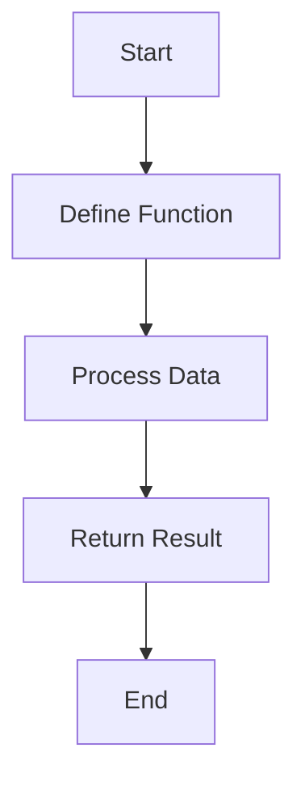

## 3.7 Coding Style and Formatting

As experienced Java developers transitioning to Clojure, understanding the nuances of Clojure's coding style and formatting is crucial for writing clean, maintainable, and idiomatic code. While Java and Clojure share some similarities, Clojure's functional nature and Lisp heritage introduce unique conventions and practices. In this section, we'll explore guidelines for consistent indentation and spacing, naming conventions for functions and variables, and tools like `cljfmt` for auto-formatting. Let's dive in!

### Consistent Indentation and Spacing

Indentation and spacing are vital for readability and maintainability in any programming language. In Clojure, these elements are particularly important due to its Lisp syntax, where parentheses play a significant role.

#### Indentation Guidelines

Clojure code is typically indented to reflect the structure of expressions. Here's a basic example:

```clojure
(defn example-function
  "This is a simple example function."
  [arg1 arg2]
  (let [result (+ arg1 arg2)]
    (println "The result is:" result)
    result))
```

- **Function Definitions**: Indent the function body by two spaces from the function name.
- **Let Bindings**: Align the bindings vertically, with the body indented further.
- **Nested Expressions**: Each nested level should be indented consistently, usually by two spaces.

#### Spacing Guidelines

Proper spacing enhances readability by separating logical units within code:

- **Around Operators**: Use spaces around operators for clarity.
  ```clojure
  (+ 1 2) ; Correct
  (+1 2)  ; Incorrect
  ```

- **Inside Data Structures**: Maintain consistent spacing within collections.
  ```clojure
  {:key1 "value1", :key2 "value2"} ; Correct
  {:key1"value1",:key2"value2"}    ; Incorrect
  ```

- **Function Calls**: Avoid unnecessary spaces between the function name and the opening parenthesis.
  ```clojure
  (my-function arg1 arg2) ; Correct
  (my-function  arg1 arg2) ; Incorrect
  ```

### Naming Conventions for Functions and Variables

Naming conventions in Clojure differ from Java due to its functional nature and emphasis on immutability. Here are some best practices:

#### Functions

- **Verb-Based Names**: Functions should generally be named with verbs to indicate actions.
  ```clojure
  (defn calculate-sum [a b]
    (+ a b))
  ```

- **Hyphenated Names**: Use hyphens to separate words in function names, unlike Java's camelCase.
  ```clojure
  (defn fetch-user-data [])
  ```

#### Variables

- **Descriptive Names**: Use descriptive names that convey the purpose of the variable.
  ```clojure
  (let [user-name "Alice"])
  ```

- **Snake Case for Constants**: Use snake_case for constants, similar to Java's convention.
  ```clojure
  (def pi-value 3.14159)
  ```

- **Avoid Single-Letter Names**: Unless in a very limited scope, avoid single-letter variable names.

### Using Tools Like `cljfmt` for Auto-Formatting

Consistency in code formatting can be challenging, especially in collaborative environments. Tools like `cljfmt` can help maintain a consistent style across your codebase.

#### Setting Up `cljfmt`

`cljfmt` is a popular tool for formatting Clojure code. It can be integrated into your development workflow to automatically format code according to predefined rules.

1. **Installation**: Add `cljfmt` to your project dependencies.
   ```clojure
   ;; Add to your `project.clj` or `deps.edn`
   [cljfmt "0.6.8"]
   ```

2. **Configuration**: Customize `cljfmt` settings in a `.cljfmt.edn` file.
   ```clojure
   {:indents {defn [[:block 1]]}
    :remove-surrounding-whitespace? true}
   ```

3. **Usage**: Run `cljfmt` to format your code.
   ```bash
   lein cljfmt fix
   ```

#### Benefits of Auto-Formatting

- **Consistency**: Ensures all code follows the same style guidelines.
- **Efficiency**: Saves time by automating the formatting process.
- **Collaboration**: Reduces friction in code reviews by standardizing code appearance.

### Comparing Clojure and Java Code Style

While both Java and Clojure emphasize readability and maintainability, their stylistic conventions reflect their underlying paradigms.

#### Java Example

```java
public class Example {
    public static void main(String[] args) {
        int result = add(5, 3);
        System.out.println("The result is: " + result);
    }

    public static int add(int a, int b) {
        return a + b;
    }
}
```

#### Clojure Equivalent

```clojure
(defn add [a b]
  (+ a b))

(defn -main [& args]
  (let [result (add 5 3)]
    (println "The result is:" result)))
```

**Key Differences**:
- **Function Definitions**: Clojure uses `defn` for defining functions, with a focus on immutability.
- **Data Structures**: Clojure's syntax for collections is more concise and expressive.
- **Immutability**: Clojure emphasizes immutability, reducing side effects and enhancing concurrency.

### Try It Yourself

Experiment with the following code snippets to reinforce your understanding of Clojure's coding style:

1. **Modify Indentation**: Adjust the indentation of a nested function to see how it affects readability.
2. **Rename Functions**: Change function names to follow Clojure's naming conventions.
3. **Use `cljfmt`**: Run `cljfmt` on your code and observe the changes.

### Diagrams and Visual Aids

To further illustrate these concepts, let's visualize the flow of data through a simple Clojure function using a Mermaid.js diagram:



**Diagram Description**: This flowchart represents the typical flow of data through a Clojure function, from definition to processing and returning the result.

### Exercises and Practice Problems

1. **Exercise 1**: Refactor a Java method to Clojure, applying Clojure's naming conventions and formatting guidelines.
2. **Exercise 2**: Use `cljfmt` to format a block of Clojure code and compare it to the original.
3. **Exercise 3**: Create a Clojure function with nested expressions and practice consistent indentation.

### Summary and Key Takeaways

- **Consistency is Key**: Consistent indentation and spacing enhance readability and maintainability.
- **Embrace Clojure's Conventions**: Adopt Clojure's naming conventions for functions and variables to write idiomatic code.
- **Leverage Tools**: Use tools like `cljfmt` to automate formatting and ensure consistency across your codebase.

By mastering these coding style and formatting guidelines, you'll be well-equipped to write clean, maintainable Clojure code that leverages the language's functional programming strengths. Now that we've explored these foundational concepts, let's apply them to your Clojure projects and see the difference they make!

## Quiz: Mastering Clojure Coding Style and Formatting



### What is the recommended indentation level for nested expressions in Clojure?

- [x] Two spaces
- [ ] Four spaces
- [ ] One tab
- [ ] No indentation

> **Explanation:** Clojure typically uses two spaces for indentation to maintain readability and consistency.

### How should functions be named in Clojure?

- [x] Using hyphenated names
- [ ] Using camelCase
- [ ] Using snake_case
- [ ] Using uppercase letters

> **Explanation:** Clojure functions are typically named using hyphenated names to separate words, unlike Java's camelCase.

### What tool can be used for auto-formatting Clojure code?

- [x] cljfmt
- [ ] Prettier
- [ ] ESLint
- [ ] Black

> **Explanation:** `cljfmt` is a popular tool for auto-formatting Clojure code according to predefined style guidelines.

### Which of the following is a benefit of using auto-formatting tools?

- [x] Ensures consistent code style
- [ ] Increases code complexity
- [ ] Reduces code readability
- [ ] Increases manual formatting effort

> **Explanation:** Auto-formatting tools like `cljfmt` ensure consistent code style, enhancing readability and maintainability.

### How should constants be named in Clojure?

- [x] Using snake_case
- [ ] Using camelCase
- [x] Using uppercase letters
- [ ] Using hyphenated names

> **Explanation:** Constants in Clojure are often named using snake_case or uppercase letters, similar to Java's convention.

### What is the purpose of spacing around operators in Clojure?

- [x] To enhance readability
- [ ] To increase code length
- [ ] To reduce execution time
- [ ] To obscure code logic

> **Explanation:** Spacing around operators enhances readability by clearly separating logical units within the code.

### Which of the following is a key difference between Java and Clojure code style?

- [x] Clojure uses hyphenated names for functions
- [ ] Java uses hyphenated names for functions
- [x] Clojure emphasizes immutability
- [ ] Java emphasizes immutability

> **Explanation:** Clojure uses hyphenated names for functions and emphasizes immutability, unlike Java.

### What is the role of `cljfmt` in a Clojure project?

- [x] To format code according to style guidelines
- [ ] To compile Clojure code
- [ ] To execute Clojure scripts
- [ ] To manage project dependencies

> **Explanation:** `cljfmt` is used to format Clojure code according to predefined style guidelines, ensuring consistency.

### How can you ensure consistent formatting in a collaborative Clojure project?

- [x] Use `cljfmt` for auto-formatting
- [ ] Rely on manual formatting
- [ ] Use different styles for each developer
- [ ] Avoid formatting altogether

> **Explanation:** Using `cljfmt` for auto-formatting ensures consistent formatting across a collaborative Clojure project.

### True or False: Clojure's coding style emphasizes the use of mutable data structures.

- [ ] True
- [x] False

> **Explanation:** Clojure's coding style emphasizes immutability, reducing side effects and enhancing concurrency.


