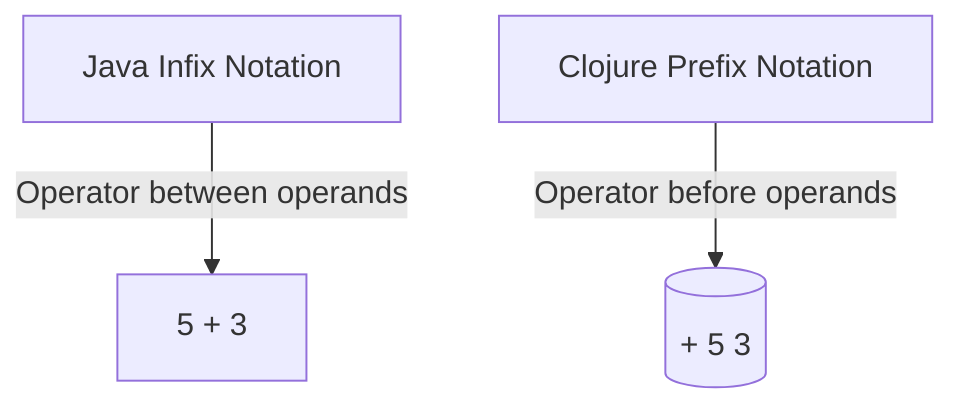
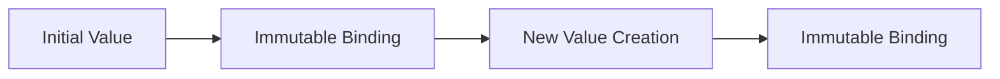

## 3.8 Differences from Java Syntax

As experienced Java developers, transitioning to Clojure involves adapting to a new syntax and programming paradigm. This section highlights the key syntactic differences between Java and Clojure, focusing on prefix notation, immutability, and the absence of traditional class and object syntax. Understanding these differences will help you leverage Clojure's strengths and write idiomatic functional code.

### Prefix Notation vs. Infix Notation

One of the most noticeable differences between Java and Clojure is the use of prefix notation in Clojure, as opposed to the infix notation commonly used in Java. In prefix notation, the operator precedes its operands, which can initially seem unfamiliar to those accustomed to Java's syntax.

#### Java's Infix Notation

In Java, arithmetic and logical operations are typically written in infix notation, where the operator is placed between the operands. For example:

```java
int sum = 5 + 3; // Infix notation for addition
boolean isEqual = (5 == 3); // Infix notation for equality check
```

#### Clojure's Prefix Notation

In Clojure, operations are expressed in prefix notation, where the operator comes first, followed by the operands enclosed in parentheses. This approach is consistent with Lisp languages and allows for more flexible and powerful expression composition.

```clojure
(def sum (+ 5 3)) ; Prefix notation for addition
(def is-equal (= 5 3)) ; Prefix notation for equality check
```

**Why Prefix Notation?**

- **Uniformity**: Prefix notation provides a uniform syntax for all operations, making it easier to compose and nest expressions.
- **Flexibility**: It allows for the creation of higher-order functions and macros, enabling powerful abstractions.

#### Try It Yourself

Experiment with converting the following Java expressions to Clojure's prefix notation:

1. `int product = 4 * 7;`
2. `boolean isGreater = (10 > 5);`

### No Variable Reassignment (Immutability)

Clojure emphasizes immutability, meaning once a value is assigned to a variable, it cannot be changed. This is a significant shift from Java, where variables can be reassigned.

#### Java's Mutable Variables

In Java, variables can be reassigned, allowing for mutable state:

```java
int counter = 0;
counter = counter + 1; // Reassignment is allowed
```

#### Clojure's Immutable Bindings

In Clojure, once a value is bound to a name using `def`, it cannot be changed. Instead, new values are created, promoting a functional style of programming.

```clojure
(def counter 0)
(def new-counter (+ counter 1)) ; Create a new value instead of reassigning
```

**Benefits of Immutability**

- **Thread Safety**: Immutability eliminates issues related to shared mutable state, making concurrent programming safer and easier.
- **Predictability**: Code becomes more predictable and easier to reason about, as values do not change unexpectedly.

#### Try It Yourself

Refactor the following Java code to use Clojure's immutable approach:

```java
int total = 100;
total = total - 20;
```

### Lack of Class and Object Syntax

Clojure is a functional language and does not use the traditional class and object syntax found in Java. Instead, it focuses on functions and data.

#### Java's Class and Object Syntax

Java is an object-oriented language, where classes and objects are fundamental constructs:

```java
public class Car {
    private String model;

    public Car(String model) {
        this.model = model;
    }

    public String getModel() {
        return model;
    }
}
```

#### Clojure's Functional Approach

Clojure does not have classes or objects. Instead, it uses functions and data structures like maps to represent entities:

```clojure
(defn create-car [model]
  {:model model})

(defn get-model [car]
  (:model car))

(def my-car (create-car "Tesla"))
(get-model my-car) ; Accessing the model
```

**Advantages of Clojure's Approach**

- **Simplicity**: Reduces complexity by focusing on functions and data.
- **Flexibility**: Encourages composition over inheritance, leading to more modular and reusable code.

#### Try It Yourself

Convert the following Java class to a Clojure function-based representation:

```java
public class Book {
    private String title;

    public Book(String title) {
        this.title = title;
    }

    public String getTitle() {
        return title;
    }
}
```

### Additional Syntactic Differences

#### Function Definitions

In Java, methods are defined within classes, while in Clojure, functions are first-class citizens and can be defined independently.

**Java Method Definition**

```java
public int add(int a, int b) {
    return a + b;
}
```

**Clojure Function Definition**

```clojure
(defn add [a b]
  (+ a b))
```

#### Conditional Expressions

Clojure uses `if`, `cond`, and `case` for conditional logic, which is more expressive compared to Java's `if-else` and `switch`.

**Java Conditional**

```java
if (x > 0) {
    System.out.println("Positive");
} else {
    System.out.println("Non-positive");
}
```

**Clojure Conditional**

```clojure
(if (> x 0)
  (println "Positive")
  (println "Non-positive"))
```

#### Looping Constructs

Clojure favors recursion and higher-order functions like `map`, `reduce`, and `filter` over traditional loops.

**Java Loop**

```java
for (int i = 0; i < 10; i++) {
    System.out.println(i);
}
```

**Clojure Loop**

```clojure
(doseq [i (range 10)]
  (println i))
```

### Diagrams and Visual Aids

#### Prefix vs. Infix Notation



*Diagram 1: Comparison of Java's infix notation and Clojure's prefix notation.*

#### Immutability Flow



*Diagram 2: Flow of data in Clojure's immutable model.*

### Exercises and Practice Problems

1. **Convert Java Expressions**: Rewrite the following Java expressions in Clojure's prefix notation:
   - `int difference = 10 - 5;`
   - `boolean isLess = (3 < 7);`

2. **Immutable Refactoring**: Refactor the following Java code to use Clojure's immutable approach:
   ```java
   int score = 50;
   score = score + 10;
   ```

3. **Class to Function Conversion**: Convert the following Java class to a Clojure function-based representation:
   ```java
   public class Student {
       private String name;

       public Student(String name) {
           this.name = name;
       }

       public String getName() {
           return name;
       }
   }
   ```

### Summary and Key Takeaways

- **Prefix Notation**: Clojure uses prefix notation, which provides uniformity and flexibility in expression composition.
- **Immutability**: Clojure's emphasis on immutability enhances thread safety and predictability.
- **Functional Approach**: Clojure's lack of class and object syntax encourages a functional style, focusing on functions and data.
- **Syntactic Simplicity**: Clojure's syntax is designed to be simple and expressive, promoting readability and maintainability.

By understanding these differences, you can effectively transition from Java to Clojure and harness the power of functional programming.

### Further Reading

- [Official Clojure Documentation](https://clojure.org/)
- [ClojureDocs](https://clojuredocs.org/)
- [Functional Programming in Clojure](https://www.braveclojure.com/)

## Quiz: Understanding Clojure Syntax Differences



### What is the primary notation used in Clojure for operations?

- [x] Prefix notation
- [ ] Infix notation
- [ ] Postfix notation
- [ ] Polish notation

> **Explanation:** Clojure uses prefix notation, where the operator precedes its operands, unlike Java's infix notation.

### How does Clojure handle variable reassignment?

- [x] Variables are immutable
- [ ] Variables can be reassigned
- [ ] Variables are mutable by default
- [ ] Variables require explicit locking

> **Explanation:** Clojure emphasizes immutability, meaning once a value is assigned, it cannot be changed.

### Which of the following is absent in Clojure's syntax?

- [x] Class and object syntax
- [ ] Function definitions
- [ ] Conditional expressions
- [ ] Looping constructs

> **Explanation:** Clojure does not have traditional class and object syntax, focusing instead on functions and data.

### What is the benefit of Clojure's immutability?

- [x] Enhanced thread safety
- [ ] Increased complexity
- [ ] Reduced performance
- [ ] More verbose code

> **Explanation:** Immutability in Clojure enhances thread safety by eliminating issues related to shared mutable state.

### How are functions defined in Clojure?

- [x] Using the `defn` keyword
- [ ] Inside classes
- [ ] With the `function` keyword
- [ ] Using `def` for all definitions

> **Explanation:** Functions in Clojure are defined using the `defn` keyword, making them first-class citizens.

### Which looping construct is preferred in Clojure?

- [x] Higher-order functions like `map`
- [ ] Traditional `for` loops
- [ ] `while` loops
- [ ] `do-while` loops

> **Explanation:** Clojure favors higher-order functions like `map`, `reduce`, and `filter` over traditional loops.

### What is a key advantage of prefix notation?

- [x] Uniformity and flexibility
- [ ] Complexity in expression composition
- [ ] Limited operator support
- [ ] Requires more parentheses

> **Explanation:** Prefix notation provides uniformity and flexibility, allowing for powerful expression composition.

### How does Clojure's approach to classes differ from Java?

- [x] Clojure uses functions and data structures
- [ ] Clojure uses classes and objects
- [ ] Clojure requires inheritance
- [ ] Clojure uses interfaces extensively

> **Explanation:** Clojure does not use classes and objects, focusing on functions and data structures instead.

### What is the primary focus of Clojure's syntax?

- [x] Simplicity and expressiveness
- [ ] Complexity and verbosity
- [ ] Object-oriented design
- [ ] Low-level programming

> **Explanation:** Clojure's syntax is designed to be simple and expressive, promoting readability and maintainability.

### True or False: Clojure allows for variable reassignment.

- [ ] True
- [x] False

> **Explanation:** Clojure emphasizes immutability, meaning variables cannot be reassigned once a value is bound.


