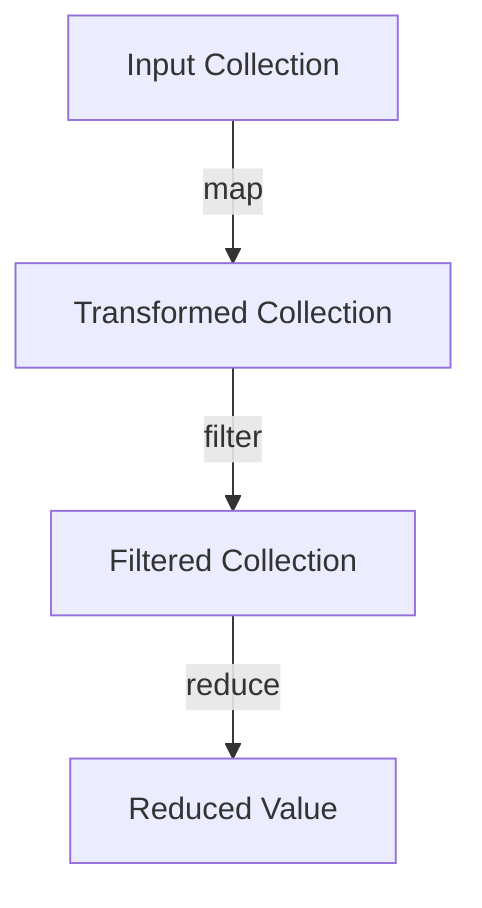
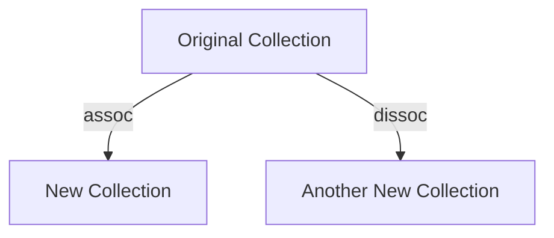

## 3.9 Practical Examples and Exercises

Welcome to the practical section of our Clojure guide, where we will solidify your understanding of Clojure's fundamental syntax and concepts through hands-on examples and exercises. As experienced Java developers, you already have a strong foundation in programming. This section will leverage that knowledge to help you transition smoothly into Clojure's functional programming paradigm.

### 3.9.1 Simple Functions and Data Manipulations

Let's start by exploring how to create simple functions and manipulate data in Clojure. We'll compare these examples with Java to highlight the differences and similarities.

#### Defining Functions

In Java, you define a method within a class. In Clojure, functions are first-class citizens and can be defined using the `defn` keyword.

**Java Example:**

```java
public class Example {
    public static int add(int a, int b) {
        return a + b;
    }
}
```

**Clojure Equivalent:**

```clojure
(defn add [a b]
  (+ a b))
```

- **Explanation:** The `defn` keyword is used to define a function named `add` that takes two parameters, `a` and `b`, and returns their sum using the `+` operator.

#### Data Manipulation with Collections

Clojure provides powerful data structures like lists, vectors, maps, and sets. Let's see how we can manipulate these collections.

**Java Example:**

```java
import java.util.Arrays;
import java.util.List;

public class Example {
    public static List<Integer> doubleValues(List<Integer> numbers) {
        return numbers.stream()
                      .map(n -> n * 2)
                      .collect(Collectors.toList());
    }
}
```

**Clojure Equivalent:**

```clojure
(defn double-values [numbers]
  (map #(* 2 %) numbers))
```

- **Explanation:** The `map` function applies a given function to each element of the collection. Here, `#(* 2 %)` is an anonymous function that doubles each number.

**Try It Yourself:** Modify the `double-values` function to filter out odd numbers before doubling them.

### 3.9.2 Exercises: Creating and Using Different Data Types

Now, let's practice creating and using different data types in Clojure. We'll explore lists, vectors, maps, and sets.

#### Lists and Vectors

Lists and vectors are sequential collections in Clojure. Lists are linked lists, while vectors are indexed collections.

**Exercise:** Create a list of numbers and a vector of strings. Write a function to concatenate the vector elements into a single string.

**Solution:**

```clojure
(def numbers '(1 2 3 4 5))
(def words ["Hello" "world" "from" "Clojure"])

(defn concatenate-words [words]
  (clojure.string/join " " words))

(concatenate-words words) ; => "Hello world from Clojure"
```

- **Explanation:** The `clojure.string/join` function concatenates the elements of the vector `words` into a single string with spaces.

#### Maps and Sets

Maps are key-value pairs, and sets are collections of unique elements.

**Exercise:** Create a map of student names to their grades and a set of subjects. Write a function to add a new student to the map.

**Solution:**

```clojure
(def students {"Alice" 90, "Bob" 85})
(def subjects #{"Math" "Science" "History"})

(defn add-student [students name grade]
  (assoc students name grade))

(add-student students "Charlie" 92) ; => {"Alice" 90, "Bob" 85, "Charlie" 92}
```

- **Explanation:** The `assoc` function adds a new key-value pair to the map.

**Try It Yourself:** Modify the `add-student` function to update a student's grade if they already exist in the map.

### 3.9.3 Experimenting in the REPL

The REPL (Read-Eval-Print Loop) is a powerful tool for experimenting with Clojure code. Let's use it to explore some interactive exercises.

#### REPL Basics

Start the REPL and try evaluating simple expressions. For example:

```clojure
(+ 1 2 3) ; => 6
```

- **Explanation:** The REPL evaluates the expression and returns the result.

#### Defining Functions in the REPL

Define a function in the REPL and test it with different inputs.

```clojure
(defn greet [name]
  (str "Hello, " name "!"))

(greet "Alice") ; => "Hello, Alice!"
```

- **Explanation:** The `str` function concatenates strings.

**Try It Yourself:** Define a function in the REPL that takes a list of names and returns a greeting for each name.

### 3.9.4 Comparing Clojure and Java

Let's compare some common tasks in Clojure and Java to understand how Clojure's functional approach simplifies code.

#### Filtering Collections

**Java Example:**

```java
import java.util.Arrays;
import java.util.List;
import java.util.stream.Collectors;

public class Example {
    public static List<Integer> filterEvenNumbers(List<Integer> numbers) {
        return numbers.stream()
                      .filter(n -> n % 2 == 0)
                      .collect(Collectors.toList());
    }
}
```

**Clojure Equivalent:**

```clojure
(defn filter-even-numbers [numbers]
  (filter even? numbers))
```

- **Explanation:** The `filter` function in Clojure takes a predicate function (`even?`) and a collection, returning a new collection of elements that satisfy the predicate.

#### Summing Numbers

**Java Example:**

```java
import java.util.Arrays;
import java.util.List;

public class Example {
    public static int sumNumbers(List<Integer> numbers) {
        return numbers.stream()
                      .mapToInt(Integer::intValue)
                      .sum();
    }
}
```

**Clojure Equivalent:**

```clojure
(defn sum-numbers [numbers]
  (reduce + numbers))
```

- **Explanation:** The `reduce` function applies a binary function (`+`) cumulatively to the elements of the collection, reducing it to a single value.

**Try It Yourself:** Modify the `sum-numbers` function to calculate the product of the numbers instead of the sum.

### 3.9.5 Visualizing Data Flow and Immutability

To better understand Clojure's data flow and immutability, let's visualize these concepts using diagrams.

#### Data Flow Through Higher-Order Functions



- **Caption:** This diagram illustrates the flow of data through a series of higher-order functions: `map`, `filter`, and `reduce`.

#### Immutability and Persistent Data Structures



- **Caption:** This diagram shows how Clojure's persistent data structures allow for efficient creation of new collections without modifying the original.

### 3.9.6 Exercises and Practice Problems

Let's reinforce your learning with some exercises and practice problems.

#### Exercise 1: Transforming Data

Write a function that takes a list of numbers and returns a list of their squares, excluding negative numbers.

**Solution:**

```clojure
(defn square-non-negative [numbers]
  (->> numbers
       (filter (fn [n] (>= n 0)))
       (map (fn [n] (* n n)))))
```

- **Explanation:** The `->>` macro threads the collection through the functions `filter` and `map`.

#### Exercise 2: Managing State

Create a function that simulates a simple bank account. It should take an initial balance and a list of transactions (positive for deposits, negative for withdrawals) and return the final balance.

**Solution:**

```clojure
(defn calculate-balance [initial-balance transactions]
  (reduce + initial-balance transactions))

(calculate-balance 100 [20 -10 50 -30]) ; => 130
```

- **Explanation:** The `reduce` function accumulates the transactions starting from the initial balance.

**Try It Yourself:** Modify the `calculate-balance` function to reject transactions that would result in a negative balance.

### 3.9.7 Summary and Key Takeaways

In this section, we've explored practical examples and exercises to reinforce your understanding of Clojure's syntax and concepts. We've compared Clojure with Java to highlight the benefits of functional programming, such as concise code and powerful data manipulation capabilities.

**Key Takeaways:**

- Clojure's functions are first-class citizens, allowing for concise and expressive code.
- Immutability and persistent data structures enable safe and efficient data manipulation.
- The REPL is a powerful tool for experimenting and testing code interactively.
- Higher-order functions like `map`, `filter`, and `reduce` simplify data processing tasks.

Now that we've explored these practical examples, let's continue to build on this foundation as we delve deeper into Clojure's advanced features and capabilities.

## Clojure Practical Examples Quiz



### What is the primary advantage of using higher-order functions like `map` and `filter` in Clojure?

- [x] They allow for concise and expressive data transformations.
- [ ] They enable mutable state changes.
- [ ] They improve the performance of Java applications.
- [ ] They are only used for debugging purposes.

> **Explanation:** Higher-order functions like `map` and `filter` enable concise and expressive data transformations by applying functions to collections.

### How does Clojure handle immutability in its data structures?

- [x] By creating new collections instead of modifying existing ones.
- [ ] By allowing direct mutation of data structures.
- [ ] By using locks and synchronization.
- [ ] By storing data in a database.

> **Explanation:** Clojure handles immutability by creating new collections with changes, leaving the original collections unchanged.

### What is the purpose of the `reduce` function in Clojure?

- [x] To accumulate values in a collection to a single result.
- [ ] To filter elements from a collection.
- [ ] To map values to a new collection.
- [ ] To concatenate strings.

> **Explanation:** The `reduce` function accumulates values in a collection to a single result by applying a binary function.

### In Clojure, what does the `assoc` function do?

- [x] Adds or updates a key-value pair in a map.
- [ ] Removes a key-value pair from a map.
- [ ] Concatenates two lists.
- [ ] Filters elements from a collection.

> **Explanation:** The `assoc` function adds or updates a key-value pair in a map, creating a new map.

### Which of the following is a key feature of Clojure's REPL?

- [x] Interactive code evaluation and testing.
- [ ] Compiling Java bytecode.
- [ ] Managing database connections.
- [ ] Generating HTML reports.

> **Explanation:** Clojure's REPL allows for interactive code evaluation and testing, making it a powerful tool for development.

### What is the result of `(map #(* 2 %) [1 2 3])` in Clojure?

- [x] (2 4 6)
- [ ] (1 2 3)
- [ ] (3 6 9)
- [ ] (0 0 0)

> **Explanation:** The `map` function applies the anonymous function `#(* 2 %)` to each element of the collection, resulting in (2 4 6).

### How does Clojure's `filter` function work?

- [x] It returns a new collection with elements that satisfy a predicate.
- [ ] It modifies the original collection in place.
- [ ] It sorts the elements of a collection.
- [ ] It concatenates two collections.

> **Explanation:** The `filter` function returns a new collection with elements that satisfy a given predicate function.

### What is the purpose of the `->>` macro in Clojure?

- [x] To thread a collection through a series of functions.
- [ ] To define a new function.
- [ ] To create a new namespace.
- [ ] To handle exceptions.

> **Explanation:** The `->>` macro threads a collection through a series of functions, making code more readable.

### In Clojure, how do you define an anonymous function?

- [x] Using the `#()` syntax.
- [ ] Using the `defn` keyword.
- [ ] Using the `let` keyword.
- [ ] Using the `fn` keyword.

> **Explanation:** Anonymous functions in Clojure can be defined using the `#()` syntax for concise function expressions.

### True or False: Clojure allows for mutable state changes by default.

- [ ] True
- [x] False

> **Explanation:** False. Clojure emphasizes immutability, and mutable state changes are not allowed by default.


