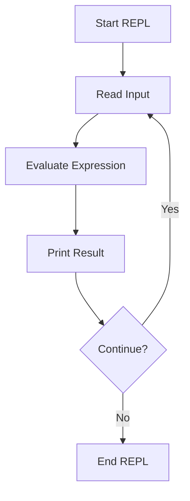

## 4.1.1 What Is a REPL?

In the world of Clojure development, the REPL, or Read-Eval-Print Loop, stands as a cornerstone tool that transforms the way developers interact with code. For Java developers venturing into Clojure, understanding the REPL is crucial, as it offers a paradigm shift from traditional compile-run-debug cycles to a more interactive and dynamic form of programming. This section delves into the essence of the REPL, its role in Clojure development, and the myriad benefits it offers for experimentation and learning.

### Defining the REPL

The REPL, an acronym for Read-Eval-Print Loop, is an interactive programming environment that allows developers to enter expressions, evaluate them, and view the results immediately. This cycle of reading input, evaluating it, printing the result, and looping back to read again is the fundamental process that defines a REPL session.

In Clojure, the REPL serves as a live environment where code can be tested, debugged, and refined in real-time. Unlike traditional development environments where code must be compiled and executed separately, the REPL integrates these steps, providing immediate feedback and facilitating a more exploratory approach to coding.

### The Role of the REPL in Clojure Development

The REPL is not just a tool but a philosophy that embodies the principles of interactive and incremental development. It plays a pivotal role in Clojure development by enabling:

1. **Interactive Programming**: The REPL allows developers to interact with their codebase in real-time. This interaction is not limited to executing functions but extends to modifying code, redefining functions, and even altering program state on the fly. This capability is particularly beneficial for testing hypotheses, exploring APIs, and understanding complex codebases.

2. **Rapid Feedback**: One of the most significant advantages of the REPL is the rapid feedback loop it provides. Developers can see the results of their code immediately, which accelerates the development process and reduces the time spent on debugging. This immediacy is especially valuable when experimenting with new ideas or learning new concepts, as it allows for quick iterations and adjustments.

3. **Incremental Development**: The REPL supports an incremental approach to development, where small changes can be tested and validated before being integrated into the larger codebase. This approach aligns well with the principles of functional programming, where functions are often small, composable units that can be developed and tested independently.

### Benefits of Using the REPL for Experimentation and Learning

The REPL is an invaluable tool for both seasoned developers and newcomers to Clojure. Its benefits extend beyond mere convenience, offering profound advantages for experimentation and learning:

- **Experimentation**: The REPL provides a sandbox environment where developers can experiment with new ideas without the risk of breaking the existing codebase. This freedom encourages creativity and innovation, allowing developers to explore different approaches and solutions.

- **Learning**: For those new to Clojure or functional programming, the REPL serves as an interactive tutor. It allows learners to test their understanding of concepts, experiment with code snippets, and receive immediate feedback. This hands-on approach to learning is often more effective than passive reading or watching tutorials.

- **Debugging**: The REPL's ability to evaluate code in real-time makes it an excellent tool for debugging. Developers can isolate and test specific parts of their code, inspect variables, and trace execution paths without the overhead of recompiling and rerunning the entire application.

- **Prototyping**: The REPL is ideal for prototyping new features or applications. Developers can quickly build and test prototypes, iterating on their designs based on immediate feedback. This rapid prototyping capability is particularly useful in agile development environments where time-to-market is critical.

### Practical Code Examples

To illustrate the power of the REPL, let's explore some practical code examples that demonstrate its capabilities:

#### Example 1: Basic Arithmetic in the REPL

```clojure
;; Start the REPL and perform basic arithmetic operations
(+ 2 3) ; => 5
(* 4 5) ; => 20
(/ 10 2) ; => 5
```

In this example, we perform simple arithmetic operations directly in the REPL. The results are displayed immediately, showcasing the REPL's ability to provide instant feedback.

#### Example 2: Defining and Testing Functions

```clojure
;; Define a function to calculate the factorial of a number
(defn factorial [n]
  (if (<= n 1)
    1
    (* n (factorial (dec n)))))

;; Test the function in the REPL
(factorial 5) ; => 120
(factorial 0) ; => 1
```

Here, we define a recursive function to calculate the factorial of a number. We then test the function in the REPL, immediately verifying its correctness.

#### Example 3: Exploring Clojure's Core Libraries

```clojure
;; Use the REPL to explore Clojure's core library functions
(map inc [1 2 3 4]) ; => (2 3 4 5)
(filter even? [1 2 3 4 5 6]) ; => (2 4 6)
(reduce + [1 2 3 4 5]) ; => 15
```

In this example, we use the REPL to explore some of Clojure's core library functions, such as `map`, `filter`, and `reduce`. This exploration helps developers understand the power and flexibility of Clojure's functional programming paradigm.

### Diagrams and Visual Aids

To further enhance understanding, let's visualize the REPL process using a flowchart:



This flowchart illustrates the cyclical nature of the REPL process, highlighting the continuous loop of reading, evaluating, and printing.

### Best Practices for Using the REPL

While the REPL is a powerful tool, there are best practices to follow to maximize its effectiveness:

- **Keep Sessions Organized**: Use namespaces to organize your REPL sessions, especially when working on larger projects. This organization helps avoid naming conflicts and keeps your environment clean.

- **Leverage History and Shortcuts**: Most REPL environments offer command history and shortcuts. Familiarize yourself with these features to navigate your session efficiently.

- **Integrate with Your Editor**: Many modern editors and IDEs offer REPL integration, allowing you to send code directly from your editor to the REPL. This integration streamlines the development process and enhances productivity.

- **Use the REPL for Testing**: Before committing changes to your codebase, test them in the REPL. This practice helps catch errors early and ensures that your code behaves as expected.

### Common Pitfalls and Optimization Tips

Despite its advantages, there are common pitfalls to be aware of when using the REPL:

- **State Management**: Be cautious with stateful operations in the REPL. Since the REPL maintains state across sessions, it's easy to introduce inconsistencies if you're not careful.

- **Performance Considerations**: While the REPL is excellent for development and testing, it may not be optimized for performance-critical applications. Always profile and optimize your code outside the REPL for production use.

- **Dependency Management**: Ensure that your REPL environment has access to all necessary dependencies. Use tools like Leiningen to manage dependencies and maintain consistency between your REPL and project environments.

### Conclusion

The REPL is an indispensable tool in the Clojure developer's toolkit. Its ability to facilitate interactive programming, provide rapid feedback, and support experimentation makes it a powerful ally in both learning and development. For Java developers transitioning to Clojure, mastering the REPL is a crucial step in embracing the functional programming paradigm and unlocking the full potential of Clojure.

By understanding the REPL's role, benefits, and best practices, developers can harness its power to write more efficient, expressive, and maintainable code. As you continue your journey into Clojure, let the REPL be your guide, offering insights, feedback, and inspiration at every turn.

## Quiz Time!



### What does REPL stand for in Clojure development?

- [x] Read-Eval-Print Loop
- [ ] Run-Execute-Program Loop
- [ ] Read-Execute-Print Loop
- [ ] Run-Evaluate-Print Loop

> **Explanation:** REPL stands for Read-Eval-Print Loop, which is an interactive programming environment used in Clojure.

### What is one of the primary benefits of using the REPL?

- [x] Rapid feedback
- [ ] Automated testing
- [ ] Code compilation
- [ ] Static analysis

> **Explanation:** The REPL provides rapid feedback by allowing developers to see the results of their code immediately.

### How does the REPL support experimentation?

- [x] By providing a sandbox environment for testing ideas
- [ ] By enforcing strict type checking
- [ ] By automatically generating test cases
- [ ] By compiling code to machine language

> **Explanation:** The REPL offers a sandbox environment where developers can experiment with new ideas without affecting the existing codebase.

### Which of the following is a best practice when using the REPL?

- [x] Organize sessions using namespaces
- [ ] Avoid using core library functions
- [ ] Disable command history
- [ ] Use the REPL only for production code

> **Explanation:** Organizing sessions using namespaces helps keep the REPL environment clean and avoids naming conflicts.

### What is a common pitfall when using the REPL?

- [x] Inconsistent state management
- [ ] Lack of syntax highlighting
- [ ] Limited support for arithmetic operations
- [ ] Inability to define functions

> **Explanation:** Inconsistent state management can occur in the REPL since it maintains state across sessions.

### How can the REPL be integrated with modern editors?

- [x] By using editor plugins that support REPL integration
- [ ] By manually copying code into the REPL
- [ ] By disabling REPL features
- [ ] By using a separate terminal window

> **Explanation:** Many modern editors offer plugins that allow code to be sent directly from the editor to the REPL, enhancing productivity.

### Why is the REPL particularly useful for learning Clojure?

- [x] It provides immediate feedback and allows hands-on experimentation
- [ ] It enforces strict coding standards
- [ ] It automatically generates documentation
- [ ] It restricts access to advanced features

> **Explanation:** The REPL's immediate feedback and hands-on experimentation capabilities make it an excellent tool for learning Clojure.

### What is a key feature of the REPL that aids in debugging?

- [x] Real-time code evaluation
- [ ] Automatic error correction
- [ ] Static code analysis
- [ ] Built-in version control

> **Explanation:** The REPL's ability to evaluate code in real-time makes it an excellent tool for debugging.

### How does the REPL facilitate rapid prototyping?

- [x] By allowing quick iterations and feedback
- [ ] By enforcing strict type checking
- [ ] By generating production-ready code
- [ ] By automating deployment

> **Explanation:** The REPL allows developers to quickly iterate on their designs and receive immediate feedback, facilitating rapid prototyping.

### True or False: The REPL is optimized for performance-critical applications.

- [ ] True
- [x] False

> **Explanation:** While the REPL is excellent for development and testing, it may not be optimized for performance-critical applications. Code should be profiled and optimized outside the REPL for production use.


