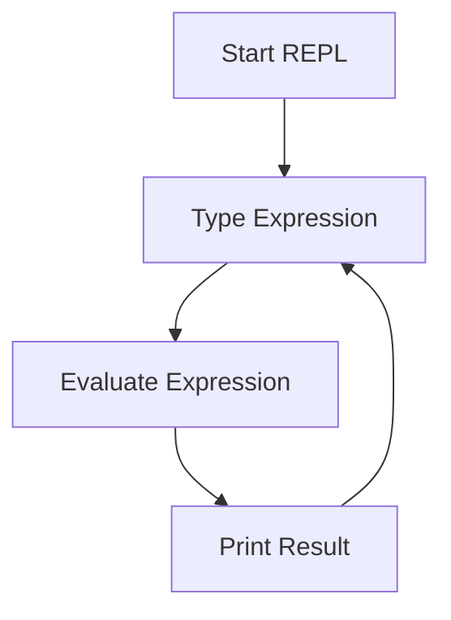

## 4.1 Introduction to the REPL

The Read-Eval-Print Loop (REPL) is a cornerstone of Clojure development, offering a dynamic and interactive coding environment that significantly enhances productivity and learning. For Java developers transitioning to Clojure, understanding and leveraging the REPL can transform how you write and debug code, allowing for rapid experimentation and immediate feedback.

### Understanding the REPL

The REPL is an interactive programming environment that takes single user inputs (expressions), evaluates them, and returns the result to the user. This cycle of reading, evaluating, and printing is continuous, allowing developers to test snippets of code in real-time.

#### Key Features of the REPL

- **Immediate Feedback**: Execute code and see results instantly, facilitating rapid prototyping and debugging.
- **Interactive Exploration**: Experiment with Clojure's syntax and libraries without the overhead of compiling and running a full application.
- **Incremental Development**: Build and test small pieces of functionality before integrating them into a larger codebase.
- **Dynamic Code Reloading**: Modify and reload code on-the-fly without restarting the application, enhancing productivity.

### The REPL vs. Java's Traditional Development Cycle

In Java, the typical development cycle involves writing code, compiling it, and then running the application to see the results. This process can be time-consuming, especially for large projects. In contrast, the REPL allows for a more fluid and interactive approach, where you can test individual functions or expressions without the need for compilation.

#### Java Development Cycle

```java
// Java Example: Traditional Development Cycle
public class HelloWorld {
    public static void main(String[] args) {
        System.out.println("Hello, World!");
    }
}
```

- **Write Code**: Develop the Java class.
- **Compile**: Use `javac HelloWorld.java` to compile the code.
- **Run**: Execute the compiled class with `java HelloWorld`.

#### Clojure REPL Cycle

```clojure
;; Clojure Example: Interactive REPL Session
(println "Hello, World!")
```

- **Write and Execute**: Directly type and run the expression in the REPL.
- **Immediate Output**: See the result instantly without compilation.

### Setting Up the REPL

To start using the REPL, you need to have Clojure installed on your system. You can use tools like Leiningen or the Clojure CLI to start a REPL session.

#### Starting a REPL with Leiningen

1. **Install Leiningen**: Follow the [Leiningen installation guide](https://leiningen.org/#install) to set up Leiningen on your system.
2. **Create a New Project**: Use the command `lein new app my-clojure-app` to create a new Clojure project.
3. **Start the REPL**: Navigate to the project directory and run `lein repl` to start the REPL session.

#### Starting a REPL with the Clojure CLI

1. **Install Clojure CLI**: Follow the [Clojure CLI installation guide](https://clojure.org/guides/getting_started) to set up the CLI tools.
2. **Start the REPL**: Simply run `clj` in your terminal to start a REPL session.

### Basic REPL Usage

Once the REPL is running, you can start typing Clojure expressions and see the results immediately.

#### Example REPL Session

```clojure
;; Define a simple function
(defn greet [name]
  (str "Hello, " name "!"))

;; Call the function
(greet "Clojure Developer")
;; => "Hello, Clojure Developer!"
```

**Explanation**: In this session, we define a function `greet` that takes a `name` as an argument and returns a greeting string. We then call the function with the argument `"Clojure Developer"` and see the result immediately.

### Advanced REPL Features

The REPL is not just for evaluating simple expressions; it offers advanced features that enhance its utility.

#### Dynamic Code Reloading

One of the powerful features of the REPL is the ability to reload code dynamically. This means you can modify your code and see the changes without restarting the REPL session.

```clojure
;; Modify the greet function
(defn greet [name]
  (str "Welcome, " name "!"))

;; Reload the function and test
(greet "Clojure Developer")
;; => "Welcome, Clojure Developer!"
```

**Explanation**: We modified the `greet` function to change the greeting message. By redefining the function in the REPL, we can immediately test the new behavior.

#### Integrating with Your Workflow

The REPL can be integrated into your development workflow, allowing you to test and debug code interactively as you develop your application.

- **Editor Integration**: Many editors and IDEs, such as Emacs with CIDER, IntelliJ IDEA with Cursive, and Visual Studio Code with Calva, offer REPL integration, allowing you to send code from your editor directly to the REPL.
- **Hot Reloading**: Use tools like [Figwheel](https://figwheel.org/) for ClojureScript to automatically reload code changes in the browser.

### Comparing REPL with Java's `main` Method

In Java, the `main` method serves as the entry point for applications. While it is essential for running Java programs, it lacks the interactivity and immediacy of the REPL.

#### Java `main` Method

```java
public class MainExample {
    public static void main(String[] args) {
        System.out.println("Running Java Application");
    }
}
```

- **Static Entry Point**: The `main` method is static and requires recompilation for changes.
- **Limited Interactivity**: Changes require recompilation and rerunning the application.

#### Clojure REPL

```clojure
;; Interactive REPL Session
(defn run-app []
  (println "Running Clojure Application"))

(run-app)
```

- **Dynamic Execution**: Functions can be defined and executed interactively.
- **Immediate Feedback**: See results instantly without recompilation.

### Try It Yourself

To get hands-on experience with the REPL, try modifying the `greet` function to include the current time in the greeting message. Use the `java.time.LocalTime` class to get the current time.

```clojure
;; Import Java class
(import '[java.time LocalTime])

;; Modify the greet function
(defn greet [name]
  (str "Hello, " name "! The current time is " (.toString (LocalTime/now)) "."))

;; Test the function
(greet "Clojure Developer")
```

### Diagrams and Visual Aids

To better understand the REPL's workflow, let's visualize the process using a flowchart.



**Diagram Description**: This flowchart illustrates the continuous cycle of the REPL, where expressions are read, evaluated, and printed, allowing for interactive development.

### Exercises

1. **Define and Test Functions**: Create a function that calculates the factorial of a number using recursion. Test it in the REPL.
2. **Explore Clojure Libraries**: Use the REPL to explore a Clojure library of your choice. Try loading the library and calling some of its functions.
3. **Interactive Debugging**: Introduce a bug in your code and use the REPL to debug and fix it interactively.

### Summary and Key Takeaways

- The REPL is a powerful tool for interactive development in Clojure, offering immediate feedback and dynamic code reloading.
- It contrasts with Java's traditional development cycle by providing a more fluid and interactive approach.
- Integrating the REPL into your workflow can enhance productivity and facilitate learning.
- Experimenting with the REPL allows you to explore Clojure's features and libraries in real-time.

By mastering the REPL, you can unlock the full potential of Clojure's interactive development environment, making your transition from Java both smooth and rewarding.

### Further Reading

- [Official Clojure Documentation](https://clojure.org/reference/repl_and_main)
- [ClojureDocs REPL Guide](https://clojuredocs.org/quickref#repl)
- [Leiningen REPL Usage](https://leiningen.org/#repl)

---

## Quiz: Mastering the Clojure REPL for Java Developers



### What is the primary purpose of the REPL in Clojure?

- [x] To provide an interactive environment for evaluating Clojure expressions.
- [ ] To compile Clojure code into Java bytecode.
- [ ] To manage dependencies in Clojure projects.
- [ ] To serve as a web server for Clojure applications.

> **Explanation:** The REPL (Read-Eval-Print Loop) is designed to allow developers to interactively evaluate Clojure expressions and see results immediately.

### How does the REPL differ from Java's traditional development cycle?

- [x] The REPL allows for immediate execution and feedback without compilation.
- [ ] The REPL requires compilation before execution.
- [ ] The REPL is used for managing Java dependencies.
- [ ] The REPL is a static entry point like Java's `main` method.

> **Explanation:** Unlike Java's compile-run cycle, the REPL provides immediate execution and feedback, enhancing interactivity and productivity.

### Which tool can be used to start a Clojure REPL session?

- [x] Leiningen
- [x] Clojure CLI
- [ ] Maven
- [ ] Gradle

> **Explanation:** Both Leiningen and the Clojure CLI can be used to start a REPL session, providing different ways to manage Clojure projects.

### What is a key advantage of using the REPL for development?

- [x] Immediate feedback and dynamic code reloading.
- [ ] Static code analysis and compilation.
- [ ] Automated deployment to production.
- [ ] Built-in version control.

> **Explanation:** The REPL offers immediate feedback and the ability to reload code dynamically, which is a significant advantage for rapid development and testing.

### Which of the following editors support REPL integration for Clojure?

- [x] Emacs with CIDER
- [x] IntelliJ IDEA with Cursive
- [ ] Eclipse
- [ ] NetBeans

> **Explanation:** Emacs with CIDER and IntelliJ IDEA with Cursive both offer excellent REPL integration for Clojure development.

### What is the role of the `println` function in a REPL session?

- [x] To output text to the console.
- [ ] To compile Clojure code.
- [ ] To manage project dependencies.
- [ ] To start a new REPL session.

> **Explanation:** The `println` function is used to print text to the console, which is useful for displaying output in a REPL session.

### How can you modify a function in the REPL?

- [x] Redefine the function with the new implementation.
- [ ] Restart the REPL session.
- [ ] Compile the function using `javac`.
- [ ] Use a version control system.

> **Explanation:** In the REPL, you can simply redefine a function to modify its implementation, allowing for dynamic updates.

### What is the benefit of using dynamic code reloading in the REPL?

- [x] It allows for testing changes without restarting the application.
- [ ] It automatically deploys changes to production.
- [ ] It compiles code into native binaries.
- [ ] It manages database migrations.

> **Explanation:** Dynamic code reloading in the REPL enables developers to test changes immediately without restarting the application, enhancing productivity.

### Which command starts a REPL session using the Clojure CLI?

- [x] `clj`
- [ ] `lein repl`
- [ ] `java -jar`
- [ ] `mvn exec:java`

> **Explanation:** The `clj` command is used to start a REPL session with the Clojure CLI, providing an interactive environment for Clojure development.

### True or False: The REPL can be used to explore Clojure libraries interactively.

- [x] True
- [ ] False

> **Explanation:** True. The REPL is an excellent tool for interactively exploring Clojure libraries, allowing developers to test functions and understand their behavior.


