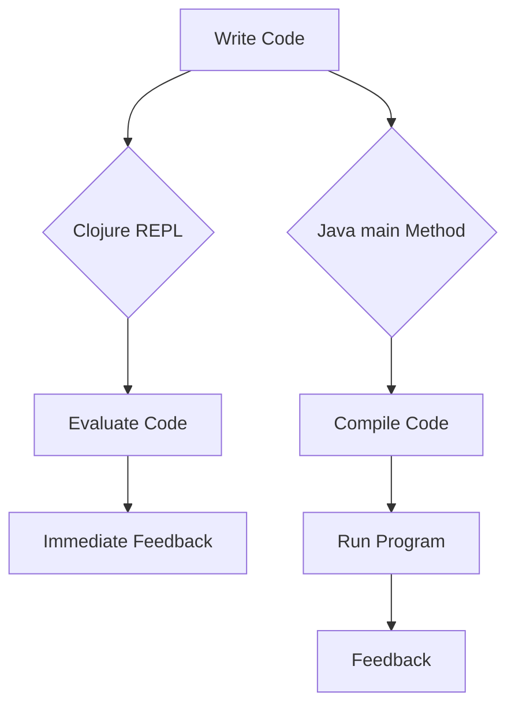

## 4.10 REPL vs Java's `main` Method

In this section, we delve into the differences between Clojure's Read-Eval-Print Loop (REPL) and Java's traditional `main` method. As experienced Java developers, you are familiar with the compile-run cycle inherent in Java development. Clojure, with its REPL, offers a contrasting approach that emphasizes immediate feedback and encourages experimentation. Let's explore these differences and understand how Clojure's REPL can enhance your development workflow.

### Understanding the REPL

The REPL is a powerful tool in the Clojure ecosystem, providing an interactive programming environment. It allows developers to enter expressions, evaluate them, and see the results immediately. This cycle of reading, evaluating, printing, and looping facilitates a dynamic and exploratory style of programming.

#### Key Features of the REPL

- **Immediate Feedback**: The REPL provides instant feedback on code execution, allowing developers to test ideas quickly.
- **Interactive Development**: Developers can interact with their codebase in real-time, modifying and testing functions without restarting the application.
- **Exploratory Programming**: The REPL encourages trying out new ideas and approaches without the overhead of a full compile-run cycle.

### Java's `main` Method: A Traditional Approach

In contrast, Java's `main` method serves as the entry point for Java applications. It follows a more traditional development cycle, where code is written, compiled, and then executed. This cycle, while robust, can be less conducive to rapid experimentation.

#### Characteristics of the `main` Method

- **Compile-Run Cycle**: Java requires code to be compiled before execution, which can slow down the feedback loop.
- **Structured Development**: The `main` method enforces a structured approach, often requiring more boilerplate code.
- **Batch Processing**: Java applications typically run as batch processes, executing a series of instructions from start to finish.

### Comparing REPL and `main` Method

Let's compare these two approaches across several dimensions to highlight their differences and advantages.

#### Immediate Feedback vs. Compile-Run Cycles

- **Clojure REPL**: Provides immediate feedback, allowing developers to see the results of their code instantly. This is particularly useful for testing small code snippets or debugging.
- **Java `main` Method**: Involves a compile-run cycle, where code changes require recompilation before execution. This can slow down the development process, especially for large codebases.

#### Encouraging Experimentation and Exploration

- **Clojure REPL**: Encourages a trial-and-error approach, making it easy to explore different solutions and iterate quickly.
- **Java `main` Method**: While possible, experimentation is often more cumbersome due to the need for recompilation and the structured nature of Java applications.

#### Development Workflow

- **Clojure REPL**: Supports a fluid workflow where developers can write and test code in small increments, integrating changes seamlessly.
- **Java `main` Method**: Typically involves writing larger chunks of code before testing, which can lead to longer feedback loops and more complex debugging sessions.

### Code Examples

Let's look at some code examples to illustrate these differences.

#### Clojure REPL Example

```clojure
;; Define a simple function in the REPL
(defn greet [name]
  (str "Hello, " name "!"))

;; Call the function and see the result immediately
(greet "World")
;; => "Hello, World!"

;; Modify the function and test again
(defn greet [name]
  (str "Hi, " name "! How are you today?"))

(greet "World")
;; => "Hi, World! How are you today?"
```

*Comments*: In the REPL, we can define, modify, and test functions interactively, seeing results instantly.

#### Java `main` Method Example

```java
public class Greeting {
    public static void main(String[] args) {
        System.out.println(greet("World"));
    }

    public static String greet(String name) {
        return "Hello, " + name + "!";
    }
}
```

*Comments*: In Java, changes to the `greet` method require recompilation before we can see the results.

### Diagrams and Visualizations

To further illustrate these concepts, let's use a flowchart to compare the development cycles in Clojure and Java.



**Caption**: This flowchart compares the development cycles of Clojure's REPL and Java's `main` method, highlighting the immediate feedback loop in Clojure.

### Advantages of Using the REPL

- **Rapid Prototyping**: The REPL is ideal for quickly prototyping new features or ideas.
- **Debugging**: Developers can isolate and test specific parts of their codebase, making debugging more efficient.
- **Learning and Exploration**: The interactive nature of the REPL makes it a great tool for learning new libraries or APIs.

### Challenges and Considerations

While the REPL offers many advantages, there are some challenges to consider:

- **State Management**: Managing state in a REPL session can be complex, especially for larger applications.
- **Integration with Build Tools**: Integrating the REPL with build tools and CI/CD pipelines may require additional configuration.

### Best Practices for Using the REPL

- **Modular Code**: Write modular, reusable code that can be easily tested in the REPL.
- **Version Control**: Use version control to manage changes made during REPL sessions.
- **Documentation**: Document your REPL experiments to ensure reproducibility and understanding.

### Try It Yourself

Experiment with the Clojure REPL by modifying the `greet` function to include a personalized message based on the time of day. Consider how you might achieve this in Java and compare the ease of experimentation.

### Exercises

1. **Experiment with Functions**: Use the REPL to define and test a function that calculates the factorial of a number. Compare this with a Java implementation.
2. **State Management**: Explore how you can manage state in a REPL session using atoms or refs. Try implementing a simple counter.
3. **Integration**: Set up a simple Clojure project with Leiningen and integrate the REPL into your development workflow.

### Key Takeaways

- The Clojure REPL offers immediate feedback and encourages experimentation, making it a powerful tool for interactive development.
- Java's `main` method follows a more traditional compile-run cycle, which can be less conducive to rapid iteration.
- Understanding the strengths and limitations of each approach can help you choose the right tool for your development needs.

By embracing the REPL, you can enhance your productivity and creativity as a developer, leveraging the power of Clojure's interactive programming environment.

## SEO optimized quiz title



### What is a key advantage of using the Clojure REPL over Java's `main` method?

- [x] Immediate feedback
- [ ] Structured development
- [ ] Batch processing
- [ ] Compile-run cycle

> **Explanation:** The Clojure REPL provides immediate feedback, allowing developers to see results instantly, which is a key advantage over Java's `main` method.

### How does the REPL encourage experimentation?

- [x] By allowing trial-and-error approaches
- [ ] By enforcing structured development
- [ ] By requiring recompilation
- [ ] By using batch processing

> **Explanation:** The REPL encourages experimentation by allowing developers to try different solutions and iterate quickly without recompilation.

### What is a characteristic of Java's `main` method?

- [ ] Immediate feedback
- [x] Compile-run cycle
- [ ] Interactive development
- [ ] Exploratory programming

> **Explanation:** Java's `main` method involves a compile-run cycle, requiring code to be compiled before execution.

### Which of the following is a challenge when using the REPL?

- [ ] Immediate feedback
- [x] State management
- [ ] Structured development
- [ ] Batch processing

> **Explanation:** Managing state in a REPL session can be complex, especially for larger applications.

### What is a best practice for using the REPL?

- [x] Write modular code
- [ ] Avoid version control
- [ ] Use batch processing
- [ ] Enforce structured development

> **Explanation:** Writing modular code is a best practice for using the REPL, as it allows for easier testing and reuse.

### How does the REPL support debugging?

- [x] By allowing isolation and testing of specific code parts
- [ ] By requiring recompilation
- [ ] By enforcing structured development
- [ ] By using batch processing

> **Explanation:** The REPL supports debugging by allowing developers to isolate and test specific parts of their codebase.

### What is a benefit of rapid prototyping with the REPL?

- [x] Quick feature prototyping
- [ ] Enforced structured development
- [ ] Required recompilation
- [ ] Batch processing

> **Explanation:** The REPL is ideal for quickly prototyping new features or ideas, providing immediate feedback.

### What is a key difference between the REPL and `main` method?

- [x] Immediate feedback vs. compile-run cycle
- [ ] Structured development vs. exploratory programming
- [ ] Batch processing vs. interactive development
- [ ] Enforced recompilation vs. trial-and-error

> **Explanation:** A key difference is that the REPL provides immediate feedback, while the `main` method involves a compile-run cycle.

### How can the REPL enhance learning and exploration?

- [x] By providing an interactive environment
- [ ] By enforcing structured development
- [ ] By requiring recompilation
- [ ] By using batch processing

> **Explanation:** The interactive nature of the REPL makes it a great tool for learning new libraries or APIs.

### True or False: The REPL is less conducive to rapid iteration than Java's `main` method.

- [ ] True
- [x] False

> **Explanation:** False. The REPL is more conducive to rapid iteration due to its immediate feedback and interactive nature.


