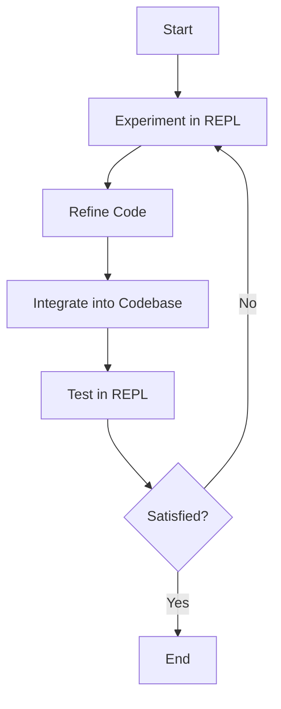

## 4.4 REPL-Driven Development

**Description**: In this section, we will delve into the workflow of developing code by iteratively testing and refining small pieces in the REPL before integrating them into your codebase. This approach, known as REPL-driven development, is a hallmark of Clojure programming and offers a dynamic and interactive way to build robust applications.

### Introduction to REPL-Driven Development

REPL-driven development is a unique and powerful approach that leverages the Read-Eval-Print Loop (REPL) to iteratively develop, test, and refine code. Unlike traditional development workflows, which often involve writing code, compiling, and then testing, REPL-driven development allows you to interact with your code in real-time. This interactive process can lead to faster feedback, more experimentation, and ultimately, more robust and well-tested code.

For Java developers transitioning to Clojure, this approach may seem unconventional. In Java, the typical workflow involves writing code in an IDE, compiling it, and then running tests. While this process is effective, it can be time-consuming and less conducive to experimentation. In contrast, Clojure's REPL allows you to test small pieces of code immediately, see the results, and make adjustments on the fly.

### The REPL Workflow

The REPL workflow can be broken down into several key steps:

1. **Experimentation**: Start by experimenting with small pieces of code in the REPL. This could be anything from a simple function to a complex algorithm. The goal is to quickly test ideas and see how they behave.

2. **Refinement**: As you experiment, refine your code based on the feedback you receive from the REPL. This might involve tweaking parameters, changing logic, or trying different approaches.

3. **Integration**: Once you're satisfied with a piece of code, integrate it into your larger codebase. This might involve moving the code from the REPL into a source file, adding it to a function, or incorporating it into a larger system.

4. **Testing**: Use the REPL to test your integrated code. This might involve running unit tests, checking edge cases, or verifying that the code behaves as expected in different scenarios.

5. **Iteration**: Repeat the process as needed. REPL-driven development is inherently iterative, allowing you to continuously refine and improve your code.

### Experimentation in the REPL

Let's start by experimenting with a simple function in the REPL. Suppose we want to write a function that calculates the factorial of a number. In Java, you might write a method, compile it, and then run tests. In Clojure, you can start by experimenting directly in the REPL.

```clojure
;; Define a simple factorial function
(defn factorial [n]
  (if (<= n 1)
    1
    (* n (factorial (dec n)))))

;; Test the function in the REPL
(factorial 5) ; => 120
(factorial 0) ; => 1
```

In the REPL, you can quickly test different inputs and see the results immediately. This allows you to verify that your function works as expected and make adjustments if needed.

### Refinement and Integration

As you experiment, you may find that your initial implementation needs refinement. Perhaps you want to handle edge cases or optimize performance. The REPL allows you to make these refinements quickly and easily.

```clojure
;; Refine the factorial function to handle negative inputs
(defn factorial [n]
  (cond
    (< n 0) (throw (IllegalArgumentException. "Negative input not allowed"))
    (<= n 1) 1
    :else (* n (factorial (dec n)))))

;; Test the refined function
(factorial -1) ; Throws IllegalArgumentException
(factorial 5)  ; => 120
```

Once you're satisfied with your function, you can integrate it into your larger codebase. This might involve moving the function from the REPL into a source file and adding it to a namespace.

### Testing and Iteration

Testing is a crucial part of REPL-driven development. The REPL allows you to test your code in real-time, providing immediate feedback on its behavior. This can help you catch bugs early and ensure that your code is robust and reliable.

```clojure
;; Use the REPL to test edge cases
(factorial 10) ; => 3628800
(factorial 1)  ; => 1
(factorial 0)  ; => 1
```

As you test your code, you may find areas for improvement or optimization. The REPL allows you to iterate quickly, making changes and testing them immediately.

### Comparing REPL-Driven Development with Java

For Java developers, the concept of REPL-driven development may be new. In Java, the typical workflow involves writing code in an IDE, compiling it, and then running tests. This process can be time-consuming and less conducive to experimentation.

In contrast, Clojure's REPL allows you to interact with your code in real-time. This can lead to faster feedback, more experimentation, and ultimately, more robust and well-tested code.

Let's compare a simple Java method with its Clojure equivalent to highlight the differences:

**Java Example:**

```java
public class Factorial {
    public static int factorial(int n) {
        if (n <= 1) return 1;
        return n * factorial(n - 1);
    }

    public static void main(String[] args) {
        System.out.println(factorial(5)); // Output: 120
    }
}
```

**Clojure Example:**

```clojure
;; Clojure REPL
(defn factorial [n]
  (if (<= n 1)
    1
    (* n (factorial (dec n)))))

(factorial 5) ; => 120
```

In the Java example, you need to compile the code and run the `main` method to see the output. In Clojure, you can evaluate the function directly in the REPL and see the result immediately.

### Advantages of REPL-Driven Development

REPL-driven development offers several advantages over traditional development workflows:

- **Immediate Feedback**: The REPL provides immediate feedback on your code, allowing you to quickly identify and fix issues.
- **Experimentation**: The interactive nature of the REPL encourages experimentation, allowing you to try different approaches and see what works best.
- **Iterative Development**: REPL-driven development is inherently iterative, allowing you to continuously refine and improve your code.
- **Reduced Context Switching**: By working directly in the REPL, you can reduce the need to switch between different tools and environments.

### Best Practices for REPL-Driven Development

To make the most of REPL-driven development, consider the following best practices:

- **Keep Functions Small**: Small, focused functions are easier to test and refine in the REPL.
- **Use Namespaces**: Organize your code into namespaces to keep it manageable and easy to navigate.
- **Leverage Clojure's Standard Library**: Clojure's standard library provides a wealth of functions and utilities that can simplify your code.
- **Document Your Code**: Use comments and docstrings to document your code and make it easier to understand.

### Try It Yourself

To get hands-on experience with REPL-driven development, try the following exercises:

1. **Experiment with a New Function**: Write a new function in the REPL and test it with different inputs. Try refining the function based on the feedback you receive.

2. **Refactor an Existing Function**: Take an existing function and refactor it in the REPL. Consider ways to optimize performance or handle edge cases.

3. **Test Edge Cases**: Use the REPL to test your functions with edge cases and unexpected inputs. See how your code handles these scenarios and make adjustments as needed.

### Visualizing the REPL Workflow

To better understand the REPL workflow, let's visualize the process using a flowchart:



**Diagram Description**: This flowchart illustrates the iterative nature of REPL-driven development, showing how code is experimented with, refined, integrated, and tested in a continuous loop.

### Further Reading

For more information on REPL-driven development and Clojure, consider exploring the following resources:

- [Official Clojure Documentation](https://clojure.org/)
- [ClojureDocs](https://clojuredocs.org/)
- [Clojure Programming by Chas Emerick, Brian Carper, and Christophe Grand](https://www.oreilly.com/library/view/clojure-programming/9781449310387/)

### Exercises and Practice Problems

1. **Implement a Fibonacci Function**: Write a function in the REPL that calculates the nth Fibonacci number. Test your function with different inputs and refine it as needed.

2. **Create a Simple Calculator**: Use the REPL to build a simple calculator that can perform basic arithmetic operations. Experiment with different approaches and see what works best.

3. **Refactor Java Code**: Take a simple Java method and refactor it into a Clojure function using the REPL. Compare the two implementations and note any differences.

### Key Takeaways

- **REPL-driven development** is a powerful approach that leverages the REPL to iteratively develop, test, and refine code.
- **Immediate feedback** from the REPL allows for faster experimentation and iteration.
- **Comparing Java and Clojure** highlights the advantages of interactive development in Clojure.
- **Best practices** such as keeping functions small and using namespaces can enhance your REPL-driven development workflow.

Now that we've explored the workflow of REPL-driven development, let's apply these concepts to build more robust and well-tested applications in Clojure.

## Quiz: Mastering REPL-Driven Development in Clojure



### What is the primary advantage of REPL-driven development?

- [x] Immediate feedback on code execution
- [ ] Reduced code complexity
- [ ] Enhanced security features
- [ ] Automatic code optimization

> **Explanation:** REPL-driven development provides immediate feedback, allowing developers to quickly test and refine code.

### In REPL-driven development, what is the typical workflow?

- [x] Experiment, Refine, Integrate, Test, Iterate
- [ ] Write, Compile, Test, Deploy
- [ ] Design, Implement, Debug, Release
- [ ] Plan, Code, Review, Merge

> **Explanation:** The REPL-driven workflow involves experimenting with code, refining it, integrating it into the codebase, testing, and iterating.

### How does the REPL differ from traditional Java development workflows?

- [x] It allows real-time interaction with code
- [ ] It requires more memory
- [ ] It is slower to execute
- [ ] It uses a different programming language

> **Explanation:** The REPL allows developers to interact with code in real-time, providing immediate feedback and facilitating experimentation.

### What is a best practice for REPL-driven development?

- [x] Keep functions small and focused
- [ ] Avoid using namespaces
- [ ] Write all code in a single file
- [ ] Minimize the use of comments

> **Explanation:** Keeping functions small and focused makes them easier to test and refine in the REPL.

### Which of the following is a benefit of using the REPL?

- [x] Encourages experimentation
- [ ] Increases compile time
- [ ] Limits code reuse
- [ ] Reduces code readability

> **Explanation:** The REPL encourages experimentation by allowing developers to quickly test and refine code.

### What is the role of namespaces in REPL-driven development?

- [x] Organize code into manageable units
- [ ] Increase code execution speed
- [ ] Reduce memory usage
- [ ] Simplify syntax

> **Explanation:** Namespaces help organize code into manageable units, making it easier to navigate and maintain.

### How can you test edge cases in the REPL?

- [x] By running different inputs and observing the output
- [ ] By writing extensive documentation
- [ ] By using a different programming language
- [ ] By avoiding edge cases altogether

> **Explanation:** The REPL allows developers to test edge cases by running different inputs and observing the output.

### What is a key difference between Java and Clojure development workflows?

- [x] Clojure allows interactive development with the REPL
- [ ] Java is faster to compile
- [ ] Clojure requires more boilerplate code
- [ ] Java supports more programming paradigms

> **Explanation:** Clojure's REPL allows for interactive development, providing immediate feedback and facilitating experimentation.

### What is the purpose of the `cond` function in Clojure?

- [x] To handle multiple conditional branches
- [ ] To define a new function
- [ ] To create a loop
- [ ] To import a namespace

> **Explanation:** The `cond` function in Clojure is used to handle multiple conditional branches, similar to a switch statement in other languages.

### True or False: REPL-driven development is inherently iterative.

- [x] True
- [ ] False

> **Explanation:** REPL-driven development is inherently iterative, allowing developers to continuously refine and improve their code.


