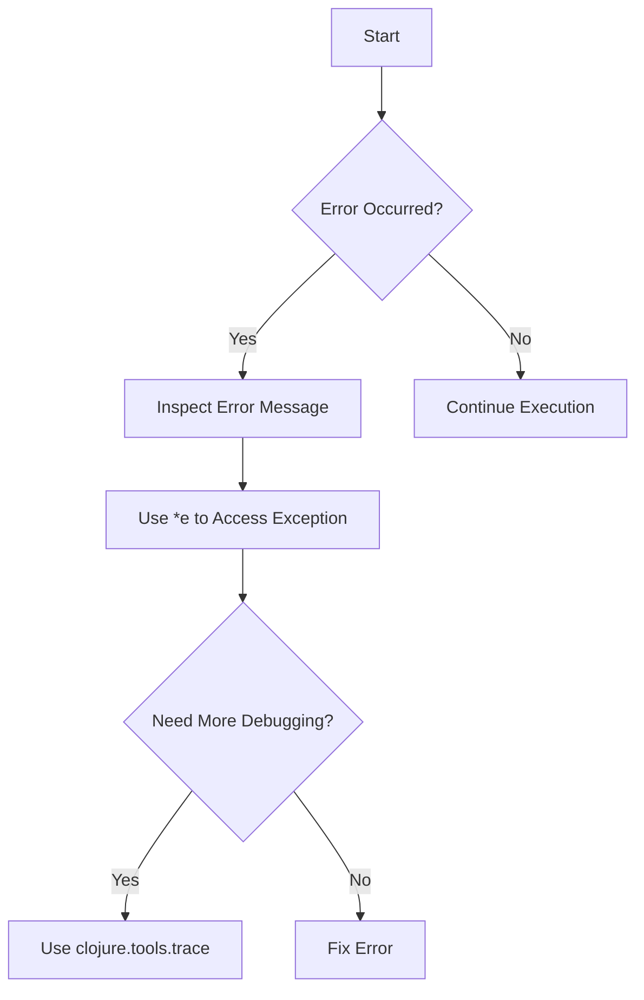

## 4.5 Handling Errors and Debugging in the REPL

As experienced Java developers, you're likely familiar with the process of debugging using IDEs and logging frameworks. Transitioning to Clojure, you'll find that the REPL (Read-Eval-Print Loop) offers a unique and interactive approach to error handling and debugging. In this section, we'll explore how to effectively interpret error messages, utilize the `*e` variable for accessing exceptions, and leverage tools like `clojure.tools.trace` to debug your Clojure code.

### Understanding Error Messages in Clojure

When working with Clojure, encountering errors is inevitable, especially as you experiment and iterate within the REPL. Understanding how to read and interpret these error messages is crucial for efficient debugging.

#### Common Error Types

1. **Syntax Errors**: These occur when the Clojure code does not conform to the language's syntax rules. For example, missing parentheses or incorrect use of special forms can trigger syntax errors.

2. **Runtime Errors**: These errors occur during the execution of the program, such as division by zero or attempting to access a non-existent key in a map.

3. **Compilation Errors**: These are errors that occur during the compilation phase, often related to type mismatches or unresolved symbols.

#### Interpreting Error Messages

Clojure error messages typically include a stack trace, which provides valuable information about the error's origin. Let's examine a simple example:

```clojure
;; Attempting to divide by zero
(/ 1 0)
```

This will produce an error message similar to:

```
Execution error (ArithmeticException) at user/eval1 (REPL:1).
Divide by zero
```

- **Error Type**: `ArithmeticException` indicates the nature of the error.
- **Location**: `user/eval1 (REPL:1)` shows where the error occurred, with `REPL:1` indicating the line number in the REPL session.
- **Message**: "Divide by zero" provides a brief description of the error.

### Accessing the Last Exception with `*e`

Clojure provides a convenient way to access the last exception that occurred in the REPL using the `*e` variable. This can be particularly useful for examining the details of an error after it has been thrown.

```clojure
;; Trigger an error
(/ 1 0)

;; Access the last exception
*e
```

The `*e` variable holds the last exception object, allowing you to inspect its properties and methods. This is akin to catching an exception in Java and examining its stack trace or message.

### Debugging with `clojure.tools.trace`

For more in-depth debugging, Clojure offers the `clojure.tools.trace` library, which provides tracing capabilities to help you understand the flow of your program.

#### Installing `clojure.tools.trace`

To use `clojure.tools.trace`, you'll need to add it to your project dependencies. If you're using Leiningen, add the following to your `project.clj`:

```clojure
:dependencies [[org.clojure/tools.trace "0.7.10"]]
```

#### Using `trace` and `trace-ns`

The `trace` function allows you to trace the execution of a specific function, while `trace-ns` can be used to trace all functions within a namespace.

```clojure
(require '[clojure.tools.trace :refer [trace]])

(defn factorial [n]
  (if (<= n 1)
    1
    (* n (factorial (dec n)))))

(trace factorial)

(factorial 5)
```

This will output the trace of each call to `factorial`, showing the arguments and return values at each step.

### Comparing Clojure and Java Debugging

In Java, debugging often involves setting breakpoints and stepping through code using an IDE. While Clojure supports similar debugging techniques through IDE plugins, the REPL offers a more interactive and iterative approach.

#### Java Example

```java
public class Factorial {
    public static int factorial(int n) {
        if (n <= 1) return 1;
        return n * factorial(n - 1);
    }

    public static void main(String[] args) {
        System.out.println(factorial(5));
    }
}
```

In Java, you might use a debugger to step through each recursive call. In Clojure, the REPL allows you to experiment with different inputs and observe the results in real-time, enhancing your understanding of the code's behavior.

### Try It Yourself

Experiment with the following exercises to deepen your understanding of error handling and debugging in the Clojure REPL:

1. **Modify the `factorial` function** to handle negative inputs gracefully. Use `*e` to inspect any exceptions that occur.

2. **Trace a different recursive function**, such as Fibonacci, using `clojure.tools.trace`. Observe how the trace output helps you understand the recursion process.

3. **Compare error handling in Clojure and Java** by writing equivalent code snippets that handle file I/O operations. Note the differences in error messages and debugging techniques.

### Diagrams and Visual Aids

To further illustrate the concepts discussed, let's use a flowchart to visualize the error handling process in Clojure:



**Diagram Caption**: This flowchart outlines the process of handling errors in the Clojure REPL, from encountering an error to using debugging tools for further investigation.

### External Resources

For more information on error handling and debugging in Clojure, consider exploring the following resources:

- [Official Clojure Documentation](https://clojure.org/reference)
- [ClojureDocs](https://clojuredocs.org/)
- [clojure.tools.trace GitHub Repository](https://github.com/clojure/tools.trace)

### Exercises and Practice Problems

1. **Exercise 1**: Write a Clojure function that reads a file and handles potential exceptions, such as file not found or access denied. Use `*e` to examine any exceptions.

2. **Exercise 2**: Implement a recursive function to calculate the nth Fibonacci number. Use `clojure.tools.trace` to trace the function's execution and understand the recursion.

3. **Exercise 3**: Compare the error handling of a simple network request in both Java and Clojure. Note the differences in exception handling and debugging techniques.

### Key Takeaways

- **Error Interpretation**: Understanding error messages is crucial for efficient debugging in Clojure.
- **Using `*e`**: The `*e` variable provides access to the last exception, allowing for detailed inspection.
- **Tracing with `clojure.tools.trace`**: This tool offers powerful tracing capabilities to help you understand the flow of your program.
- **Interactive Debugging**: The Clojure REPL provides an interactive environment for experimenting and debugging, offering a unique approach compared to traditional Java debugging.

By mastering these techniques, you'll be well-equipped to handle errors and debug effectively in the Clojure REPL, enhancing your productivity and confidence as you transition from Java to Clojure.

## Clojure REPL Debugging Quiz: Test Your Knowledge



### What is the purpose of the `*e` variable in the Clojure REPL?

- [x] To access the last exception that occurred
- [ ] To evaluate expressions
- [ ] To define new functions
- [ ] To trace function calls

> **Explanation:** The `*e` variable in the Clojure REPL is used to access the last exception that occurred, allowing developers to inspect the error details.

### Which library provides tracing capabilities in Clojure?

- [ ] clojure.core
- [x] clojure.tools.trace
- [ ] clojure.tools.logging
- [ ] clojure.java.io

> **Explanation:** The `clojure.tools.trace` library provides tracing capabilities to help developers understand the flow of their Clojure programs.

### How can you trace all functions within a namespace using `clojure.tools.trace`?

- [ ] Use the `trace` function
- [x] Use the `trace-ns` function
- [ ] Use the `trace-vars` function
- [ ] Use the `trace-all` function

> **Explanation:** The `trace-ns` function in `clojure.tools.trace` is used to trace all functions within a specified namespace.

### What type of error occurs when there is a division by zero in Clojure?

- [x] ArithmeticException
- [ ] NullPointerException
- [ ] IllegalArgumentException
- [ ] IndexOutOfBoundsException

> **Explanation:** A division by zero in Clojure results in an `ArithmeticException`.

### Which of the following is a common error type in Clojure?

- [x] Syntax Errors
- [x] Runtime Errors
- [ ] Compilation Errors
- [ ] Network Errors

> **Explanation:** Syntax errors and runtime errors are common error types in Clojure, while compilation errors are less common due to Clojure's dynamic nature.

### What is the equivalent of Java's try-catch block in Clojure?

- [ ] `try-catch`
- [x] `try-catch-finally`
- [ ] `catch-try`
- [ ] `try-finally`

> **Explanation:** In Clojure, the `try-catch-finally` construct is used to handle exceptions, similar to Java's try-catch block.

### How can you install `clojure.tools.trace` in a Leiningen project?

- [x] Add `[org.clojure/tools.trace "0.7.10"]` to the `:dependencies` in `project.clj`
- [ ] Use the `lein install` command
- [ ] Add `[clojure.tools.trace "0.7.10"]` to the `:plugins` in `project.clj`
- [ ] Use the `lein trace` command

> **Explanation:** To install `clojure.tools.trace` in a Leiningen project, you need to add `[org.clojure/tools.trace "0.7.10"]` to the `:dependencies` in `project.clj`.

### What is the main advantage of using the REPL for debugging in Clojure?

- [x] Interactive and iterative experimentation
- [ ] Automatic error correction
- [ ] Built-in logging capabilities
- [ ] Visual debugging interface

> **Explanation:** The main advantage of using the REPL for debugging in Clojure is the ability to interactively and iteratively experiment with code, enhancing understanding and productivity.

### Which function in `clojure.tools.trace` is used to trace a specific function?

- [x] `trace`
- [ ] `trace-ns`
- [ ] `trace-vars`
- [ ] `trace-all`

> **Explanation:** The `trace` function in `clojure.tools.trace` is used to trace the execution of a specific function.

### True or False: The Clojure REPL can be used to set breakpoints like in a traditional Java IDE.

- [ ] True
- [x] False

> **Explanation:** False. The Clojure REPL does not support setting breakpoints like a traditional Java IDE, but it offers interactive debugging through experimentation and tracing.


